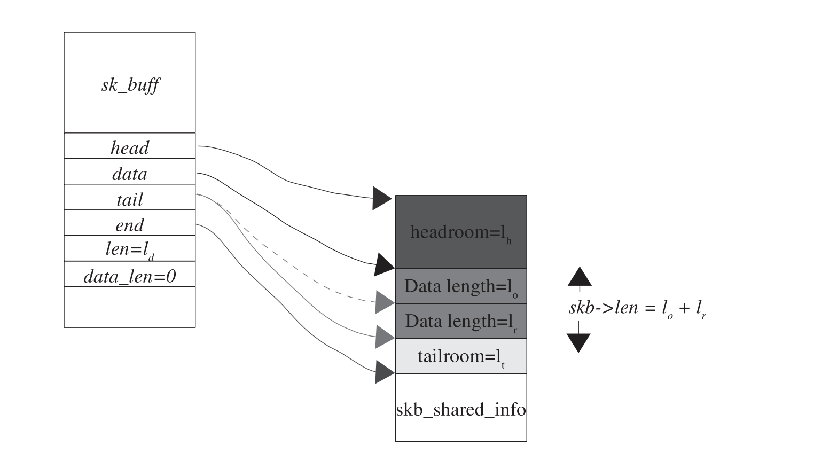
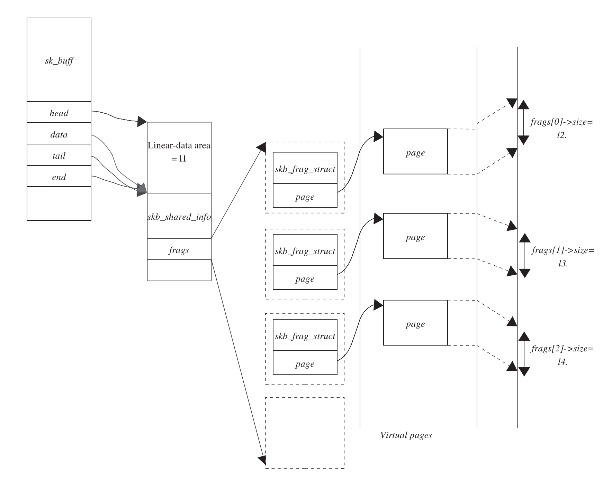
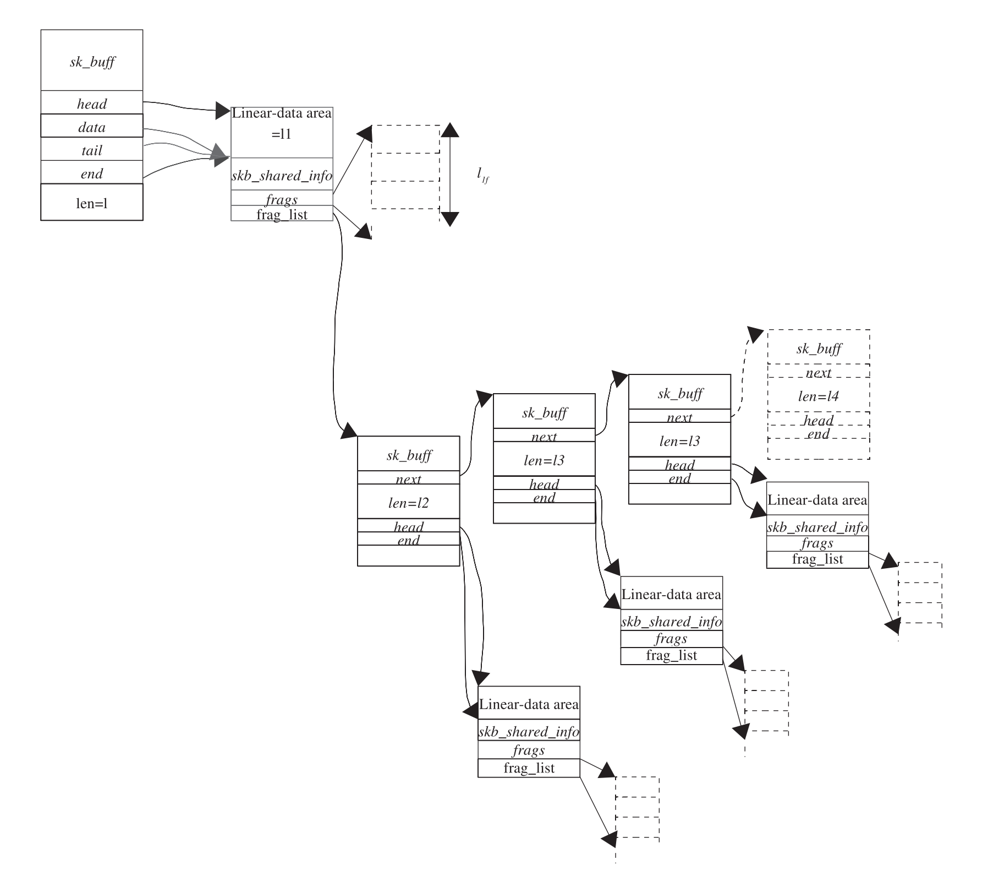

[TOC]

## skb details

Skb，就是 sk_buff，存网络包的数据结构，它有三个组成部分, sk_buff, linear-data buffer, paged-data(struct skb_shared_info)。申请 sk_buff 的时候，传入 linear data 长度。

linear data 就是 skb->data，一般来说，一个 skb 只需要一个 page，而对于比 IP 分段比一个 page 还长的情况，我们有两种做法

1. 可以增大 linear 区域，来容纳整个 IP 分段。
2. 可以拿一个 paged data area 来存放剩余的包里的数据，后面这种情况，只在 device 不支持 scatter-gather 的时候执行。

### skb linear area & operation

说明几个指针

1. head: 指向 protocol headers(head room) 开始的位置
2. data: 指向 linear data area 开始的位置
3. tail: 指向 linear data area 结束的位置，也是 tail room 开始的位置
4. End: 指向 skb 结束的位置，也是 tail room 结束的位置

一些关键操作 skb 的函数

1. alloc_skb()： 分配一个新的 sk_buff，

2. skb_reserve()：增大 sk_buff 的 head room/减小 tail room，用来给 protocol headers 留位置。将 tail 和 data 指针同时往后移动相同距离。

3. skb_put(): 将 linear data area 的空间增大，data 指针不变， tail 指针向后移动。



4. skb_push(): 将 head room 的一部分空间腾给 linear data area。减小 head 指针。这个主要是发包的时候用，我们发包的时候需要不断添加 header，传递给下一层，上层的header对于下层来说是数据，所以需要不断将 data 往前移。
5. skb_pull(): 将 heade room 增大，将 data pointer 向后移动，减小 linear data area。


### skb_shared_info

```c
static inline unsigned char *skb_end_pointer(const struct sk_buff *skb)
{
	return skb->end;
}

/* Internal */
#define skb_shinfo(SKB)	((struct skb_shared_info *)(skb_end_pointer(SKB)))

/* This data is invariant across clones and lives at
 * the end of the header data, ie. at skb->end.
 */
struct skb_shared_info {
	__u8		flags;
	__u8		meta_len;
	__u8		nr_frags;
	__u8		tx_flags;
	unsigned short	gso_size;
	/* Warning: this field is not always filled in (UFO)! */
	unsigned short	gso_segs;
	struct sk_buff	*frag_list;
	struct skb_shared_hwtstamps hwtstamps;
	unsigned int	gso_type;
	u32		tskey;

	/*
	 * Warning : all fields before dataref are cleared in __alloc_skb()
	 */
	atomic_t	dataref;
	unsigned int	xdp_frags_size;

	/* Intermediate layers must ensure that destructor_arg
	 * remains valid until skb destructor */
	void *		destructor_arg;

	/* must be last field, see pskb_expand_head() */
	skb_frag_t	frags[MAX_SKB_FRAGS];
};
```


paged data area of sk_buff:




fragmentation and paged data area of sk_buff:




### More on non-linear data

在 ip_rcv() 收包中，有 pskb_may_pull()，它的作用是确保 skb->data 指向的内存包含的数据至少为 IP header 大小，由于每个 IP 数据包包括IP分片必须包含一个完整的 IP header。如果小于 IP header 大小，则缺失的部分将从 non-linear fragments 中拷贝。这些 fragments 保存在 skb_shinfo(skb)->frags[] 中。

当数据包进入协议栈往上层递交的过程中，比如在 IP 层，它需要对数据包的 IP header 进行分析，比如 header 合法性等，这时候就需要确保 IP header 在线性缓冲区中，这样才能对它进行分析，如果在非线性缓冲区中，而非线性缓冲区是 unmapped 的 page，因此就需要从这些 unmapped page 当中把数据复制到线性缓冲区中。
这个艰难的工作就是 __pskb_pull_tail 完成的。

我们可以看一下 `__pskb_pull_tail()` 这个函数的具体内容：

```c

/* Moves tail of skb head forward, copying data from fragmented part,
 * when it is necessary.
 * 1. It may fail due to malloc failure.
 * 2. It may change skb pointers.
 *
 * It is pretty complicated. Luckily, it is called only in exceptional cases.
 */
void *__pskb_pull_tail(struct sk_buff *skb, int delta)
{
	/* If skb has not enough free space at tail(eat>0), get new one
	 * plus 128 bytes for future expansions. If we have enough
	 * room at tail, reallocate without expansion only if skb is cloned.
	 */
	int i, k, eat = (skb->tail + delta) - skb->end;
    
    /* eat > 0 说明skb的线性缓冲区尾部没有足够空闲空间，或者如果skb是被克隆过的那
     * 么pskb_expand_head会重新分配一个线性数据缓冲区，该缓冲区大小在原缓冲区的
     * 基础上，将尾部扩大eat + 128字节，或者得到一份新的数据缓冲区拷贝，它保证该
     * skb是没有克隆过，且数据缓冲区是私有的，即skb->cloned = 0且
     * skb_shareinfo(skb)->dataref = 1.
     * 首先分析eat > 0 的情况下要扩展线性缓冲区尾部的理由很直接，因为尾部空间不
     * 足以容纳将要从其他地方拷贝来的数据。
     * skb是被克隆的情况下，需要一个私有的数据缓冲区，这是因为skb被克隆时，数
     * 据缓冲区是被共享的，而接下来需要从其他地方拷贝数据到线性缓冲区，也就是对
     * 缓冲区进行了修改，因此，需要一份私有的数据缓冲区。*/
	if (eat > 0 || skb_cloned(skb)) {
        // reallocate header of &sk_buff
		if (pskb_expand_head(skb, 0, eat > 0 ? eat + 128 : 0,
				     GFP_ATOMIC))
			return NULL;
	}
    
    /*
     * 从skb的线性数据区以及可能从非线性数据区，甚至可能从skb的frag_list链中拷贝
     * 总长度为delta的数据到skb_tail_pointer(skb)。这个函数也比较复杂，它里面还需要递归
     * 单独分析。
     */
	BUG_ON(skb_copy_bits(skb, skb_headlen(skb),
			     skb_tail_pointer(skb), delta));

	/* Optimization: no fragments, no reasons to preestimate
	 * size of pulled pages. Superb.
	 */
	if (!skb_has_frag_list(skb))
		goto pull_pages;

	/* Estimate size of pulled pages. */
	/* 统计这次从非线性缓冲区中拷贝了多少数据 */
	eat = delta;
	for (i = 0; i < skb_shinfo(skb)->nr_frags; i++) {
		int size = skb_frag_size(&skb_shinfo(skb)->frags[i]);

		if (size >= eat)
			goto pull_pages;
		eat -= size;
	}

	/* If we need update frag list, we are in troubles.
	 * Certainly, it is possible to add an offset to skb data,
	 * but taking into account that pulling is expected to
	 * be very rare operation, it is worth to fight against
	 * further bloating skb head and crucify ourselves here instead.
	 * Pure masohism, indeed. 8)8)
	 */
	/* 如果eat大于零...那么本次的拷贝还从skb的frag_list中进行了拷贝*/
	if (eat) {
		struct sk_buff *list = skb_shinfo(skb)->frag_list;
		struct sk_buff *clone = NULL;
		struct sk_buff *insp = NULL;

		do {
			if (list->len <= eat) {
				/* Eaten as whole. */
				eat -= list->len;
				list = list->next;
				insp = list;
			} else {
				/* Eaten partially. */
				if (skb_is_gso(skb) && !list->head_frag &&
				    skb_headlen(list))
					skb_shinfo(skb)->gso_type |= SKB_GSO_DODGY;

				if (skb_shared(list)) {
					/* Sucks! We need to fork list. :-( */
                    /* 有其他部分和我们共享这个skb的数据，所以需要克隆一个sk_buff
                     * 因为接下我们要修改sk_buff中的指针。 */
					clone = skb_clone(list, GFP_ATOMIC);
					if (!clone)
						return NULL;
					insp = list->next;
					list = clone;
				} else {
					/* This may be pulled without
					 * problems. */
					insp = list;
				}
                /* 将list->data向前移动eat个字节，因为这部分已经被拷贝走了.额...
                 * pskb_pull 可能会继续调用__pskb_pull_tail。好混乱，因为前面在调用
                 * pskb_copy_bits时会对frag_list中的skb递归调用__pskb_copy_bits，而
                 * 这个skb线性缓冲区中的数据可能又不满足需要拷贝的长度，因此又
                 * 要从非线性缓冲、frag_list中拷贝数据...*/
				if (!pskb_pull(list, eat)) {
					kfree_skb(clone);
					return NULL;
				}
				break;
			}
		} while (eat);

		/* Free pulled out fragments. */
		while ((list = skb_shinfo(skb)->frag_list) != insp) {
			skb_shinfo(skb)->frag_list = list->next;
			consume_skb(list);
		}
		/* And insert new clone at head. */
		if (clone) {
			clone->next = list;
			skb_shinfo(skb)->frag_list = clone;
		}
	}
	/* Success! Now we may commit changes to skb data. */

pull_pages:
	eat = delta;
	k = 0;
	for (i = 0; i < skb_shinfo(skb)->nr_frags; i++) {
		int size = skb_frag_size(&skb_shinfo(skb)->frags[i]);

		if (size <= eat) {
			skb_frag_unref(skb, i);
			eat -= size;
		} else {
			skb_frag_t *frag = &skb_shinfo(skb)->frags[k];

			*frag = skb_shinfo(skb)->frags[i];
			if (eat) {
				skb_frag_off_add(frag, eat);
				skb_frag_size_sub(frag, eat);
				if (!i)
					goto end;
				eat = 0;
			}
			k++;
		}
	}
	skb_shinfo(skb)->nr_frags = k;

end:
	skb->tail     += delta;
	skb->data_len -= delta;

	if (!skb->data_len)
		skb_zcopy_clear(skb, false);

	return skb_tail_pointer(skb);
}
EXPORT_SYMBOL(__pskb_pull_tail);
```


我们再看 `pskb_copy_bits()` 的具体内容：

```c
/**
 *	skb_copy_bits - copy bits from skb to kernel buffer
 *	@skb: source skb
 *	@offset: offset in source
 *	@to: destination buffer
 *	@len: number of bytes to copy
 *
 *	Copy the specified number of bytes from the source skb to the
 *	destination buffer.
 *
 *	CAUTION ! :
 *		If its prototype is ever changed,
 *		check arch/{*}/net/{*}.S files,
 *		since it is called from BPF assembly code.
 */
int skb_copy_bits(const struct sk_buff *skb, int offset, void *to, int len)
{
	int start = skb_headlen(skb);
	struct sk_buff *frag_iter;
	int i, copy;
    
    /* 偏移比skb的总长度减去要copy的长度还要大？也就是说偏移已经超出了要拷贝的
     * 的起始位置，显然是一个错误。注意是copy靠后的部分。 */
	if (offset > (int)skb->len - len)
		goto fault;

	/* Copy header. */
	/* start - offset 大于0， 说明线性数据缓冲区中有数据需要copy */
	if ((copy = start - offset) > 0) {
		if (copy > len)
			copy = len;
		skb_copy_from_linear_data_offset(skb, offset, to, copy);
		if ((len -= copy) == 0)
			return 0;
		offset += copy;
		to     += copy;
	}
    
	/* copy 非线性缓冲区中的数据 */
	for (i = 0; i < skb_shinfo(skb)->nr_frags; i++) {
		int end;
		skb_frag_t *f = &skb_shinfo(skb)->frags[i];

		WARN_ON(start > offset + len);

		end = start + skb_frag_size(f);
		if ((copy = end - offset) > 0) {
			u32 p_off, p_len, copied;
			struct page *p;
			u8 *vaddr;

			if (copy > len)
				copy = len;
			/* 将skb非线性数据片段映射到内核中，这样内核可以直接访问 */
			skb_frag_foreach_page(f,
					      skb_frag_off(f) + offset - start,
					      copy, p, p_off, p_len, copied) {
				vaddr = kmap_atomic(p);
				memcpy(to + copied, vaddr + p_off, p_len);
				/* 解除映射 */
				kunmap_atomic(vaddr);
			}

			if ((len -= copy) == 0)
				return 0;
			offset += copy;
			to     += copy;
		}
		start = end;
	}

    /* 如果还木有拷贝完...OMG...则从skb的frag_list中继续进行拷贝,由于frag_list链中全
     * 是sk_buff，所以可以进行递归的调用. */
    skb_walk_frags(skb, frag_iter) {
		int end;

		WARN_ON(start > offset + len);

		end = start + frag_iter->len;
		if ((copy = end - offset) > 0) {
			if (copy > len)
				copy = len;
			if (skb_copy_bits(frag_iter, offset - start, to, copy))
				goto fault;
			if ((len -= copy) == 0)
				return 0;
			offset += copy;
			to     += copy;
		}
		start = end;
	}

	if (!len)
		return 0;

fault:
	return -EFAULT;
}
EXPORT_SYMBOL(skb_copy_bits);
```


### reference

* https://zhuanlan.zhihu.com/p/626514905
* [linux TCP/IP协议栈 ---pskb_may_pull()-PCliangtao-ChinaUnix博客](http://m.blog.chinaunix.net/uid-22577711-id-3220103.html)


