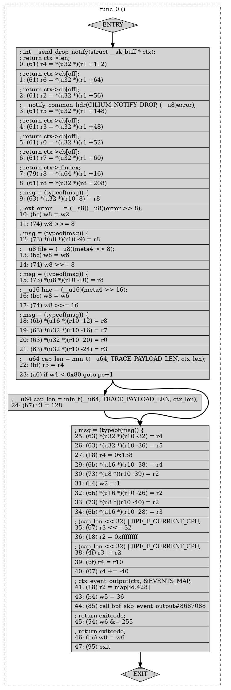

# bpf verifier (2)

[TOC]

这一节结合 kernel docs 里 verifier 的介绍和源码一起学习一下 bpf verifier。

eBPF 程序的安全性由两个步骤确定。

第一步进行 DAG 检查以禁止循环和其他 CFG 验证。 特别是，它会检测具有无法访问指令的程序。 这是 `check_cfg()`做的事情。

第二步从第一个insn开始，沿着所有可能的路径遍历。 它模拟每个insn的执行并观察寄存器和堆栈的状态变化。`do_check()` 做的事情。

## 一些判定规则

1. 传递性，比如` R1` 是 `PTR_TO_CTX`，然后执行语句 `R2=R1`，然后我们就知道 `R2` 也是 `PTR_TO_CTX`了。
2. 不允许指针之间的算术运算，比如 `R2=R1+R1` 就不合法。
3. 未初始化的 寄存器不可以用来赋值，比如 `R1` 没有初始化，就不能执行 `R0=R2`。
4. kernel function call 之后，R1-R5 不能读取，R6-R9 是 callee saved, 他们的状态是一直保留的。

```
// 这段代码能过 verifier，但是如果把 R6 换成 R1 就不行了
bpf_mov R6 = 1
bpf_call foo
bpf_mov R0 = R6
bpf_exit
```

5. Load/store 只能对 PTR_TO_CTX, PTR_TO_MAP, PTR_TO_STACK 使用。他们会被 bound/alignment check
6. 一些 customized 的检查，比如 R1 的类型是 PTR_TO_CTX (a pointer to generic `struct bpf_context`) 一个 customized 的回调函数会用来检查 ebpf 程序对于特定 field 的访问。

```
bpf_ld R0 = *(u32 *)(R6 + 8)
```

比如以上程序，会尝试从 R6 + 8 的地址 load 一个 word 大小，放到 R0 里面。如果 R6 是 PTR_TO_CTX，通过  `is_valid_access()` callback 会进行验证

7. verifier 只允许 eBPF program to read data from stack only after it wrote into it. 比如下面这一段，它会读取 PTR_TO_STACK 的开始的 4 个字节，尽管 R10 就是  read-only register and has type PTR_TO_STACK，而且 R10 - 4 is within stack bounds，但是 verifier 会 reject，因为之前没有对这个位置做 store。

```
bpf_ld R0 = *(u32 *)(R10 - 4)
bpf_exit
```

8. Bpf helper function 会通过 bpf_verifier_ops->get_func_proto() ，然后会检查参数是否合规。


## verification process

翻来覆去看了好多资料，最后发现 learning ebpf 的书里面有讲 bpf verifier.....overall, verifier 会检查所有的执行路径。

它会逐条检查指令，维护 bpf_reg_state。

每次 verfier 来到一个分支，在那里必须决定是按顺序继续，还是跳转到不同的指令，验证者将所有寄存器当前状态的副本推入堆栈并探索可能的路径之一。它继续计算指令，直到它在程序结束时达到返回值(或达到它将处理的指令数量的限制，目前是一百万条指令)，此时它从堆栈中弹出一个分支以进行下一次计算。如果发现可能导致无效操作的指令，则验证失败。

验证每一种可能性是非常消耗计算资源的，所以有一些优化，诸如 剪枝 state pruning。在相同位置的指令，寄存器状态相同的时候，则跳过。

之前有对比，在每个 jmp 指令的前后，都会暂存 pruning state。

## visual control flow of bpf 

```shell
~/proj/learning-ebpf/chapter6 (main ✗) sudo bpftool prog dump xlated id 4050 visual > out-4050.dot
~/proj/learning-ebpf/chapter6 (main ✗) dodot -Tpng out-4050.dot  > out-4050.png
```



## verifying details

* verifying helper function

source code 搜索 `strcut bpf_func_proto`，它定义了 helper function 的参数要求，以及定义的变量会在一些函数中被引用，限制在哪些 bpf program 类型中可以使用。

* checking license

比如需要有 GPL 许可证，才允许调用 bpf_probe_read_kernel 

* checking mem access
* checking ptrs before dereferencing them

* accessing context 

每个函数都有 context 参数，但是context参数可能只有一部分可以访问，比如 tracepoint，只有部分 tracepoint data 可以访问，不同tracepoint 的 common fields 是无法访问的。

* running to completion 能够结束
* checking return code 检查 R0 返回值
* unreachable instruction 一般编译器编译出来的没有这种错误。


## 关于 subprogs 的验证

代码里面 `do_check_subprogs` 负责验证 subprog，注释里面提到了顺序问题，另外，关于 subprog，可以看到 subprog 就是一个 bpf object 里面的某一段指令，类似 c 的 global functions。

```c
/* Verify all global functions in a BPF program one by one based on their BTF.
 * All global functions must pass verification. Otherwise the whole program is rejected.
 * Consider:
 * int bar(int);
 * int foo(int f)
 * {
 *    return bar(f);
 * }
 * int bar(int b)
 * {
 *    ...
 * }
 * foo() will be verified first for R1=any_scalar_value. During verification it
 * will be assumed that bar() already verified successfully and call to bar()
 * from foo() will be checked for type match only. Later bar() will be verified
 * independently to check that it's safe for R1=any_scalar_value.
 */
static int do_check_subprogs(struct bpf_verifier_env *env) 
{
	struct bpf_prog_aux *aux = env->prog->aux;
	int i, ret;

	if (!aux->func_info)
		return 0;

	for (i = 1; i < env->subprog_cnt; i++) {
		if (aux->func_info_aux[i].linkage != BTF_FUNC_GLOBAL)
			continue;
		env->insn_idx = env->subprog_info[i].start;
		WARN_ON_ONCE(env->insn_idx == 0);
		ret = do_check_common(env, i);
		if (ret) {
			return ret;
		} else if (env->log.level & BPF_LOG_LEVEL) {
			verbose(env,
				"Func#%d is safe for any args that match its prototype\n",
				i);
		}
	}
	return 0;
}
```

可以看到一个 subprog 是从 env->subprog_info[i].start; 开始的一段指令。

然后 bpf prog 自己则是从 insn_idx = 0 开始的一段指令。

```c 
static int do_check_main(struct bpf_verifier_env *env)
{
	int ret;

	env->insn_idx = 0;
	ret = do_check_common(env, 0);
	if (!ret)
		env->prog->aux->stack_depth = env->subprog_info[0].stack_depth;
	return ret;
}

```

## other tips

1. Subprog 只能返回 int
1. liveness mark，表示寄存器的一些 read 和 write 关系 (bpf verifier log 里面有)

```c
/* Liveness marks, used for registers and spilled-regs (in stack slots).
 * Read marks propagate upwards until they find a write mark; they record that
 * "one of this state's descendants read this reg" (and therefore the reg is
 * relevant for states_equal() checks).
 * Write marks collect downwards and do not propagate; they record that "the
 * straight-line code that reached this state (from its parent) wrote this reg"
 * (and therefore that reads propagated from this state or its descendants
 * should not propagate to its parent).
 * A state with a write mark can receive read marks; it just won't propagate
 * them to its parent, since the write mark is a property, not of the state,
 * but of the link between it and its parent.  See mark_reg_read() and
 * mark_stack_slot_read() in kernel/bpf/verifier.c.
 */
enum bpf_reg_liveness {
	REG_LIVE_NONE = 0, /* reg hasn't been read or written this branch */
	REG_LIVE_READ32 = 0x1, /* reg was read, so we're sensitive to initial value */
	REG_LIVE_READ64 = 0x2, /* likewise, but full 64-bit content matters */
	REG_LIVE_READ = REG_LIVE_READ32 | REG_LIVE_READ64,
	REG_LIVE_WRITTEN = 0x4, /* reg was written first, screening off later reads */
	REG_LIVE_DONE = 0x8, /* liveness won't be updating this register anymore */
};
```


## run kernel tests

bpf verifier 的 test 在 

```shell
root@ubuntu2204:/home/kanxu/Documents/jammy/tools/testing/selftests/bpf# cat ./verifier/tests.h
/* Generated header, do not edit */
#ifdef FILL_ARRAY
#include "and.c"
#include "array_access.c"
// ...
#include "xdp.c"
#include "xdp_direct_packet_access.c"
#endif
```


## reference

1. kernel docs about verifier
   1. https://arthurchiao.art/blog/linux-socket-filtering-aka-bpf-zh/
   2. https://docs.kernel.org/bpf/verifier.html
   
   
