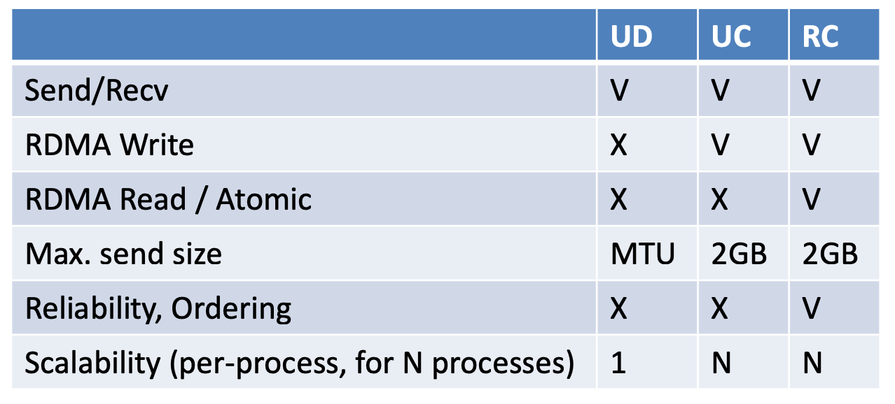
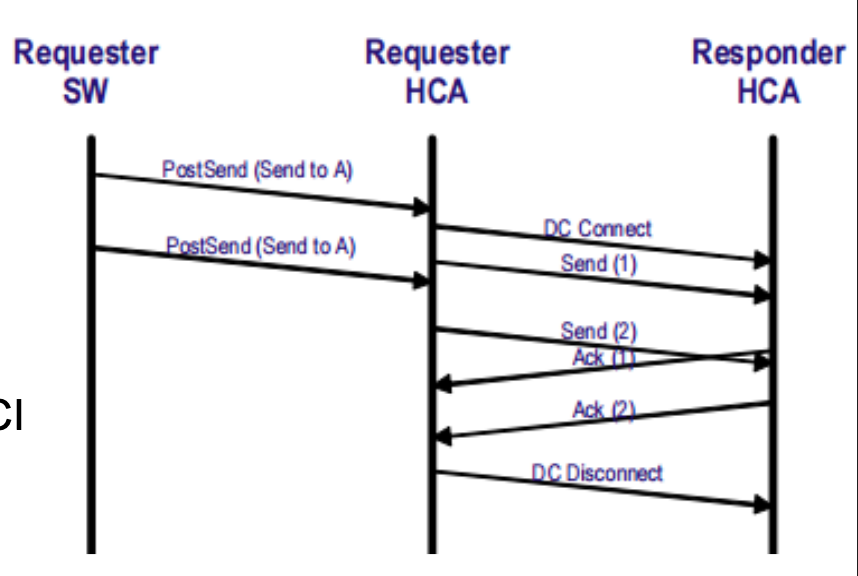
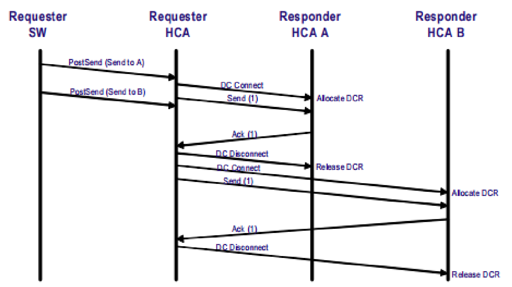
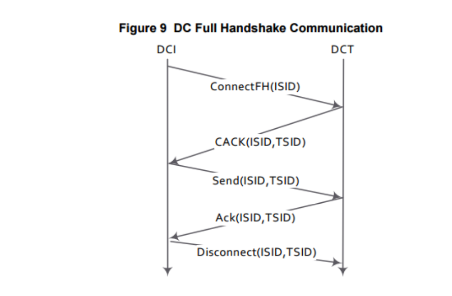

https://www.openfabrics.org/images/2018workshop/presentations/303_ARosenbaum_DynamicallyConnectedTransport.pdf 

UD 可扩展性好，但是不支持 Read Write。RD 不 scale（N个对端，N个QP）。

所以提出 DCT（dynamically connected transport）QP，既能支持 RDMA，又 scale，是reliablility semantics。

sender 侧是 DC initiator，成为 DCI，recv 侧是 DCT，DC target

内部实现上，它是一种临时连接。

* 第一个 send 的 WR 发给 DCI，DCI 会连接到 remote DCT
* 第二个 send 到 WR 会用这个打开的连接。
* DCI 会在一段空闲时间后断开连接。
* 那如果 send WR 练到另一个目的地址的话呢？

DCI 可以改变目的地址，DCT 有一个 responder pool，每个 DC connection 会被分配一个 DC responder。

但如果太少 DCI 的话，

* DCI 可以在不同 destination 切换，但会有很多 connect 和 disconnect 的流量，导致 latency 变差

如果太多 DCI 的话，也不会像 N^2 RC QP 一样差，但还是挺消耗 cache 资源的。

最好的方式是 maintain 一个 DCI hash table，减少建联。LRU 策略来回收。

DCT handshake 分两种

* Half handshake，就是之前介绍的图里面的，只有一次 connect message
* full handshake 的话，则需要三次握手 

