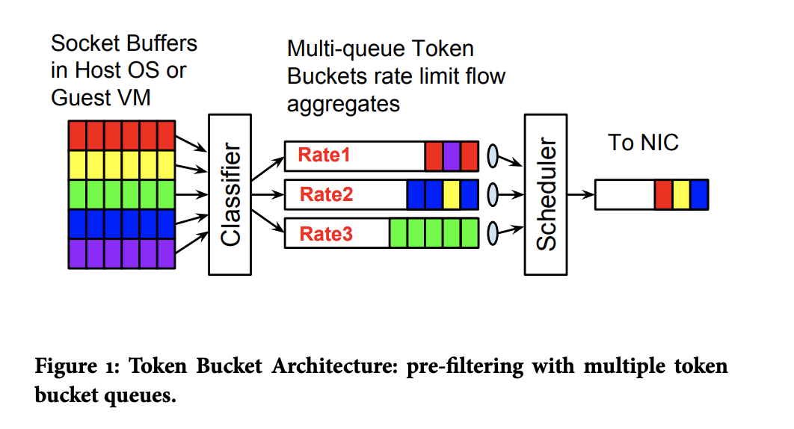
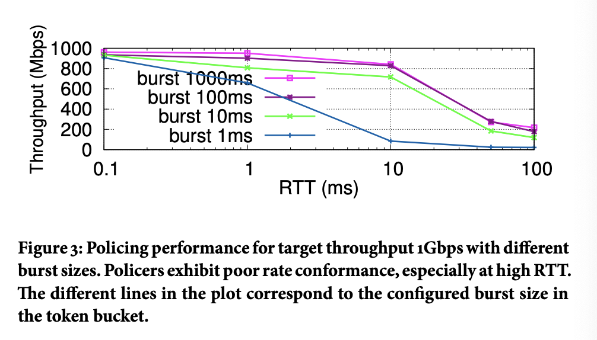
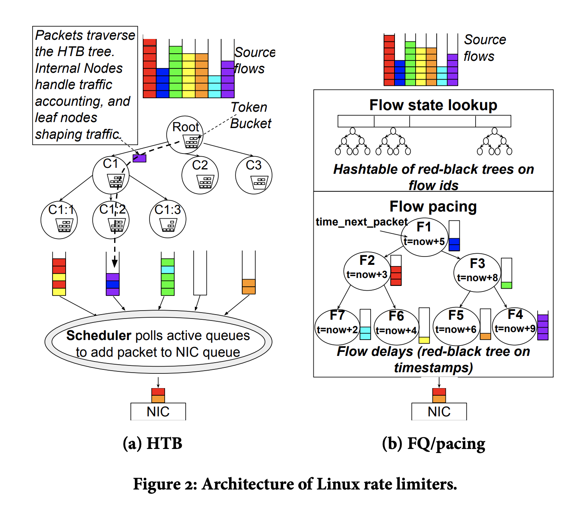
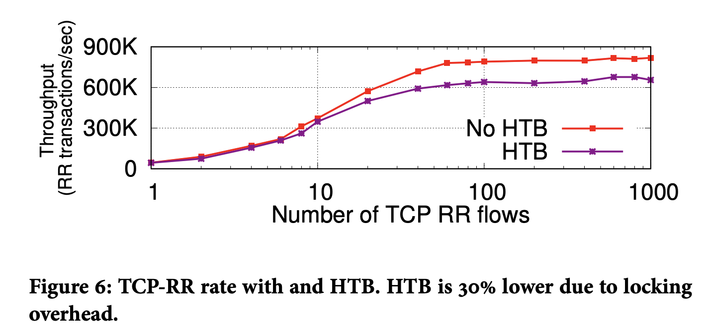
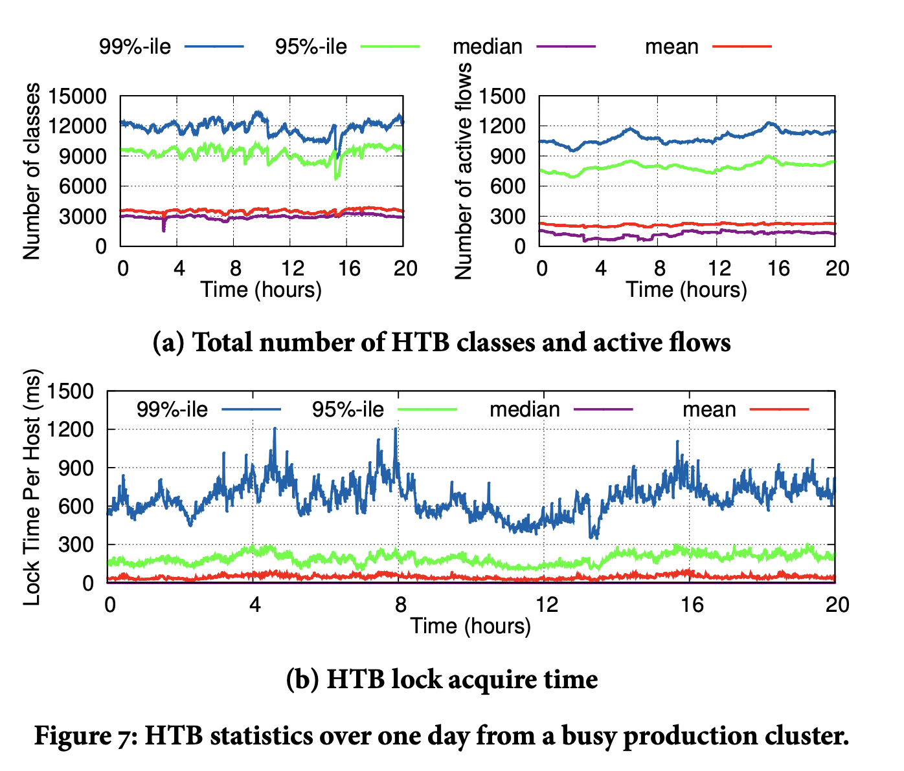
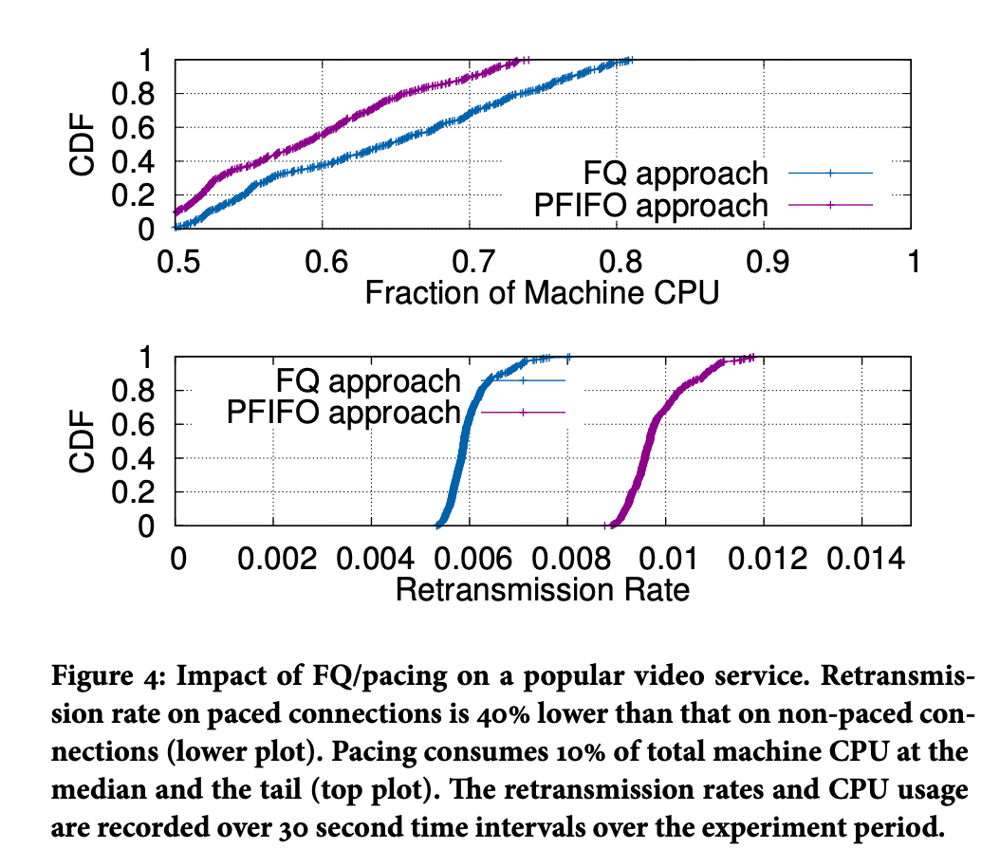

# [SIGCOMM17] Carousel: Scalable Traffic Shaping at End Hosts

## abstract

traffic shaping，即流量整形，在 data center 和 WAN 里都很常见，常见的应用包括 bandwidth allocation，基于 rate 的 congestion control，packet pacing 来防止突发传输(bursty transmissions)来冲击 buffer。

我们需要

1. scale to millions of flows，
2. 对 flow 使用复杂的 policies

因此 traffic shaping 逐渐从 switch 端移到 end hosts，由软件实现。

在这篇论文中，作者发现 end-host 的 traffic shaping 的开销较大，限制了整个系统的 scalability（我们可能需要上千种流量分类）。在 production 的环境中测量发现，shaping 消耗了大量CPU，memory，导致了不必要的 packet drops，以及 head-of-line blocking 和 shaping 的不准确性。

本文中，作者提出了 carousel，一个可以 scale 到 10k+ policies + flows per server 的框架。主要 idea 如下：

1. single queue shaper using time as the basis for releasing packets
2. deferred freeing resources (TSQ, tcp small queue fix in KVM environment)
3. one shaper per core to avoid lock contention.

它限流比较准确，可以做到 更好的准确度，消耗的 memory 也比正常的低两个数量级。

## introduction 

主要介绍 traffic shaping 的发展趋势

traffic shaping 广义上包括 rate limiting 或者 pacing，pacing 是指 inter packet gap between packets within a single connection，rate limiting 指 enforcing a rate on a flow-aggregate consisting of one or more connections。

traffic shaping 以前主要在 WAN switch 上，最近也逐渐用于 datacenter communication，在 end host 上发挥作用。

一个趋势是，使用 pacing 的 congestion control 算法更多了，譬如 BBR, TIMELY，他们实测能减少 video-serving traffic 和 incast communication 场景的 drop (incast 是指 datacenter app 同时和1k+的服务器在交互)。在 incast 场景，一个 sender 很容易把 receiver 的 network bandwidth 冲垮。

此外， endhost 的 traffic 变得普遍更加 bursty（由于 batching, aggregate 提升性能，也比如 TSO，GRO，都会做 batching）。Pacing 可以减少 burstiness，也减少了 shallow buffer 的 drop，从而提升 network utilization。

另一个云环境更需要 isolation 了。一个 server 上可能有 1k+ VM(啊这)，每个 VM 也要和其他 VM(1k+) 通信，最终可能导致有 1000k+ flows 在一个 server 上(啊这)。

之前， network switches 和 routers 已经有 traffc shaping 了。但是这些 middlebox 也不太可能做 traffic shaping（他们也不知道 endhost 上的状态，除非对 flow 打标记）

后面是介绍 carousel 的设计，（略，大概是 abstract 里面的意思）

## traffic shaping in practice

一般典型的 traffic rate limiter 如上图所示，一般叫做 pre-filtering with multiple token bucket queues，它依赖于 a classifier, multiple queues, token bucket shapers and a scheduler。classifier 把包分类到不同的队列，队列有相关的 traffic queue，scheduler 会按照 round-robin 的方式，按照 per class 的优先级来访问各个 queue，取出 packet。

这样的方式通过对每个 flow aggregate 设置一个 queue，避免了 head-of-line blocking。所有同一个  queue 的 packet 都会被 delay，但不会被其他 queue 影响。其他机制，如 TCP small queue 提供了 backpressure ，从而减少 network stack drop。

除此之外，介绍 3 种 常用的 end-host 的 shapers。包括

1. policer
2. HTB
3. Fair queue(FQ)

### policer 

policer 是最简单的限速方式，policer 使用 zero buffer 的 token bucket 来限速。token bucket 使用一个 counter 记录 token 数量，发包的时候检查 counter 值，发包需要消耗 token。如果没有足量 token 就丢弃 packet。

token 按照 target rate 填充，并且 bucket 中最多只有 burst 个 token。rate 表示目标速率，burst 表示 tolerance/jitter，表示短时间对于 target rate 的偏差。

**Tradeoff**:

policer 非常简单，开销最小。因为是 zero-buffer，开销也很小，CPU 开销也很小，因为不需要 schedule/manage queues。然而， policers 很难到达妥协的速率，图 3 中我们可以看到随着 RTT 增加，policers 逐渐偏移 target rate，有两点原因，一是它会  drop non-conformant packets 另外也失去机会再未来再 schedule 这个 packet，另外，在 TCP 情况，即使是常规的 packet loss 也会导致 low throughput 和 wasted uplink work。

为了修正这种情况，在 large bandwidth delay product 的网络中运作，policer 需要配置一个较大的 burst size，需要一个系数 根据 flow 的 RTT 的时间和 rate limit 的速度大小而定。

但是过大的 burst 是不可取的，因为在 short time scale 中会导致 rate 很大，限速无法起作用。比如在下图中，burst 设置越小，导致 throughput 越小，并且 RTT 越大，throughput 越小。

注：以 burst = 1000ms 为例，其 burst size 为 1000 Mbps * 1s = 1000 Mb，能容纳 1000Mb 的突发流量。而 BDP 在开始可能有 1000Mbps * 100ms = 100Mb，按理说也没到呀 

### HTB

和 policer zero buffer 不一样， traffic shaper 会 buffer packet，而不是 drop 他们，实际上，token bucket 会以复杂的结构组织起来，linux qdisc HTB 中会使用 tree 来组织 shaper。如图 2a 中所示，HTB 将 packet 划分到不同的 traffic classes，每个 class 都和一个叶子结点的 shaper 联系起来，HTB 的结构可以使得不同的 bucket 之间相互借 token。

google 的 BwE 就在 端侧借助 HTB 实现 端侧限速。traffic flow 被划分到多个 flow aggregate。HTB 的叶子数量等于 QoS 的数量 * destination clusters * number of tasks。

为了避免 queue 无限增长，shaper 需要使用 TCP 协议栈的 backpressure 的机制，就是 drop packets，然而 drop 也只是一个 TCP 协议栈的一个 coarse signal，HTB 使用了 TSQ 来限制 qdisc 中的数量，限制 TCP 上层发包。直到网卡发包了，他们才能继续从 TCP/IP stack 发包。在有 flow aggregates 的情况下，enqueue packets 最多只有 TCP flows* TSQ limit。再多的 packet 都会被 drop 掉。

**Tradeoff**：

不像 FQ/pacing，HTB 能够提供很好的 rate conformance 和 target rate 只有 5% 的 throughput 偏差，但代价是 CPU 和 memory 消耗较大。随着 pps 越大，HTB 的 CPU 消耗越多。图 6 中可以看到在 netperf RR 的情况下，flows 越多，使用 HTB 会导致 pps 越小。

> 注： 我理解 HTB 底层也是 token bucket 实现的，它也要配置 busrt 值，为什么它就没有所说的 target rate 的问题？？？

HTB CPU 高的原因是 global qdisc lock，当每个 packet enqueue 的时候，都会占用这个锁，http://events.linuxfoundation.org/sites/events/files/slides/net_stack_challenges_100G_1.pdf 有详细说明

根据论文作者从 Production 中拿到的数据，拿一个锁的 p99 时间可能到 1s。

而对于 memory 的 cost，理论上是 flows*cwnd 的大小。图 8 是有个 VM 有个 flow，被 shaped 到了 2Gbps & 50ms，在 p99 的情况下，有 21k 个 MTU 的包，大概消耗了 32MB 的数据，由于 buffer，导致了 120ms 的延迟。在有 backpressure 的情况下，最多 85 个 MTU 的包。memory 就小很多了。

> 2 Gbps*50ms = 100Mb -> 12.5 MB
>
> 32 MB / 12.5 MB = 2.56
>
> 120ms/50ms = 2.4 差不多

按理说，memory 消耗等于 shaper 的数量。

### FQ/Pacing

FQ/pacing 是 linux qdisc 中用于 packet pacing 的流控机制，通过 fair queueing 在 egress 对 UDP 和 TCP traffic flow 起作用。上面图片 2b 中说明了 FQ/pacing 的结构， FQ scheduler 通过红黑树维护每个 flow 的状态，用 [DRR scheduler](https://en.wikipedia.org/wiki/Deficit_round_robin) 来从 active flows 里面拿 packets，同时也会有 GC 来清理 inactive flows。

维护每个 flow 的状态提供了能够 pace 每个 active flow 的能力，特别地，TCP 会按照 `cwnd/RTT` 来发包。cwnd 和 RTT 都只是 best-effort estimates，所以 TCP 把 pacing rate 设成 `2*cwnd/RTT`，FQ 通过一个 [Leaky bucket ](https://en.wikipedia.org/wiki/Leaky_bucket) 来实现 pacing rate。

Linux TCP stack 进一步利用 pacing rate 来自动调整用于 TSO 的数据包大小。 目标是每 1 ms 至少有一个 TSO 数据包，以触发更频繁的数据包发送，从而获得更好的 ACK clocking 并减少低速率流的 small burst。 TSO 自动调整大小、FQ 和调步共同实现 Linux stack 中的流量整形。

**Tradeoff**: 

FQ/pacing 可以提供还好的限速保证，最多离 target rate 偏离 6%，但是很消耗CPU。

为了理解其 impact on CPU 和 packet loss，作者 在 Production video servers 上跑了实验，峰值流量 37 Gbps，使用 PFIFO queue 作为对比，可以看到 FQ 的 CPU 占用要高一些，但是相应的，重传率要低一些。

这种 pacing 的 cost 不局限于 FQ/pacing in qdisc， 对于 其他traffic，比如 QUIC，也是一样的。QUIC 可以在 userspace 做 pacing，发现开启 pacing 后 CPU 比不开 pacing 高了 30%。

### summary 

HTB 和 FQ/pacing 的问题不仅仅是 accuracy 和 granularity。 HTB 和 FQ/pacing 的 CPU 效率低下是这些机制固有的，而不是配置不当的结果。 这些整形器的架构基于跨多个队列和核心的同步，这会增加 CPU 成本：

1) FQ/pacing 和 HTB 的令牌桶架构需要多个队列，每个速率限制一个队列，以避免队头 阻塞。 维护这些队列的成本随着此类队列的数量而增长，有时呈超线性增长。 CPU 成本源于多种因素，尤其是需要轮询队列以处理要处理的数据包。 通常，调度程序要么使用简单的循环算法（其中轮询成本与队列数量成线性关系），要么使用更复杂的算法来跟踪活动队列。 
2) 跨多个核心的同步：此外，多 CPU 系统的成本主要由 CPU 之间共享队列和相关速率限制器时的锁定和/或争用开销决定。 HTB 和 FQ/pacing 在每个数据包的基础上获取全局锁，随着 CPU 数量的增加，其争用会变得更糟。 解决这些问题需要一种根本不同的方法，例如我们在以下各节中描述的方法。 如今，从业者在速率限制器中面临着一个艰难的选择：policer 具有很高的 CPU/内存效率，但整形性能却令人无法接受。 HTB 和 FQ/pacing 具有良好的整形特性，但 CPU 和内存成本相当高。 准确调整带来的 10% CPU 开销与额外的网络效率相比是值得的，特别是对于 WAN 传输。 现在的问题是，我们能否以更少的 CPU 开销获得相同的功能。

### in pactice

FQ/pacing 和 HTB 可以一起使用， FQ 是给单个流限流的，HTB 是给 flow aggregate 限流的。两者可以组合。policer 一般用在 hypervisor 的 switch 上，因为 HTB/FQ 会比较消耗 CPU。

