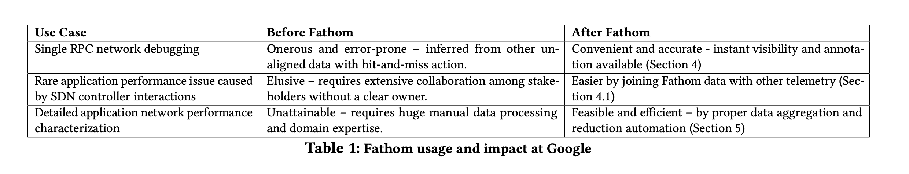
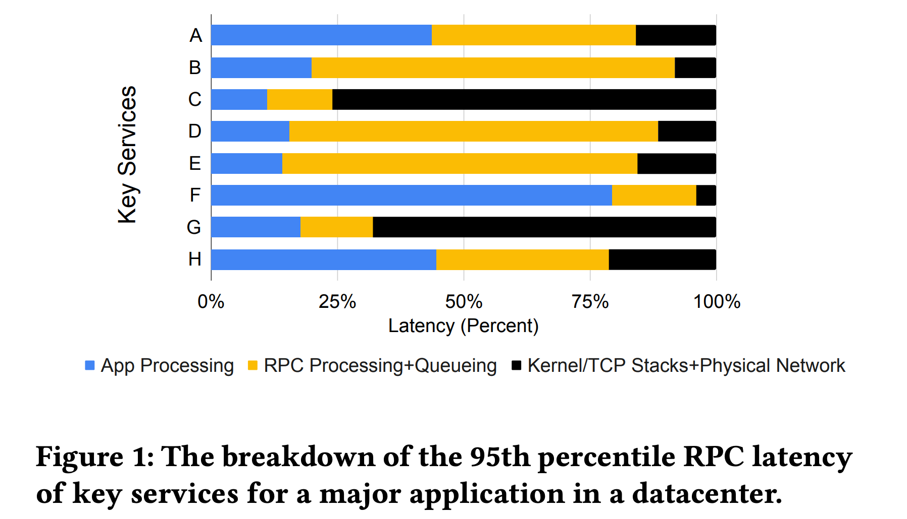
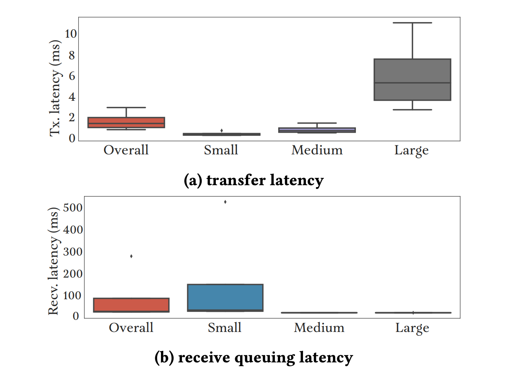
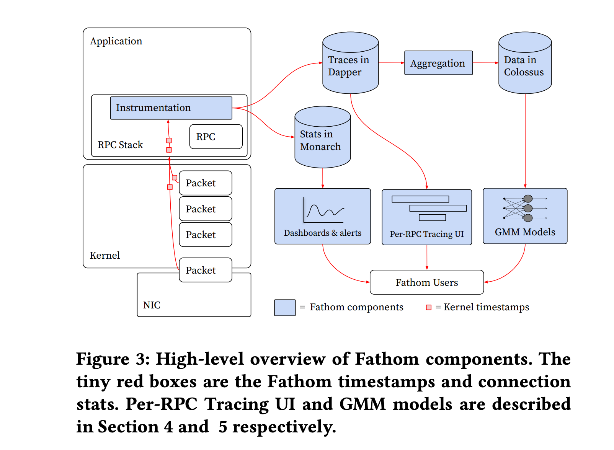
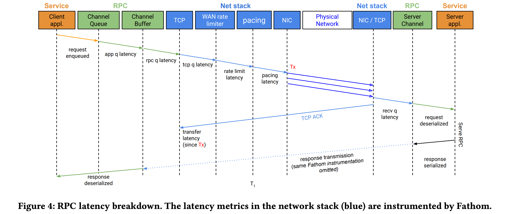
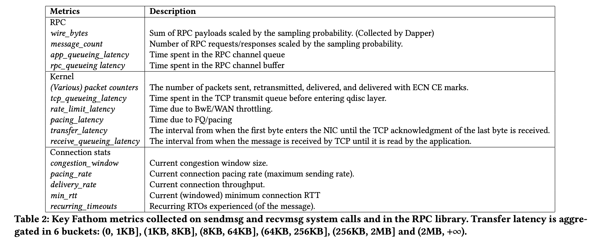

# [SIGCOMM23] Fathom: Understanding Datacenter Application Network Performance

> Translated by KIMI，读不通的地方就是 KIMI 的锅，不过我觉得它概括做的挺好的

Abstract: 给 RPC 请求找 network performance bottleneck。它把 network latency 划分成了 host 和 network components，通过 kernel 和 RPC 的 stack 注入。对于每个 sampled RPC，它记录了所有的 detailed latency metrics，还有 transport 的 connection state。

这让我们可以知道 network 的限制在哪里，client, network 还是 server。为了能够扩展分析，还把样本聚合，更容易分析。

它已经应用于谷歌所有的数据中心，全局运行，应用于所有的生产流量，监控数十亿的 TCP 连接。

## introduction

我们希望改善服务和网络基础设施，以保持这种延迟的低水平。不幸的是，由于服务网络性能的高度异质性，很难知道如何最好地减少 RPC 网络延迟。RPC 的执行受到本地主机资源（如 CPU 和内存）、远程主机资源以及它们之间的网络的约束。每个组件都由许多竞争服务动态共享，并且具有不同的工作负载。在不同的服务工作负载下的不同时间，任何组件都可能限制性能。结果是，一些服务经历高 RPC 延迟，而在同一基础设施中运行的其他服务则没有。此外，对基础设施的更改可能会使某些服务受益，同时降低其他服务的性能。

我们以两种方式体验服务和网络性能之间的复杂关系。

* 首先，当服务所有者发现 RPC 完成需要很长时间时，他们会联系网络团队寻求帮助。在多租户环境中找到根本原因是具有挑战性的，因为问题可能源于并行性不足、间歇性故障、网络带宽以及服务器 CPU 或内存瓶颈。
* 其次，我们必须评估网络基础设施升级（例如，更快的 NIC、更多的链路条带、新的拥塞控制或不同的路由）的好处，以决定是否在整个车队中部署。跨所有服务平均的指标并不足以作为有效的决策标准，因为服务体验差异很大。平均视图可能掩盖了某些服务的重要退化。当更改将性能瓶颈转移到其他组件时，我们可能低估了它应有的潜力。例如，更快的 NIC 可能带来性能增益，但也需要更多的主机资源来实现增益。如果主机资源不够，NIC 的性能潜力无法充分释放。

数据中心网络性能已经得到了很好的研究，但我们发现现有的方法并不适合解决这些基本问题。高层次系统可以测量总体的 RPC 延迟，但并不能告诉我们为什么观察到这种延迟，以及如何减少它。较低层次的连接或网络遥测很有价值，但需要与 RPC 消息边界关联以直接关联服务性能。例如，交换机计数器跟踪利用率和损失，但跨所有服务平均。在主机或交换机上的包样本（甚至完整的跟踪）仅捕获网络事件，而不涉及主机延迟。其他方法如主动探测测量网络性能，但从探测服务的角度而不是应用程序服务的角度。

我们创建了 Fathom 以补充这些现有实践，专注于可见性、可解释性和可扩展性之间的权衡。Fathom 无缝集成了 Google 的 Dapper RPC 跟踪系统，以进一步注释采样的 RPC，并提供丰富的网络栈仪表板。除了采样的 Dapper RPC 跟踪外，它还单独对 Google 的每个连接进行仪表板。为了在不干扰服务的情况下收集详细信息，Fathom 采样并被动监控生产 RPC。它使用内核时间戳设施来测量每个处理步骤在本地和远程主机栈以及网络传输时间的延迟。对于每个时间戳，它附加相应的连接级测量，如拥塞窗口、超时和 RTT，以提供解释 RPC 延迟背后原因的指标。我们聚合多维数据切片，让我们能够推理限制各个服务网络性能的因素。

一个关键的挑战是在操作规模上产生的庞大数据量与保留使数据有价值细节和测量维度之间的竞争需求之间取得平衡。Fathom 用服务元数据注释每个 RPC，例如源和目的用户以及网络位置。然后，我们根据这些元数据对 RPC 指标进行分组，按分钟进行分箱，并使用 t-digests 聚合成分布。在高斯混合模型（GMM）的离线处理中，我们将数百万的 RPC 指标数据减少到只有几十组聚合分布，以便我们的专家关注最显著的变化。生成这些模型仅需要几十分钟，而使用原始方法则需要专家手动切分和汇总原始数据，这在劳动强度上要大得多，而且在我们的规模上是完全不可持续的。

在本文中，我们介绍了 Fathom 以及我们在 Google 数据中心超过五年的全球生产部署经验。Fathom 从所有生产 RPC 流量（Google 网络流量的绝大部分）中被动地收集高分辨率内核时间戳和详细的 TCP 统计信息，对数十亿并发连接上的每个 Petabit 流量进行仪表板，同时仅消耗整个系统 (fleet-wide) 总 RPC/TCP/内核周期的 0.4%。Fathom 提供了以前难以获得的网络问题洞察；

例如使用案例 Table 1。在微观层面上，在许多情况下，它揭示了 RPC 减速的源头，以指导调查和行动。在其他情况下，它可以揭示需要基础设施升级、回滚甚至协议修复的微妙问题。在宏观层面上，它自动化了大规模数据处理，以快速突出网络基础设施变更前后的服务质量性能影响。我们发现它在量化许多数据中心基础设施部署的网络性能影响方面是不可或缺的。

总结我们的贡献，Fathom 的主要创新是

* 结合了低开销的 RPC 网络改造、可扩展但细粒度的聚合 t-digest，以及从大量原始数据中提取洞察
* 通过多年的实际使用，涵盖了我们所有的生产 RPC 流量，我们证明了这样的系统不仅可以落地，而且对于大规模的网络非常有价值。

## background and context

> 懒得翻译了，直接拿 kimi 概括的结果，我觉得概括的挺好的

1. **微服务依赖性**：现代数据中心的应用程序通常依赖于许多微服务，这些服务的性能分析对于整体系统性能至关重要。
2. **RPC 跟踪**：使用 Dapper 这类分布式 RPC 跟踪工具可以普遍地监控 RPC 性能，图 1 显示了一个数据中心中主要应用程序中前十个服务的 95 百分位 RPC 延迟的细分。但是它们通常只在 TCP 层以上的网络性能具有可见性。
3. **性能异质性**：即便在相同的网络基础设施上，不同服务的网络性能表现也可能大相径庭。某些服务，如示例图中的服务 C 和 G，可能会经历较高的网络延迟。
4. **延迟分析的复杂性**：网络延迟的原因可能多种多样，包括发送方的内核排队、接收方的应用程序响应速度慢、网络拥塞等。
5. **Fathom 的作用**：Fathom 通过分解 RPC 网络延迟成不同组件，提供了更细致的延迟数据，帮助确定高延迟的原因。
6. **数据解释的挑战**：在分析大量混合 RPC 时，需要保留相关子群体的分布，以避免辛普森悖论(是概率和统计中的一种现象，其中趋势出现在几组数据中，但当这些组被合并后趋势消失或反转)，这是一种因数据聚合方式不当而得出错误结论的现象。
7. **传输与接收延迟**：传输延迟和接收排队延迟会根据 RPC 的大小而变化，对于小型 RPC，接收排队延迟较高，而对于大型 RPC，传输延迟较高。
8. **优化考虑**：如果只考虑所有 RPC 大小的总体延迟，可能会错误地优化对小型传输有益的方面，而忽视了对大型传输更重要的性能改进。

## fathom design

简单来说， Fathom 希望微观上能够看到一个连接的关键事件，提供更强的网络可见性。宏观上，希望方便做聚合，后期容易分析，在服务变更的时候，能够直观看到优化/劣化。

也有其他一些方案，收集信息，但这些方案有一些短板，比如

* 发送 RPC 之前和之后收集 TCP 统计数据对于调试微秒级间隔发生的事件是没有用的。
* 使用 eBPF 作为 side channel 收集统计数据在运行时成本过高，并且由于需要 root 权限，难以与现有的应用级监控集成。
* 导出所有跟踪 RPC 的原始事件日志在网络和存储成本上都很高。

### high level design

Figure 3 展示了 Fathom 及其组件的高层设计，以蓝色突出显示。Fathom 跟踪用户空间中 RPC 的字节边界在序列化缓冲区中的位置(the byte boundaries of an RPC in the serialization buffers in user space)。然后，它使用这些边界指导内核收集 RPC payload 的传输和接收时间戳，因为它们穿越端到端路径。用户空间仪表板从内核收集网络时间戳以进行进一步处理。这些时间戳将数据在主机的各种内核管道阶段（如排队、等待 ACK 等）以及网络中的时间花费分解开来。Fathom 还记录了 TCP 连接指标，如 RTT、拥塞窗口和丢包率，这些指标既附加在采样 RPC 的内核时间戳上进行跟踪，也通过定期统计收集所有 RPC 连接的数据。每个 RPC 的统计数据和每个连接的定期统计数据都输入到中央收集服务 Monarch [4] 中，Fathom 后期可以根据不同的目的以不同的粒度聚合数据，用于实时监控、警报和仪表板。

### host stack intrumentation

Fathom 的仪表板收集了从用户 RPC [7] 库、通过 Linux 内核 TCP/IP 协议栈和流量整形（qdisc）层，到 NIC 的请求或响应数据的时间戳信息，在发送主机还是接收主机上都收集了。图 4 展示了 Fathom 如何将延迟分解为数据包穿越 RPC 和内核网络栈的不同层。≈当请求和响应穿越不同的层级的时候，Fathom 收集了他们的时间戳。

在用户空间，Fathom 仪表板在 RPC 库中记录了请求或响应进入 RPC 缓冲区、序列化以及写入套接字的时间戳。Prior to our work, 对于每个 socket，这些时间戳可以对每个 socket 按需打开。

但由于需要按 RPC 启用时间戳，独立于 TCP 套接字，并且否则保持关闭状态，这对 Fathom 来说是不恰当的。在所有套接字上始终启用时间戳将使我们的 RPC 栈开销增加 30%，这是不可接受的。

为了减轻这个成本，对 LInux 做了一系列改造

**对于发送方：**我们在 Linux 中引入了一个选项，使用 sendmsg 系统调用中的辅助数据（cmsg）请求个别时间戳。如果 RPC 被采样进行跟踪（例如，由 Dapper），Fathom 使用这个特性在 RPC 消息边界请求时间戳。

* 发送方启用 SO_TIMESTAMPING 并请求 TX_SOFTWARE 和 TX_SCHED 时间戳，以捕获携带边界字节的数据包离开内核 TCP/IP 协议层，过渡流量整形并交给 NIC 的时间；
* 发送方使用 TX_ACK 捕获消息被 TCP 完全确认的时间。

时间戳本身对于根因分析是不够的，需要了解 TCP 连接的状态（例如，RTT、拥塞窗口和调整速率）及其限制因素（例如，接收窗口和发送缓冲区限制）。在用户空间接收到时间戳时拍摄的 TCP 状态的快照被证明是不准确的，特别是在高速网络中。用户空间应用程序可能需要一毫秒的时间来处理未处理的时间戳( It can take a millisecond for a userspace application to process outstanding timestamps and)，这个时候，TCP 连接的状态可能已经发生变化了。

为了解决这个测量延迟问题，我们引入了一种名为 OPT_STATS 的新特性，用于传输时间戳。该特性在内核中记录时间戳时捕获 TCP 的状态。从各种时间戳和 OPT_STATS 捕获的数据包括：

* 延迟：从字节被发送出去直到在 TCP 中被确认时，在主机的每个层级（即 RPC、TCP、数据包调度器）和网络中花费的时间。
* 连接状态：TCP RTT、拥塞窗口、发送和重传的数据包数、ECN CE 标记、重复超时等。 
* 速率：发送方调整速率和接收方交付速率（即吞吐量）。

**在接收方**：内核必须在知道这是否是采样消息的一部分之前对数据进行时间戳标记，因此 Fathom 在所有 RPC 连接上启用了低开销的 RX_SOFTWARE 选项。这些时间戳是通过与从套接字读取传入数据的同时，通过 cmsg 并发收集的。在发送方，传输时间戳和统计数据由 RPC 库异步地从数据发送中通过套接字的错误队列（即 MSG_ERRQUEUE）收集。

表 2 总结了这些时间戳和统计数据。这些指标是经验性且简洁地选择的，以指导诊断。例如，一个关键指标，传输延迟，是从第一个字节进入 NIC 直到收到 TCP 对最后一个字节的确认的时间间隔，其中在 TCP 延迟确认中产生的延迟通过内部 TCP 选项进行了补偿。传输延迟包括 TCP 重传和丢包恢复、拥塞控制和流控制适应，这需要相应的统计数据来区分。请注意，不需要发送方和接收方之间的紧密时钟同步，因为所有 Fathom 延迟指标都是基于同一时钟的时间戳。我们所有的时间戳扩展已经并入到 Linux 内核 v3.17 及以后的版本中 [11] [Merge branch 'net-timestamp-next' - kernel/git/torvalds/linux.git - Linux kernel source tree](https://git.kernel.org/pub/scm/linux/kernel/git/torvalds/linux.git/commit/?id=618896e6d00773d6d50e0b19f660af22fa26cd61) 。请注意，Fathom 时间戳与系统调用的语义（例如，是否使用零拷贝）、IO 通知机制（例如，使用 epoll 或 io_uring）或卸载机制（例如，TCP 分段卸载或 PSP 加密卸载 [38]）是正交的。Fathom 跟踪数据如何穿越栈，无论它如何被操作。它将相同的跟踪技术应用于用户空间 RPC 传输 [23]。

### Horizontal scaling

为了将测量数据的收集开销限制在可管理的范围内，Fathom 以均匀随机的方式对车队范围内的 RPC 进行采样。

Fathom 应用了两个默认采样率：1:1000 与 Monarch 收集更多样本，减少了一组维度用于实时监控，以及 1:128k 与 Dapper 提供更丰富的一组维度用于离线分析。

Fathom 记录与每个 RPC 相关的分类属性，如源和目的地用户、作业名称、数据中心位置、数据包 QoS 类别和拥塞控制算法，以便于查询和分析。

为了有效扩展并管理数据量，Fathom 采用随机采样策略，并利用 t-digests 算法来聚合数据，以保持分布的准确性，尤其是在分布的尾部。

....

### deployment experience

Fathom 使用现有的基础设施服务 Monarch [4] 和 Colossus [12] 进行数据收集和保留。它已经部署了五年多，涵盖了 Google 所有生产服务，通过仪器化所有三个 RPC 库（Stubby、gRPC [1]、Pony Express [23]）而无需任何应用程序更改。收集 Fathom 时间戳为我们的 RPC 栈增加了 0.4% 的 CPU 开销。尽管流量增长了几个数量级，但覆盖范围和数据可用性始终接近 100%，由一个小型的三名开发人员团队管理。我们使用持续的单元和基准测试，针对 RPC 系统和内核网络（例如 packetdrill [8]）以确保正确性和效率。在接下来的两节中，我们将介绍使用 Fathom 的生产经验。首先，我们将展示如何将 Fathom 与现有的遥测集成，帮助服务所有者排除他们的网络性能问题。然后，我们将展示我们如何减少大量的 Fathom 数据，以表征 Google 的一些网络基础设施升级对应用程序性能的影响。

Fathom 的所有仪表板工作都在 Linux 内核和 gRPC 中公开可用，以便开源社区也能从中受益。

...

## Experience

1. **Dapper 集成**：Fathom 与 Google 的分布式 RPC 跟踪系统 Dapper 集成，提供了对网络性能问题的深入洞察。Dapper 允许开发人员通过延迟分解来识别性能瓶颈，而 Fathom 增加了网络层面的详细数据。
2. **注释和故障排除**：Fathom 的数据被用来注释 Dapper 的 RPC 跟踪，提供了额外的网络性能信息。这些注释帮助用户快速识别和理解单个 RPC 的性能问题。
3. **简化诊断**：通过 Fathom，网络性能问题的诊断变得更加便捷和准确。Fathom 提供的即时可见性和注释功能减少了以往繁琐和容易出错的推断过程。
4. **案例研究**：文中提供了一个案例研究，展示了 Fathom 如何帮助识别和解决 WAN（广域网）应用程序的性能问题。在 WAN 链接故障后，特定的 WAN 应用程序表现出两个性能下降的阶段。Fathom 数据帮助快速定位到 WAN 流量控制器 Bandwidth Enforcer（BwE）作为问题源头。
5. **性能问题分布**：通过分析一个月期间的 Fathom 注释数据，作者发现大多数性能问题实际上并不是由网络拥塞引起的。例如，接收主机的资源争用是导致性能下降的最常见原因。
6. **存储服务的 RPC**：对于存储服务的 RPC，Fathom 的注释分布显示了在高速和低速网络基础设施中性能问题的对比。高速网络基础设施中，网络拥塞问题相对较少。
7. **WAN 限制问题**：Fathom 揭示了 WAN 应用程序在 WAN 链接故障后遇到的一个不明显的性能问题。在链接修复和容量恢复后的几分钟内，许多 RPC 因超时而失败。Fathom 数据指导了对 WAN 流量控制器 BwE 的调查，揭示了其在处理突发的低速率限制时的问题。
8. **自动化和效率**：Fathom 的使用减少了对网络操作团队的依赖，使得服务所有者能够自行诊断 "容易到中等" 的网络性能案例，同时让专家能够专注于解决更复杂的问题。

## CHARACTERIZING APPLICATIONS’ NETWORK PERFORMANCE

1. **GMM 方法**：为了自动化和简化从大规模多维数据中提取有用信息的过程，作者采用了高斯混合模型（GMM）来分析 Fathom 数据。GMM 能够将数据聚合成几个“blobs”（数据簇），每个簇代表一组经历相似网络性能的 RPCs。
2. **特征化分析**：GMM 分析有助于快速识别和理解基础设施变更对应用程序性能的影响。通过比较变更前后的 GMM 数据，可以揭示性能变化的模式和趋势。
3. **案例研究**：文中提供了两个案例研究，展示了如何使用 GMM 分析来评估网络基础设施变更的影响。
   - **BBRv2 拥塞控制**：第一个案例研究分析了 BBRv2 拥塞控制算法在存储服务中的作用。GMM 分析显示，从 BBRv1 到 BBRv2 的过渡导致了预期中的变化，如拥塞窗口（cwnd）的减少和传输速率的下降。
   - **DCN 硬件升级**：第二个案例研究评估了数据中心网络（DCN）硬件升级对 Jupiter 数据中心的 Monarch 服务的影响。GMM 分析揭示了不同超级块（superblock）类型和目标用户之间的性能差异。
4. **性能回归分析**：在另一个案例中，GMM 分析帮助识别了一个看似的性能退化问题，即在硬件升级后，特定存储服务的小 RPCs 出现了双峰延迟分布。通过深入分析，团队确定了问题的根本原因是 CPU 状态唤醒延迟，而不是网络拥塞。
5. **自动化和效率**：GMM 方法的使用大大提高了分析效率，使得在几分钟内就能生成模型，而不是手动处理数十万个多维分布或数百万的 RPC 样本。
6. **数据简化**：GMM 分析方法能够将大量的原始数据简化为易于理解的数据簇，从而帮助领域专家快速识别和分析影响性能的关键因素。
7. **性能 bug 发现**：GMM 分析不仅有助于性能特征化，还能揭示潜在的性能问题，如 BBRv2 实现中的一个 bug，这个 bug 导致了拥塞窗口的异常行为。
