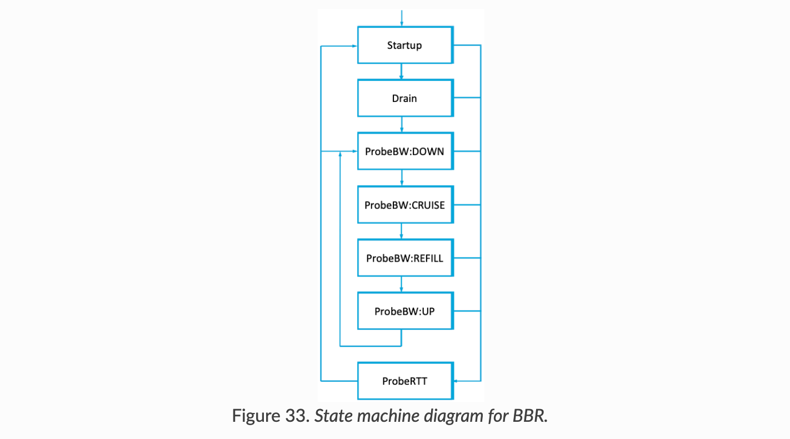

# 《TCP CC: a systems approach》nßotes 3: avoidance-based cc

Link: https://tcpcc.systemsapproach.org/index.html 

概括总结 by kimi

前一节 introduction 最后说到 implementation choices 主要有两种，一种是 control-based，一种是 avoidance-based。这一节介绍其一。

迄今为止描述的每种方法(loss-based/control-based)都把数据包丢失视为拥塞信号，并试图在拥塞开始后做出反应来控制拥塞，而TCP Vegas则采取了一种基于避免的拥塞方法：它试图检测测量吞吐量率的变化，并在拥塞严重到足以引起数据包丢失之前调整发送速率。本章描述了一般的“Vegas策略”，以及随着时间推移引入的该策略的三个示例变体。这个案例研究以今天由Google倡导的BBR算法作为高潮。

## 5.1 TCP Vegas

TCP Vegas的核心思想是**基于测量的吞吐量率与预期吞吐量率的比较来调整发送速率**。这种直觉可以从图29中给出的TCP Reno的追踪中看出。顶部的图表追踪了连接的拥塞窗口；它显示了与前一章中给出的追踪相同的信息。中间和底部的图表展示了新信息：中间的图表显示了在源处测量的平均发送速率，底部的图表显示了在瓶颈路由器处测量的平均队列长度。所有三个图表都是时间同步的。在4.5秒到6.0秒之间的时间段（阴影区域），拥塞窗口增加（顶部图表）。我们期望观察到的吞吐量也会增加，但实际上它保持不变（中间图表）。这是因为吞吐量不能超过可用带宽。超过这一点，**窗口大小的任何增加只会导致数据包在瓶颈路由器（底部图表）的缓冲区中占用空间**。

>  Figure 29. *Congestion window versus observed throughput rate (the three graphs are synchronized). Top, congestion window; middle, observed throughput; bottom, buffer space taken up at the router. Colored line = CongestionWindow; solid bullet = timeout; hash marks = time when each packet is transmitted; vertical bars = time when a packet that was eventually retransmitted was first transmitted.*

这里可以用一个很形象的比喻，你在马路上开车的时候，车上仪表告诉你，你的速度是 30km/h，但是其实据你的观察，你的速度应该和路人 5km/h 的速度差不多。在这个比喻中，无用地旋转的车轮就像那些被发送出去却只能无用地坐在路由器缓冲区中的额外数据包。

TCP Vegas利用这个想法来测量和控制连接在传输中的“额外数据”的数量，这里的“额外数据”指的是如果源能够完全匹配网络的可用带宽，它就不会传输的数据。TCP Vegas的目标是保持网络中“正确”数量的额外数据。显然，如果一个源发送了太多的额外数据，它将导致长时间的延迟，并可能导致拥塞。不太明显的是，如果一个连接发送的额外数据太少，它就不能足够快地响应可用网络带宽的瞬时增加。TCP Vegas的拥塞避免行动是基于网络中估计的额外数据量的变化，而不仅仅是基于丢包。我们现在详细描述算法。

首先，定义给定流的BaseRTT为流不拥塞时数据包的RTT。在实践中，TCP Vegas将BaseRTT设置为所有测量的往返时间的最小值；它通常是连接发送的第一个数据包的RTT，在由于此流量生成的流量导致路由器排队增加之前。如果我们假设我们没有溢出连接，那么预期的吞吐量由以下公式给出，其中**CongestionWindow是TCP拥塞窗口，我们假设（为了本讨论的目的）等于在传输中的字节数**。
$$
\mathsf{ExpectedRate = CongestionWindow\ /\ BaseRTT}
$$
其次，TCP Vegas计算当前的发送速率ActualRate。这是通过记录一个特定数据包的发送时间，记录在该数据包发送和其确认被接收之间传输了多少字节，计算该特定数据包的样本RTT，当其确认到达时，并将传输的字节数除以样本RTT来完成的。这个计算每轮 RTT 进行一次。

第三，TCP Vegas将ActualRate与ExpectedRate进行比较，并相应地调整窗口。我们让Diff = ExpectedRate - ActualRate。请注意，Diff是非负的，因为ActualRate > ExpectedRate的唯一方式是如果测量的样本RTT小于BaseRTT。如果发生这种情况，我们将BaseRTT更改为最新的样本RTT。我们还定义了两个阈值α和β，分别对应于网络中过少和过多的额外数据。当Diff < α时，TCP Vegas在下一个RTT期间线性增加拥塞窗口；当Diff > β时，TCP Vegas在下一个RTT期间线性减少拥塞窗口。当α < Diff < β时，TCP Vegas保持拥塞窗口不变。

直观地看，实际吞吐量与预期吞吐量相差越远，网络中的拥塞就越多，这意味着应该减少发送速率。阈值α触发了减少发送速率的行为。另一方面，当实际吞吐量率过于接近预期吞吐量时，连接就有未充分利用可用带宽的危险。阈值β触发了增大速率的行为。总体目标是在网络中保持α和β之间的额外字节。

> Figure 30. *Trace of TCP Vegas congestion-avoidance mechanism. Top, congestion window; bottom, expected (colored line) and actual (black line) throughput. The shaded area is the region between the* *𝛼* *and* *𝛽* *thresholds.*

图30追踪了TCP Vegas拥塞避免算法。顶部图表追踪了拥塞窗口，显示了本章中其他追踪给出的相同信息。底部图表追踪了决定如何设置拥塞窗口的预期和实际吞吐量率。这幅底部图表最好地说明了算法的工作方式。彩色线跟踪ExpectedRate，而黑色线跟踪ActualRate。

宽阴影条给出了α和β阈值之间的区域；阴影条的顶部距离ExpectedRate有α KBps的距离，阴影条的底部距离ExpectedRate有β KBps的距离。目标是保持ActualRate在这两个阈值之间，即在阴影区域内。无论何时ActualRate落在阴影区域之外（即，与ExpectedRate相差太远），TCP Vegas都会减少拥塞窗口，因为它担心网络中有太多的数据包被缓冲。同样地，无论何时ActualRate超过阴影区域（即，过于接近ExpectedRate），TCP Vegas都会增加拥塞窗口，因为它担心它没有充分利用网络。

由于刚刚介绍的算法将实际和预期吞吐量率之间的差异与α和β阈值进行比较，这两个阈值是以KBps为单位定义的。然而，可能更准确地考虑连接在网络中占用的额外数据包缓冲区的数量。例如，在BaseRTT为100毫秒，数据包大小为1KB的连接上，如果α = 30 KBps且β = 60 KBps，那么我们可以认为α指定连接需要在网络中至少占用3个额外缓冲区，而β指定连接应该占用不超过6个额外缓冲区。当Vegas最初部署时，α和β的这种设置在实践中效果很好，但正如我们在下一节中看到的，这些参数继续针对不同环境的情况要进行调整。

最后，你会注意到TCP Vegas线性减少拥塞窗口，这似乎与确保稳定性所需的乘性减少规则相冲突。解释是，当发生超时时，TCP Vegas确实使用了乘性减少；这里所描述的线性减少是在拥塞发生并且数据包开始被丢弃之前，应该在拥塞窗口中提前发生的减少。

## 5.2 Varied assumptions

算法 FAST TCP 针对 Large bandwidth delay product 情况下做出优化，其理念是在算法试图找到可用的“在途”带宽阶段（在数据包在网络中被缓冲之前）更积极地增加拥塞窗口，然后在算法开始与其他流量在瓶颈路由器处争夺缓冲区时更保守。FAST还建议将α的值调整到大约30个数据包。

虽然Vegas的动机是认为拥塞可以在丢包发生之前被检测并避免，但 **TCP Westwood**（TCPW）主要是基于这样的认识：丢包并不总是拥塞的可靠指标。这在无线链路上尤为明显，无线链路在Vegas时代还是新奇事物，但到了TCPW时代已经变得普遍。无线链路经常因为无线信道上的未校正错误而丢包，这与拥塞无关。因此，需要用另一种方式来检测拥塞。

有趣的是，最终结果与Vegas有些相似，即TCPW也试图通过观察成功传输的数据包的ACK返回速率来确定瓶颈带宽。当发生丢包时，TCPW不会立即将拥塞窗口减半，因为它还不知道丢包是由于拥塞还是与链路相关的丢包。因此，它反而估计了丢包之前流量的流动速率。这是一种比TCP Reno不那么激进的退避形式。如果丢包是由于拥塞，TCPW应该以丢包之前可接受的速率发送。如果丢包是由无线错误引起的，TCPW就没有退避那么多，并将开始再次增加以充分利用网络。结果是，该协议在固定链路上的表现类似于Reno，但在有损链路中的表现则远远超过了它。

我们的最后一个例子是**New Vegas（NV）**，这是Vegas基于延迟的方法的改编，用于数据中心，其中链路带宽为10Gbps或更高，RTT通常以几十微秒为单位测量。这是一个重要的用例，我们在第7章将再次讨论；我们的目标是在这里建立一些直觉。

为了理解NV的基本概念，假设我们为每个收到ACK的数据包绘制Rate与CongestionWindow的关系图。为了本练习的目的，Rate简单地是已ACK的数据包的CongestionWindow（以字节为单位）与这些数据包的RTT（以秒为单位）的比率。请注意，我们在这次讨论中使用CongestionWindow是为了简单起见，而在实践中NV使用的是飞行中（未确认的）字节。当在时间上绘制时，如Figure 31所示，我们最终得到了垂直条（而不是点），这是由于瞬态拥塞或测量中的噪声造成的CongestionWindow的值。

顶部条形图的最大斜率表示我们过去能够做到的最好。在一个调整良好的系统中，条形图的顶部应该被一条通过原点的直线所限制。这个想法是，只要网络不拥塞，我们每个RTT发送的数据量加倍应该使速率加倍。

> figure 31.  *Plotting measured rate vs congestion window.*

新的Rate和CongestionWindow的测量值要么接近边界线（图中的黑色菱形），要么在边界线以下（图中的蓝色菱形）。一个高于线的测量值会导致NV自动更新该线，通过增加其斜率，使测量值落在新线上。如果新的测量值接近该线，那么NV将增加CongestionWindow。如果测量值在线下，这意味着我们过去在较低的CongestionWindow下看到了相等的性能。在图31所示的例子中，我们看到在CongestionWindow=12时有类似的性能，所以我们减少CongestionWindow。

减少是乘性进行的，而不是立即进行的，以防新的测量值有噪声。为了过滤掉不良测量，NV收集了许多测量值，然后在做出拥塞决定之前使用最好的一个。

## 5.3 BBR

BBR（Bottleneck Bandwidth and RTT，瓶颈带宽和往返时间）是由Google的研究人员开发的一种新型TCP拥塞控制算法。与Vegas类似，BBR基于延迟，意味着它试图检测缓冲区的增长，以避免拥塞和数据包丢失。BBR和Vegas都使用在某个时间间隔内计算出的最小RTT和观察到的瓶颈带宽作为它们的主要控制信号。

> Figure 32. *Determining the optimal sending rate based on observed throughput and RTT.*

图32展示了BBR背后的基本思想。假设网络有一个单一的瓶颈链路，具有一定的可用带宽和排队容量。随着拥塞窗口的打开和更多数据的发送，最初会看到吞吐量的增加（下图所示），但延迟并没有增加，因为瓶颈尚未充满。然后，当数据速率达到瓶颈带宽时，开始形成队列。此时，RTT上升，且吞吐量不再增加。这是拥塞阶段的开始。这张图实际上是图29中4.5到6.0秒时间范围内所观察到情况的简化版本。

与Vegas一样，BBR的目标是准确地确定队列刚开始建立的点，而不是继续到填满缓冲区并导致数据包丢失的地步，这是Reno算法所采取的做法。BBR中的许多工作都集中在提高定位最佳点的机制的灵敏度上。存在许多挑战：带宽和延迟的测量是嘈杂的；网络条件不是静态的；以及在与BBR和非BBR流量竞争带宽时对公平性的持续追求。

与其他我们见过的方法相比，BBR的一个显著特点是它不仅仅依赖于拥塞窗口（CongestionWindow）来确定放入网络中的数据量。值得注意的是，BBR还试图平滑发送方将数据放入网络的速率，以避免导致过度排队的突发。在理想条件下，我们希望以瓶颈链路的速率精确地发送数据，从而实现最高的可能吞吐量而不导致队列的形成。与大多数TCP变体不同，这些变体使用ACK的到达来“计时”数据的发送，从而确保飞行中的未确认数据量保持不变，BBR则创建了一个瓶颈带宽的估计，并使用一个本地调度算法以该速率发送数据。ACK仍然在更新网络状态知识方面发挥重要作用，但它们不直接用于控制传输速率。这意味着延迟的ACK不会导致传输的突然爆发。当然，拥塞窗口仍然被用来确保发送足够的数据以保持管道被充满，并且飞行中的数据量不会超过带宽-延迟乘积太多，以至于导致队列溢出。

为了维持对当前RTT和瓶颈带宽的最新视图，有必要不断在当前瓶颈带宽的估计之上和之下进行探测。更多的带宽可能因竞争流量的减少、链路属性的变化（例如在无线链路上）或路由变化而变得可用。RTT的变化也是可能的，特别是如果路径发生变化。为了检测RTT的变化，有必要发送较少的流量，从而排空队列。为了检测可用带宽的变化，有必要发送更多的流量。因此，BBR在其当前瓶颈带宽估计的上下都进行探测。如果必要，估计值会更新，发送速率和拥塞窗口也会相应更新。

图33展示了BBR的状态机图。在积极的启动阶段试图确定路径上的可用带宽后，发送速率降低以排空队列，然后算法进入图中内循环的状态，在这个循环中它定期检查较低发送速率下的更好延迟，或较高发送速率下的更好吞吐量。在相对较长的时间尺度（多秒）上，算法进入ProbeRTT状态，将其发送速率降低一半，努力完全排空队列并测试更低的RTT。

这种方法的一个有趣方面是，当一个大流量在ProbeRTT状态下显著降低其发送速率时，该流量对排队延迟的贡献下降，这导致其他流量同时看到一个新的、更低的RTT，并更新它们的估计。因此，流量倾向于在队列实际上为空或接近空时同步它们的RTT估计，从而提高了这个估计的准确性。

BBR正在积极开发中，并迅速发展，写作时正在使用版本2。一个主要的关注点是公平性。例如，一些早期的实验表明，与BBR流量竞争时，CUBIC流量获得的带宽少100倍，其他实验表明BBR流量之间的不公平性是可能的。BBRv1对丢包不敏感，这可能导致丢包率很高，特别是当路径上的缓冲量相对较低时。随着现在不同的环境（包括Google的内部主干和更广泛的互联网）中尝试几种BBR的实现，正在收集经验以进一步完善设计。IETF的拥塞控制工作组正在主持有关正在进行的设计和实验的讨论。
