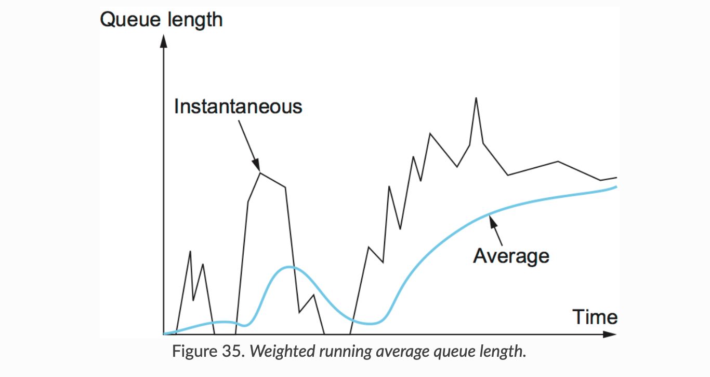
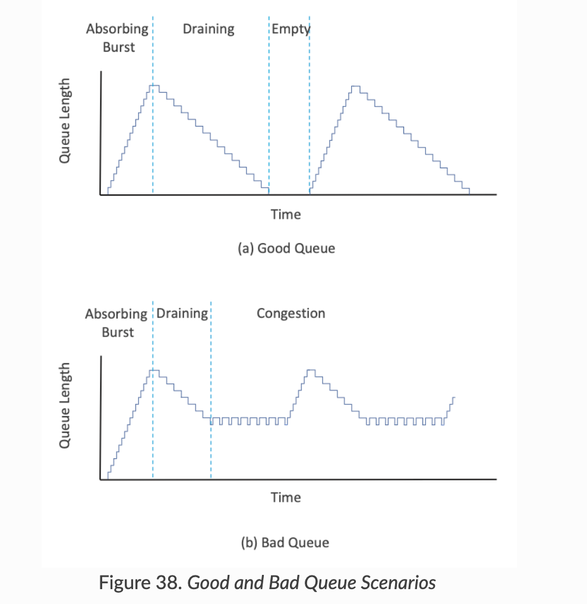

# 《TCP CC: a systems approach》notes 4: active queue management

Link: https://tcpcc.systemsapproach.org/index.html 

概括总结 by kimi

我们现在来审视一下路由器在拥塞控制中可以扮演的角色，这种方法通常被称为主动队列管理（AQM）。就其本质而言，AQM引入了一种避免端到端解决方案的元素，即使与基于控制的方法如TCP Reno配对也是如此。 改变路由器行为从来不是互联网引入新特性的首选方式，但尽管如此，这种方法在过去30年里一直是持续的困惑之源。问题在于，虽然人们普遍认为路由器处于检测拥塞开始的理想位置——它们的队列开始填满——但关于最佳算法是什么并没有达成共识。以下描述了两种经典机制，并以对当前状况的简短讨论结束。

## 6.1 DECbit

第一种机制是为数字网络架构（DNA）开发的，这是TCP/IP互联网的早期同行，也采用了无连接/最佳努力的网络模型。K.K. Ramakrishnan和Raj Jain在1988年的SIGCOMM上与Jacobson/Karels论文一同提出了这种方法的描述。 该思想是将拥塞控制的责任更均匀地分配给路由器和终端主机。每个路由器监控其正在经历的负载，并在即将发生拥塞时明确通知端节点。这种通知是通过在通过路由器的数据包中设置一个二进制拥塞位来实现的，这被称为DECbit。然后，目的主机将这个拥塞位复制到它发送回源的确认（ACK）中。最后，源调整其发送速率以避免拥塞。以下讨论更详细地描述了算法，从路由器发生的事情开始。

在数据包头中添加了一个单一的拥塞位。如果路由器的平均队列长度在数据包到达时大于或等于1，则路由器会设置此位。这个平均队列长度是在过去忙碌+空闲周期加上当前忙碌周期的时间间隔上测量的（路由器在传输时忙碌，在不传输时空闲）。图34显示了路由器的队列长度随时间的变化。本质上，路由器计算曲线下的面积，并将这个值除以时间间隔来计算平均队列长度。使用队列长度1作为设置拥塞位的触发器是在显著排队（因此更高的吞吐量）和增加空闲时间（因此更低延迟）之间的权衡。换句话说，队列长度1似乎优化了功率函数。

> Figure 34. *Computing average queue length at a router.*

现在转向机制的主机部分，源记录了它的数据包中有多少导致了某些路由器设置了拥塞位。具体来说，源维护一个拥塞窗口，就像在TCP中一样，并观察上一个窗口的数据包中有多少导致了位被设置。如果少于50%的数据包设置了位，则源将其拥塞窗口增加一个数据包。如果50%或更多的上一个窗口的数据包设置了拥塞位，则源将其拥塞窗口减少到先前值的0.875倍。50%的选择是基于分析，表明它对应于功率曲线的峰值。"增加1，减少0.875"的规则被选中是因为增加/乘性减少使机制稳定。

## 6.2 Random Early Detection(RED)

第二种机制，称为随机早期检测（RED），与DECbit方案相似，每个路由器都被编程监控自己的队列长度，当它检测到即将发生拥塞时，通知源调整其拥塞窗口。由Sally Floyd和Van Jacobson在20世纪90年代初发明的RED，与DECbit方案有两个主要的不同之处。

首先，与明确向源发送拥塞通知消息不同，RED通常实现为通过丢弃源的一个数据包来隐式通知拥塞。因此，源通过随后的超时或重复ACK（确认）来有效收到通知。正如“早期”在RED缩写中所暗示的，网关比它必须的时候更早地丢弃数据包，以便通知源应该更早地减小其拥塞窗口。换句话说，路由器在其缓冲区完全耗尽之前丢弃一些数据包，以便使源减慢速度，希望这意味着它不必稍后丢弃许多数据包。

RED和DECbit之间的第二个区别在于RED决定何时丢弃数据包以及决定丢弃哪个数据包的细节。为了理解基本思想，考虑一个简单的先进先出（FIFO）队列。而不是等待队列完全满了然后被迫丢弃每个到达的数据包（在第2.1.3节中描述的尾部丢弃策略），我们可以决定，每当队列长度超过某个丢弃水平时，就对每个到达的数据包应用某些丢弃概率。这个想法被称为早期随机丢弃。RED算法定义了如何监控队列长度以及何时丢弃数据包的细节。

在接下来的段落中，我们描述了Floyd和Jacobson最初提出的RED算法。我们注意到，自那以后，发明者和其他研究人员都提出了一些修改。然而，关键思想与下面介绍的相同，大多数当前实现都接近于以下算法。

首先，RED使用类似于原始TCP超时计算中使用的加权运行平均值来计算平均队列长度。也就是说，AvgLen被计算为：
$$
\mathsf{AvgLen = (1 - Weight)\ x\ AvgLen + Weight\ x\ SampleLen}
$$
使用平均队列长度而不是瞬时队列长度的原因，是它更准确地捕捉了拥塞的概念。由于互联网流量的突发性质，队列可以非常快地变满，然后又变空。如果一个队列大部分时间都是空的，那么得出结论认为路由器拥塞并告诉主机减速可能是不合适的。因此，加权运行平均值的计算试图通过过滤队列长度的短期变化来检测长期存在的拥塞，如图35右侧所示。你可以将运行平均值视为一个低通滤波器，其中Weight决定了滤波器的时间常数。

我们如何选择这个时间常数的问题将在下面讨论。

其次，RED有两个队列长度阈值，触发某些动作：MinThreshold和MaxThreshold。当一个数据包到达网关时，RED将当前的AvgLen与这两个阈值进行比较，根据以下规则：

- 如果 AvgLen ≤ MinThreshold，则对数据包进行排队
- 如果 MinThreshold < AvgLen < MaxThreshold，则以概率P丢弃到达的数据包
- 如果 MaxThreshold ≤ AvgLen，则丢弃到达的数据包

如果平均队列长度小于下阈值，则不采取任何行动，如果平均队列长度大于上阈值，则总是丢弃数据包。如果平均队列长度介于两个阈值之间，则新到达的数据包以概率P被丢弃。这种情况在图36中被描绘。P与AvgLen之间的近似关系在图37中显示。请注意，丢弃概率在AvgLen介于两个阈值之间时缓慢增加，在达到上阈值时达到MaxP，此时它跳到1。背后的理念是，如果AvgLen达到上阈值，那么温和的方法（丢弃一些数据包）不起作用，需要采取更激烈的措施：丢弃所有到达的数据包。一些研究表明，与这里显示的不连续方法相比，从随机丢弃到完全丢弃的更平滑过渡可能是合适的。

RED的随机性质赋予了算法一个有趣的属性。**因为RED随机丢弃数据包，所以RED决定丢弃特定流的数据包（s）的概率大致与该流在该路由器当前获得的带宽份额成正比。**这是因为发送相对较多数据包的流提供了更多的随机丢弃候选。因此，RED内置了某种公平资源分配的感觉，尽管它远非精确。虽然可以认为这是公平的，**因为RED对高带宽流的惩罚超过了低带宽流，但它增加了TCP重新启动的概率，这对那些高带宽流来说是双重的痛苦**。

RED 有很多参数， MaxThreshold，MinThreshold，MaxP和Weight。这些都需要配置，所有这些都是为了优化功率函数（吞吐量-延迟比）。

后面略 ....

## 6.3 控制延迟（Controlled Delay）

正如前一节提到的，RED从未被广泛采用。当然，它从未达到对互联网拥塞产生重大影响所需的水平。原因之一是，RED很难以一种一致改善性能的方式进行配置。

注意影响其操作的大量参数（MinThreshold、MaxThreshold和Weight）。有足够的研究表明，根据流量类型和参数设置，RED会产生广泛的结果（并非所有结果都是有帮助的）。这在部署它的优点周围造成了不确定性。

多年来，Van Jacobson（以他在TCP拥塞和原始RED论文的合著者而闻名）与Kathy Nichols合作，并最终与其他研究人员合作，提出了一种改进RED的AQM方法。这项工作被称为CoDel（发音为“coddle”），即控制延迟AQM。CoDel建立在数十年使用TCP和AQM的经验中出现的一些关键见解上。

首先，队列是网络的一个重要方面，预计队列会不时地建立起来。例如，一个新打开的连接可能会将一窗口的数据包倾倒入网络，这些数据包可能会在瓶颈链路上形成队列。这本身并不是问题。应该有足够多的缓冲容量来吸收这样的突发。当没有足够的缓冲容量来吸收突发，导致过度丢失时，问题就会出现。这在1990年代被理解为一个要求，即缓冲区能够容纳至少一带宽-延迟乘积的数据包——这一要求可能过大，随后由进一步的研究质疑。但事实是，缓冲区是必要的，预计它们会被用来吸收突发。CoDel作者将这称为“好队列”，如图38（a）所示。

队列成为问题时，它们持续地满。一个持续满的队列除了给网络增加延迟外什么也不做，而且如果它从未完全排空，它也不太能吸收突发。大缓冲区和持续队列的结合现象被Jim Gettys命名为“缓冲膨胀”（Bufferbloat）。显然，持续满的队列是一个设计良好的AQM机制将寻求避免的。长时间保持满而没有排空的队列被称为“坏队列”，如图38（b）所示。

在某种意义上，AQM算法的挑战在于区分“好”队列和“坏”队列，并仅在确定队列为“坏”时触发数据包丢失。实际上，这就是RED尝试用其权重参数（过滤瞬态队列长度）来做的事情。

CoDel的一个创新是关注停留时间：任何给定数据包在队列中等待的时间。停留时间与链路的带宽无关，即使在带宽随时间变化的链路上（如无线链路），也提供了有用的拥塞指示。一个表现良好的队列将频繁地排空，因此，一些数据包将经历接近零的停留时间，如图38（a）所示。相反，一个拥塞的队列将延迟每个数据包，最小的停留时间永远不会接近零，如图38（b）所示。因此，CoDel测量每个数据包的停留时间——这是一件容易做到的事情——并跟踪它是否持续显著高于某个小目标。“持续”被定义为“超过典型的RTT”。

而不是要求操作员确定使CoDel工作良好的参数，算法选择了合理的默认值。使用5毫秒作为目标停留时间，以及100毫秒的滑动测量窗口。与RED一样，直觉是100毫秒是穿越互联网的流量的典型RTT，如果拥塞持续时间超过100毫秒，我们可能正在进入“坏队列”区域。因此，CoDel监控相对于5毫秒目标的停留时间。如果超过目标超过100毫秒，就是开始采取行动通过丢弃（或标记，如果可用下面描述的显式拥塞通知）来减少队列的时候了。选择5毫秒是因为接近零（以获得更好的延迟），但又不至于太小以至于队列会跑空。需要注意的是，这些数值选择经过了大量的实验和模拟，但更重要的是，算法似乎对它们并不过于敏感。

总结来说，CoDel基本上忽略了持续时间少于一个RTT的队列，但只要队列持续超过一个RTT，它就开始采取行动。通过对互联网RTTs的合理假设，该算法不需要配置参数。

另一个微妙之处是，只要观察到的停留时间保持在目标之上，CoDel就逐渐增加丢弃流量的百分比。如第7.4节(https://tcpcc.systemsapproach.org/variants.html#tcp-friendly-protocols-tfrc)进一步讨论的，**TCP吞吐量已被证明与丢包率的平方根成反比**。因此，只要停留时间保持在目标之上，CoDel就按照自目标超出以来丢包数量的平方根比例稳步增加其丢包率。理论上，这样做的效果是导致受影响的TCP连接的吞吐量线性减少。最终，这应该会导致到达流量的足够减少，允许队列排空，使停留时间回到目标以下。

Nichols和Jacobson的论文中详细介绍了CoDel，包括广泛的模拟，以表明其在广泛场景下的有效性。该算法已被IETF标准化为“实验性”的RFC 8289。它也被实现在Linux内核中，这有助于其部署。特别是，CoDel在家庭路由器（通常是基于Linux的）中提供了价值，这是端到端路径上的一个点（见图39），通常会出现缓冲膨胀。

## 6.4 显式拥塞通知（Explicit Congestion Notification, ECN）

虽然TCP的拥塞控制机制最初基于数据包丢失作为主要的拥塞信号，但人们早已认识到，如果路由器发送更明确的拥塞信号，TCP可以做得更好。也就是说，不是丢弃一个数据包并假设TCP最终会注意到（例如，由于重复ACK的到来），任何AQM算法如果标记数据包并继续将其发送到目的地，可能会做得更好。这个想法在IP和TCP头的更改中被编码，称为显式拥塞通知（ECN），在RFC 3168中规定。

具体来说，这种反馈是通过将IP TOS字段中的两个位作为ECN位来实现的。一个位由源设置，表示它能够对拥塞通知做出反应，这称为ECT位（ECN-Capable Transport）。另一个位由沿途的路由器在遇到拥塞时设置，由它正在运行的任何AQM算法计算。这称为CE位（Congestion Encountered）。

除了IP头中的这两个位（它们与传输无关），ECN还包括在TCP头中添加的两个可选标志。第一个是ECE（ECN-Echo），它从接收方通信到发送方，表示它已收到设置了CE位的数据包。第二个是CWR（Congestion Window Reduced），它从发送方通信到接收方，表示它已减少了拥塞窗口。

虽然ECN现在是IP头TOS字段中八个位中的两个位的标准解释，并且强烈建议支持ECN，但它不是必需的。此外，没有单一推荐的AQM算法，而是有一系列一个好的AQM算法应该满足的要求。像TCP拥塞控制算法一样，每个AQM算法都有其优点和缺点，因此我们需要很多算法来进行讨论。

## 6.5 ingress/egress queues

我们一直在网络内部发生的拥塞控制方法（即本章描述的AQM算法）和网络边缘（即前面章节描述的基于TCP的算法）之间划清界限。但这条线并不一定那么清晰。要看到这一点，您只需要将端到端路径视为在发送主机的内核/设备接口上有一个入口队列，在接收主机的设备/内核接口上有一个出口队列

> 从网络路径的角度来看，入口队列是发送主机上的出队（出口）队列，而从网络路径的角度来看，出口队列是接收主机上的入队（入口）队列。）

随着虚拟交换机和对虚拟化的支持变得越来越普遍，这些边缘队列可能会变得越来越重要。

这种观点在图40中得到了说明，两个位置都位于TCP下方，并提供了一个机会，将第二段拥塞控制逻辑注入到端到端路径中。CoDel和ECN就是这个想法的例子：它们已经在Linux内核的设备队列级别上实现。

这是否有效？一个问题是数据包是在入口还是出口处被丢弃。在入口处（发送主机）丢弃时，TCP会在Write函数的返回值中得到通知，这导致它“忘记”发送了该数据包。这意味着这个数据包将在下一次发送，尽管TCP会根据失败的写入减少其拥塞窗口。相比之下，在出口队列（接收主机）丢弃数据包意味着TCP发送方在通过其标准机制（例如，三个重复ACK，超时）检测到丢包之前，不会知道要重传该数据包。当然，出口处实现ECN对此有所帮助。 当我们在更广泛的拥塞控制背景中考虑这个讨论时，我们可以做出两个有趣的观察。首先，Linux提供了一个方便且安全的方法，将新代码——包括拥塞控制逻辑——注入到内核中，即使用扩展的Berkeley Packet Filter（eBPF）。eBPF正在成为许多其他背景下的重要技术。标准的内核API用于拥塞控制已经被移植到eBPF，并且大多数现有的拥塞控制算法已经被移植到这个框架中。这简化了通过绕过等待相关Linux内核部署的障碍来尝试新算法或调整现有算法的任务。

第二个观察是，通过明确将入口/出口队列暴露给决策过程，我们为构建一个包含“决定何时传输数据包”组件和“决定排队或丢弃数据包”组件的拥塞控制机制打开了大门。我们将在第7.1节描述On-Ramp时，看到一个采用这两种组件的创新方法的机制示例。
