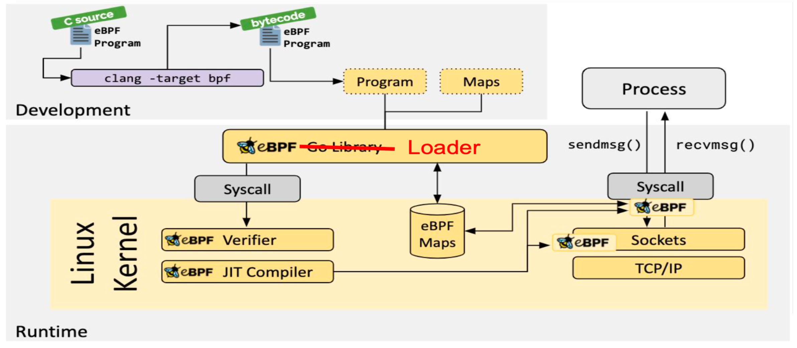
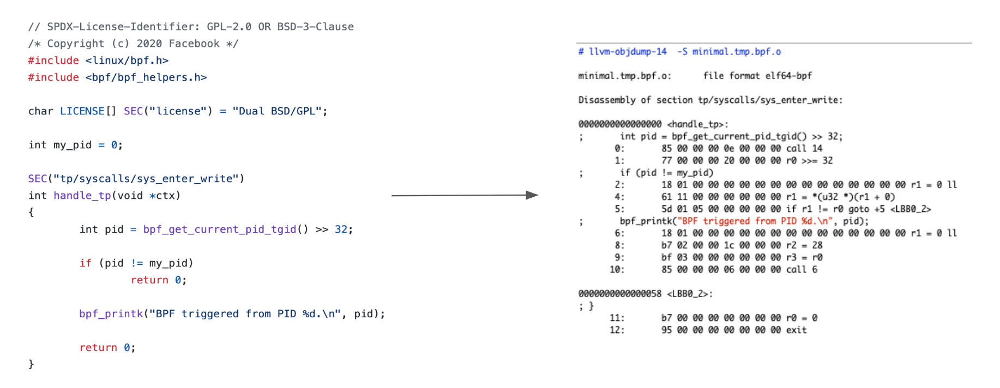
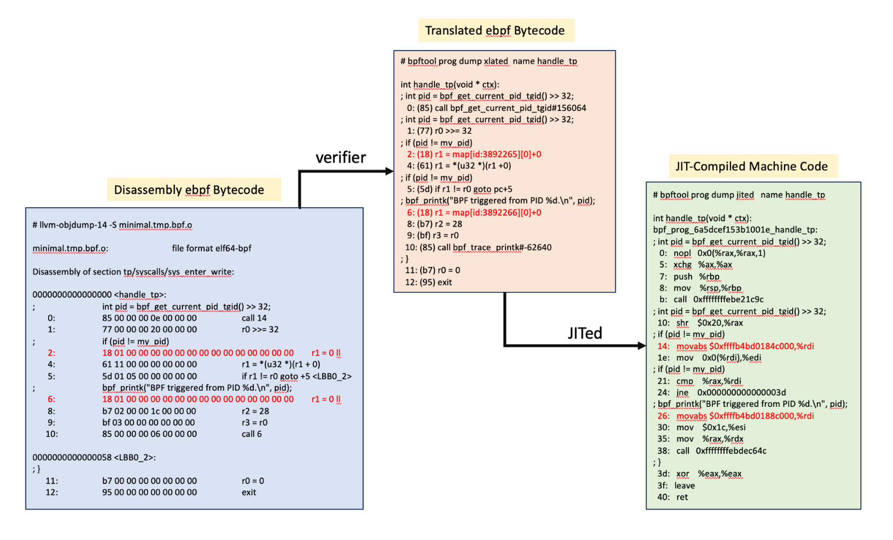
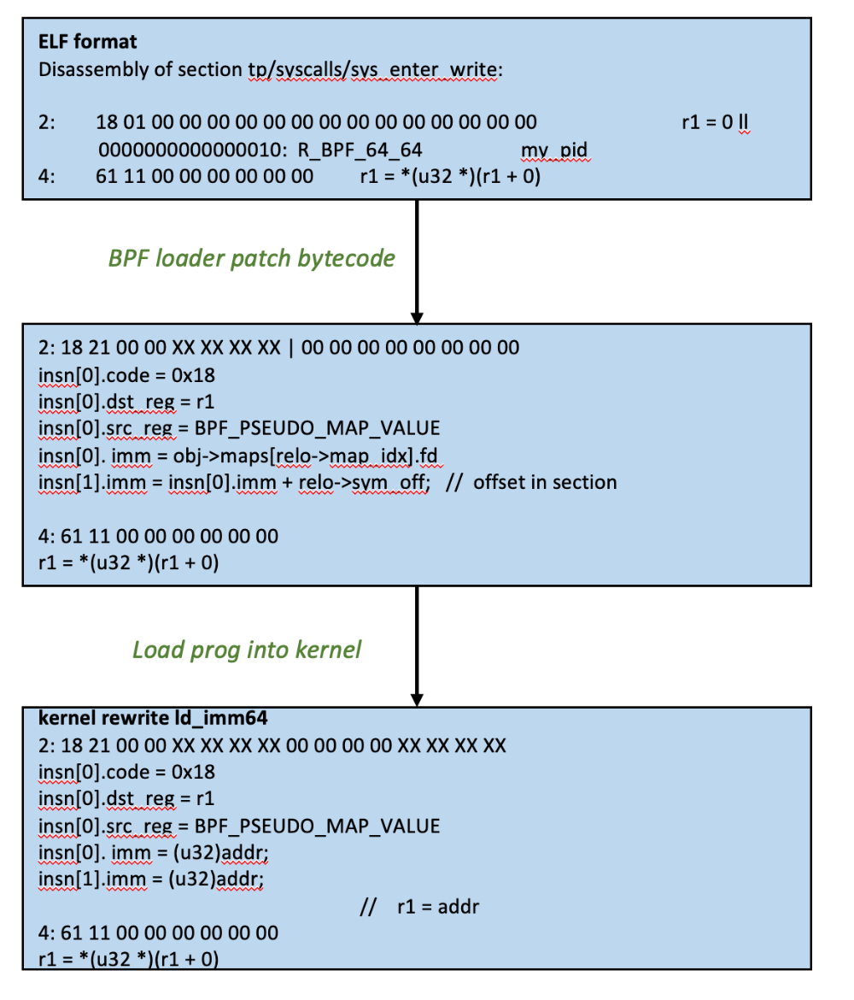
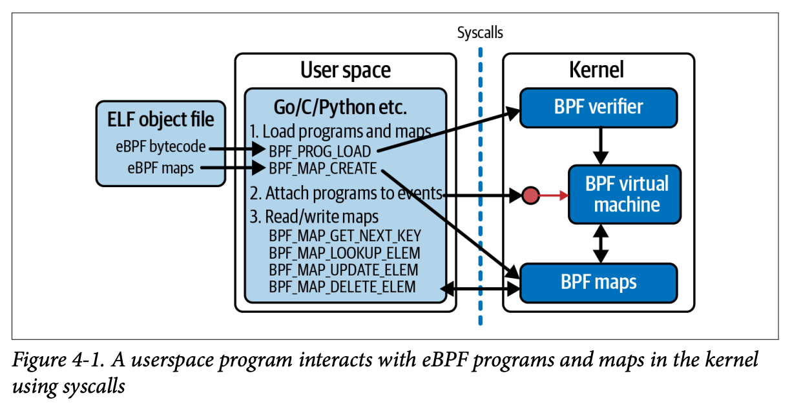

## 1. overall framework



there are many ebpf loader as we have heard of:

1. ip/tc iproute2
2. bcc
3. ebpf-go
4. libbpf

take libbpf minimal example, let's sketch its lifecycle.

## 2. compile 

* compile bpf program

```bash
$ clang -g -O2 -target bpf -D__TARGET_ARCH_x86  -I.output -I../../libbpf/include/uapi -I../../vmlinux/x86/ -idirafter /usr/lib/llvm-14/lib/clang/14.0.0/include -idirafter /usr/local/include -idirafter /usr/include/x86_64-linux-gnu -idirafter /usr/include	    -c minimal.bpf.c -o .output/minimal.tmp.bpf.o
```

* generate bpf skeleton file for bpf user space driver program.(skeleton is actually the results of parsing different sections(.BTF/.text) and make them as c structs)

```bash
$ bpftool gen object .output/minimal.bpf.o .output/minimal.tmp.bpf.o
$ bpftool gen skeleton .output/minimal.bpf.o > .output/minimal.skel.h
```

* compile userspace driver program

```bash
$ cc -g -Wall -I.output -I../../libbpf/include/uapi -I../../vmlinux/x86/ -I/var/home/centos/libbpf-bootstrap/blazesym/capi/include -c minimal.c -o .output/minimal.o
$ cc -g -Wall .output/minimal.o /var/home/centos/libbpf-bootstrap/examples/c/.output/libbpf.a   -lelf -lz -o minimal
```

## 3. ebpf code translation process

specifically, for bpf object file, we can check its file type

```
# file minimal.tmp.bpf.o
minimal.tmp.bpf.o: ELF 64-bit LSB relocatable, eBPF, version 1 (SYSV), with debug_info, not stripped
```

so basically in this compile process, it transfers the bpf (limited) c code to ebpf bytecode.



One step foraard, when loading a ebpf program, what verifier/JIT has done here in translation process, let's take a ebpf map(var) for example.



And there are rewrites about the bpf instructions



## 4. the loading process

Let's take a look about how typicall tracing ebpf prog loads, about its user-kernel interactions:



Basically, it covers several parts in sequence:

```
bpf(BPF_BTF_LOAD, ...) = 3
bpf(BPF_MAP_CREATE, {map_type=BPF_MAP_TYPE_PERF_EVENT_ARRAY…) = 4
bpf(BPF_MAP_CREATE, {map_type=BPF_MAP_TYPE_HASH...) = 5
bpf(BPF_PROG_LOAD, {prog_type=BPF_PROG_TYPE_KPROBE,...prog_name="hello",...) = 6
bpf(BPF_MAP_UPDATE_ELEM, ...}
```

these steps load BTF, BPF maps, BPF prog into the kernel.(the last one is modifying the bpf map contents)

finally, when attaching and enable the bpf programs, specifically for kprobe, we will see a sys call that's openning a perf buf.

```
perf_event_open({type=0x6 /* PERF_TYPE_??? */, ...},...) = 7
ioctl(7, PERF_EVENT_IOC_SET_BPF, 6) = 0
```

after that, it uses PERF_EVENT_IOC_SET_BPF to enable the existing kprobe tracepoint bpf event.
