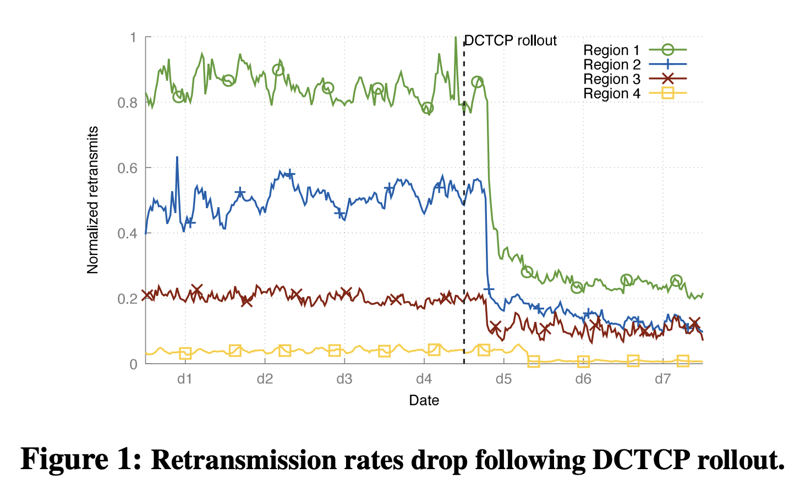

# [SIGCOMM24] A large-scale deployment of DCTCP

reference: https://www.usenix.org/system/files/nsdi24-dhamija.pdf

## Abstract

这篇论文描述了在大规模数据中心网络中部署数据中心传输控制协议（DCTCP）的过程和操作经验。与传统依赖丢包作为拥塞主要信号的拥塞控制协议不同，DCTCP基于队列占用情况向发送方发出网络拥塞信号，并根据拥塞水平调整发送速率。在我们部署之时，该协议已经得到了充分的研究，并在其他网络中证明了效率增益。正如预期，我们也观察到了性能的提升，特别是与我们数据中心的传统协议相比，数据包丢失显著减少。然而，出乎意料的是，我们在推出DCTCP时遇到了众多障碍；我们记录了这些意想不到的挑战，包括其对其他流量类别的不公平性以及实现中的错误。我们最后讨论了一些开放的研究问题和挑战。

## 1: Introduction

### DCTCP 背景

拥塞控制算法（CCAs）调节网络中的流量入口，通过频繁决定发送多少数据和何时发送，以寻求高利用率、低延迟和相对公平性。这些决策基于拥塞信号，而在许多CCAs中，丢包是基本信号。CCAs往往会增加飞行中的数据处理量，直到引发数据包丢失。随后，它们造成队列堆积和延迟增加。这对我们数据中心应用的延迟要求产生影响。这些工作负载在数据中心中生成大量小请求和响应流，这些流合并完成用户请求的计算。为了实现快速响应，每个这些短请求都应该迅速完成。

利用多样化的拥塞信号（来自网络的通知、端点处测量的延迟等）更快地检测和响应即将到来的拥塞。作为这一类中最早和最成熟的协议之一，数据中心拥塞控制（DCTCP）使用交换机的显式拥塞通知（ECNs）来调整发送速率，与拥塞水平成比例。ECN通过在队列溢出前提供拥塞信号，避免了大规模的队列堆积和丢包，DCTCP解释ECN标记的数据包的分数来调整其响应，避免了持续的排队和溢出导致丢包。

### 为什么 DCTCP 适合我们

我们的网络的一些特性使得DCTCP的潜力值得考虑。首先，我们的机架顶交换机拥有“浅缓冲区”，为排队提供了有限的空间。第二，缓冲区共享和对缓冲区的争夺导致了变化和不可预测的队列容量。最后，我们在数据中心间分配作业的方法创造了一组机架，这些机架上混合了大量吞吐量重的流程和小的延迟敏感流程，它们必须在网络中有限且变化的缓冲区空间中竞争。DCTCP可以调节大流程对交换机缓冲区的使用，为共享浅缓冲区交换机的作业提供更多的隔离。

### 使用 DCTCP 有什么挑战

使用DCTCP需要解决一个挑战：专门为短RTT数据中心流量设计的DCTCP必须专门应用于区域内流量，而不是跨骨干流量。这转化为几个问题：

（a）我们必须识别区域内流量，将其与跨区域流量分开，并仅对前者协商DCTCP。在规模和复杂性与我们相当的网络中这样做，而不冒破坏网络的风险，需要大量的工程努力

（b）区域内的DCTCP和跨区域的Cubic流量必须共存并共享网络。这需要仔细调整参数和网络配置，以在各种流量类别之间取得平衡。尽管具有挑战性，但这些都是我们的工程师可以克服的问题，以便仅将DCTCP应用于区域内流量以及跨区域的Cubic流量。

### Meta rollout DCTCP 的实践经验

此外，DCTCP的一个特定特性使其成为一个操作上吸引人的选择：它是一个相对简单、成熟且建立良好的协议。当我们在2018年启动将我们数据中心拥塞控制算法从Cubic更改为DCTCP的努力时，DCTCP的设计已于八年前（2010年）发布，其设计已被充分理解，自2014年以来已加入Linux内核四年，并且ECN标记获得了广泛的硬件支持。我们预期向DCTCP的过渡将会顺利。然而，与我们的预期相反，端到端栈的几乎每个点都存在问题需要我们去解决，以 rollout DCTCP：

1. 内核存在错误；
2. 像接收卸载这样的优化并不总是能与它互操作，因为DCTCP较小的拥塞窗口并不总是足以触发及时交付
3. 一些交换机尽管有空间缓冲它们，却丢弃了支持ECN的数据包，导致应用性能不佳
4. 并非所有交换机都能一致且可靠地支持ECN
5. 我们不能在数据传输中途改变长期运行连接的拥塞控制，等等。

在这篇论文中，我们分享了在Meta数据中心部署 DCTCP 的经验。这个项目于2018年正式开始，我们在成功的测试和令人挠头的问题之间寻找平衡。我们分享了我们在发现的绊脚石，希望帮助研究人员考虑新数据中心拥塞控制算法的可部署性。特别是，

1. 交换机和NIC实现是多样化的，不同供应商的产品都存在差异，数据中心运维也并不总是知道这些差异，并且随着我们网络的规模和需求的变化而频繁变化。
2. 依赖于参数调整以获得最佳性能的协议很难部署和维护（比如 ECN 水位阈值？）
3. 在大规模和多样化的网络中，每种拥塞控制算法将与大量且多样化的协议共存。
4. 最后，任何大规模、复杂的网络中都不可避免地存在错误。
5. 理想情况下，拥塞控制协议应该配备有机制来检测并优雅地处理错误和边缘情况。我们发现以下文本中的每个问题都非常丰富和深入，有很多惊喜。

当时，我们质疑为什么这么难：交换机可以标记ECN，内核实现了DCTCP。还需要什么？但回顾这一经历，通过预期意料之外的麻烦，仔细部署和监控是值得的。我们不是第一个报告生产DCTCP部署的；Judd [15] 分享了影响我们设计的经验。

他们表明DCTCP可能对已建立的Cubic流不公平，这使我们深入研究如何选择 ECN marking threshold and drop threshold 来保持公平。他们还指出，尽管标准如此，SYN和SYN/ACK数据包应该是支持ECN的；我们惊讶地发现即使在我们的交换机阈值阻止DCTCP饿死Cubic之后，情况也是如此。他的部署只在机架顶交换机上支持ECN标记；这成为了我们在本文中关注的起点。

论文组织如下：在下一节中，我们简要概述了DCTCP。如果愿意，可以跳过这一节或阅读Alizadeh等人的[4]。

第3节描述了我们如何选择为区域内TCP连接启用DCTCP而不是跨区域连接；专注于部署安全。

第4节描述了如何配置交换机以标记DCTCP流量，并鼓励与竞争的Cubic流量保持平衡；对于我们网络中的一些设备来说，这是出乎意料的复杂。

第5节描述了我们构建的用于监控部署的工具，希望确认设置了拥塞体验位，DCTCP已协商并未回落到Reno，交换机缓冲区占用减少等。

第6节描述了ECN标记数据包和较小拥塞窗口出现的微妙的内核和驱动程序错误。

第7节描述了我们对初始DCTCP部署应用的一些扩展，扩展了可以使用ECN进行拥塞检测的地方。

我们在第8节中得出结论，讨论了拥塞中仍然存在的问题，并反思了网络中几乎每个组件的设计如何影响这次部署。

## 2: background

**数据中心TCP（DCTCP）**。DCTCP使用来自交换机的显式拥塞通知（ECN）信号。它在IP头中使用2位来表示ECN信息。如果两个位都没有设置，则流不支持ECN，交换机也不会标记数据包。当只设置了一个位时，流支持ECN信号，并且尚未遇到拥塞。最后，当两个位都设置时，流支持ECN，数据包已遇到拥塞。在这种情况下，拥塞通常被定义为数据包路径上的交换机队列大小超过了预定义的阈值。也就是说，当交换机接收到一个启用了ECN的数据包时，如果用于将数据包排队的队列大于某个阈值，则交换机会将数据包标记为已经历拥塞。这个信号随后到达接收方。接收方通过在ACK数据包的TCP头中回显拥塞信号来通知发送方。在DCTCP之前，发送方将ECN标记的ACK视为数据包丢失。例如，TCP Reno会将其拥塞窗口（CWND）减少50%。这种激进的节流可能导致链路利用率不足。另一个问题是，传统协议不区分短时突发和持续拥塞。例如，由于微突发导致的亚RTT队列堆积仍然会导致减少CWND，这是一个不理想的结果。相比之下，DCTCP通过跟踪每个RTT的字节百分比来将CWND减少与拥塞水平成比例。例如，如果100%的字节遇到拥塞，DCTCP将其CWND减少50%，但如果只有50%的字节这样做，它将CWND减少25%。DCTCP还利用移动平均值来避免对瞬态突发反应过度。例如，如果一个RTT中的100%字节遇到拥塞，但在之前的RTT中没有拥塞，那么CWND只会减少1/32而不是1/2 [9]。鉴于我们工作负载的特性，特别是它们的突发性[13,27]，我们预期DCTCP对突发的更快反应将提高我们应用程序的性能。

**DCTCP帮助了我们的网络**。受到积极测试结果的鼓励，我们逐渐将DCTCP推广到每个区域。总体上，我们观察到网络指标的改善，例如减少了机架顶交换机拥塞丢弃和队列长度，导致主机收到的重传数据包数量减少。我们比较了部署DCTCP后每个区域的总重传量与过渡前一周的情况，并观察到大约75%的减少。图1显示了四个区域在各自区域部署DCTCP前后几天标准化重传率的变化。请注意，部署DCTCP后重传的减少并不是立即的。在§3.2中，我们讨论了一个可能的原因（长时间运行连接的拥塞控制算法变更的延迟）。除了重传，我们还跟踪了基础主机指标，如吞吐量，以及拥塞窗口大小，以及一般系统状态指标，如CPU和内存利用率。我们没有观察到这些指标的任何退化。对于四个区域，我们测量了过渡到DCTCP后重传率、吞吐量、平均CWND和平均平滑RTT（srtt）的变化。表1报告了结果。请注意不同指标和区域之间的差异，例如，虽然区域4的srtt没有变化，但它在区域5中有所改善，尽管不像重传率那样显著（7%对50%）。此外，对于我们的一个数据密集型服务，我们测量了一个区域在过渡到DCTCP前后的读延迟变化，并观察到90th和99th百分位延迟分别减少了38%（从65ms减少到40ms，从130ms减少到80ms）。

**DCTCP的部署时间表。**值得注意的是，我们并没有同时将所有选定的区域升级到DCTCP；我们在四个月的时间里逐步进行，同时仔细监控这一变化对我们网络的影响（§5）。图2显示了每个区域的部署时间表，与此期间ECN启用数据包的总速率重叠。在我们的网络中，ECN启用数据包的速率是DCTCP采用的代理，因为DCTCP流量默认启用了ECN。在这段时间内，DCTCP是我们网络中唯一的ECN启用流量类别。为了计算图2中的标准化速率，我们将所有数据中心主机接收到的ECN启用数据包的数量除以完成整个部署过程后所有主机接收到的ECN启用数据包的最大数量。该图显示了随着时间的推移，连续部署之间的时间间隔越来越小；随着我们最初的部署帮助我们识别和解决我们将在本文其余部分讨论的问题，我们的部署过程逐渐加快。为了衡量DCTCP部署后的影响和有效性，我们暂时在一个区域禁用了它几个小时。这导致该区域的吞吐量下降了约10%，重传量增加了4.5倍。

## 3 enablement

 我们希望仅为区域内连接启用DCTCP，这些连接的RTT足够小，以至于DCTCP有效。这为我们提出了几个直接挑战，因为我们可用的选项无法实现这一点，例如，

1. 选择性启用要求意味着sysctl不可行，而复杂性排除了setsockopt和路由等选项。
2. 当我们探索和试验启用选项时，我们还遇到了与内核特性相关的几个其他挑战，以及DCTCP回退行为的不明确问题。我们在下文讨论这些挑战。

### 仅为区域内流量启用 DCTCP

我们在更详细地讨论现有旋钮的不足之前，讨论了我们解决这一挑战的方法。

**用于更改拥塞控制的潜在开关** 我们的目标是识别开关，以针对短RTT连接并更改其拥塞控制算法（CCA）。对于DCTCP，这应该在3次握手之前完成，因为ECN是在建立连接期间协商的。我们针对的是典型的区域内流量的亚毫秒级延迟。在我们的数据中心网络中，我们可以使用**IP地址作为RTT的代理，并通过查看源和目的IP地址来分类是否在区域内创建的连接**。可以通过多种方式更改CCA，特别是通过sysctl、setsockopt和routes，如下所述。

**sysctl** sysctl是更改CCA最常见和最简单的方法。这对所有新套接字都有效。这不理想有两个原因：

1. 我们不能轻松地区分城际和区域内流量，并将DCTCP的适应性仅限于后者，
2. 过渡过程会很慢。由于通过sysctl的更改仅对新套接字生效，因此必须重置监听套接字，以便被动端的连接可以接收到这一变化。在区域规模上，重置监听套接字需要重启服务，这需要几天或几周的时间。

**setsockopt** 最细粒度的方法是每个套接字调用setsockopt()。这也提供了最大的灵活性，因为它允许对每个单独的连接运行任意逻辑。在数据中心规模上，setsockopt涉及构建一个库，该库被每个服务使用，并适应跨舰队运行的数千个服务的持续集成和交付计划。虽然这在概念上是可行的，但这种紧密耦合在操作上并不理想，因为它会复杂化调试和故障隔离。此外，由于DCTCP不需要任何特定于服务的信息来证明与服务的相互依赖性，因此它几乎没有什么好处。

**routing** Linux支持根据每个IP目的地路由自定义TCP参数。通过更改路由的粒度，我们可以针对不同的范围，从整个区域到单个主机。对于启用，我们需要枚举所有区域内路由前缀，并创建多个路由表规则。这种方法之所以吸引人，是因为它具有所有选项中最低的依赖性。然而，它并不可扩展：它不支持基于其他标准进行匹配，例如我们未来设计中设想的端口号、内核版本和NIC模型。另一个风险是修改主机路由表，并依赖于可聚合的IP前缀。鉴于路由在我们的舰队中控制可达性，这些都带来了相当大的风险。

总之，上述讨论的方法都不适合我们的用例。我们必须基于eBPF开发一种新方法，我们将在下文中讨论。

**TCP套接字钩子eBPF** 我们开发了一种基于eBPF的方法来解决上述挑战。通过在内核栈中提供钩子点，eBPF允许我们自定义网络栈。自Linux 4.11引入以来，sockops为TCP套接字事件期间运行eBPF程序提供了一种方式。sockops的一个主要优点是其灵活性和可编程性。它能够在每个连接开始时运行eBPF程序，该程序可以使用用户空间配置为每个连接选择CCA。我们使用相同的基于IP的分类器来识别启用DCTCP的连接。按设计，sockops限制在特定版本的cgroup(cgroup-v2)上。我们部署了具有两种cgroup版本的异构内核版本。内核和cgroup限制意味着这不能单独使用。为了解决sockops对cgroup版本的依赖，我们使用了两个BPF程序来为新的区域内TCP连接启用DCTCP:

1. 在cgroup-v2主机上，我们附加了一个每个连接的sockops BPF程序，以将DCTCP设置为区域内连接的CCA，同时保持跨区域连接不变，以及
2. 在cgroup-v1主机上，我们使用sysctl将DCTCP设置为默认CCA，并附加了一个每个数据包的流量控制（TC）程序来清除跨区域SYN数据包上的ECN相关位，强制这些连接回落到Cubic。这个程序不仅为跨区域流量禁用了DCTCP，还为预先存在的侦听套接字上的连接启用了DCTCP。

**启用计划** 我们部署DCTCP的预期范围是即时的区域范围启用( instantaneous region-wide enablement)，这样我们就可以最小化区域内DCTCP和Cubic流量在同一交换机缓冲区中交互造成的网络中断。这是一个我们网络中从未进行过的实质性变化，必须安全地执行，以免对服务造成干扰。鉴于我们集群的异构性（例如，就cgroup和内核版本而言），确保安全性是一项挑战。确保安全性的同时，需要对启用开关进行可见性和监控，以检测问题，并在出现问题时能够快速回滚。安全性、灵活性和故障开启特性使eBPF成为解决这个问题的好选择。鉴于我们在开始这项工作时已经有90%的机器在使用cgroup-v2，我们短期内承担了更多的复杂性来处理cgroup-v1，但随着时间的推移，我们淘汰了cgroup-v1解决方案，并发展了eBPF，使其能够定制我们最初设想的算法和部署能力。我们接下来解释两个cgroup版本各自的两个单独的eBPF开关。

**cgroup-v2和4.11+内核** 我们在root-cgroup上附加了一个每个连接的sockops BPF程序。一个sockops程序在TCP连接的生命周期中不同状态转换期间被调用。在特定的TCP事件期间，sockops eBPF程序可以使用setsockopt()调用更改一些TCP参数，或者影响内核行为。例如，当客户端或服务器必须决定ECN协商时，注册在此回调上的eBPF程序可以在分析数据包中的TCP和IP头或任何用户空间映射状态后选择加入ECN协商。我们的cgroup-v2程序使用源和目的IP地址并计算连接的范围（机架/集群/DC/区域）。它使用一个填充了所有区域内IP前缀的IP前缀eBPF映射。它采取了以下行动，也总结在图3中。

#1：NEED_ECN：当内核询问一个套接字是否需要ECN时，对于区域内流量选择“是”，对于跨区域流量选择“否”。

#2：CONN_ESTABLISHED：当连接建立时，如果是区域内流量并且ECN启用成功，则调用bpf_setsockopt将套接字的CCA算法设置为DCTCP。跨区域CCA保持不变，使用通过sysctl指定的默认值。

**cgroup-v1和旧内核** 在cgroup-v1或旧内核的主机上，其中没有sockops eBPF钩子点（少于10%的主机），我们仍然需要一个解决方案来选择性地更改CCA。我们选择了sysctl和TC eBPF的组合来解决这个问题。我们使用sysctl将DCTCP设置为默认CCA，并使用流量控制（TC）eBPF程序来终止跨区域连接的ECN协商，从而迫使它们回落到Cubic，如下所述。表2显示了在3次握手期间发生的事件序列（蓝色部分特指ECN/DCTCP）。为了有选择地禁用跨区域范围的DCTCP，我们在服务器的入口方向使用每个数据包的TC eBPF程序。TC eBPF程序可以访问套接字缓冲区（skb），并通过此**修改数据包内容**（其他的不太行）。因此，该程序可以选择性地清除客户端设置的所有ECN状态（步骤1从表2）。这之所以可能，是因为在入口方向TC程序在TCP堆栈可以协商ECN之前执行。该程序使用与上文sockops部分中解释的类似的范围解析器来检测跨区域客户端，并匹配具有ECN协商位（ECE/CWR位[6]）的TCP SYN数据包。如果存在模式匹配，该程序将清除SYN数据包中TCP和IP头中的ECN相关位，从而导致ECN协商失败。没有ECN，DCTCP配置为回落[7]，这个eBPF程序利用了这个配置。尽管Linux DCTCP实现配置为在ECN协商失败时回落到TCP Reno作为CCA，我们不希望将这个额外的算法添加到我们网络中的算法集合中。回想一下，DCTCP和Cubic流量的共存是在部署DCTCP时的一个主要挑战。增加一个新的协议到CCA集合中将加剧这种情况，需要重新运行整个参数调整和交换机配置的过程，与新的协议组合一起。为了避免这个问题，我们的内核团队更改了DCTCP代码[7]，使其回落到Cubic，这个更改我们没有发布到上游。这是我们为这项工作所做的唯一自定义内核更改，我们通过能够处理回落的BPF代码替换了这个逻辑。

### 长连接

ECN在连接开始时协商：这为将正在进行中的连接的CCA从Cubic更改为DCTCP创造了挑战，因为我们不能在连接中途为流启用ECN。不幸的是，**我们网络中的许多连接都是长期的，运行几天或更长时间。这减慢了迁移到DCTCP的过程。**像终止现有连接和与服务所有者合作强制所有服务重启这样的简单解决方案由于其复杂性和对服务性能的感知影响而不理想。

我们意识到，我们的一个内部灾难恢复工具Maelstrom可以被重新用于帮助CCA升级过程。Maelstrom[26]是一个大规模的灾难恢复系统。它提供了一个流量管理框架，具有可以组合以安全高效地从一个或多个故障数据中心引流到健康数据中心的模块化原语。Maelstrom编码了服务间依赖关系，**并有安全地暂时引流一个区域流量的方法。我们利用Maelstrom运行多个引流练习，逐渐将连接升级到DCTCP。**每次引流练习导致大约50%的连接切换到DCTCP，从而为CCA变更提供了显著的覆盖率。（简单说，通过切流替换的）

为了使未来的升级和维护成为可能，**我们最终增强了我们的eBPF框架，增加了一个连接迭代器，它可以遍历所有现有连接，升级拥塞控制，并进行其他传输更改。**这个程序可以按需触发，并且与sockops共享类似的代码，简化了CCA的可进化性和维护。

## 4: switches and buffers

DCTCP依赖于网络支持——交换机在缓冲区占用超过某个阈值时标记数据包ECN。大多数现代交换机支持ECN，但很快变得明显的是，我们特定的网络特性使得在网络中广泛部署ECN变得不切实际。我们列出了在部署我们网络中的ECN时面临的具体挑战。

### **交换机队列是稀缺资源**

DCTCP，顾名思义，是为具有低RTT（约1ms）的数据中心流量设计的。它不适用于长距离流量（几十到几百毫秒）。**这是因为基于队列占用的ECN信号是短暂的；当前队列占用在几毫秒后就没有意义了。**因此，对于我们的跨区域流量，我们继续使用Cubic，它依赖于丢包作为信号。通常，DCTCP和Cubic流量终止在同一个主机上，服务可以与区域内和跨区域的其他主机通信。在这种情况下，理想情况下，我们应该在网络中隔离这两种CCA的反馈信号。对于Cubic和DCTCP，隔离更加重要，因为它们依赖于两种非常不同的信号。**基于ECN的CCA旨在保持瓶颈缓冲区利用率低，而基于丢包的CCA则将缓冲区推向容量和丢包。**在交换机术语中，**从概念上讲，隔离很容易实现——我们只需要将每种CCA放入它自己的队列中，这样它就可以获得自己动态共享缓冲区的分配。**然而，交换机队列主要用于我们网络中的流量分类；我们支持几种流量类别[3]，每个类别都被分配到一个队列。**为了彼此隔离CCA，我们需要为每个流量类别配置两个队列。虽然后续的交换机支持这种配置，但最初我们的交换机没有足够的队列来支持这种配置。**这意味着我们不得不将DCTCP和Cubic放在同一个队列中，根据交换机供应商的不同，交换机支持在同一个队列中同时支持ECN和Drop Tail（或WRED），或者只支持其中之一。

### ToR switches were sufficient for ECN

我们分析了我们生产网络，并发现瓶颈主要出现在ToR交换机下行链路[13]——到主机，或我们的骨干广域网（WAN）网络中。后者不在我们可控范围，因为DCTCP不跨越区域，所以我们只关注ToR下行链路。一个自然的问题是**为什么我们看到拥塞主要出现在ToR下行链路。**答案是多种因素的结合：

1. 首先，由于我们硬件的特性，**ToR下行链路的链路速度与其余网络相比存在很高的差异**，使得这一层更容易受到突发流量的影响。
2. 其次，配置和拓扑确保了机架之间的高带宽。
3. 最后，与机架无关的作业调度确保了流量的高度异质性，很大程度上防止了由于网络密集型服务集中放置而可能引起的热点。

正如我们之前提到的，并非我们网络中的所有层都有支持DCTCP和Cubic的双模式阈值的交换机。然而，由于拥塞在网络其他部分（除了 ToR 交换机）一般也不是问题，我们可以有效地忽略它们，并将注意力集中在为ToR下行链路设置正确的阈值上。

### 如何设置 ECN 水位以及丢弃阈值

我们的交换机能够根据ECN-Capable Transport（ECT）标记对流进行ECN标记或执行DropTail/WRED，因此DCTCP和Cubic都会收到正确的信号，但缓冲区本身是跨两类流量共享的，结果没有隔离。**ECN信号试图保持DCTCP队列维持较低水位**，但不提供保证——完全有可能的是，DCTCP流量的突发可以占用超出ECN阈值的缓冲区。另一方面，**Cubic流量将尝试维持高缓冲区利用率**。这是一个具有挑战性的场景：

高缓冲区占用率和突发的Cubic流量将导致与DCTCP流量竞争时ECN标记非常高，而高缓冲区占用率和突发的DCTCP流量将导致与Cubic流量竞争时可用缓冲区非常低。使问题更加复杂的是，并非所有的DCTCP流量都是突发的（除非在 incast 中），而即使是一些长RTT的Cubic流量也可能由于高BDP而变得突发。

high buffer occupancy with bursty Cubic flows will result in very high ECN marks for a competing DCTCP flow, while high buffer occupancy with bursty DCTCP flows will result in very low available buffer for competing Cubic flows. Complicating the issue further, not all DCTCP flows are bursty (unless within an incast), while even a few long-RTT Cubic flows could be bursty due to the high BDP

我们的假设是我们需要防止任一CCA完全接管缓冲区——但我们更担心Cubic的能力，所以我们缩小到一个解决方案，即为DCTCP设置相对较高的ECN阈值，为Cubic设置较低的Droptail阈值。这是一个对两种CCA都不优的解决方案，因为它稀释了DCTCP的ECN，并使Cubic更有可能丢包，但它解决了我们认为是**我们网络中的主导问题——Cubic突发破坏DCTCP**。

部署后的经验证明我们的假设并不完全正确：虽然Cubic确实可以捕获浅缓冲区，**但 incast 场景在我们的网络中比我们最初预期的要严重得多**，我们必须实施更多功能来控制DCTCP的突发性和缓冲区利用率，特别是对于同时拥有这两类流量的服务。

### **多主机NIC**

 多主机NIC使用单个连接到ToR交换机来为（通常是两个或四个）不同主机的PCI总线提供连接。

多主机（MH）NIC设计在空间、功率和硬件方面都是高效的，但它不是通常在拥塞控制工作中建模的网络组件。MH NIC将多个机器连接到网络，并有一个缓冲区（大小约为0.5到1 MB），但它不充当传统交换机。

MH NIC默认不标记ECN；早期版本甚至没有这个功能。缓冲区没有明确地跨主机或队列划分，因此它不提供隔离，也不能优先交付高优先级流量。它没有可预测的下行速率；PCI总线速率在主机之间分配，导致每个主机的速率明显低于MH NIC速率。此外，当主机内核无法跟上中断，或无法提供空闲缓冲区时，向单个主机的交付速度可能会进一步下降。当MH NIC缓冲区填满时，NIC可以向ToR交换机发送以太网暂停帧（PAUSE FRAME），导致在交换机处排队。当单个主机是内播的目标时，这种情况可能发生：NIC的完整比特率可以应用于从交换机到NIC传输突发流量，达到将数据交付到目标主机内存的瓶颈。当主机处理难以接受的数据（例如，来自许多不同连接的小型帧，不适合卸载重组）时，这种交付也可以慢到足以发送暂停帧。

未经修改，ToR的ECN标记阈值意味着对主机的有效队列积压是ToR ECN阈值加上NIC缓冲区的大小。这创造了一个实际上过高的ECN阈值，导致持续的不公平、性能不佳，甚至DCTCP流量的丢包，因为拥塞窗口超过了目标。对于单个主机来说，实际上更大的缓冲区并不是Cubic的问题：**它看起来是一个跨主机共享的单个大缓冲区**。然而，单个主机的流量仍然可以主导缓冲区，而且由于只有交换机能够优先处理流量，缓冲区饥渴服务和需要高可靠性交付服务之间的不公平导致了将缓冲区转移到交换机上，通过每个主机的队列来进行。

在具有此类MH NIC的机架上，ToR交换机为每个下游主机创建了单独的、限速的队列。这个速率限制基于主机的“份额”的NIC带宽，即1/2或1/4。然后，这个队列被配置为使用第4.3节中的ECN标记和丢弃阈值。

这种每个主机一个队列的设计并没有解决不同作业共享同一NIC的所有交互问题：**例如，一个慢速内核处理小数据包仍然可以填满NIC缓冲区，导致向ToR发送一些暂停帧，但在链路暂停期间，ToR可以在其他主机之间轮询，以限制性能下降。**对于DCTCP来说重要的是，在预期的情况下，当有效队列完全在ToR上时，数据包会在达到预期阈值时被标记。

这个每个主机一个队列的功能在MH NIC系统上实现DCTCP的性能和公平性中发挥了重要作用。测试集中在个别主机的流量的公平性和性能上；不同主机上同时发生的、类似生产的流量的性能并没有那么容易观察到。我们很幸运，我们的ToR中每个主机一个队列的功能在DCTCP部署及时推出。

**特别是数据库客户端**: 这里有一个具体的例子，说明为什么每个主机一个队列对于部署DCTCP变得必要。在我们第一个区域推出时，我们发现许多区域内连接建立超时。数据库客户端代码在一秒钟后会超时并报告错误。丢包和重传总体上减少了，利用率上升了；典型的网络性能信号看起来很好。我们有一套工具，使用eBPF“tracepoints”和“kprobes”来检测由Linux内核生成的重传。虽然内核的内置计数器可以跟踪重传发生的频率，但通过eBPF我们可以**分类是什么生成了重传（超时？重复ACK？）**，**重传了什么（一个SYN？SYN/ACK？尾部丢失探测？）**，以及这些重传的端点和服务是什么。我们观察到对数据库服务器的SYN重传和返回的SYN/ACK。

问题是，虽然SYN和数据包被标记为ECN能力，可能会被标记，但侦听套接字并没有将SYN/ACK标记为ECN能力，导致其进入Cubic连接的数据包丢弃逻辑。由于DCTCP由于过高的有效阈值而积极行动，来自--可能是MH NIC中的其他主机--的DCTCP流量会填满其标记阈值和Cubic丢弃阈值之间的空间，导致看似“Cubic”的SYN/ACK被丢弃。（所以错把 DCTCP 连接认作 Cubic 连接）

我们很幸运，这个问题影响了这个数据库客户端，它有一个硬编码的应用程序级超时，足以让SYN和SYN/ACK重传。有了这些信息，很容易找到看到SYN/ACK丢失的端点。许多其他服务在短暂的超时后放弃连接，因此不会重传SYN数据包；这些服务还重用连接，使它们对三方握手中的问题不那么敏感。启用每个主机一个队列的功能立即解决了这个问题，尽管我们也准备了BPF过滤器，以确保协商DCTCP的SYN/ACK数据包会被ECT标记，以防万一。

### 不同 Switch ASIC 造成的问题

我们在§4.3中讨论了如何为ToR层调整ECN和Droptail阈值。在初始部署时，绝大多数ToR交换机都使用了同一家制造商的相同ASIC，我们称之为Asic-A1。然而，我们的生产网络继续发展，有了新的ASIC来自同一制造商（Asic-A2），以及来自新供应商的新ASIC（Asic-B）。当我们依赖ASIC进行拥塞标记时，需要考虑关于交换机ASIC的两个主要问题：**缓冲区尺寸和ECN实现**。

在我们的情况下，最初，新的ASICs，Asic-A2和Asic-B继承了我们为Asic-A1开发的阈值。Asic-A2的架构与Asic-A1相同，但它有4倍的缓冲区。随着主机NIC速度的演变，新的交换机也服务于更快的NIC（2-4倍）。结合起来，尽管原始阈值并不总是最优的，但它们仍然产生了合理的良好性能。然而，Asic-B对缓冲区设计和管理采取了根本不同的方法，使我们的阈值在Asic-A系列中的行为有所不同。对于服务运营商来说，ToR放置被认为是透明的：然而，对于Asic-B来说，性能现在可能取决于ToR硬件；我们解释了ASIC架构的差异，这些差异被证明对于阈值调整是重要的。

**队列管理**: Asic-B使用单独的虚拟输出队列（VOQs）来处理ECN-Capable Transport（ECT）流量和非ECT流量，这有助于隔离这两类流量，即使它们目的地是同一主机。对于Asic-B，我们可以将DCTCP和Cubic缓冲区阈值调整作为两个独立的问题来处理。然而，这引发了意想不到的、有些棘手的问题，因为这和Asic-B是如何分配共享缓冲区相关。

**缓冲区分配**: Asic-B的共享缓冲区空间被划分为单独的“切片”，并且缓冲区阈值独立作用于每个切片。这与Asic-A系列不同，后者将共享缓冲池分解为入口流量管理器（ITMs），但特定VOQ的缓冲区阈值是作为所有ITMs中该VOQ的缓冲区总和来应用的。这种区别对于任何多于单个流的流量模式特别重要：任何**这样的流量都可能在Asic-B上——跨所有切片——实际上消耗更多的缓冲区空间**，相比之下，对于相同的缓冲区阈值，Asic-A系列也是如此。不用说，直接将阈值减少切片数量的因素并不是一个选项，因为那将影响到我们没有内播时映射到单个切片的单个流。

**量化阈值。**进一步使阈值部署复杂化的是，Asic-B架构使用了“量化”区域，这意味着它不支持任意阈值，任何配置在两个量化值之间的阈值都将在较低值处。例如，如果量化区域在100KB和200KB，配置为120KB，但实际上会将阈值应用在100KB。这种量化的缓冲区管理减少了有效的参数空间；虽然这有潜力简化搜索，但它也减少了调整的灵活性。

**量化丢弃概率。**与阈值类似，Asic-B还有量化的丢弃概率（对于像Drop Tail和WRED这样的方案很重要。这使得在我们的机器中模拟WRED的性能变得困难，因为不清楚WRED是否会对具有相同阈值和丢弃概率的不同流量集进行一致的性能。

**丢弃决策。**尽管我们所有的ASIC都有动态共享缓冲区的概念，但Asic-A系列和Asic-B使用非常不同的逻辑来共享可用缓冲区。Asic-A系列使用α参数来共享可用缓冲区，而Asic-B使用基于总缓冲区使用情况、VOQ大小和从VOQ发送的最后一个数据包经历的延迟的函数。这些值被量化，并用于索引查找表。与Asic-A系列的单参数共享缓冲区模型相比，这种机制要复杂得多，有许多旋钮可以调整。这进一步加剧了事实，即这些旋钮的值并不总是为我们所知。

这些差异是不可调和的——无法保证特定的流量模式在所有平台上看到相同的缓冲区和标记或丢弃概率，或者只是跨越Asic-A2和Asic-B，我们认为是代际等效的。即使只有一个参数要调整——ECN——上述挑战强调了在越来越异构的网络中，参数调整的困难和复杂性，类似于我们的网络，对于更复杂的参数敏感协议。

## 5 Observability

我们从两个角度来处理可见性。首先，我们查看了网络各层的指标——从交换机及其计数器到服务及其查询时间。其次，我们查看了覆盖不同的时间尺度——从RTT规模的细粒度调试，查看数据包跟踪，到长期趋势，如网络指标中的重传。可见性和监控是任何部署工作的重要组成部分。我们需要确保我们的常规监控系统能够尽可能地考虑CCA，并且有DCTCP特定的计数器，例如带有ECT/CE位的数据包计数。

### **eBPF用于监控** 

我们广泛使用基于eBPF的仪器来监控DCTCP部署。类似于我们的启用工作，我们发现内核维护的计数器并不总是足够的：它们不分离使用DCTCP和Cubic发送的字节，或者区域内和跨区域流量。类似地，重传的计数器也有主要限制，我们稍后将描述。每个TCP连接都有一个字段来存储该连接的CCA。这使我们可以使用我们的fbflow[25]数据包抽样实现，跟踪特定传输的特定CCA。有了这个，我们可以迅速确认我们期望的区域内流量是否在使用DCTCP，并且区域内流量的总比特率在启用前后大致相同。**我们还使用基于eBPF的系统来检测和记录重传，该系统捕获对tcp_retransmit_skb函数的调用，并用类型（超时、快速、syn和synack）、CCA 以及有关端点和服务的信息注释重传事件**。CCA字段并不总是有一个明确的答案，因为SYN数据包可能在ECN能力协商之前就被重传。

### 更多重传的谜题

我们观察到**重传意外增加**，无论是在内核netstat计数器（RetransSegs）中，还是在我们的基于eBPF的管道中。交换机的数据包丢弃计数器下降了；那么为什么内核需要更频繁地重传呢？这种重传增加原来是由**尾部丢失探测（TLP）**[11]造成的。TLP是一种保护TCP连接免受需要完整RTO才能恢复的数据包丢失的手段。**发送方在确认ACK逾期后立即重传，以便修复丢失的数据包，接收到识别丢失数据包的ACK，或确认原始数据包已交付**。Linux中实现的用于决定何时发送TLP的算法是在每次传输后设置一个计时器，设置为两倍RTT加上两个“jiffies”（即，当常数HZ为1000时的2毫秒）。我们观察到DCTCP减少了排队和RTT；在一些忙碌的主机上，需要几毫秒来回答查询，这种减少足以将连接从不出现TLP（3毫秒RTT会导致8毫秒TLP计时器，8毫秒足以生成响应）转变为频繁出现TLP（0毫秒RTT导致2毫秒TLP计时器）。尽管有一个传输TLP的计数器，但它包括了新数据和重传，因为两者都可以用于TLP；必要的重传数量不容易恢复。我们调整了我们的 metric 和监控，以识别这类重传，使我们能够基本上忽略它们，而专注于其他重传，以便调试性能。TLP在DCTCP连接的常见情况下可能是浪费的，其中丢包不频繁，RTT短，但我们还没有尝试禁用它；发送TLP的开销很低，它可能在某些情况下有所帮助。

### **我们为健全性检查监控的指标** 

我们还监控了一组现有的网络指标，这些指标告诉我们舰队的网络状态。这些包括来自主机的指标（例如，吞吐量、套接字数、RTOs、TCP内存、CPU利用率），来自交换机的指标（链路利用率、缓冲区利用率、拥塞丢弃、队列长度）。为了这个现有的指标集，我们还添加了ECT和CE标记的数据包。这些数据为我们提供了基线保证，即DCTCP没有不必要地限制链路，并且确实减少了交换机的缓冲区利用率和数据包丢弃，并且ECN信号如预期工作。我们还专注于服务监控，识别出在推出区域的顶级服务，并主动通知他们的值班人员进行推出。此外，我们还在聚合指标上工作，以允许问题识别和深入研究它们。这些聚合允许用户从单个主机到服务到整个区域，看看异常的范围，并反之亦然，从区域级别的异常到面临问题的主机。我们还进行了另一项工作，以确定网络改进是否仅归因于DCTCP的推出，或者是否由其他并行网络变化引起，例如该区域的用户激增。为了执行此操作，我们使用所有非推出区域创建了背景信号，并将其与推出区域的信号进行了比较。我们能够确定DCTCP推出与指标改进之间的统计学上显著的相关性。

### **帮助我们解决问题的指标** 

解决性能问题很重要——无论何时对网络进行如此大规模的更改，服务看到的任何性能下降都会被归咎于网络，不管是否应得。在这种情况下，能够确认网络是否出错，或者不是，可以决定部署成功与否。有几项指标帮助我们解决问题，并在适当的时候将责任归咎于我们的推出。我们在本节中列出了两个。

**连接建立失败：**对于我们在4.4.1中讨论的数据库问题，我们注意到在推出时连接建立失败激增。这是一个舰队范围的现有计数器；最终，当我们在5.1中看到SYN受到影响时，它帮助我们找到了根本原因。最终，我们需要tcpdump 来确定SYN/ACK中缺少ECT位。

**硬件标记：**在最初的推出浪潮中，我们开始注意到几个区域中的特定服务看到增加的快速重传和超时。这让我们最初怀疑该服务是否突发性，以及DCTCP是否无法处理突发流量。然而，在我们的重传数据中，NIC供应商标记将问题隔离到只有一个特定供应商，并且同一数据集中的服务标记告诉我们其他服务也受到了影响，只是没有那么严重。我们还构建了用于突发可见性的工具，帮助我们将问题归因于驱动程序错误。

总的来说，在一个庞大且异构的网络中，我们需要广泛监控各种网络指标。即使它们中的大多数不是日常使用的，或者指向症状而不是原因，它们也有助于隔离问题并集中努力找出根本原因，节省了工程师的数小时时间。

## 6 Kernel and driver trouble

DCTCP暴露了与内核和NIC驱动程序功能的一些交互，这些交互可能导致不良或不均匀的性能。在高层次上，DCTCP的较小拥塞窗口意味着CPU效率技术分段卸载（“TSO”）和重组卸载（“GRO”）的行为略有不同，可能会增加等待更多数据的延迟，或者简单地需要更多的操作来发送相同数量的数据包。其他人也注意到了由于内核对Cubic的典型使用与DCTCP之间的交互而导致的性能问题，Cubic具有较大的窗口和较大的后退。例如，Misund[23]注意到了DCTCP、比例速率减少[10]和分段卸载之间的交互。

### 延迟 ACKs

DCTCP于2014年出现在Linux内核中[7]，2018年对延迟ACK处理进行了大量修复。中心错误是，当发送方的拥塞窗口为1时，接收方会（但不应该）延迟其ACK[9]。延迟ACK超时默认为40毫秒，导致连接拥塞窗口为1时的连接长时间停滞。我们不得不将这个更改回传到运行旧内核的大量主机上。尽管我们尽可能升级到最新的内核，但有时由于特定的回归或驱动程序问题，旧内核会延长使用寿命。

### **GRO造成不公平** 

除了延迟ACK问题外，**某个供应商的NIC延迟传递它期望能够重组的数据包**，这导致了小规模测试中的吞吐量极度不平衡。特别是，**一个已建立的测试流将达到91%的链路速率，而第二个流只会得到2%**。当然，被ECN标记的数据包的分数是可比的，所以我们期望这两个流会像在不同的NIC上一样收敛。通过大量测试，发送小RPC，这些RPC没有延迟，并且在两端使用tcpdump，我们发现NIC对其GRO应用了以下规则。如果NIC能够重组十个数据包，如果它看到了推送位，或者经过了1毫秒，NIC就会交付。实际上，这条规则意味着拥塞窗口低于十个数据包的流将看到额外的一毫秒添加到它们的延迟中，而拥塞窗口较大的流则不会。这个GRO规则可能不影响长RTT流，其中1毫秒计时器相对较小。但在同一个数据中心内，这比基础RTT要大得多。这种有效的RTT差异加强了它们之间不公平的带宽分配。为了修复，我们不得不为这个NIC禁用硬件GRO。还有其他选择（例如，强制在否则不会有推送位的段上设置推送位），但复杂性似乎不值得。

### **新eBPF** 

在第3节中，我们描述了BPF如何为我们提供了最好的方式来表达哪些连接应该使用DCTCP的政策。然而，这给我们留下了一些额外的问题。首先，我们必须修复基于使用DCTCP的决定在SYN/ACK上获得ECT标记的问题。这是可能的（决定是在BPF代码发送SYN/ACK之前做出的），但这不是默认行为。其次，**为了给DCTCP提供更多的灵活性以适应不同的信号，我们用BPF重新实现了DCTCP。**Linux的新功能允许基于BPF的拥塞控制，我们可以使用与以前相同的逻辑将BPF拥塞控制算法附加到新套接字上。然而，**我们还想能够在“运行中”升级BPF基础的拥塞控制算法，替换现有连接使用的算法**。尽管将Cubic“升级”到DCTCP并不实用（如果没有协商ECN，信号就不会存在），但替换一个“版本”的DCTCP为另一个允许我们保持较少的版本在使用中。**这里的关键是“bpf-iter”，它允许在系统上运行一个循环，遍历所有套接字。有了这个循环，我们可以替换每个活动套接字上的拥塞控制算法**。这比替代方案（排空数据中心，终止连接，或等待所有旧连接消失）要好得多。

**实现eBPF CCA。**我们利用struct-ops[19]，一个eBPF接口通过特定的内核函数指针实现DCTCP，创建一个eBPF程序，为TCP子系统提供tcp-congestion-ops结构[1]实现。这种能力允许我们像管理车队中已有的其他eBPF程序一样管理CCA。我们的DCTCP eBPF实现与内核eBPF示例[18]非常接近。

**管理eBPF CCAs。**我们构建了**NetEdit[16]**，这是一个代理，它协调组合、部署和跨我们服务器车队的网络eBPF程序的生命周期管理。NetEdit支持实施、实验、测试和推出定制CCA。这使我们能够为不同的RTT选择车队范围的默认值，也可以在所需的规模（特定服务或数据中心）运行主动实验。我们几乎每周都会推送新版本的NetEdit。这使我们能够快速迭代CCA更改。

##  **正在进行的工作、限制、增强**

本文到目前为止主要讨论了启用DCTCP并使其适用于区域内流量，以及在ToR交换机下行链路上启用ECN。这是重要的第一步。在本节中，我们描述了一些后续步骤：我们对信号的增强，以及基于部署经验的CCA开发。我们还将列出DCTCP的限制，特别是针对我们的流量，以及减轻这些限制的正在进行的和未来的工作。

### **在其他热点上的ECN标记** 

目前的工作中，我们**专注于ToR下行链路的标记**，忽略了网络中所有其他链路，通过针对大多数拥塞发生的地方来最大化收益。

大多数服务都会使它们的入站网络连接过载。然而，有一些情况ToR下行链路并不是主要瓶颈。

1. 第一种情况是当ToR 上行链路饱和时；我们在一些写入密集型服务集中在机架上，或者由于维护而无法使用机架的全部容量的情况下看到了这种情况。对于这些情况，我们在ToR上行链路上启用了ECN。
2. 第二种情况是当ToR下行链路拥塞蔓延到上行链路到 fabric 时：当一些读密集型服务集中在一个机架上，它们的入站流量突发在毫秒时间尺度上同步时，就会发生这种情况。这导致ToR缓冲区以及ToR上行链路的织物交换机都出现了 high-contention。

为了缓解这些情况，我们在 fabric 交换机下行链路上部署了ECN。对于这两种情况以及ToR上行链路，我们重用了原始的ECN/DropTail阈值，这些阈值运作良好。我们看到交换机的上行链路队列长度和缓冲区水位以及主机上的入站重传都有所减少。

3. 第三个——令人惊讶——情况是当我们看到主机NIC上出现大量数据包丢弃时。这种情况发生在新一代更快的NIC上；我们的假设是主机CPU无法跟上更快的突发流量，导致本地NIC缓冲区溢出。**在NIC缓冲区上启用ECN对我们来说是可行的，因为我们的一些供应商NIC提供了这个功能，**然而，只有一家供应商的实现允许我们在不重启NIC的情况下启用此功能。没有供应商提供调整阈值的手段——事实上，甚至标记阈值也不是公开信息。这些限制意味着我们无法在NIC上部署ECN标记；然而，有限的测试显示，在减少NIC丢包方面有希望，当我们在一个供应商NIC上启用它时，默认阈值就足够了。我们在一台经历大量NIC缓冲区丢包的主机上测试了这个功能。打开这个功能将入站重传减少了约30%（见图4）。随着主机NIC变得更快，挑战了CPU跟上入站流量的能力，我们预计主机-网络拥塞将成为我们需要解决的更大问题。

### DCTCP 的限制

**DCTCP并不能解决所有拥塞问题。**图1显示DCTCP显著减少了重传率；它还显示收益在各个区域之间是不均匀的，还有大量DCTCP无法解决的重传。其中一些是由于**我们观察到并有时修复的其他网络热点和NIC造成**的。然而，相当一部分是由于DCTCP当前形式无法解决的流量和网络特性造成的。

1. 我们的流量特点是短暂而沉重的 incast [13]。短暂的突发不允许 inast sender converge，也会导致较高的 buffer usage。高 incast 意味着DCTCP可以维持的最低 CWND 太高了。其他工作已经解决了一些 incast；它们需要增强的硬件支持和新的 network stack。
2. 我们的突发也可以在ToR中的主机之间同步：由于我们的ToR缓冲区浅且动态共享，同步突发会导致争用和ToR上的高缓冲区压力，这意味着突发可能会根据同步程度接收到变化的缓冲区分配。

尽管DCTCP本身无法解决上述挑战，我们正在研究补充系统和更好的CCA。正在进行的一项工作是接收方基础流控，以帮助发送者更快、更可靠地汇聚[22]；这已经取得了显著的胜利。缓冲区调整以管理争用也是一个有希望的研究领域。但归根结底，ECN是一个粗略的信号，有其局限性；我们正在研究使用基于延迟的信号，提供更响应迅速的拥塞控制。

**巨型帧**: 巨型帧在网络上更有效；然而，启用巨型帧面临启用DCTCP的挑战——不同的内核和NIC以不同的方式支持更大的数据包；在处理大型TCP快速打开SYN数据包或处理MH NIC上MTU大小混合配置的BUG。我们注意到关于巨型和非巨型帧如何相互作用，以及我们经验得出的阈值是否需要随着帧变大而重新审视，这些都是以后要探究的问题。我们将这些问题留作未来的工作。

###  **在BPF中实现DCTCP**

我们使用最近的“bpf-cc”系统重新实现了DCTCP，这项任务由于使用BPF启用DCTCP的软件而变得容易一些。这种相同CCA的替代实现允许我们进行修改，无论是小的——例如尝试不同的参数——还是大的——使用DCTCP对ECN响应的既定框架作为基础，但为我们的环境略有不同的延迟或丢包响应建立响应。最后，我们的BPF实现的DCTCP允许我们记录内部CCA状态（例如，每个RTT记录cwnd），而不是从数据包捕获分析中推断。我们对BPF内和内核内DCTCP实现进行了广泛的测试，使用长流以及小型和大型RPC。发送方和接收方的CPU使用情况大致相同（可能由数据包处理的其他部分所主导）。两种实现彼此公平，单独或在争用中获得大致相同的吞吐量。

##  Takeaways and Conclusion

我们希望与社区分享一些关于在大规模生产网络中部署CCA的观察，这将影响CCA研究。

**在生产中部署CCA并不是一个开关的问题。** 安全地、逐步地部署更改会导致一个过渡期，在此期间，正在使用的各种CCA混合在一起。这不仅仅是因为主机和网络设备还没有采纳变化，还因为现有的连接无法（可能也无法）翻转过来。过渡期可能因开关的复杂性以及连接/流量的性质而异。这意味着我们必须考虑过渡期间的性能——如果稳定状态具有出色的性能，但（漫长的）过渡期可能会显著降低性能，那么切换将会更加复杂。数据中心是复杂和异构的。

**CCA必须简单且宽容**硬件（NIC供应商、NIC速度、交换机供应商、交换机ASIC、队列）、软件（操作系统内核、驱动程序版本）和应用程序（突发性、可变RTT、延迟/吞吐量/尾部敏感）的混合，以及这些组合，可能是令人生畏的——使任何计划中的部署成为后勤挑战。虽然可能无法在部署前考虑到每一个可能性（事实上，我们只有在回顾中才发现许多问题），但更简单的CCA可以更容易地推理和规划。这意味着新的网络（ECN、网络遥测）或主机（硬件时间戳）要求需要尽可能简单且简单。新特性的调整也必须是宽容的。许多工作已经投入到确定理想的ECN阈值——然而，这些假设是理想情况下，没有与其他CCA共享，并且阈值搜索空间是连续的，而不是量化的。我们无法部署这些理想的阈值，相反不得不进行广泛的测试，以找到合理的、尽管不是理想的性能的“足够好”的阈值。依赖于精细调整参数的CCA，如果没有优雅的降级，就更难在大规模数据中心成功部署。

**预料之外的事情**。有时长期部署（并被遗忘）的配置或优化可能会因新的CCA而暴露出来。例如，理想CWND大小可能只足以完全理论上利用网络链路，但可能不足以触发NIC传递重组的数据包集合，导致延迟增加，或者更糟，破坏公平性。CCA的简单性也可以降低与其他组件（如主机和NIC优化）发生不良交互的可能性，但可能无法考虑到每一个可能性。热点可能出现在意想不到的地方。CCA必须有好的回退。CCA调节并发流如何共享已知的瓶颈资源，但瓶颈的位置（网络内、主机侧、多主机NIC）并不总是清楚的。

**一个在意想不到的位置的瓶颈**，它不适应部署CCA所依赖的信号可能会有问题。例如，当我们发现NIC瓶颈时，我**们意识到我们无法在那里部署ECN；因此NIC中的丢包继续发生**，DCTCP对此类丢包反应次优，因为它旨在最佳响应ECN而不是丢包。最终，一个可能在分析和模拟中表现良好的CCA可能在实践中表现不佳——我们希望我们的经验指导研究人员避免常见的陷阱，并设计具有现实世界可部署性视野的CCA。我们对DCTCP的经验也指导了我们对更先进的CCA潜力的评估，**这些CCA依赖于更广泛的信号集：网络内遥测、细粒度硬件时间戳或来自交换机的早期拥塞信号**。

## My comments

我还是比较喜欢这种论文的，虽然 dctcp 出来 10 多年了，ecn 出来 20 多年了，但是实际上在整个数据中心大规模用起来还是挺难的。

在学校的时候，我仔细学习过 dctcp 的论文，当时就觉着这个挺好的，还把它一些理论分析都推导了一遍，觉得收货挺大。

之前我也在公司做 pod 流控，发现分类很粗的话，容易 head-of-line blocking，看到 `Lawrence Brakmo`（也是本文作者之一） 在内核做的 cgroup 的流控，发现可以用 ECN 解决这个问题。

于是就想着在公司的数据中心 enable ECN，来解决这个问题，但是想了想又有 fairness，公网 ECN marking 以及有些交换机不可控的问题。所以就放弃了。看看这篇论文至少他们把这条路走通了，看起来也挺不容易的。

