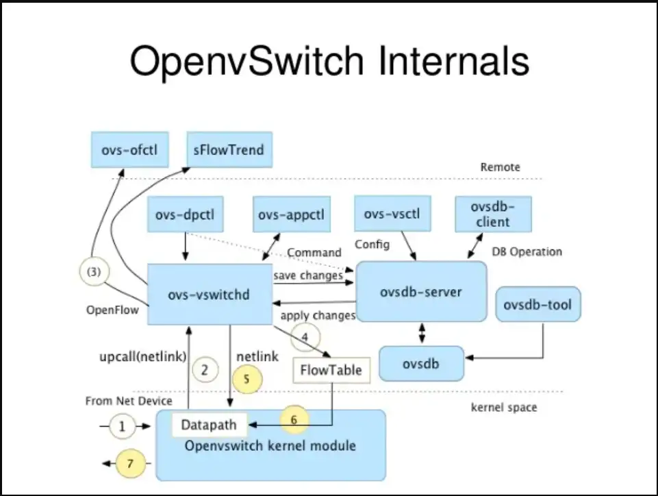

# ovs 源码笔记



## 概览

* dataplane： 以用户态的 ovs-vswitchd 和内核态的 datapath 为主的转发模块，以及与之相关联的数据库模块 ovsdb-server。
* control plane: 由ovs-ofctl模块负责，基于OpenFlow协议与数据面进行交互。
* management plane: 由 OVS 提供的各种工具来负责，这些工具的提供也是为了方便用户对底层各个模块的控制管理，提高用户体验。

主要组件：

* Ovs-switchd: 与内核 datapath 共同组成数据面，用 Openflow 协议与控制器通信，用 OVSDB 与 ovsdb-server 通信
* ovsdb-server: OVS 轻量级数据库服务，配置 OVS，包括接口，VLAN 等
* OpenFlow 控制器（OVN）通过 OpenFlow 协议连接到任何支持 OpenFlow 的交换机，通过向交换机下发 OpenFlow 规则，来控制数据流向
* Kernel datapath 内核模块和 ovs-vswitchd 相互写作，datapath 负责收发包，而ovs-vswitchd通过下发的流表规则指导datapath如何转发包。
* ovs-ofctl是控制面的模块，但本质上它也是一个管理工具，主要是基于OpenFlow协议对OpenFlow交换机进行监控和管理，通过它可以显示一个OpenFlow交换机的当前状态，包括功能、配置和表中的项。
* [ovs-dpctl](https://zhida.zhihu.com/search?q=ovs-dpctl&zhida_source=entity&is_preview=1)用来配置交换机的内核模块datapath，它可以创建，修改和删除datapath，一般单个机器上的datapath有256条（0-255）。一条datapath对应一个虚拟网络设备。该工具还可以统计每条datapath上的设备通过的流量，打印流的信息等。
* ovs-appctl查询和控制运行中的OVS守护进程，包括ovs-switchd，datapath，OpenFlow控制器等，兼具ovs-ofctl、ovs-dpctl的功能，是一个非常强大的命令。ovs-vswitchd等进程启动之后就以一个[守护进程](https://zhida.zhihu.com/search?q=守护进程&zhida_source=entity&is_preview=1)的形式运行，为了能够很好的让用户控制这些进程，就有了这个命令。
* ovs-appctl查询和控制运行中的OVS守护进程，包括ovs-switchd，datapath，OpenFlow控制器等，兼具ovs-ofctl、ovs-dpctl的功能，是一个非常强大的命令。ovs-vswitchd等进程启动之后就以一个[守护进程](https://zhida.zhihu.com/search?q=守护进程&zhida_source=entity&is_preview=1)的形式运行，为了能够很好的让用户控制这些进程，就有了这个命令。

## ovs 源码

### vswitchd 模块


 在ovs中交换机和桥是一个东西, ovs用两个数据结构描述它们: 交换机(ofproto)与桥(bridge)，它们在ovs中是一一对应的。bridge更贴近用户, ofproto跟底层联系更多。ovs用port和ofprot描述端口, 前者对应bridge, 而后者对应ofproto。ovs还有一个结构叫[iface](https://zhida.zhihu.com/search?q=iface&zhida_source=entity&is_preview=1), 一般而言, 一个port包含一个iface, 但存在一种聚合(bond)的情况，此时port和iface就是一对多的关系了。


**ofproto** 代表了一个openflow switch，是ofproto层的整体结构体，它负责与controller交互，并通过调用ofproto-dpif等下层组件和内核及硬件交互。ofproto层通过ofproto_class类实现，目前只有一种 ofproto_class，即ofproto_dpif_class（用ofproto_class_register()进行注册）。

**ofproto-dpif**通过dpif_backer关联dpif（datapath接口）。dpif_class是datapath接口实现类，初始化时调用dp_register_provider()进行注册，用于和实际的datapath交互。目前已有的两种dpif实现是dpif-netlink和dpif-netdev，前者是基于内核datapath的dpif实现（linux），后者基于用户态datapath（dpdk）：

```c
static struct dpif_class *base_dpif_classes[] = {
  &dpif_netlink_class, /* “system” */
  &dpif_netdev_class, /* “netdev” */
};
```

All datapaths of a given type share a single dpif backer instance.

**datapath, table, vport**

内核模块结构关系图


flow 相关的数据结构

```

flow_table 流表结构, 每个datapath都有一个流表
table_instance 流表实例, 其中的 buckets 用来存放具体的 flow 条目,存储方式参见FlexArray
sw_flow flow条目, 其中 key 表示报文的特征, 在进行匹配时, 便是从收到的报文中提取 key , 与flow 条目的 key 进行比较
sw_flow_key 报文特征. 提取报文特征时,会提取每一层的特征.
mask_array 流表掩码集合. 老版本OVS只支持exact flow, 即报文特征必须和flow中描述完全相同才算匹配，而在较新的版本中，支持wildcarded flow. 可以为 flow中的特征添加掩码。最常见的例子，可以设置 flow条目中源 IP 和 IP 掩码， 只要进行匹配的报文 IP 在掩码作用后的网段内，就认为是通过匹配的。
sw_flow_mask 掩码条目。其中 refcount 表明有多少个 flow 正在关联它。
sw_flow_match 在匹配过程中使用的结构
```

**vswitchd的主要工作：**

- 建立与ovsdb的通信；
- 实现一个OpenFlow软件交换机，并和Controller建立连接；
- 对网络设备进行抽象netdev；
- 实现用户态转发以及和内核态快转路径通信；

注：运行网桥bridge_run_()，主进行两项工作，第一是通过函数ofproto_type_run(type)让每一个类型的datapath（dpif-netlink和dpif-netdev两种类型）运行，第二是调用ofproto_run(br->ofproto)让每一个bridge的ofproto运行。

### 命令行命令下发流程

以ovs-vsctl模块为例:


### 内核 datapath

Datapath为ovs内核模块，负责执行数据处理，也就是把从接收端口收到的数据包在流表中进行匹配，并执行匹配到的动作。一个datapath可以对应多个vport，一个vport类似物理交换机的端口概念。一个datapth关联一个flow table，一个flow table包含多个条目，每个条目包括两个内容：一个match/key和一个action。


一般的数据包在Linux[网络协议](https://zhida.zhihu.com/search?content_id=229903845&content_type=Article&match_order=1&q=网络协议&zhida_source=entity)中的流向为上图中的蓝色箭头流向：网卡eth0收到数据包后判断报文走向，如果是本地报文把数据传送到用户态，如果是转发报文根据选路（二层交换或三层路由）把报文送到另一个网卡如[eth1](https://zhida.zhihu.com/search?content_id=229903845&content_type=Article&match_order=1&q=eth1&zhida_source=entity)。当有ovs时，数据流向如红色所示：从网卡eth0收到报文后进入ovs的端口，根据key值进行流表匹配，如果匹配成功执行流表对应的action；如果失败通过upcall送入用户态处理。

**datapath 初始化 dp_init()**


**收包处理：**

通过vport注册的[回调函数](https://zhida.zhihu.com/search?content_id=229903845&content_type=Article&match_order=1&q=回调函数&zhida_source=entity)netdev_frame_hook()->netdev_port_receive()->ovs_vport_receive()处理接收报文，

1. ovs_flow_key_extract()函数生成flow的key内容用以接下来进行流表匹配，


2. 最后调用ovs_dp_process_packet

```
	 17041719.341098208 b'__ip_local_out+0xd7'
	 17041719.341098208 b'ip_local_out+0x1d'
	 17041719.341098208 b'iptunnel_xmit+0x170'
	 17041719.341098208 b'stt_xmit_skb+0x5ea'
	 17041719.341098208 b'ovs_stt_xmit+0x153'
	 17041719.341098208 b'ovs_vport_send+0xa3'
	 17041719.341098208 b'do_output+0x59'
	 17041719.341098208 b'do_execute_actions+0x17be'
	 17041719.341098208 b'ovs_execute_actions+0x48'
	 17041719.341098208 b'ovs_dp_process_packet+0x99'
	 17041719.341098208 b'ovs_vport_receive+0x77'
	 17041719.341098208 b'netdev_port_receive+0x87'
	 17041719.341098208 b'netdev_frame_hook+0x5c'
	 17041719.341098208 b'__netif_receive_skb_core+0x2b4'
	 17041719.341098208 b'__netif_receive_skb_one_core+0x3f'
	 17041719.341098208 b'__netif_receive_skb+0x18'
	 17041719.341098208 b'process_backlog+0xa9'
	 17041719.341098208 b'net_rx_action+0x142'
	 17041719.341098208 b'__softirqentry_text_start+0xe1'
```

**action 处理**

```
OVS_ACTION_ATTR_OUTPUT：获取 port 号，调用 do_output()发送报文到该 port；
OVS_ACTION_ATTR_USERSPACE：调用 output_userspace()发送到用户态；
OVS_ACTION_ATTR_HASH：调用 execute_hash()获取 skb 的 hash 赋值到 ovs_flow_hash；
OVS_ACTION_ATTR_PUSH_VLAN：调用 push_vlan()增加 vlan 头部；
OVS_ACTION_ATTR_POP_VLAN：调用 pop_vlan()移除 vlan 头；
OVS_ACTION_ATTR_RECIRC:在 action_fifos 全局数组中添加一个 deferred_action；
OVS_ACTION_ATTR_SET:调用 execute_set_action()设置相关参数；
OVS_ACTION_ATTR_SAMPLE:概率性的发送报文到用户态；
```

---


### Upcall

当没有找到匹配的流表时，内核通过 netlink 发送报文到用户层处理，入口函数
ovs_dp_upcall()，该函数调用 queue_userspace_packet()构造发往用户层的 skb，通过
netlink 通信机制发送到用户层，其中形成的主要数据格式如下：


upcall 内核态处理流程：


ovs_dp_upcall()首先调用queue_userspace_packet()将信息排队发到用户空间去，用get_dpifindex(dp)获取网卡设备索引号，upcall_msg_size()获得upcall发送消息的大小，然后genlmsg_put()增加一个新的Netlink消息到skb，最后调用genlmsg_unicast()发送消息到[用户空间](https://zhida.zhihu.com/search?content_id=229903845&content_type=Article&match_order=2&q=用户空间&zhida_source=entity)去处理。

**Upcall用户态处理**


---

### 流表创建

用户态通过netlink进行datapath流表更新的入口函数都定义在dp_flow_genl_ops中，流表创建的入口函数是ovs_flow_cmd_new函数，代码分析如下：


## Reference

* https://zhuanlan.zhihu.com/p/637977332
* [OVS Deep Dive 0: Overview (arthurchiao.art)](https://arthurchiao.art/blog/ovs-deep-dive-0-overview/)
