# linux tc 系列(1) - introduction

之前写过一篇 Linux tc 的介绍，写的比较乱，最近做了次 sharing，把那些材料也放到这边来。

## Basic view

Traffic Control (tc) is a traffic rate limiting, shaping, and policy control mechanism provided by the Linux kernel. (control the packet)

1. Filter packets (similar to netfilter)
2. Bandwidth limit (how fast packets are sent)
3. Edit skb metainfo ( [tc-skbedit](https://man7.org/linux/man-pages/man8/tc-skbedit.8.html) )
4. emulate network env ( add latency, loss rate to traffic, [tc-netem](https://man7.org/linux/man-pages/man8/tc-netem.8.html) )

About its position in the network stack:

1. in ingress, it's between the hook point of tcpdump and before the processing of netfilter system.
2. in egress, it's processed after the netfilter system, in L2 processing logics, before the tcpdump egress hook point

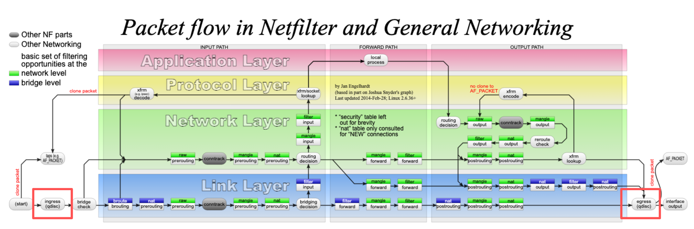

Generally, linux TC packet processing workflow is different from netfitler, more flexible than netfilter.

For netfitler, the kernel network stack is only do filtering and modifying, however, linux tc is scheduling the packets. so the netfilter will not change processing sequence of packets intentionally, while linux tc is aimed to achieve this.

For netfilter, we have a bunch of incoming packets(in specific core), its outgoing packets won't be changed.

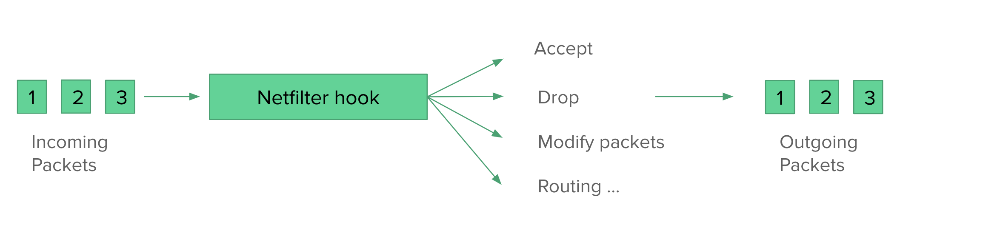

While for linux tc, it has the capability to change the sequence of incoming packets. it processing logics is firstly call `tc->enqueue(skb1)` , then call `skb2 = tc->dequeue()` to get an `skb2`, then continue processing the `skb2`, here the `skb2` and `skb1` may be same or different, depending on linux tc queue types. When packets got enqueued or dequeued, the packets can dropped/rescheduled/modified/delayed/..., so the outgoing packet sequence can be different

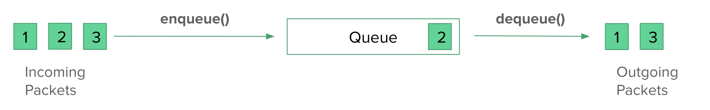

## Queue discipline(qdisc)

Qdisc stands for queue discipline

1. there are many types of qdiscs in kernel, you could check out them in [tc qdisc](https://man7.org/linux/man-pages/man8/tc.8.html#top_of_page) 
2. Whenever the kernel needs to send a packet to an interface, it is **enqueued** to the root qdisc configured for that interface. 
3. Immediately afterwards, the kernel tries to **get as many packets as possible** from the qdisc(**dequeue**), for giving them to the network adaptor driver.

### qdisc categories

For qdisc, we can basically divide them into two categories,

- Classless qdisc
  - Queueing discipline, treat all packets the same way
  - Examples: Token Bucket Filter(tbf), pfifo_fast, fq-codel, fq, etc…

- Classful qdisc
  - Qdisc that contain classes, traffic in different classes can be treated in different way.
  - Useful when applying different logics to different traffic
  - Examples: Hierarchical Token Bucket(HTB), PRIO, etc…


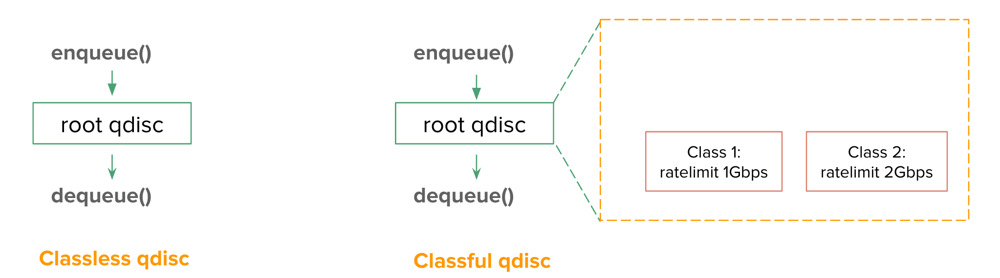

From the graphs above, we can see that the classless qdisc treat all packets the same way, while classful divide them into two classes.

One thing to complement is that for each netdev in linux kernel network, there is one root qdisc attached to the netdev. the netdev will call linux tc logics by enqueuing the packets to the root qdisc and dequeuing from it as well.  For classful qdisc, root qdisc will call enqueue function of child qdiscs recuresively.

### Classless tc example 1: tbf

here is the command to replace the root qdisc to tbf qdisc.

```bash
tc qdisc add dev veth1 root tbf rate 100mbit burst 32mbit latency 400ms
```

for tbf qdisc workflow, this picture gives a detailed workflow.

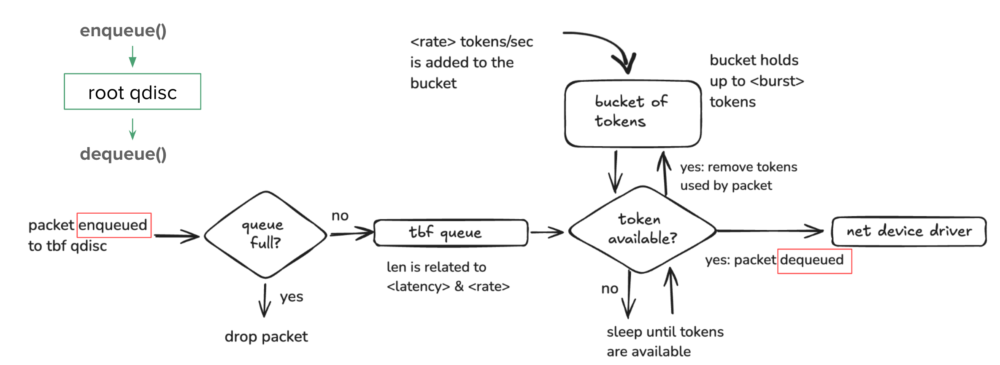

In tbf qdisc, it will drop or let packet pass, it's still in a FIFO way.

### Classless tc example 2: fq

Linux fq can make packets out of original order by scheduling its sending time.

When we set the root qdisc to mq+fq, we will see

```
root@tess-node-2b8qx-tess11:/sysroot/home/tess-admin# tc qdisc show dev eth0
qdisc mq 8002: root 
qdisc fq 0: parent 8002:50 limit 10000p flow_limit 100p buckets 1024 orphan_mask 1023 quantum 3028b initial_quantum 15140b low_rate_threshold 550Kbit refill_delay 40ms timer_slack 10us horizon 10s horizon_drop 
qdisc fq 0: parent 8002:4f limit 10000p flow_limit 100p buckets 1024 orphan_mask 1023 quantum 3028b initial_quantum 15140b low_rate_threshold 550Kbit refill_delay 40ms timer_slack 10us horizon 10s horizon_drop 
```

There is actually a parameter `flow_max_rate` , does not show up when it's default value(UINT_MAX) in the output above. We commonly call this pacing rate in networking.

All flow(e.g. TCP connection) will be enforced by an interval of `packet_len / flow_max_rate`. We can also set the flow pacing rate to a specific value, by setting the sock's `sk_pacing_rate` field(call `setsockopt(SO_MAX_PACING_RATE, <fq-rate>)` syscall to set. Linux fq qdisc will check the field `sk_pacing_rate`, enforce the sock's outgoing packets output at configured  pacing rate.

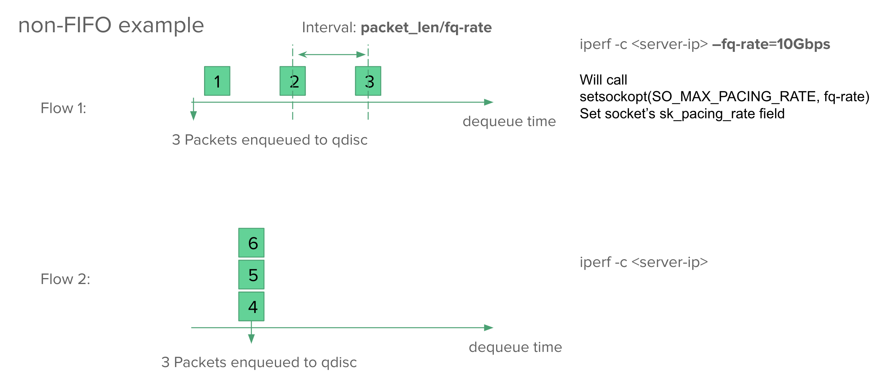

We can run a simple iperf example, to have a pacing TCP flow.

```
iperf -c <server-ip> –fq-rate=10Gbps
```

For different flows, their pacing rate can be different, so the dequeue time is different, leading to non-FIFO behavior for the fq qdisc.

By enable pacing, sometimes, we can see less retransmission for TCP flow, because the packet flow's the order is less likely to be disturbed by RPS,RSS behavior, and less likely to cause burst traffic.

### classful qdisc example: HTB(hierarchy token bucket)

we have an example here to build a HTB qdisc:

```bash 
#!/bin/bash

INTERFACE="eth0"

# Set IP addresses through environment variables
IP1=${IP_ADDRESS_1:-10.0.0.1}
IP2=${IP_ADDRESS_2:-10.0.0.2}

# Load necessary module
modprobe sch_htb

# Create root queue discipline
tc qdisc add dev $INTERFACE root handle 1: htb default 10

# Create class for first IP with 1Gbit limit
tc class add dev $INTERFACE parent 1: classid 1:1 htb rate 1Gbit ceil 1Gbit
tc filter add dev $INTERFACE protocol ip parent 1:0 prio 1 u32 match ip dst $IP1/32 flowid 1:1

# Create class for second IP with 2Gbit limit
tc class add dev $INTERFACE parent 1: classid 1:2 htb rate 2Gbit ceil 2Gbit
tc filter add dev $INTERFACE protocol ip parent 1:0 prio 1 u32 match ip dst $IP2/32 flowid 1:2
```

for this, it bulids the HTB qdisc in several steps:

1. replace the qdisc

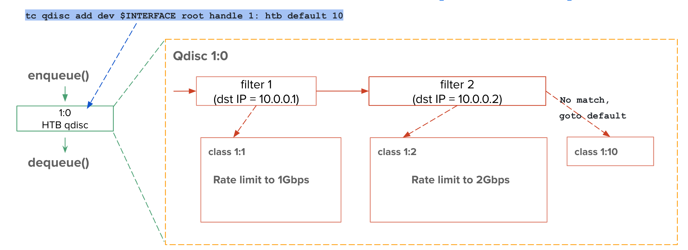

2. create a HTB class

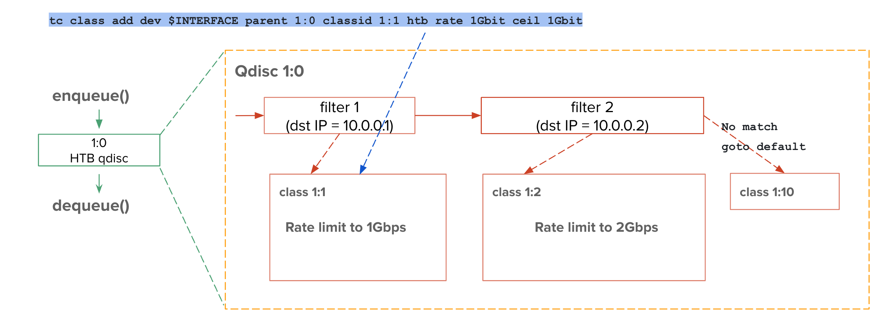

3. create a filter, if the packet match that dst ip is IP1, then it goes to class 1:1. If packets do not match all the rule, it will goto the default class, if the default class do not exist, it will enter a FIFO queue maintained by HTB qdisc, which can be sent immediately without delay.

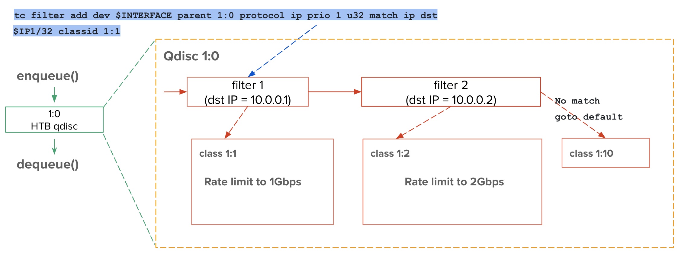

4. moreover, there can be nested qdisc in HTB context

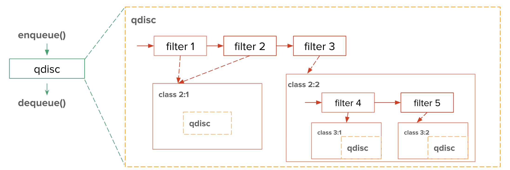

## Ingress qdisc and egress qdisc

In 5.15 kernel, the egress qdisc and ingress qdisc processing logics is different. To be specific, egress qdisc is like a filter + queue, while ingress qdisc is like a filter only.

* egress qdisc

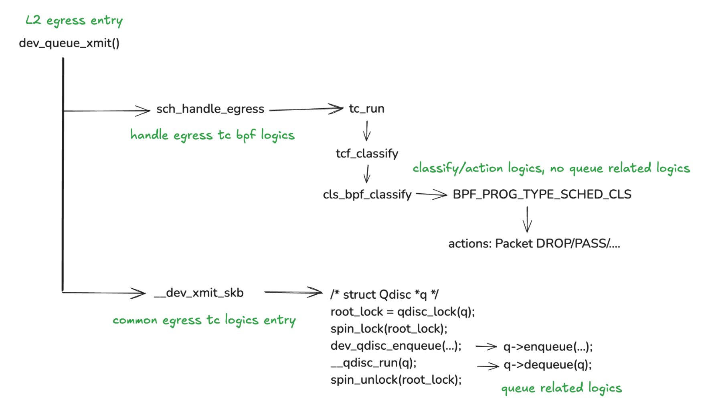

* ingress qdisc
  * ingress qdisc is a field called `mini_Qdisc` in kernel, it can be `clsact_sched_data` or `ingress_sched_data` internally in `mini_Qdisc`, it will decide it exec which filter logics.
  * and there no queue logics like `__qdisc_run` in ingress qdisc.

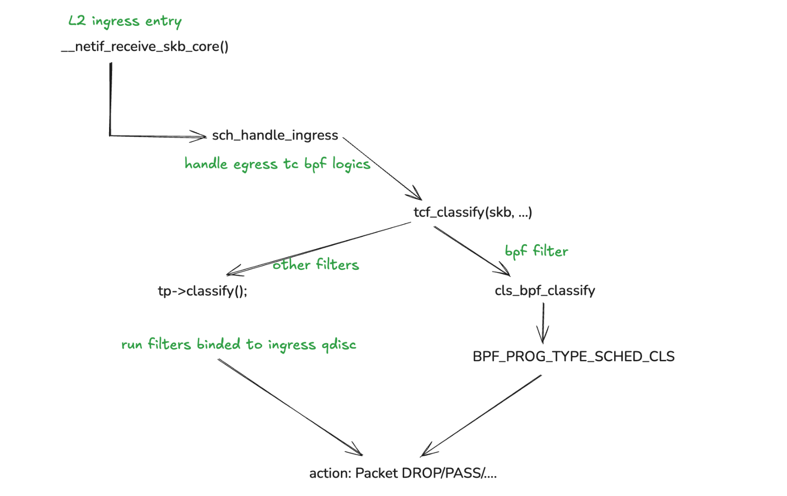


## Small practice about ingress/egress qdisc

in this directory, we have scripts for seting up two namespaces, connected by a veth device, described by the figure below:

```
------------------   ------------------ 
|                |   |                |
| ns1       veth1-----veth2 - ns2     |
|                |   |                |
------------------   ------------------ 
```

```bash
#!/bin/bash

# Create network namespaces
sudo ip netns add ns1
sudo ip netns add ns2

# Create a veth pair
sudo ip link add veth1 type veth peer name veth2

# Attach the veth interfaces to the network namespaces
sudo ip link set veth1 netns ns1
sudo ip link set veth2 netns ns2

# Configure IP addresses for the veth interfaces within each namespace
sudo ip netns exec ns1 ip addr add 192.168.1.1/24 dev veth1
sudo ip netns exec ns2 ip addr add 192.168.1.2/24 dev veth2

# Bring up the loopback and veth interfaces inside each namespace
sudo ip netns exec ns1 ip link set lo up
sudo ip netns exec ns1 ip link set veth1 up
sudo ip netns exec ns2 ip link set lo up
sudo ip netns exec ns2 ip link set veth2 up

# Optionally, enable IP forwarding if needed
sudo ip netns exec ns1 sysctl -w net.ipv4.ip_forward=1
sudo ip netns exec ns2 sysctl -w net.ipv4.ip_forward=1

# Test connectivity (optional)
echo "Testing connectivity between ns1 and ns2..."
sudo ip netns exec ns1 ping -c 3 192.168.1.2

# Notify the user of completion
echo "Network namespaces and veth pair have been set up successfully."
```


Then we conduct simple and same bandwidth test using iperf in two different scenarios:

1. Apply egress tbf(token bucket filter) qdisc to veth1

**setup egress tbf qdisc**

```bash
$ sudo tc qdisc show dev veth1
qdisc noqueue 0: root refcnt 2
# add egress tbf to veth1 device
$ sudo ip netns exec ns1 tc qdisc add dev veth1 root tbf rate 100mbit burst 32mbit latency 400ms
$ sudo tc qdisc show dev veth1
qdisc tbf 8001: root refcnt 13 rate 100Mbit burst 4Mb lat 400ms
```

The bandwidth limit is set to 100Mbps.

**bandwidth test(egress limit)**

```bash
### in ns1
# start iperf3 server in ns2
$ sudo ip netns exec ns2 bash
$ iperf3 -s
-----------------------------------------------------------
Server listening on 5201
-----------------------------------------------------------

### in ns2
$ sudo ip netns exec ns1 bash
# start iperf3 client in ns1, and create one TCP connection.
$ iperf3 -c 192.168.1.2
Connecting to host 192.168.1.2, port 5201
...
- - - - - - - - - - - - - - - - - - - - - - - - -
[ ID] Interval           Transfer     Bitrate         Retr
[  5]   0.00-10.00  sec   120 MBytes   101 Mbits/sec    0             sender
[  5]   0.00-10.01  sec   118 MBytes  98.8 Mbits/sec                  receiver
```

the throughput is about 98.8 Mbps and retransmission is 0.


2. Apply ingress tbf filter to veth2

**setup ingress qdisc and tbf filter**

```bash
$ tc filter show dev veth2
# result is empty
$ tc qdisc add dev veth2 ingress # create ingress qdisc
$ tc qdisc show dev veth2
qdisc noqueue 0: root refcnt 2
qdisc ingress ffff: parent ffff:fff1 ----------------

$ tc filter add dev veth2 ingress protocol all prio 50 u32 match u32 0 0 action police rate 100Mbit burst 100m mtu 65536 drop # this adds a tbf filter at qdisc ingress
$ tc filter show dev veth2 ingress
filter protocol all pref 50 u32 chain 0
filter protocol all pref 50 u32 chain 0 fh 800: ht divisor 1
filter protocol all pref 50 u32 chain 0 fh 800::800 order 2048 key ht 800 bkt 0 terminal flowid ??? not_in_hw
  match 00000000/00000000 at 0
	action order 1:  police 0x1 rate 100Mbit burst 4Mb mtu 64Kb action drop overhead 0b
	ref 1 bind 1
```

The bandwidth limit is set to 100Mbps as well, some shared token bucket filter params(burst parameter) are set as similar as egress test case.

**bandwidth test(ingress limit)**

```bash
### in ns1
# start iperf3 server in ns2
$ sudo ip netns exec ns2 bash
$ iperf3 -s
-----------------------------------------------------------
Server listening on 5201
-----------------------------------------------------------

### in ns2
$ sudo ip netns exec ns1 bash
# start iperf3 client in ns1, and create one TCP connection.
$ iperf3 -c 192.168.1.2

/var/home/centos/proj/KernelTraining2024/homework/lesson_12# iperf3 -c 192.168.1.2
Connecting to host 192.168.1.2, port 5201
...
- - - - - - - - - - - - - - - - - - - - - - - - -
[ ID] Interval           Transfer     Bitrate         Retr
[  5]   0.00-10.00  sec   124 MBytes   104 Mbits/sec  5204             sender
[  5]   0.00-10.00  sec   123 MBytes   103 Mbits/sec                  receiver
```

In this case, throughput is about 103Mbps, it's similar, but the retransmission is 5204, much larger than egress bandwidth limit case.

This result is because ingress qdisc is only a filter, once the throughput exceeds the limit, it will drop packet, it requires retransmision. However, for egress case, it has buffer in queue to stores the packet temporariy. avoid drops packet. meanwhile it's not common to drop packet in egress case in host, since we have TSQ(you could refer to TCP small queue in another post in blog). 


## reference 

1. https://people.netfilter.org/pablo/netdev0.1/papers/Linux-Traffic-Control-Classifier-Action-Subsystem-Architecture.pdf 这篇介绍传统 tc 框架，写的很详细
2. https://www.cnblogs.com/ouyangxibao/articles/12571358.html 这篇讲数据结构之间的关系，非常清晰。（如侵删

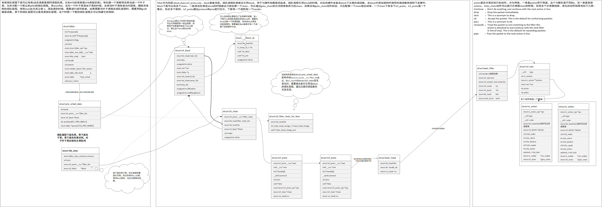

3. 其他引用太多了...不一一列举了（主要是懒
