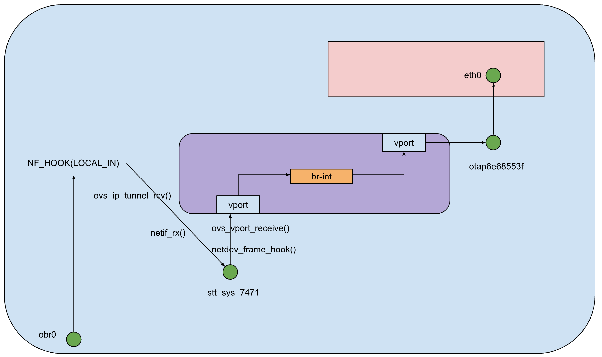
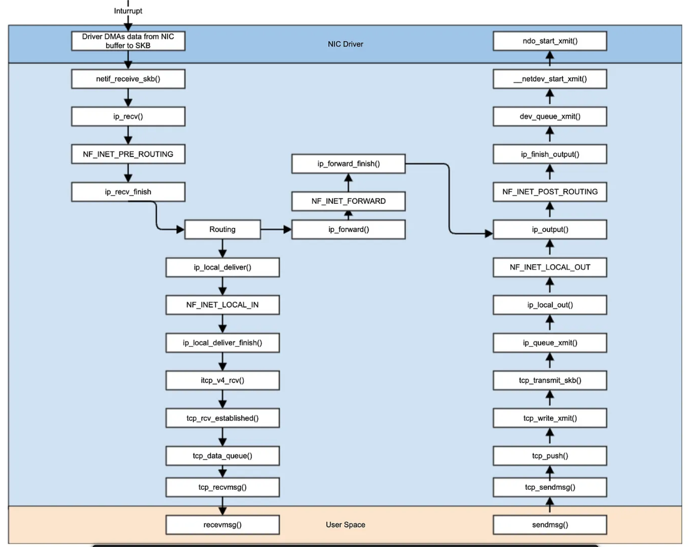
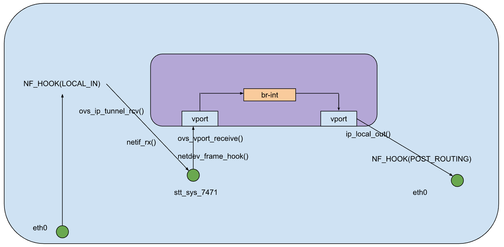
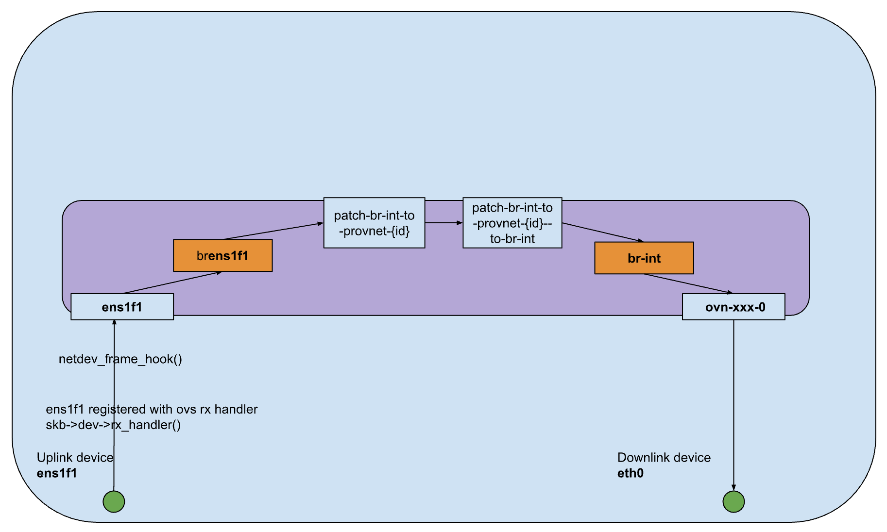
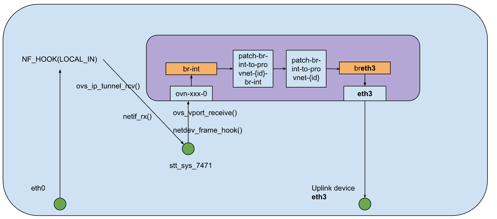
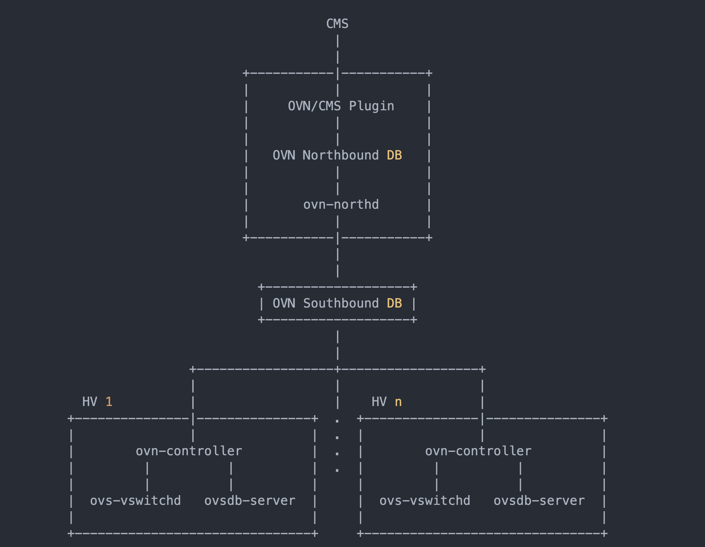
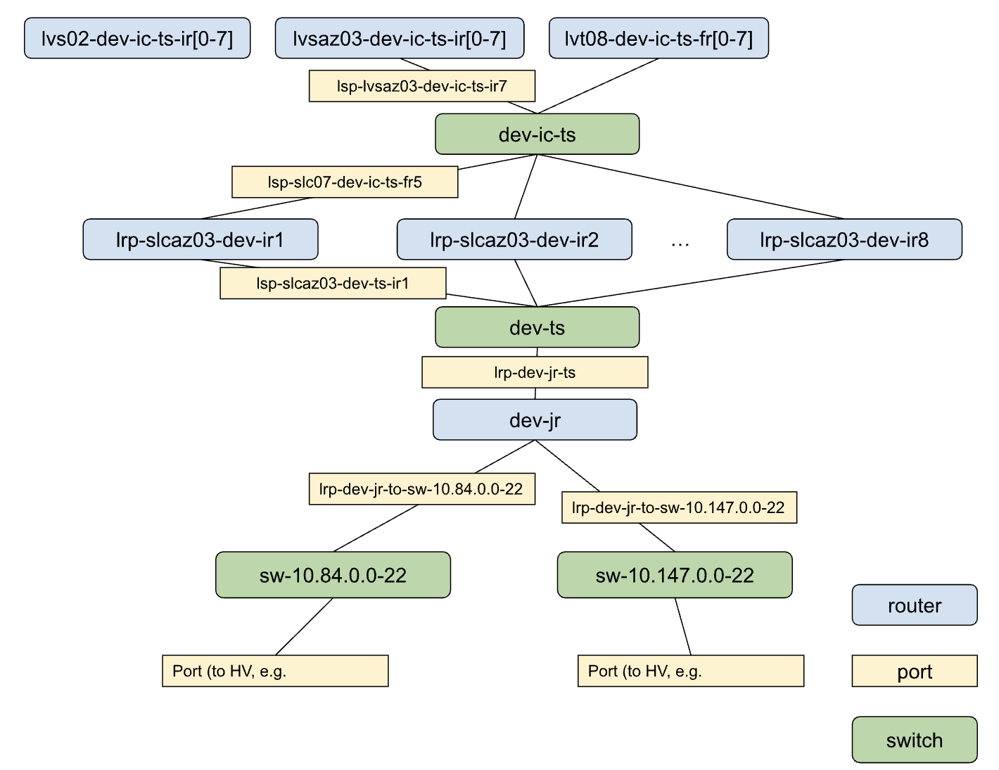

之前搞了一阵子 OVN，做些笔记记录。

## 1. ovn data path

我们这里以 STT tunnel 实现举例

OVN datapath 有三种角色，Hypervisor, IC-gateway, NS-gateway，我们来看下他们的具体实现：

### 1.1 hypervisor



VM 的 eth0 通过 tap 网卡连接到 tunnel device，如上图所示，是 stt_sys_7471。

而 tap 网卡，则作为一个 ovs 的 vport，连接到 ovs 的 bridge，即 br-int 上。而 tunnel device 在收包时，会将对应的 tunnel src IP 解析得到另一个 vport，vport 之间通过 br-int OVS bridge 连接起来。

我们可以通过数据包的发送和接收过程来一窥 datapath。

在接收过程中，首先包在 obr0 device 中进入内核协议栈进行处理， OVS module 在 LOCAL_IN 加上了一个自定义的 hook `ovs_ip_tunnel_rcv`，如果目的端口为 7471（STT 目的端口），则调用 `netif_rx` 将包转入 tunnel device `stt_sys_7471` 进行处理。在 stt tunnel device 中，它在二层收包 hook 注册了 OVS 的收包逻辑。从而进入 OVS 相关模块进行处理，找到 tunnel IP 对应的 vport 进行转发。最后通过 ip_output() 传入 otap 网卡再传入 eth0。

关于 LOCAL_IN ，可以结合下图参考一下调用位置



接受过程则相反，只是不会经过 OVS 挂上的 custom 的 NF_HOOK。

接收路径的 kernel packet trace 路径

```
[05:49:50.820947] [4026532056] eth0                 outer:10.71.84.91:36827->10.185.164.66:7471 -- inner:U:10.5.5.25:53->10.147.1.7:47811 len:155 cksum:52807    FUNC:napi_gro_receive     skb:18446625454473720064 skb_data_len:247
[05:49:50.820971] [4026532056] obr0                 outer:10.71.84.91:36827->10.185.164.66:7471 -- inner:U:10.5.5.25:53->10.147.1.7:47811 len:155 cksum:52807    FUNC:netif_rx     skb:18446625454473720064 skb_data_len:247
[05:49:50.820998] [4026532056] obr0                 outer:10.71.84.91:36827->10.185.164.66:7471 -- inner:U:10.5.5.25:53->10.147.1.7:47811 len:155 cksum:52807    FUNC:__netif_receive_skb     skb:18446625454473720064 skb_data_len:247
[05:49:50.821020] [4026532056] obr0                 outer:10.71.84.91:36827->10.185.164.66:7471 -- inner:U:10.5.5.25:53->10.147.1.7:47811 len:155 cksum:52807    FUNC:ip_rcv     skb:18446625454473720064 skb_data_len:247
[05:49:50.821040] [4026532056] obr0                 outer:10.71.84.91:36827->10.185.164.66:7471 -- inner:U:10.5.5.25:53->10.147.1.7:47811 len:155 cksum:52807    FUNC:trace_ip_rcv_core     skb:18446625454473720064 skb_data_len:247
[05:49:50.821062] [4026532056] obr0                 outer:10.71.84.91:36827->10.185.164.66:7471 -- inner:U:10.5.5.25:53->10.147.1.7:47811 len:155 cksum:52807    FUNC:ip_rcv_finish     skb:18446625454473720064 skb_data_len:247
[05:49:50.821083] [4026532056] stt_sys_7471         outer:10.71.84.91:36827->10.185.164.66:7471 -- inner:U:10.5.5.25:53->10.147.1.7:47811 len:155 cksum:52807    FUNC:netif_rx     skb:18446625454473720064 skb_data_len:175
[05:49:50.821103] [4026532056] stt_sys_7471         outer:10.71.84.91:36827->10.185.164.66:7471 -- inner:U:10.5.5.25:53->10.147.1.7:47811 len:155 cksum:52807    FUNC:__netif_receive_skb     skb:18446625454473720064 skb_data_len:175
[05:49:50.821145] [4026532056] otap6e68553f         U:10.5.5.25:53->10.147.1.7:47811 len:155 cksum:52807            FUNC:__dev_queue_xmit     skb:18446625454762022144 skb_data_len:189

```

### 1.2  IC-GW

IC-GW 的情况和 HV 的情况类似，只是在发送包的时候从 ip_local_out() 出去了，因为它只执行一个转发功能。



IC-GW 的包转发过程的 kernel packet trace 如下， 可以看到其中打印出了调用栈，这是我们在 nf_conntrack_in加了 bpf 钩子，打印调用栈，可以看到会经过两处 kernel 的 conntrack 入口。但其实 conntrack 一般为了 NAT 服务，不需要的话，我们可以在 iptables 中针对目的端口为 7471 端口的流量，施加 NOTRACK rule，减小不必要的 load。

```
TIMESTAMP        TIME              NETWORK_NS   INTERFACE            PKT_INFO                                                        TRACE_INFO
17041719.341073669 [07:11:12.059223] [4026532072] eth0                 outer:10.214.88.67:60414->10.177.17.223:7471 -- inner:T_ACK,SYN:10.147.36.4:8083->10.9.59.129:44844 seq:2674243231 ack:3023388399 win:65160 len:92    FUNC:napi_gro_receive     skb:18446633092601266432 skb_data_len:132
17041719.341081351 [07:11:12.059393] [4026532072] eth0                 outer:10.214.88.67:60414->10.177.17.223:7471 -- inner:T_ACK,SYN:10.147.36.4:8083->10.9.59.129:44844 seq:2674243231 ack:3023388399 win:65160 len:92    FUNC:trace_ip_rcv_core     skb:18446633092601266432 skb_data_len:132
17041719.341083486 [07:11:12.059418] [4026532072] eth0                 outer:10.214.88.67:60414->10.177.17.223:7471 -- inner:T_ACK,SYN:10.147.36.4:8083->10.9.59.129:44844 seq:2674243231 ack:3023388399 win:65160 len:92    FUNC:nf_conntrack_in     skb:18446633092601266432 skb_data_len:132
	 17041719.341083486 b'nf_conntrack_in+0x1'
	 17041719.341083486 b'nf_hook_slow+0x45'
	 17041719.341083486 b'ip_sublist_rcv+0x23e'
	 17041719.341083486 b'ip_list_rcv+0x10b'
	 17041719.341083486 b'__netif_receive_skb_list_core+0x228'
	 17041719.341083486 b'netif_receive_skb_list_internal+0x1a1'
	 17041719.341083486 b'gro_normal_list.part.0+0x1e'
	 17041719.341083486 b'napi_complete_done+0x91'
	 17041719.341083486 b'bnxt_poll+0x10d'
	 17041719.341083486 b'net_rx_action+0x142'
	 17041719.341083486 b'__softirqentry_text_start+0xe1'
	 17041719.341083486 b'irq_exit+0xae'
	 17041719.341083486 b'do_IRQ+0x5a'
	 17041719.341083486 b'ret_from_intr+0x0'
	 17041719.341083486 b'cpuidle_enter_state+0xc5'
	 17041719.341083486 b'cpuidle_enter+0x2e'
	 17041719.341083486 b'call_cpuidle+0x23'
	 17041719.341083486 b'do_idle+0x1dd'
	 17041719.341083486 b'cpu_startup_entry+0x20'
	 17041719.341083486 b'start_secondary+0x167'
	 17041719.341083486 b'secondary_startup_64+0xa4'
17041719.341092553 [07:11:12.060006] [4026532072] stt_sys_7471         outer:10.214.88.67:60414->10.177.17.223:7471 -- inner:T_ACK,SYN:10.147.36.4:8083->10.9.59.129:44844 seq:2674243231 ack:3023388399 win:65160 len:20    FUNC:netif_rx     skb:18446633092601266432 skb_data_len:60
17041719.341094945 [07:11:12.060033] [4026532072] stt_sys_7471         outer:10.214.88.67:60414->10.177.17.223:7471 -- inner:T_ACK,SYN:10.147.36.4:8083->10.9.59.129:44844 seq:2674243231 ack:3023388399 win:65160 len:20    FUNC:__netif_receive_skb     skb:18446633092601266432 skb_data_len:60
17041719.341098208 [07:11:12.060050] [4026532072] stt_sys_7471         outer:10.177.17.223:24803->10.96.157.94:7471 -- inner:T_ACK,SYN:10.147.36.4:8083->10.9.59.129:44844 seq:2674243231 ack:3023388399 win:65160 len:92    FUNC:nf_conntrack_in     skb:18446633092601266432 skb_data_len:132
	 17041719.341098208 b'nf_conntrack_in+0x1'
	 17041719.341098208 b'nf_hook_slow+0x45'
	 17041719.341098208 b'__ip_local_out+0xd7'
	 17041719.341098208 b'ip_local_out+0x1d'
	 17041719.341098208 b'iptunnel_xmit+0x170'
	 17041719.341098208 b'stt_xmit_skb+0x5ea'
	 17041719.341098208 b'ovs_stt_xmit+0x153'
	 17041719.341098208 b'ovs_vport_send+0xa3'
	 17041719.341098208 b'do_output+0x59'
	 17041719.341098208 b'do_execute_actions+0x17be'
	 17041719.341098208 b'ovs_execute_actions+0x48'
	 17041719.341098208 b'ovs_dp_process_packet+0x99'
	 17041719.341098208 b'ovs_vport_receive+0x77'
	 17041719.341098208 b'netdev_port_receive+0x87'
	 17041719.341098208 b'netdev_frame_hook+0x5c'
	 17041719.341098208 b'__netif_receive_skb_core+0x2b4'
	 17041719.341098208 b'__netif_receive_skb_one_core+0x3f'
	 17041719.341098208 b'__netif_receive_skb+0x18'
	 17041719.341098208 b'process_backlog+0xa9'
	 17041719.341098208 b'net_rx_action+0x142'
	 17041719.341098208 b'__softirqentry_text_start+0xe1'
	 17041719.341098208 b'irq_exit+0xae'
	 17041719.341098208 b'do_IRQ+0x5a'
	 17041719.341098208 b'ret_from_intr+0x0'
	 17041719.341098208 b'cpuidle_enter_state+0xc5'
	 17041719.341098208 b'cpuidle_enter+0x2e'
	 17041719.341098208 b'call_cpuidle+0x23'
	 17041719.341098208 b'do_idle+0x1dd'
	 17041719.341098208 b'cpu_startup_entry+0x20'
	 17041719.341098208 b'start_secondary+0x167'
	 17041719.341098208 b'secondary_startup_64+0xa4'
17041719.341104191 [07:11:12.060297] [4026532072] stt_sys_7471         outer:10.177.17.223:24803->10.96.157.94:7471 -- inner:T_ACK,SYN:10.147.36.4:8083->10.9.59.129:44844 seq:2674243231 ack:3023388399 win:65160 len:92    FUNC:ip_output     skb:18446633092601266432 skb_data_len:132
17041719.341106821 [07:11:12.060318] [4026532072] eth0                 outer:10.177.17.223:24803->10.96.157.94:7471 -- inner:T_ACK,SYN:10.147.36.4:8083->10.9.59.129:44844 seq:2674243231 ack:3023388399 win:65160 len:92    FUNC:ip_finish_output     skb:18446633092601266432 skb_data_len:132
17041719.341108475 [07:11:12.060334] [4026532072] eth0                 outer:10.177.17.223:24803->10.96.157.94:7471 -- inner:T_ACK,SYN:10.147.36.4:8083->10.9.59.129:44844 seq:2674243231 ack:3023388399 win:65160 len:92    FUNC:__ip_finish_output     skb:18446633092601266432 skb_data_len:132
17041719.341110166 [07:11:12.060349] [4026532072] eth0                 outer:10.177.17.223:24803->10.96.157.94:7471 -- inner:T_ACK,SYN:10.147.36.4:8083->10.9.59.129:44844 seq:2674243231 ack:3023388399 win:65160 len:106    FUNC:__dev_queue_xmit     skb:18446633092601266432 skb_data_len:146

```


### 1.3 NS-GW



NS gateway 的 datapath 需要分成 IC-GW -> NS-GW 和 NS-GW -> IC-GW，即北向流量和南向流量讨论。

**对于南向流量，其 datapath 如上图**：数据包通过 uplink device 进入 NS-GW 节点在二层的处理中，在 uplink device 上，OVS register 了 uplink 的 rx_handler，即在二层就会执行 OVS 的包处理逻辑。

在 OVS 的处理中，NS-GW 中有两个 bridge，通过 patch vport  相连，最终转发到一个与 IC-GW 相连的 port 中，包从 eth0 发出去。

值得一提的是，这里并不会经过 kernel 的三层逻辑，即 kernel 的 conntrack module，但是 OVS 中维护了自身相关的 conntrack 信息，但不会受到 iptables NOTRACK rule 影响。比如我们可以看到如下的 bpf 调用栈： __nf_conntrack_confirm 被调用时的 kernel packet trace 如下，我们可以知道 ovs 相关的逻辑涉及到了 conntrack 表的插入。

```c
311833.403507497 [08:03:02.105239] [4026532072] eth2                 T_ACK:10.148.224.40:61433->10.147.124.41:8001 seq:4029302317 ack:3152207018 win:64 len:20    FUNC:__nf_conntrack_confirm     skb:18446613866445268480 skb_data_len:40
         311833.403507497 b'__nf_conntrack_confirm+0x1'
         311833.403507497 b'do_execute_actions+0xafe'
         311833.403507497 b'ovs_execute_actions+0x48'
         311833.403507497 b'ovs_dp_process_packet+0x99'
         311833.403507497 b'clone_execute+0x1d1'
         311833.403507497 b'do_execute_actions+0x482'
         311833.403507497 b'ovs_execute_actions+0x48'
         311833.403507497 b'ovs_dp_process_packet+0x99'
         311833.403507497 b'ovs_vport_receive+0x77'
         311833.403507497 b'netdev_port_receive+0x87'
         311833.403507497 b'netdev_frame_hook+0x5c'
         311833.403507497 b'__netif_receive_skb_core+0x2b4'
         311833.403507497 b'__netif_receive_skb_list_core+0x102'
         311833.403507497 b'netif_receive_skb_list_internal+0x1a1'
         311833.403507497 b'gro_normal_list.part.0+0x1e'
         311833.403507497 b'napi_complete_done+0x91'
         311833.403507497 b'mlx5e_napi_poll+0x1ca'
         311833.403507497 b'net_rx_action+0x142'
         311833.403507497 b'__do_softirq+0xe1'
         311833.403507497 b'irq_exit+0xae'
         311833.403507497 b'do_IRQ+0x5a'
         311833.403507497 b'ret_from_intr+0x0'
         311833.403507497 b'cpuidle_enter_state+0xc5'
         311833.403507497 b'cpuidle_enter+0x2e'
         311833.403507497 b'call_cpuidle+0x23'
         311833.403507497 b'do_idle+0x1dd'
         311833.403507497 b'cpu_startup_entry+0x20'
         311833.403507497 b'start_secondary+0x167'
         311833.403507497 b'secondary_startup_64+0xa4'
```

另外这里我们也展示下相关的 datapath（这里 uplink device 不一定和图中对应，它名字比较多样，这里是 `ens1f1`: 

```c
[09:44:45.205526] [4026532056] ens1f1               T_SYN:10.55.80.21:38465->10.215.1.126:8080 seq:4123746103 ack:0 win:8190 len:20    FUNC:napi_gro_receive
[09:44:45.205545] [4026532056] ens1f1               T_SYN:10.55.80.21:38465->10.215.1.126:8080 seq:4123746103 ack:0 win:8190 len:20    FUNC:packet_rcv
[09:44:45.205564] [4026532056] ens1f1               T_SYN:10.55.80.21:38465->10.215.1.126:8080 seq:4123746103 ack:0 win:8190 len:20    FUNC:init_conntrack
          b'init_conntrack.isra.0+0x1'
          b'__ovs_ct_lookup+0xad'
          b'ovs_ct_execute+0x488'
          b'do_execute_actions+0xafe'
          b'ovs_execute_actions+0x48'
          b'ovs_dp_process_packet+0x99'
          b'ovs_vport_receive+0x77'
          b'netdev_port_receive+0x87'
          b'netdev_frame_hook+0x5c'
          b'__netif_receive_skb_core+0x2b4'
          b'__netif_receive_skb_list_core+0x102'
          b'netif_receive_skb_list_internal+0x1a1'
          b'gro_normal_list.part.0+0x1e'
          b'napi_complete_done+0x91'
          b'i40e_napi_poll+0x1a0'
          b'net_rx_action+0x142'
          b'__do_softirq+0xe1'
          b'irq_exit+0xae'
          b'do_IRQ+0x5a'
          b'ret_from_intr+0x0'
          b'cpuidle_enter_state+0xc5'
          b'cpuidle_enter+0x2e'
          b'call_cpuidle+0x23'
          b'do_idle+0x1dd'
          b'cpu_startup_entry+0x20'
          b'start_secondary+0x167'
          b'secondary_startup_64+0xa4'
[09:44:45.205909] [4026532056] ens1f1               T_SYN:10.55.80.21:38465->10.215.1.126:8080 seq:4123746103 ack:0 win:8190 len:20    FUNC:__nf_conntrack_confirm
          b'__nf_conntrack_confirm+0x1'
          b'do_execute_actions+0xafe'
          b'ovs_execute_actions+0x48'
          b'ovs_dp_process_packet+0x99'
          b'clone_execute+0x1d1'
          b'do_execute_actions+0x482'
          b'ovs_execute_actions+0x48'
          b'ovs_dp_process_packet+0x99'
          b'ovs_vport_receive+0x77'
          b'netdev_port_receive+0x87'
          b'netdev_frame_hook+0x5c'
          b'__netif_receive_skb_core+0x2b4'
          b'__netif_receive_skb_list_core+0x102'
          b'netif_receive_skb_list_internal+0x1a1'
          b'gro_normal_list.part.0+0x1e'
          b'napi_complete_done+0x91'
          b'i40e_napi_poll+0x1a0'
          b'net_rx_action+0x142'
          b'__do_softirq+0xe1'
          b'irq_exit+0xae'
          b'do_IRQ+0x5a'
          b'ret_from_intr+0x0'
          b'cpuidle_enter_state+0xc5'
          b'cpuidle_enter+0x2e'
          b'call_cpuidle+0x23'
          b'do_idle+0x1dd'
          b'cpu_startup_entry+0x20'
          b'start_secondary+0x167'
          b'secondary_startup_64+0xa4'
[09:44:45.206302] [4026532056] stt_sys_7471         outer:10.172.66.144:11872->10.96.132.47:7471 -- inner:T_SYN:10.55.80.21:38465->10.215.1.126:8080 seq:4123746103 ack:0 win:8190 len:92 IPT:OUTPUT.raw.ACCEPT
[09:44:45.206334] [4026532056] stt_sys_7471         outer:10.172.66.144:11872->10.96.132.47:7471 -- inner:T_SYN:10.55.80.21:38465->10.215.1.126:8080 seq:4123746103 ack:0 win:8190 len:92 IPT:OUTPUT.mangle.ACCEPT
[09:44:45.206355] [4026532056] stt_sys_7471         outer:10.172.66.144:11872->10.96.132.47:7471 -- inner:T_SYN:10.55.80.21:38465->10.215.1.126:8080 seq:4123746103 ack:0 win:8190 len:92 IPT:OUTPUT.filter.ACCEPT
[09:44:45.206471] [4026532056] stt_sys_7471         outer:10.172.66.144:11872->10.96.132.47:7471 -- inner:T_SYN:10.55.80.21:38465->10.215.1.126:8080 seq:4123746103 ack:0 win:8190 len:92    FUNC:ip_output
[09:44:45.206496] [4026532056] eth0                 outer:10.172.66.144:11872->10.96.132.47:7471 -- inner:T_SYN:10.55.80.21:38465->10.215.1.126:8080 seq:4123746103 ack:0 win:8190 len:92 IPT:POSTROUTING.mangle.ACCEPT
[09:44:45.206540] [4026532056] eth0                 outer:10.172.66.144:11872->10.96.132.47:7471 -- inner:T_SYN:10.55.80.21:38465->10.215.1.126:8080 seq:4123746103 ack:0 win:8190 len:92    FUNC:ip_finish_output
[09:44:45.206560] [4026532056] eth0                 outer:10.172.66.144:11872->10.96.132.47:7471 -- inner:T_SYN:10.55.80.21:38465->10.215.1.126:8080 seq:4123746103 ack:0 win:8190 len:92    FUNC:__ip_finish_output
[09:44:45.206588] [4026532056] eth0                 outer:10.172.66.144:11872->10.96.132.47:7471 -- inner:T_SYN:10.55.80.21:38465->10.215.1.126:8080 seq:4123746103 ack:0 win:8190 len:106    FUNC:__dev_queue_xmit
[09:44:45.206642] [4026532056] eth0                 outer:10.172.66.144:11872->10.96.132.47:7471 -- inner:T_SYN:10.55.80.21:38465->10.215.1.126:8080 seq:4123746103 ack:0 win:8190 len:106    FUNC:kfree_skbmem

```


对于北向流量，其 datapath 如图：



在收包的时候，类似 IC-GW 和 HV，它需要走 LOCAL_IN 的钩子，通过两个 OVS-bridge 后 从 uplink device 中发出。示例 packet trace 如下：

```
[07:08:57.179971] [4026532072] eth0                 outer:10.71.12.61:24799->10.189.201.39:7471 -- inner:T_ACK:10.147.167.7:42986->10.222.19.111:443 seq:4116230886 ack:1674061806 win:502 len:92    FUNC:napi_gro_receive     skb:18446615864248234752 skb_data_len:124
[07:08:57.180019] [4026532072] eth0                 outer:10.71.12.61:24799->10.189.201.39:7471 -- inner:T_ACK:10.147.167.7:42986->10.222.19.111:443 seq:4116230886 ack:1674061806 win:502 len:92    FUNC:packet_rcv     skb:18446615864248234752 skb_data_len:124
[07:08:57.180042] [4026532072] stt_sys_7471         outer:10.71.12.61:24799->10.189.201.39:7471 -- inner:T_ACK:10.147.167.7:42986->10.222.19.111:443 seq:4116230886 ack:1674061806 win:502 len:20    FUNC:netif_rx     skb:18446615864248234752 skb_data_len:52
[07:08:57.180062] [4026532072] stt_sys_7471         outer:10.71.12.61:24799->10.189.201.39:7471 -- inner:T_ACK:10.147.167.7:42986->10.222.19.111:443 seq:4116230886 ack:1674061806 win:502 len:20    FUNC:__netif_receive_skb     skb:18446615864248234752 skb_data_len:52
[07:08:57.180081] [4026532072] stt_sys_7471         T_ACK:10.147.167.7:42986->10.222.19.111:443 seq:4116230886 ack:1674061806 win:502 len:20    FUNC:packet_rcv     skb:18446615864248234752 skb_data_len:52
[07:08:57.180100] [4026532072] eth3                 T_ACK:10.147.167.7:42986->10.222.19.111:443 seq:4116230886 ack:1674061806 win:502 len:34    FUNC:__dev_queue_xmit     skb:18446615864248234752 skb_data_len:66

```


## 2. ovn control path

OVN architecture has a good picture to show OVN control path components.



### 2.1 ovn cheatsheet

find openflow configuration from south to north:

* In north bound db, it has mac addr and VM(logical network information)

```
root:# ovn-nbctl show
switch be21f5e0-03de-41e6-8521-d1a85303c10f (sw-10.84.0.0-22)
    port e990cd90-6337-407b-b820-d6bd502b1294
        addresses: ["74:db:d1:3a:b1:97 10.84.2.207"]
    port 478e96b2-5aa6-459a-a1e5-bc58dec7b876
        addresses: ["74:db:d1:7f:cc:d1 10.84.2.19"]
    port 19a5a0ca-d180-42dd-8649-95881c2b0e98
        addresses: ["74:db:d1:0b:99:43 10.84.2.243"]
```

`10.84.2.207` is IP of a VM node on OVN hypervisor.


* In south bound db, it shows info about Hypervisor. It's about physical network information. 

```
root:# ovn-sbctl show | head
Chassis "4479d714-d827-4717-a045-cb7ef457ebcf"
    hostname: z7zqh-node
    Encap stt
        ip: "10.179.206.43"
        options: {csum="true"}
    Port_Binding "d0943c4d-fc57-4d25-afc8-bfeb0b75e30c"
    Port_Binding "15b0fb0a-0605-4244-bb8e-ba3393639e53"
```

the Hypervisior is Chassis "4479d714-d827-4717-a045-cb7ef457ebcf", it will use `stt` protocol to encapsulate packets, it has two ports binded on this Hypervisor. One Port "04217bd3-ce16-449e-8fed-abb2a4815c30" binding to the hypervisor. And it's connected to a VM on this Hypervisor.

```
root@:# ovn-nbctl --no-leader-only show | grep d0943c4d-fc57-4d25-afc8-bfeb0b75e30c -C 3
switch e18980e5-d2da-40de-85cc-0fbbfefadba1 (sw-10.9.0.0-22)
...
	port d0943c4d-fc57-4d25-afc8-bfeb0b75e30c
        addresses: ["74:db:d1:5e:64:d4 10.9.3.189"]
...
```

And the port connected to VM, has MAC addr `d0943c4d-fc57-4d25-afc8-bfeb0b75e30c` and IP addr `10.9.3.189`

* in hypervisor ovs info, we can see some port/addr information

```
# ovs-vsctl show | grep br-int -A 100
		Bridge br-int
        fail_mode: secure
        datapath_type: system
        Port ovn-a45bf0-1
            Interface ovn-a45bf0-1
                type: stt
                options: {csum="true", key=flow, local_ip="10.184.163.36", remote_ip="10.217.73.23"}
        Port ovn-842a08-1
            Interface ovn-842a08-1
                type: stt
                options: {csum="true", key=flow, local_ip="10.184.163.36", remote_ip="10.179.224.71"}
...
        Port br-int
            Interface br-int
                type: internal

```

local ip is local hypervisor IP, while remote ip is remote hypervisor IP.

### 2.2 A case to understand pod(inside VM) routing

Architecture case:



these CIDR will be routed to VM 10.9.2.146.

```
# ovn-nbctl --no-leader-only lr-route-list dev-jr | grep 10.9.2.146 
           10.9.52.144/28                10.9.2.146 dst-ip
            10.9.143.0/28                10.9.2.146 dst-ip
           10.9.193.96/28                10.9.2.146 dst-ip
          10.9.202.192/28                10.9.2.146 dst-ip
           10.9.207.64/28                10.9.2.146 dst-ip
```

check the Logical Port binding, the port `670c5500-4083-4322-84d7-d457b04b605c` is binded to VM IP `10.9.2.146`

```
# ovn-nbctl --no-leader-only show  | grep 10.9.2.146 -C 3
    port 23f2d07b-d052-4d9c-ae1f-44927c2156ff
        addresses: ["74:db:d1:29:c6:a3 10.9.1.31"]
    port 670c5500-4083-4322-84d7-d457b04b605c
        addresses: ["74:db:d1:bf:44:5a 10.9.2.146"]
    port 93db7faa-c8f2-422f-b48e-7621cb41c9fd
        addresses: ["74:db:d1:d4:c7:24 10.9.3.109"]
    port a0ad4811-2ff8-42cd-baab-7793867038ed
```

Found the Hypervisor/Chassis, which has the port binded.

```
# ovn-sbctl --no-leader-only show | grep 670c5500-4083-4322-84d7-d457b04b605c -C 3
    Encap stt
        ip: "10.184.163.36"
        options: {csum="true"}
    Port_Binding "670c5500-4083-4322-84d7-d457b04b605c"

```

Check the openflow rule in Hypervisor, it says all packets going to `10.9.52.144/255`, will be routed to `10.96.133.20` Hypervisor.

```
# ovs-dpctl dump-flows | grep 10.9.52
recirc_id(0),in_port(5),eth(src=74:db:d1:2f:8b:ef,dst=74:db:d2:19:e7:6b),eth_type(0x0800),ipv4(src=10.32.0.0/255.224.0.0,dst=10.9.52.144/255.255.255.240,tos=0/0x3,ttl=63,frag=no), packets:5718, bytes:563542, used:0.713s, actions:set(tunnel(tun_id=0x10f3e000002,src=10.184.162.92,dst=10.96.133.20,ttl=64,tp_dst=7471,flags(df|csum|key))),set(eth(src=74:db:d2:19:e7:6b,dst=74:db:d1:30:9e:dd)),set(ipv4(ttl=62)),3
```

check the logical flow in southbound db, it says all packets going to 10.9.52.144/28 will be routed to logical IP `10.215.91.233`, which is the dst VM.

```
# ovn-sbctl dump-flows dev-jr | grep 10.9.52.144
  table=14(lr_in_ip_routing   ), priority=85   , match=(reg7 == 0 && ip4.dst == 10.9.52.144/28), action=(ip.ttl--; reg8[0..15] = 0; reg0 = 10.215.91.233; reg1 = 10.215.88.1; eth.src = 74:db:d2:19:e7:6b; outport = "lrp-dev-jr-to-sw-10.215.88.0-22"; flags.loopback = 1; next;)
```


The last two openflow rules info do not align with what's shown in ovn-northd info. 

from nbctl shown info, the CIDR `10.9.52.144/28` will be routed to VM `10.9.2.146`, which is on the hypervisor of IP  `10.184.163.36`

```
# ovn-nbctl --no-leader-only lr-route-list dev-jr | grep 10.9.2.146 
           10.9.52.144/28                10.9.2.146 dst-ip
```

However, from the openflow rule, we can see from the hypervisor rule, the packets going to `10.9.52.144` will be routed to HV `10.96.133.20`, while it is expected to be `10.184.163.36` from nb-db info.

from the sb dump flow results, in logical route aspect, the packets going to  `10.9.52.144` will be routed to VM IP `10.215.91.233`, while it is expected to be `10.9.2.146`.


