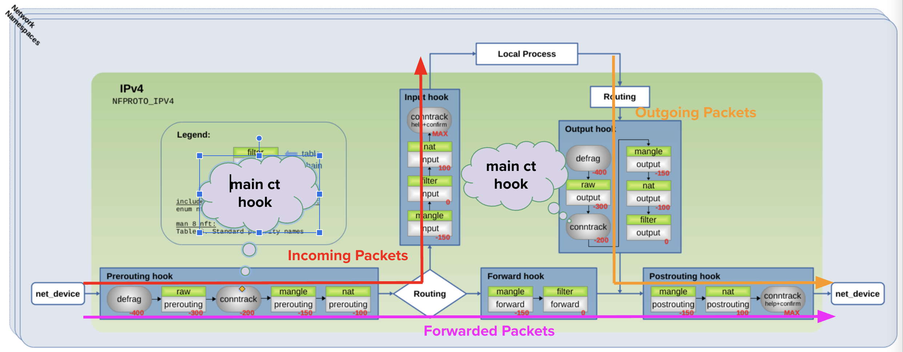
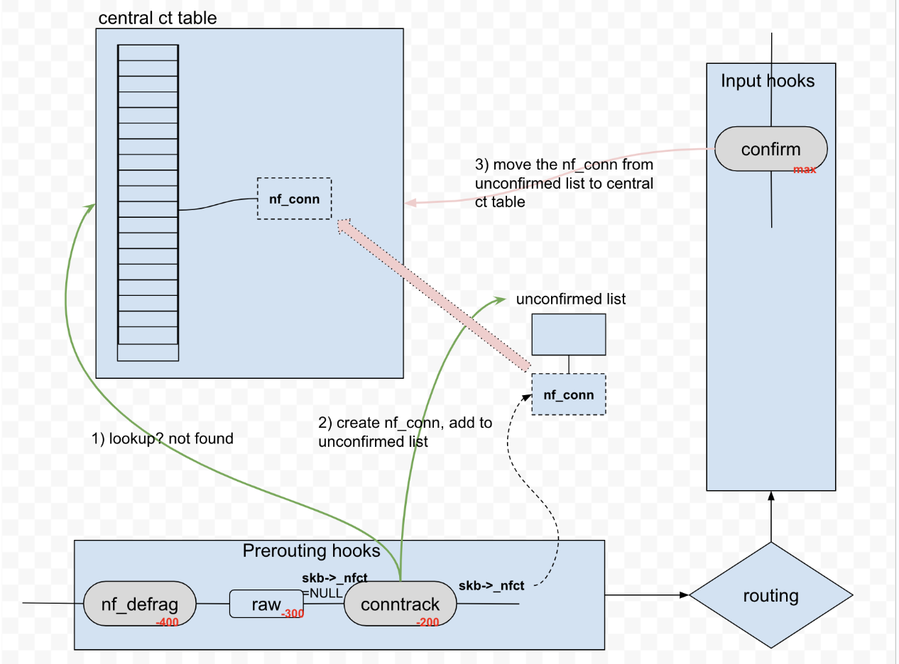
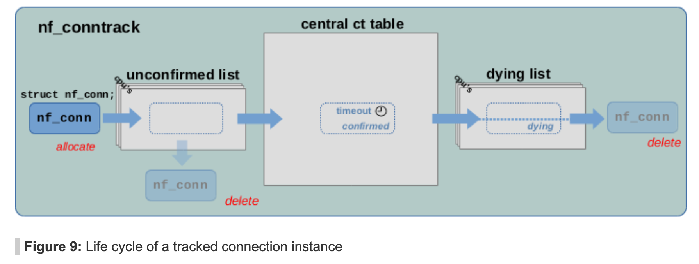

Conntrack 作为实现 NAT 的基础模块，在内核中经常见到，而且它开销挺大。这里我们做一些关于它实现的笔记。

Kernel version: v6.8

# 1. purpose

Conntrack，也就是连接跟踪，通过它可以监控和管理网络连接的状态。

我们可以用 `conntrack` 命令来查看 conntrack 子系统的一些细节：

```bash
~ sudo conntrack -L -p tcp
tcp      6 4 TIME_WAIT src=10.147.1.7 dst=10.196.118.30 sport=41662 dport=4506 src=10.196.118.30 dst=10.147.1.7 sport=4506 dport=41662 [ASSURED] mark=0 use=1
tcp      6 26 TIME_WAIT src=10.147.1.7 dst=10.196.118.30 sport=41930 dport=4506 src=10.196.118.30 dst=10.147.1.7 sport=4506 dport=41930 [ASSURED] mark=0 use=1
...

~ sudo conntrack -L -p udp
udp      17 2 src=10.147.1.7 dst=10.5.5.25 sport=47556 dport=53 src=10.5.5.25 dst=10.147.1.7 sport=53 dport=47556 mark=0 use=1
udp      17 26 src=10.147.1.7 dst=10.5.5.25 sport=36338 dport=53 src=10.5.5.25 dst=10.147.1.7 sport=53 dport=36338 mark=0 use=1
```

conntrack 子系统主要有两种作用

1. 维护包之间的**关系**。需要说明的是，这里我们说 connection，不仅仅指面向连接的协议 TCP 这种。比如 ICMP echo-request 和 ICMP echo-reply 的关系。
2. 其他的内核组件，可以借助这些 connection 之间的关系信息，来做一些决策，包括： NAT，包过滤（比如防火墙 iptables/nftables 可以借助这些信息做包过滤）

# 2. Overview

packet 在 network namespace 中的转发路径如图所示，conntrack 子系统也像 iptables/nftables 一样，搭建于 netfilter 框架之上，它使用 netfilter 框架在一些 hook 点加入了一些处理逻辑，用于观察每个包的信息。



在图中，我们可以看到一些主要的 conntrack hook function（图中灰色部分）：

1. Main ct hook：用于分析和关联包和跟踪的连接
   1. Ipv4_conntrack_in (-200)：挂在 prerouting chain 上，用于处理本地网络收到的包
   2. ipv4_conntrack_local (-200)：挂在 output chain 上，用于处理从本地网络发出去的包
2. Confirm hook function：用于确认新的跟踪的连接
   1. Ipv4_confirm (INT_MAX)：挂在 postrouting & input chain。
3. Defrag hook：重组 IP 分片
   1. Ipv4_conntrack_defrag(-400)：挂在 prerouting 和 output chain。

对于每个网络包，对于 ct 来说，有四种情形：

1. 它是已跟踪的连接之一，或者于已跟踪的连接相关
2. 它属于新的连接，系统从没见过
3. 它是个非法包，broken 或者和现有运行状态不兼容（不该出现）
4. 被标记成了 NOTRACK，系统配置要求不追踪此类包。

代码中相关定义如下：

```c
* Connection tracking may drop packets, but never alters them, so
 * make it the first hook.
 */
static const struct nf_hook_ops ipv4_conntrack_ops[] = {
	{
		.hook		= ipv4_conntrack_in,
		.pf		= NFPROTO_IPV4,
		.hooknum	= NF_INET_PRE_ROUTING,
		.priority	= NF_IP_PRI_CONNTRACK,      //-200
	},
	{
		.hook		= ipv4_conntrack_local,
		.pf		= NFPROTO_IPV4,
		.hooknum	= NF_INET_LOCAL_OUT,
		.priority	= NF_IP_PRI_CONNTRACK,      //-200
	},
	{
		.hook		= ipv4_confirm,
		.pf		= NFPROTO_IPV4,
		.hooknum	= NF_INET_POST_ROUTING,
		.priority	= NF_IP_PRI_CONNTRACK_CONFIRM,   //INT_MAX
	},
	{
		.hook		= ipv4_confirm,
		.pf		= NFPROTO_IPV4,
		.hooknum	= NF_INET_LOCAL_IN,
		.priority	= NF_IP_PRI_CONNTRACK_CONFIRM,   //INT_MAX
	},
};
```

Defrag 相关 hook：

```c
static const struct nf_hook_ops ipv4_defrag_ops[] = {
	{
		.hook		= ipv4_conntrack_defrag,
		.pf		= NFPROTO_IPV4,
		.hooknum	= NF_INET_PRE_ROUTING,
		.priority	= NF_IP_PRI_CONNTRACK_DEFRAG,
	},
	{
		.hook           = ipv4_conntrack_defrag,
		.pf             = NFPROTO_IPV4,
		.hooknum        = NF_INET_LOCAL_OUT,
		.priority       = NF_IP_PRI_CONNTRACK_DEFRAG,
	},
};
```


# 3. Conntrack 实现

## 3.1 相关数据结构


* `struct nf_conn` 对于每个连接，conntrack 使用结构体 `struct nf_conn` 来表示相关跟踪连接。
* `struct nf_conntrack_tuple` ：从包中提取的五元组信息
* `struct nf_conntrack_tuple_hash`：包的五元组哈希，作为 conntrack 表中的 entry。
* `nf_conntrack_hash`: 此外，会有一个 central ct table(struct hlist_nulls_head )，用于维护连接信息。

skb 中，会有 tracked connection nf_conn 的引用，也就是 `skb->_nfct`。

## 3.2 大致流程



在 prerouting hook 的 conntrack_in 中，对包进行处理，首先会去 central ct table 里面查找包是否与某个连接信息相关，有的话就设置，否则放到 unconfirmed list 里面。在处理到 input hook 的 confirm hook 的时候。

上面是 5.x 的情况，对于 kernel 6.x，代码有些不同 uncofirmed list 被移除了，分配直接通过 slab 分配器 `kmem_cache (nf_conntrack_cachep)` 来管理。当相关 nf_conn 被调用到 `nf_ct_put()` 的时候，若引用计数为0，会将其在 kmem cache 里面的分配内存释放，并清理相关数据。

## 3.3 ct connection lifecycle



通常来说，一个新连接首先被加入到 unconfirmed list，然后再被 confirm 之后，被加入到 central ct table。之后它会一直待在 central ct table 里面直到 connection 过期 timeout，连接一直没有包的话，就会过期。一旦过期，就会放到 dying list，被删除。

## 3.4 nf_conntrack_in：进入连接跟踪

```c
unsigned int
nf_conntrack_in(struct sk_buff *skb, const struct nf_hook_state *state)
{
    enum ip_conntrack_info ctinfo;
    struct nf_conn *ct, *tmpl;
    u_int8_t protonum;
    int dataoff, ret;

    // 获取数据包的连接跟踪信息
    tmpl = nf_ct_get(skb, &ctinfo);
    if (tmpl || ctinfo == IP_CT_UNTRACKED) {
        // 如果数据包是模板连接或未跟踪连接，则直接放行
        if ((tmpl && !nf_ct_is_template(tmpl)) || ctinfo == IP_CT_UNTRACKED)
            return NF_ACCEPT;
        skb->_nfct = 0;
    }

    // 获取传输层协议的偏移量
    dataoff = get_l4proto(skb, skb_network_offset(skb), state->pf, &protonum);
    if (dataoff <= 0) {
        // 如果获取失败，则增加无效计数器并放行数据包
        NF_CT_STAT_INC_ATOMIC(state->net, invalid);
        ret = NF_ACCEPT;
        goto out;
    }

    // 处理 ICMP 和 ICMPv6 协议的数据包
    if (protonum == IPPROTO_ICMP || protonum == IPPROTO_ICMPV6) {
        ret = nf_conntrack_handle_icmp(tmpl, skb, dataoff, protonum, state);
        if (ret <= 0) {
            ret = -ret;
            goto out;
        }
        // 如果 ICMP 处理器分配了连接跟踪，则直接返回
        if (skb->_nfct)
            goto out;
    }

repeat:
    // 开始连接跟踪：提取 tuple；创建新连接记录，或者更新已有连接的状态
    ret = resolve_normal_ct(tmpl, skb, dataoff, protonum, state);
    if (ret < 0) {
        // 如果处理失败，则增加丢弃计数器并丢弃数据包
        NF_CT_STAT_INC_ATOMIC(state->net, drop);
        ret = NF_DROP;
        goto out;
    }

    // 获取数据包的连接跟踪信息
    ct = nf_ct_get(skb, &ctinfo);
    if (!ct) {
        // 如果数据包不属于有效连接，则增加无效计数器并放行数据包
        NF_CT_STAT_INC_ATOMIC(state->net, invalid);
        ret = NF_ACCEPT;
        goto out;
    }

    // 处理数据包并更新连接跟踪状态
    ret = nf_conntrack_handle_packet(ct, skb, dataoff, ctinfo, state);
    if (ret <= 0) {
        // 如果处理失败，则释放连接跟踪并重置数据包的连接跟踪信息
        nf_ct_put(ct);
        skb->_nfct = 0;
        // 特殊情况：TCP 连接尝试重新打开已关闭的连接，需要重新创建连接跟踪
        if (ret == -NF_REPEAT)
            goto repeat;

        NF_CT_STAT_INC_ATOMIC(state->net, invalid);
        if (ret == -NF_DROP)
            NF_CT_STAT_INC_ATOMIC(state->net, drop);

        ret = -ret;
        goto out;
    }

    // 如果是已建立的回复连接，并且这是第一次看到回复，则触发连接事件缓存更新
    if (ctinfo == IP_CT_ESTABLISHED_REPLY &&
        !test_and_set_bit(IPS_SEEN_REPLY_BIT, &ct->status))
        nf_conntrack_event_cache(IPCT_REPLY, ct);
out:
    // 释放模板连接
    if (tmpl)
        nf_ct_put(tmpl);

    return ret;
}
EXPORT_SYMBOL_GPL(nf_conntrack_in);
```

这个函数通过识别并更新数据包对应的连接跟踪信息来决定数据包的命运。大致流程如下：

- 首先检查数据包是否已被标记为模板连接或不跟踪的连接，如果是则直接放行。
- 然后解析传输层协议(ICMP、TCP等)，并在需要时调用专门的处理逻辑(如处理ICMP报文)。
- 若发现连接跟踪需要更新，就分配或获取对应的连接跟踪结构(nf_conn)，并根据数据包的方向和状态决定是否放行、丢弃或重新建立连接跟踪。
- 最后对已完成握手的连接进行回包标记，触发连接事件缓存更新。


## 3.5 resolve_normal_ct: 处理新连接

上文 `conntrack_in` 中核心函数是 `resolve_normal_ct`，它处理包时，发现它属于一个新的连接，需要进行处理，我们下面简单解析一下

```c
/* On success, returns 0, sets skb->_nfct | ctinfo */
static int
resolve_normal_ct(struct nf_conn *tmpl,
		  struct sk_buff *skb,
		  unsigned int dataoff,
		  u_int8_t protonum,
		  const struct nf_hook_state *state)
{
  // 1. 解析得到 nf_conntrack_tuple
	if (!nf_ct_get_tuple(skb, skb_network_offset(skb),
			     dataoff, state->pf, protonum, state->net,
			     &tuple))
		return 0;

  // 2. 在 central ct table，也就是 nf_conntrack_hash 中寻找 tuple 信息
	/* look for tuple match */
	zone = nf_ct_zone_tmpl(tmpl, skb, &tmp);
	zone_id = nf_ct_zone_id(zone, IP_CT_DIR_ORIGINAL);
	hash = hash_conntrack_raw(&tuple, zone_id, state->net);
	h = __nf_conntrack_find_get(state->net, zone, &tuple, hash);
  // ..

	if (!h) {
		h = init_conntrack(state->net, tmpl, &tuple,
				   skb, dataoff, hash);
		if (!h)
			return 0;
		if (IS_ERR(h))
			return PTR_ERR(h);
	}
	ct = nf_ct_tuplehash_to_ctrack(h);

	/* It exists; we have (non-exclusive) reference. */
	if (NF_CT_DIRECTION(h) == IP_CT_DIR_REPLY) {
		ctinfo = IP_CT_ESTABLISHED_REPLY;
	} else {
		unsigned long status = READ_ONCE(ct->status);

		/* Once we've had two way comms, always ESTABLISHED. */
		if (likely(status & IPS_SEEN_REPLY))
			ctinfo = IP_CT_ESTABLISHED;
		else if (status & IPS_EXPECTED)
			ctinfo = IP_CT_RELATED;
		else
			ctinfo = IP_CT_NEW;
	}
	nf_ct_set(skb, ct, ctinfo);
	return 0;
}

```

* `nf_ct_get_tuple`：解析 skb 得到 struct nf_conn 和 nf_conntrack_tuple
* `nf_ct_zone_tmpl`/`nf_ct_zone_id`：根据 tmpl 找到相关的 conntrack zone
  * 关于 conntrack zone：使用 skb->mark 用于区分 device，可以参考 [[译] 云原生世界中的数据包标记（packet mark）(LPC, 2020)](https://arthurchiao.art/blog/packet-mark-in-a-cloud-native-world-zh/) 和 [Linux Netfilter conntrack对zone的支持](https://blog.csdn.net/dog250/article/details/42614127) 总之把 conntrack 表分的小一些了
* `__nf_conntrack_find_get` 到 central ct table 中查找 tuple 是否存在
* 如果 central ct table 中不存在，则调用 `init_conntrack` 新建连接，这里是使用 `kmem_cache_alloc` 进行分配的，不涉及 central ct table 的修改。

简单说，该函数会根据数据包与模板信息确定连接跟踪结构（`struct nf_conn`）。它先提取五元组（tuple），然后在散列表中查找对应的连接。如果没找到，则调用 `init_conntrack()` 新建连接。随后根据连接方向和状态标志（如 `IPS_SEEN_REPLY`）设置 `ctinfo`。最后通过 `nf_ct_set(skb, ct, ctinfo)` 将连接信息与当前数据包关联。这样便能跟踪该数据包属于哪条连接以及其连接状态。

## 3.6 nf_conntrack_confirm：确认包加入 conntrack table

`nf_conntrack_in()` 创建的新 conntrack entry 由 kmem cache `nf_conntrack_cachep` 分配。

`nf_conntrack_confirm()` 完成之后，状态就变为了 `IPS_CONFIRMED`，并且连接记录从 **未确认列表**移到**正常**的列表。

之所以把创建一个新 entry 的过程分为创建（new）和确认（confirm）两个阶段 ，是因为**包在经过 nf_conntrack_in() 之后，到达 nf_conntrack_confirm() 之前 ，可能会被内核丢弃**。

```c
/* Confirm a connection given skb; places it in hash table */
int
__nf_conntrack_confirm(struct sk_buff *skb)
{
    struct nf_conn *ct;
    ct = nf_ct_get(skb, &ctinfo);

    local_bh_disable();               // 关闭软中断

    hash = *(unsigned long *)&ct->tuplehash[IP_CT_DIR_REPLY].hnnode.pprev;
    reply_hash = hash_conntrack(net, &ct->tuplehash[IP_CT_DIR_REPLY].tuple);

    ct->timeout += nfct_time_stamp;   // 更新连接超时时间，超时后会被 GC
    atomic_inc(&ct->ct_general.use);  // 设置连接引用计数？
    ct->status |= IPS_CONFIRMED;      // 设置连接状态为 confirmed

    __nf_conntrack_hash_insert(ct, hash, reply_hash);  // 插入到连接跟踪哈希表

    local_bh_enable();                // 重新打开软中断

    nf_conntrack_event_cache(master_ct(ct) ? IPCT_RELATED : IPCT_NEW, ct);
    return NF_ACCEPT;
}
```


## 3.7 connection 的timeout，删除，gc

### 3.7.1 nf_conn 释放

当 `nf_conntrack_put()` 把 reference count 计数器减少到 0，就会调用 `nf_conntrack_destroy` 把 nf_conn 结构释放掉，这有两种情况，

1. packet 在未加入 central ct table(即未被 confirm) 的过程中，需要被丢弃。在其中会调用 `nf_conntrack_put`，将需要 drop 的包相关 nf_conn 释放掉。还有种情况是 `skb_release_head_state`（好像和 segment 有关）。
2. 当 connection 在 dying list 里面，会将过期的 connection 的 nf_conn 释放掉。

### 3.7.2 conntrack timeout

在 conntrack_confirm 的时候，会为 nf_conn 设置 timeout

在 conntrack_in 的时候，调用到 `nf_conntrack_handle_packet`，解析处理各种协议 conntrack 信息，其中会调用到 `__nf_ct_refresh_acct`，这其中会更新相关 nf_conn 的 timeout 值。nf_conn 对应连接一直没有包的话，那么就一直不会更新 timeout 值，最后被 gc 了

### 3.7.3 conntrack gc

conntrack 的 gc 是通过 workqueue 来实现的，他会周期 queue_work 来执行 gc 工作

它会以哈希桶为单位扫描连接跟踪表，删除已过期或符合“早期丢弃”条件的连接条目，并计算下一次扫描的延迟。主要步骤如下：

1. 根据当前哈希表大小与扫描索引 (i)，逐个获取连接条目。
2. 如果超出设置的最大处理数或已消耗过多时间，就记录进度并提前退出，防止长时间阻塞。
3. 使用 nf_ct_is_expired(...) 检测条目是否过期；若过期则直接清理。
4. 动态计算下次超时时间 next_run，用于控制扫描频率。
5. 当连接总数超过一定阈值时 (nf_conntrack_max95)，会触发 early_drop 逻辑，强制清理部分连接。
6. 处理完后，更新扫描索引，重新排队延迟工作 (queue_delayed_work)，以在适当的时候继续后续扫描。

```c
static void gc_worker(struct work_struct *work)
{
    unsigned int i, hashsz, nf_conntrack_max95 = 0;
    u32 end_time, start_time = nfct_time_stamp;
    struct conntrack_gc_work *gc_work;
    unsigned int expired_count = 0;
    unsigned long next_run;
    s32 delta_time;
    long count;

    // 获取 workqueue
    gc_work = container_of(work, struct conntrack_gc_work, dwork.work);
  	// ...
    end_time = start_time + GC_SCAN_MAX_DURATION;

    do {
        struct nf_conntrack_tuple_hash *h;
        struct hlist_nulls_head *ct_hash;
        struct hlist_nulls_node *n;
        struct nf_conn *tmp;

        rcu_read_lock();

        // 获取哈希表和大小
        nf_conntrack_get_ht(&ct_hash, &hashsz);
        if (i >= hashsz) {
            rcu_read_unlock();
            break;
        }

        // 遍历哈希桶中的所有连接
        hlist_nulls_for_each_entry_rcu(h, n, &ct_hash[i], hnnode) {
            struct nf_conntrack_net *cnet;
            struct net *net;
            long expires;

            tmp = nf_ct_tuplehash_to_ctrack(h);

            // 处理 offload 连接
            if (test_bit(IPS_OFFLOAD_BIT, &tmp->status)) {
                nf_ct_offload_timeout(tmp);
                if (!nf_conntrack_max95)
                    continue;
            }

            // 如果过期连接数超过最大值，提前退出
            if (expired_count > GC_SCAN_EXPIRED_MAX) {
                rcu_read_unlock();

                gc_work->next_bucket = i;
                gc_work->avg_timeout = next_run;
                gc_work->count = count;

                delta_time = nfct_time_stamp - gc_work->start_time;

                // 如果总循环时间超过最大值，立即重新调度
                next_run = delta_time < (s32)GC_SCAN_INTERVAL_MAX;
                goto early_exit;
            }

            // 如果连接已过期，删除连接
            if (nf_ct_is_expired(tmp)) {
                nf_ct_gc_expired(tmp);
                expired_count++;
                continue;
            }

            // 计算下次运行时间
            expires = clamp(nf_ct_expires(tmp), GC_SCAN_INTERVAL_MIN, GC_SCAN_INTERVAL_CLAMP);
            expires = (expires - (long)next_run) / ++count;
            next_run += expires;

            // 如果不需要 early drop 或者跳过当前连接，继续下一个
            if (nf_conntrack_max95 == 0 || gc_worker_skip_ct(tmp))
                continue;

            net = nf_ct_net(tmp);
            cnet = nf_ct_pernet(net);
            if (atomic_read(&cnet->count) < nf_conntrack_max95)
                continue;

            // 增加引用计数，避免竞争条件
            if (!refcount_inc_not_zero(&tmp->ct_general.use))
                continue;

            // 在引用计数增加后加载状态
            smp_acquire__after_ctrl_dep();

            // 如果需要跳过当前连接，继续下一个
            if (gc_worker_skip_ct(tmp)) {
                nf_ct_put(tmp);
                continue;
            }

            // 如果可以 early drop，删除连接
            if (gc_worker_can_early_drop(tmp)) {
                nf_ct_kill(tmp);
                expired_count++;
            }

            nf_ct_put(tmp);
        }

        rcu_read_unlock();
        cond_resched();
        i++;

        // 如果时间超过最大值，提前退出
        delta_time = nfct_time_stamp - end_time;
        if (delta_time > 0 && i < hashsz) {
            gc_work->avg_timeout = next_run;
            gc_work->count = count;
            gc_work->next_bucket = i;
            next_run = 0;
            goto early_exit;
        }
    } while (i < hashsz);

    // 重置哈希桶索引
    gc_work->next_bucket = 0;

    // 限制下次运行时间
    next_run = clamp(next_run, GC_SCAN_INTERVAL_MIN, GC_SCAN_INTERVAL_MAX);

    // 计算 delta_time
    delta_time = max_t(s32, nfct_time_stamp - gc_work->start_time, 1);
    if (next_run > (unsigned long)delta_time)
        next_run -= delta_time;
    else
        next_run = 1;

early_exit:
    // 如果正在退出，直接返回
    if (gc_work->exiting)
        return;

    // 如果下次运行时间不为零，重置 early_drop 标志
    if (next_run)
        gc_work->early_drop = false;

    // 重新调度工作
    queue_delayed_work(system_power_efficient_wq, &gc_work->dwork, next_run);
}
```


# 4. questions

1. conntrack -L 的实现中， 直接遍历了 `nf_conntrack_hash`，这里面并不包含 confirmed list，那么 conntrack -L 中是如何看到 unconfirmed conntrack entry 的呢

```c

static int
ctnetlink_dump_table(struct sk_buff *skb, struct netlink_callback *cb)
{
	unsigned int flags = cb->data ? NLM_F_DUMP_FILTERED : 0;
	struct net *net = sock_net(skb->sk);
	struct nf_conn *ct, *last;
	struct nf_conntrack_tuple_hash *h;
	struct hlist_nulls_node *n;
	struct nf_conn *nf_ct_evict[8];
	int res, i;
	spinlock_t *lockp;

	last = (struct nf_conn *)cb->args[1];
	i = 0;

	local_bh_disable();
	for (; cb->args[0] < nf_conntrack_htable_size; cb->args[0]++) {
restart:
		while (i) {
			i--;
			if (nf_ct_should_gc(nf_ct_evict[i]))
				nf_ct_kill(nf_ct_evict[i]);
			nf_ct_put(nf_ct_evict[i]);
		}

		lockp = &nf_conntrack_locks[cb->args[0] % CONNTRACK_LOCKS];
		nf_conntrack_lock(lockp);
		if (cb->args[0] >= nf_conntrack_htable_size) {
			spin_unlock(lockp);
			goto out;
		}
		hlist_nulls_for_each_entry(h, n, &nf_conntrack_hash[cb->args[0]],
					   hnnode) {
			ct = nf_ct_tuplehash_to_ctrack(h);
			if (nf_ct_is_expired(ct)) {
				/* need to defer nf_ct_kill() until lock is released */
				if (i < ARRAY_SIZE(nf_ct_evict) &&
				    refcount_inc_not_zero(&ct->ct_general.use))
					nf_ct_evict[i++] = ct;
				continue;
			}

			if (!net_eq(net, nf_ct_net(ct)))
				continue;

			if (NF_CT_DIRECTION(h) != IP_CT_DIR_ORIGINAL)
				continue;

			if (cb->args[1]) {
				if (ct != last)
					continue;
				cb->args[1] = 0;
			}
			if (!ctnetlink_filter_match(ct, cb->data))
				continue;

			res =
			ctnetlink_fill_info(skb, NETLINK_CB(cb->skb).portid,
					    cb->nlh->nlmsg_seq,
					    NFNL_MSG_TYPE(cb->nlh->nlmsg_type),
					    ct, true, flags);
			if (res < 0) {
				nf_conntrack_get(&ct->ct_general);
				cb->args[1] = (unsigned long)ct;
				spin_unlock(lockp);
				goto out;
			}
		}
		spin_unlock(lockp);
		if (cb->args[1]) {
			cb->args[1] = 0;
			goto restart;
		}
	}
out:
	local_bh_enable();
	if (last) {
		/* nf ct hash resize happened, now clear the leftover. */
		if ((struct nf_conn *)cb->args[1] == last)
			cb->args[1] = 0;

		nf_ct_put(last);
	}

	while (i) {
		i--;
		if (nf_ct_should_gc(nf_ct_evict[i]))
			nf_ct_kill(nf_ct_evict[i]);
		nf_ct_put(nf_ct_evict[i]);
	}

	return skb->len;
}
```


# reference

1. 在 6.x 的 kernel 中移出了 uncofirmed list 等，使用 ecache 机制 https://patchwork.ozlabs.org/project/netfilter-devel/patch/20220510122150.92533-2-pablo@netfilter.org/ 
2. 5.x 版本 conntrack 实现详解 https://thermalcircle.de/doku.php?id=blog:linux:connection_tracking_2_core_implementation
3. https://arthurchiao.art/blog/conntrack-design-and-implementation-zh/#3-netfilter-conntrack-%E5%AE%9E%E7%8E%B0
