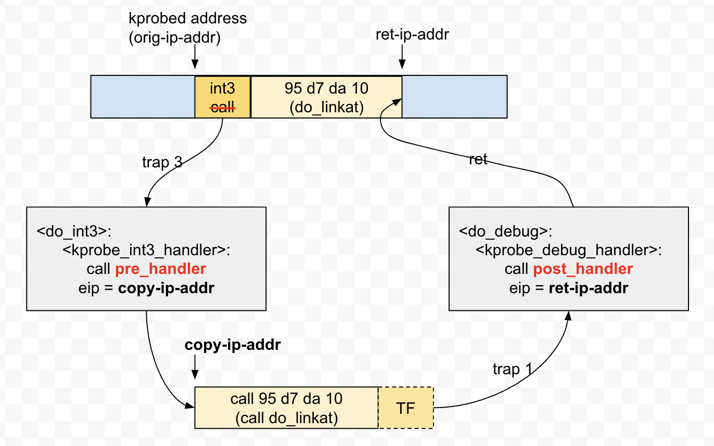
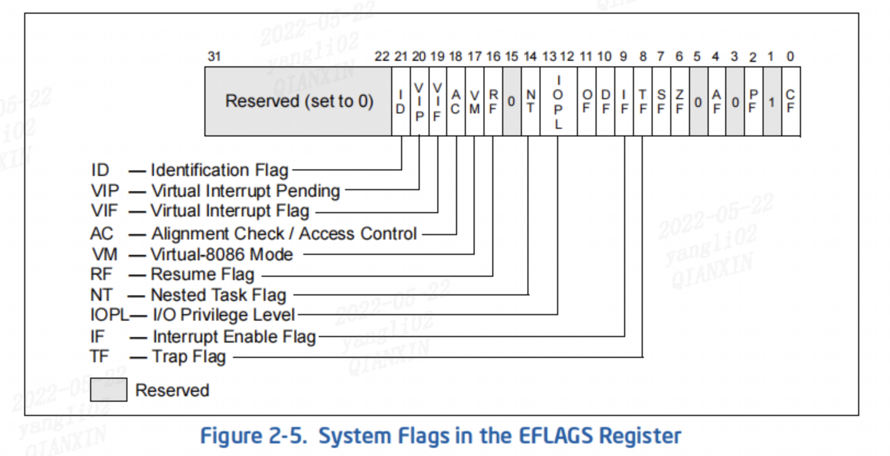
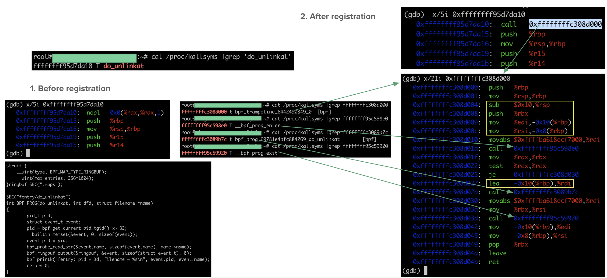
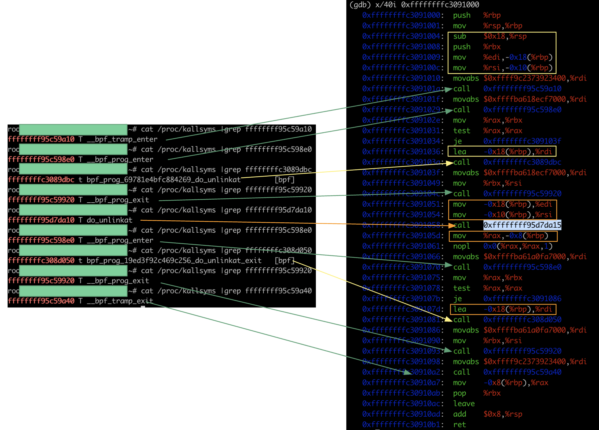

kprobe  的实现看了好多次，但是总是忘，这里做一些笔记。

## kprobe 实现

### 5.4 kernel 实现



上图是 5.4 kernel 的实现，在 5.15 kernel 中，实现已经变了。这里我们先介绍 5.4 的实现

比如我们这里用 kprobe trace 指令 call `do_unlinkat`（图里面写错了），首先 kernel 会把原有指令复制，再将原指令的第一个字节替换为 int 3 指令。当 kernel 运行到这一指令时，会触发 trap，于是执行到 `do_int3 ->  kprobe_int3_handler` 函数。

### kprobe 执行 的过程

```c
/*
 * Interrupts are disabled on entry as trap3 is an interrupt gate and they
 * remain disabled throughout this function.
 */
int kprobe_int3_handler(struct pt_regs *regs) {
	struct kprobe *p;
	struct kprobe_ctlblk *kcb;
  
  //...
  
	addr = (kprobe_opcode_t *)(regs->ip - sizeof(kprobe_opcode_t));
  // 拿到一个 percpu 的全局变量 kprobe control block
	kcb = get_kprobe_ctlblk();
  // 根据当前 kprobe 的 addr 找到 kprobe hook function
	p = get_kprobe(addr);
  
  if (p) {
    // 判断是否是重入 kprobe 的状态
		if (kprobe_running()) {
			if (reenter_kprobe(p, regs, kcb))
				return 1;
		} else {
      // 配置 kprobe 的状态
			set_current_kprobe(p, regs, kcb);
			kcb->kprobe_status = KPROBE_HIT_ACTIVE;

			/*
			 * If we have no pre-handler or it returned 0, we
			 * continue with normal processing.  If we have a
			 * pre-handler and it returned non-zero, that means
			 * user handler setup registers to exit to another
			 * instruction, we must skip the single stepping.
			 */
      // 执行 pre_handler，之后设置 single_step
			if (!p->pre_handler || !p->pre_handler(p, regs))
				setup_singlestep(p, regs, kcb, 0);
			else
				reset_current_kprobe();
			return 1;
		}
  } else {/*...*/}
  //...
}
```

在 `setup_singlestep` 中，会执行一系列相关操作，设置单步中断，设置 eip 到被 probe 替换的函数（上例为 `do_unlinkat`)。

```c
static void setup_singlestep(struct kprobe *p, struct pt_regs *regs,
			     struct kprobe_ctlblk *kcb, int reenter)
{
	if (setup_detour_execution(p, regs, reenter))
		return;

#if !defined(CONFIG_PREEMPTION)
  // ...
#endif
  // ...

  // 设置单步中断
	regs->flags |= X86_EFLAGS_TF;
	regs->flags &= ~X86_EFLAGS_IF;
  
  // 设置 ip 寄存器，跳转到目的函数 do_linkat
	/* single step inline if the instruction is an int3 */
	if (p->opcode == BREAKPOINT_INSTRUCTION)
		regs->ip = (unsigned long)p->addr;
	else
		regs->ip = (unsigned long)p->ainsn.insn;
}
NOKPROBE_SYMBOL(setup_singlestep);
```

较新的版本中，没有相关操作去设置单步中断的寄存器 FLAG [X86_EFLAGS_TF](https://elixir.bootlin.com/linux/v5.4/C/ident/X86_EFLAGS_TF);，大概是被优化掉了

> 与x86_64有关的EFLAGS 寄存器的flag位：
>
> （1）TF Trap (bit 8)：设置启用单步模式进行调试； 清除以禁用单步模式。 在单步模式下，处理器在每条指令后生成一个调试异常。 这允许在每条指令之后检查程序的执行状态。如果应用程序使用 POPF、POPFD 或 IRET 指令设置 TF 标志，则会在 POPF、POPFD 或 IRET 之后的指令之后生成调试异常。
>
> （2）IF Interrupt enable (bit 9)：控制处理器对可屏蔽硬件中断请求的响应，该标志设置为响应可屏蔽的硬件中断； 清除以禁止可屏蔽的硬件中断。 IF 标志不影响异常或不可屏蔽中断（NMI 中断）的生成。控制寄存器 CR4 中的 CPL、IOPL 和 VME 标志的状态决定了 IF 标志是否可以被 CLI、STI、POPF、POPFD 和 IRET 修改
>
> 原文链接：https://blog.csdn.net/weixin_45030965/article/details/125793813



在单步执行了被 trace 的函数 `do_unlinkat()` 之后，将触发单步中断，执行 `do_debug() -> kprobe_debug_handler()` 

```c
/*
 * Interrupts are disabled on entry as trap1 is an interrupt gate and they
 * remain disabled throughout this function.
 */
int kprobe_debug_handler(struct pt_regs *regs)
{
	struct kprobe *cur = kprobe_running();
	struct kprobe_ctlblk *kcb = get_kprobe_ctlblk();
 	
  //...
  // 继续 kprobe 的执行
	resume_execution(cur, regs, kcb);
	regs->flags |= kcb->kprobe_saved_flags;
  
  // 执行 post_handler
	if ((kcb->kprobe_status != KPROBE_REENTER) && cur->post_handler) {
		kcb->kprobe_status = KPROBE_HIT_SSDONE;
		cur->post_handler(cur, regs, 0);
	}
  
  // 恢复原有执行地址
	/* Restore back the original saved kprobes variables and continue. */
	if (kcb->kprobe_status == KPROBE_REENTER) {
    // 重入的情况
		restore_previous_kprobe(kcb);
		goto out;
	}
	reset_current_kprobe();
out:
  // ...
}
NOKPROBE_SYMBOL(kprobe_debug_handler);
```

### 5.15 kernel 实现

后面社区对于上文介绍 kprobe 的方案提出了两个优化方案 https://fuweid.com/post/2022-bpf-kprobe-fentry-poke/

之前的 kprobe 方案包括了 int3 以及单步调试两个中断，开销较大。

> 在上文提到的单步调试里，`do_debug/kprobe_debug_handler`调试中断处理需要通过 `resume_execution` [[6](https://elixir.bootlin.com/linux/v4.19/source/arch/x86/kernel/kprobes/core.c#L869)] 里面修正 CPU 的寄存器信息，这本质上和模拟没有区别。 

**int3 替代 single-step**

 `x86/kprobes: Use int3 instead of debug trap for single-step` 

[x86/kprobes: Use int3 instead of debug trap for single-step](https://lore.kernel.org/all/161460769556.430263.12936080446789384938.stgit@devnote2/)，它是通过离线模拟被观测指令来去除单步调试中断。这个方案通过在 INT3 中断处理中模拟指令的方式（如图所示，感谢 https://fuweid.com/post/2022-bpf-kprobe-fentry-poke/)，来移除了不必要的单步调试中断，这对性能有极大的提升。不过需要说明的是，该方案并非支持所有指令的模拟，kernel patch 中提到了它的局限。


```
- kprobes can not probe following instructions; int3, iret,
  far jmp/call which get absolute address as immediate,
  indirect far jmp/call, indirect near jmp/call with addressing
  by memory (register-based indirect jmp/call are OK), and
  vmcall/vmlaunch/vmresume/vmxoff.

- If the kprobe post_handler doesn't set before registering,
  it may not be called in some case even if you set it afterwards.
  (IOW, kprobe booster is enabled at registration, user can not
   change it)
```

在代码中，主要改动在 函数 `setup_singlestep` 中

```c
static void setup_singlestep(struct kprobe *p, struct pt_regs *regs,
			     struct kprobe_ctlblk *kcb, int reenter)
{
	if (setup_detour_execution(p, regs, reenter))
		return;
  // ...
  
  // 对于 emulate_op 存在的情况，在 int3 中进行指令模拟
	if (p->ainsn.emulate_op) {
		p->ainsn.emulate_op(p, regs);
    // 调用 post_handler
		kprobe_post_process(p, regs, kcb);
		return;
	}
  
  // 设置返回地址
	/* Disable interrupt, and set ip register on trampoline */
	regs->flags &= ~X86_EFLAGS_IF;
	regs->ip = (unsigned long)p->ainsn.insn;
}
```

**detour buffer**

09 年社区提出了 detour_bufffer 的方案，即上一段代码段中提到的 `setup_detour_execution()`。可以参考 https://fuweid.com/post/2022-bpf-kprobe-fentry-poke/ 中的介绍。

> 该方案的思路是通过 `Near JMP` 指令来模拟 `do_int3/kprobe_int3_handler` 中断处理。 该方案在各大发行版里目前默认开启，在当时的优化结果比单步调试快了近 10 倍。虽然它存在一定的局限性，但不妨碍我们了解它，这个方案和后面提到的 ftrace 设计理念一致。
>
> ...
>
> 总的来说，这个优化方案要求被观测指令不能涉及到异常处理、不能出现跳跃到被修改指令的中间位置以及被观测指令是可以脱离原上下文离线运行的。 有一定的局限性，但如果我们想要观测某一个函数入口时，我们还是可以使用上这个优化。

**ftrace/fexit**

Kprobe kpf progrm register 过程

> 首先 `bpf_tramp_image_alloc` [[19](https://elixir.bootlin.com/linux/v5.18/source/kernel/bpf/trampoline.c#L290)] 函数会申请一个页大小的指令内存空间，而这个指令内存空间的地址将有一个符号标记，符号的命名规则为 `bpf_trampoline_$key_$index`。 `key` 是通过 BTF ID 来生成，只要关联的函数固定，这个 `key` 值是固定的; 而 `index` 是一个自增的 ID，每一次调用 `bpf_tracing_prog_attach` 函数来关联 eBPF 程序时，它会都 `+1`。eBPF fentry 并没有 kprobe 那样的 `pre_handler` 聚合函数，每次关联观测程序都需要重新生成汇编指令，而重新生成的 `bpf_tramp_image` 将通过新的 `index` 来做区分。我们可以通过 `/proc/kallsyms` 来查看这个符号，当然也可以通过符号后的 `index` 来查看被观测函数的关联次数。
>
> fentry 会通过 `arch_prepare_bpf_trampoline` [[20](https://elixir.bootlin.com/linux/v5.18/source/arch/x86/net/bpf_jit_comp.c#L1981)] 函数在新申请的 `bpf_tramp_image` 上添加必要的指令：将 `do_unlinkat` 的函数参数压入栈，然后生成调用已关联的 eBPF 观测程序指令，当然中间还会记录 eBPF 程序调用的耗时，最后会调用 `RET` 来结束该过程。最后这个 `bpf_tramp_image` 跳板函数会替换掉 `do_unlinkat` 函数入口处 `NOP5` 的指令。替换过程和 kprobe jump 优化一样，同样是通过 `text_poke_bp` 三步更新模式来替换，最后这个 `NOP5` 会变成 `Near CALL <bpf_tramopline_$key_1>`。当然，如果再次添加一个新的 `fentry/do_unlinkat` 观测程序，那么该指令将从 `Near CALL <bpf_trampoline_$key_1>` 变成 `Near CALL <bpf_tramopline_$key_2>`。
>
> 对于 fexit 而言，`arch_prepare_bpf_trampoline` 生成的指令稍微复杂些，但也不难理解，其中唯一的区别在于， `do_unlinkat` 的调用是发生在 `bpf_trampoline_$key_$index` 函数体内，而 `bpf_trampoline_$key_$index` 函数返回后将直接返回到调用 `do_unlinkat` 的地方。在这里，就不再贴图说明啦，更多细节可以查看 arch_prepare_bpf_trampoline 函数体。

对应注册过程，https://fuweid.com/post/2022-bpf-kprobe-fentry-poke/ 中有幅图描述的非常细致。


以上我们可知，每个 bpf_program 对应有一个 `bpf_trampoline_$key_$index`符号，实际上在执行到被观测函数时，即会执行 near call 执行到  `bpf_trampoline_$key_$index`。在下图中，我们对比了  ftrace-based kprobe 方式的 register 前后对比

Fentry: 



可以看到实际上将 bpf_prog 前后加了些 prelogue 和 prologue，封装了起来，从而不需要 INT3 等操作。

fexit:




