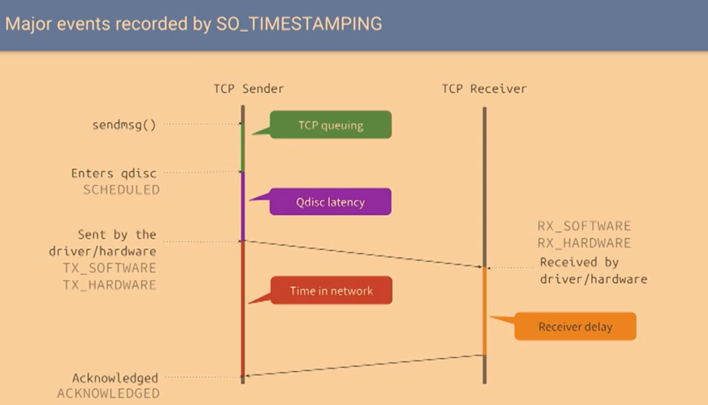

talk about tcp so timestamping

* https://www.youtube.com/watch?v=RjNEbTaqnX4

从现有状态信息并不能推断一些连接的状况，如果能准确记录每个 RPC 经历了什么，就很方便 debug 了。



我们现在记录了每个 TCP 连接的一些时延信息，如果我们与此同时，能够看到 TCP 的一些状态信息，那就很容易解释这些高时延了


之前在看 fathom 的实现，

* https://github.com/grpc/grpc/blob/fb72f1df08e4bbdad6eba93412135856ea45abe8/src/core/lib/event_engine/posix_engine/posix_endpoint.cc#L842
* https://git.kernel.org/pub/scm/linux/kernel/git/torvalds/linux.git/commit/?id=618896e6d00773d6d50e0b19f660af22fa26cd61
* tools/testing/selftests/net/txtimestamp.c 

发现其中用到了一些 kernel 里的 timestamp，这里做一些记录

tx 相关的 timestamp 如下，注释已经说明了其大概位置。

```c
/* Definitions for tx_flags in struct skb_shared_info */
enum {
	/* generate hardware time stamp */
	SKBTX_HW_TSTAMP = 1 << 0,

	/* generate software time stamp when queueing packet to NIC */
	SKBTX_SW_TSTAMP = 1 << 1,

	/* device driver is going to provide hardware time stamp */
	SKBTX_IN_PROGRESS = 1 << 2,

	/* generate hardware time stamp based on cycles if supported */
	SKBTX_HW_TSTAMP_USE_CYCLES = 1 << 3,

	/* generate wifi status information (where possible) */
	SKBTX_WIFI_STATUS = 1 << 4,

	/* determine hardware time stamp based on time or cycles */
	SKBTX_HW_TSTAMP_NETDEV = 1 << 5,

	/* generate software time stamp when entering packet scheduling */
	SKBTX_SCHED_TSTAMP = 1 << 6,
};
```

初版实现中，还使用了 `SKBTX_ACK_TSTAMP` ，后面替代为了 `txstamp_ack`。


## kernel selftests example

rxtimestamp:

```
~/proj/jammy/tools/testing/selftests/net (main ✗) sudo ./rxtimestamp.sh --tcp --ipv4
Testing tcp...
Starting testcase 0 over ipv4...
Sending sockopts {} expected cmsgs: {}
Starting testcase 1 over ipv4...
Sending sockopts { SO_TIMESTAMP } expected cmsgs: { SCM_TIMESTAMP }
Starting testcase 2 over ipv4...
Sending sockopts { SO_TIMESTAMPNS } expected cmsgs: { SCM_TIMESTAMPNS }
Starting testcase 3 over ipv4...
Sending sockopts { SO_TIMESTAMP  SO_TIMESTAMPNS } expected cmsgs: { SCM_TIMESTAMPNS }
Starting testcase 4 over ipv4...
Sending sockopts { SO_TIMESTAMPING: { SOF_TIMESTAMPING_RX_SOFTWARE |}} expected cmsgs: {}
Starting testcase 5 over ipv4...
Sending sockopts { SO_TIMESTAMPING: { SOF_TIMESTAMPING_RX_HARDWARE |}} expected cmsgs: {}
Starting testcase 6 over ipv4...
Sending sockopts { SO_TIMESTAMPING: { SOF_TIMESTAMPING_SOFTWARE |}} expected cmsgs: {}
Starting testcase 7 over ipv4...
Sending sockopts { SO_TIMESTAMPING: { SOF_TIMESTAMPING_RX_SOFTWARE | SOF_TIMESTAMPING_RX_HARDWARE |}} expected cmsgs: {}
Starting testcase 8 over ipv4...
Sending sockopts { SO_TIMESTAMPING: { SOF_TIMESTAMPING_SOFTWARE | SOF_TIMESTAMPING_RX_SOFTWARE |}} expected cmsgs: { SCM_TIMESTAMPING {0}}
Starting testcase 9 over ipv4...
Sending sockopts { SO_TIMESTAMP  SO_TIMESTAMPING: { SOF_TIMESTAMPING_SOFTWARE | SOF_TIMESTAMPING_RX_SOFTWARE |}} expected cmsgs: { SCM_TIMESTAMP  SCM_TIMESTAMPING {0}}
PASSED.
```

txtimestamp:

```
~/proj/jammy/tools/testing/selftests/net (main ✗) sudo ./txtimestamp.sh   
...
protocol:     TCP
payload:      10
server port:  9000

family:       INET 
test SND
    USR: 1734100309 s 6160 us (seq=0, len=0)
    SND: 1734100309 s 7194 us (seq=9, len=10)  (USR +1033 us)
    USR: 1734100309 s 56438 us (seq=0, len=0)
    SND: 1734100309 s 57464 us (seq=19, len=10)  (USR +1025 us)
    USR: 1734100309 s 106708 us (seq=0, len=0)
    SND: 1734100309 s 107752 us (seq=29, len=10)  (USR +1044 us)
    USR: 1734100309 s 157021 us (seq=0, len=0)
    SND: 1734100309 s 158090 us (seq=39, len=10)  (USR +1068 us)
    USR-SND: count=4, avg=1043 us, min=1025 us, max=1068 us
test ENQ
    USR: 1734100309 s 313645 us (seq=0, len=0)
    ENQ: 1734100309 s 313663 us (seq=9, len=10)  (USR +18 us)
    USR: 1734100309 s 363749 us (seq=0, len=0)
    ENQ: 1734100309 s 363759 us (seq=19, len=10)  (USR +10 us)
    USR: 1734100309 s 413864 us (seq=0, len=0)
    ENQ: 1734100309 s 413874 us (seq=29, len=10)  (USR +9 us)
    USR: 1734100309 s 464110 us (seq=0, len=0)
    ENQ: 1734100309 s 464139 us (seq=39, len=10)  (USR +28 us)
    USR-ENQ: count=4, avg=16 us, min=9 us, max=28 us
test ENQ + SND
    USR: 1734100309 s 620921 us (seq=0, len=0)
    ENQ: 1734100309 s 620939 us (seq=9, len=10)  (USR +17 us)
    SND: 1734100309 s 621949 us (seq=9, len=10)  (USR +1027 us)
    USR: 1734100309 s 671062 us (seq=0, len=0)
    ENQ: 1734100309 s 671074 us (seq=19, len=10)  (USR +11 us)
    SND: 1734100309 s 672104 us (seq=19, len=10)  (USR +1041 us)
    USR: 1734100309 s 721301 us (seq=0, len=0)
    ENQ: 1734100309 s 721332 us (seq=29, len=10)  (USR +30 us)
    SND: 1734100309 s 722374 us (seq=29, len=10)  (USR +1072 us)
    USR: 1734100309 s 771553 us (seq=0, len=0)
    ENQ: 1734100309 s 771583 us (seq=39, len=10)  (USR +30 us)
    SND: 1734100309 s 772631 us (seq=39, len=10)  (USR +1077 us)
    USR-ENQ: count=4, avg=22 us, min=11 us, max=30 us
    USR-SND: count=4, avg=1054 us, min=1027 us, max=1077 us

test ACK
    USR: 1734100309 s 928300 us (seq=0, len=0)
    ACK: 1734100309 s 934467 us (seq=9, len=10)  (USR +6166 us)
    USR: 1734100309 s 978464 us (seq=0, len=0)
    ACK: 1734100309 s 984621 us (seq=19, len=10)  (USR +6156 us)
    USR: 1734100310 s 28730 us (seq=0, len=0)
    ACK: 1734100310 s 34965 us (seq=29, len=10)  (USR +6234 us)
    USR: 1734100310 s 78852 us (seq=0, len=0)
    ACK: 1734100310 s 84963 us (seq=39, len=10)  (USR +6111 us)
    USR-ACK: count=4, avg=6167 us, min=6111 us, max=6234 us

test SND + ACK
    USR: 1734100310 s 235757 us (seq=0, len=0)
    SND: 1734100310 s 236808 us (seq=9, len=10)  (USR +1051 us)
    ACK: 1734100310 s 241896 us (seq=9, len=10)  (USR +6138 us)
    USR: 1734100310 s 286009 us (seq=0, len=0)
    SND: 1734100310 s 287068 us (seq=19, len=10)  (USR +1058 us)
    ACK: 1734100310 s 292255 us (seq=19, len=10)  (USR +6246 us)
    USR: 1734100310 s 336233 us (seq=0, len=0)
    SND: 1734100310 s 337288 us (seq=29, len=10)  (USR +1055 us)
    ACK: 1734100310 s 342446 us (seq=29, len=10)  (USR +6213 us)
    USR: 1734100310 s 386441 us (seq=0, len=0)
    SND: 1734100310 s 387473 us (seq=39, len=10)  (USR +1031 us)
    ACK: 1734100310 s 392533 us (seq=39, len=10)  (USR +6092 us)
    USR-SND: count=4, avg=1049 us, min=1031 us, max=1058 us
    USR-ACK: count=4, avg=6172 us, min=6092 us, max=6246 us

test ENQ + SND + ACK
    USR: 1734100310 s 543101 us (seq=0, len=0)
    ENQ: 1734100310 s 543122 us (seq=9, len=10)  (USR +21 us)
    SND: 1734100310 s 544132 us (seq=9, len=10)  (USR +1031 us)
    ACK: 1734100310 s 549251 us (seq=9, len=10)  (USR +6150 us)
    USR: 1734100310 s 593382 us (seq=0, len=0)
    ENQ: 1734100310 s 593406 us (seq=19, len=10)  (USR +23 us)
    SND: 1734100310 s 594418 us (seq=19, len=10)  (USR +1036 us)
    ACK: 1734100310 s 599480 us (seq=19, len=10)  (USR +6098 us)
    USR: 1734100310 s 643682 us (seq=0, len=0)
    ENQ: 1734100310 s 643712 us (seq=29, len=10)  (USR +29 us)
    SND: 1734100310 s 644746 us (seq=29, len=10)  (USR +1063 us)
    ACK: 1734100310 s 649831 us (seq=29, len=10)  (USR +6148 us)
    USR: 1734100310 s 693906 us (seq=0, len=0)
    ENQ: 1734100310 s 693925 us (seq=39, len=10)  (USR +18 us)
    SND: 1734100310 s 694959 us (seq=39, len=10)  (USR +1052 us)
    ACK: 1734100310 s 700043 us (seq=39, len=10)  (USR +6137 us)
    USR-ENQ: count=4, avg=23 us, min=18 us, max=29 us
    USR-SND: count=4, avg=1046 us, min=1031 us, max=1063 us
    USR-ACK: count=4, avg=6133 us, min=6098 us, max=6150 us
...
```

so_txtime.sh

```
~/proj/jammy/tools/testing/selftests/net (main ✗) sudo ./so_txtime.sh  

SO_TXTIME ipv4 clock monotonic
payload:a delay:73 expected:0 (us)

SO_TXTIME ipv6 clock monotonic
payload:a delay:154 expected:0 (us)

SO_TXTIME ipv6 clock monotonic
payload:a delay:10106 expected:10000 (us)

SO_TXTIME ipv4 clock monotonic
payload:a delay:10189 expected:10000 (us)
payload:b delay:20221 expected:20000 (us)

SO_TXTIME ipv6 clock monotonic
payload:b delay:20197 expected:20000 (us)
payload:a delay:20342 expected:20000 (us)

SO_TXTIME ipv4 clock tai
send: pkt a at -1734100212183ms dropped: invalid txtime
./so_txtime: recv: timeout: Resource temporarily unavailable

SO_TXTIME ipv6 clock tai
send: pkt a at 0ms dropped: invalid txtime
./so_txtime: recv: timeout: Resource temporarily unavailable

SO_TXTIME ipv6 clock tai
payload:a delay:9739 expected:10000 (us)

SO_TXTIME ipv4 clock tai
payload:a delay:9810 expected:10000 (us)
payload:b delay:19727 expected:20000 (us)

SO_TXTIME ipv6 clock tai
payload:b delay:9656 expected:10000 (us)
payload:a delay:19711 expected:20000 (us)
OK. All tests passed
```


