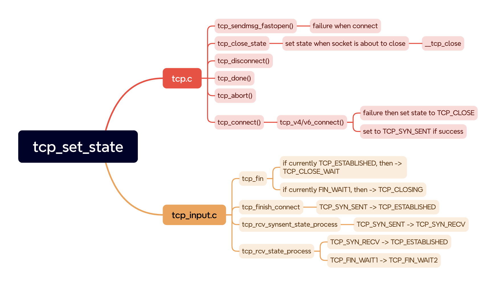
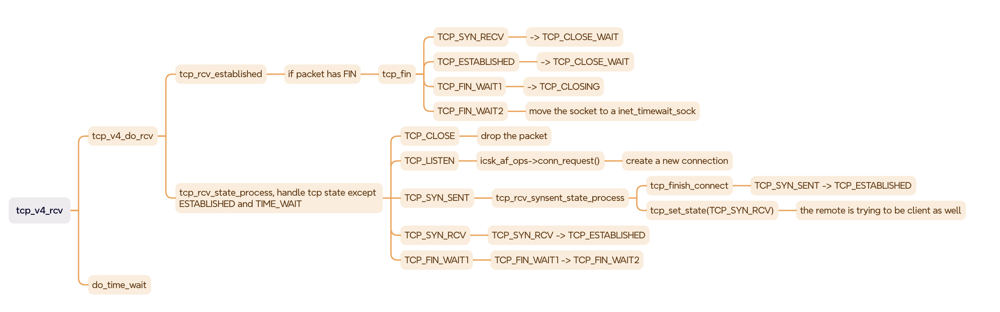

> Kernel version: 6.10


如 [docs.ebpf.io](https://docs.ebpf.io/linux/program-type/BPF_PROG_TYPE_SOCK_OPS/) 中所述，socket ops 是 attach 到 cgroup，在 socket 的 lifecycle 的特殊 event 里面被调用，从而改变 socket 的行为，做出一些特定的配置。

> Socket ops programs are attached to cGroups and get called for multiple lifecycle events of a socket, giving the program the opportunity to changes settings per connection or to record the existence of a socket.

在 [kernel source code]( https://elixir.bootlin.com/linux/v6.12.6/source/include/uapi/linux/bpf.h#L6910) 中，我们能看到现有的一些 socket ops Operator 类型。

```c
/* List of known BPF sock_ops operators.
 * New entries can only be added at the end
 */
enum {
	BPF_SOCK_OPS_VOID,
	BPF_SOCK_OPS_TIMEOUT_INIT,
	BPF_SOCK_OPS_RWND_INIT,
	BPF_SOCK_OPS_TCP_CONNECT_CB,
	BPF_SOCK_OPS_ACTIVE_ESTABLISHED_CB,
	BPF_SOCK_OPS_PASSIVE_ESTABLISHED_CB,
	BPF_SOCK_OPS_NEEDS_ECN,
	BPF_SOCK_OPS_BASE_RTT,
	BPF_SOCK_OPS_RTO_CB,
	BPF_SOCK_OPS_RETRANS_CB,
	BPF_SOCK_OPS_STATE_CB,
	BPF_SOCK_OPS_TCP_LISTEN_CB,
	BPF_SOCK_OPS_RTT_CB,
	BPF_SOCK_OPS_PARSE_HDR_OPT_CB,
	BPF_SOCK_OPS_HDR_OPT_LEN_CB,
	BPF_SOCK_OPS_WRITE_HDR_OPT_CB,
};
```

这篇文章中，我们逐个分析各个 operator 的调用过程，能够很好地帮助我们理解 socket 的一些重要行为。

### BPF_SOCK_OPS_TIMEOUT_INIT

自定义 socket 的 *SYN-RTO* 包的 timeout 时间，在几个点中有 hook。实现在 `tcp_timeout_init`中，配置 timeout 之后，server 端会调用 `af_ops->send_synack()` 发送 syn-ack 包，client 端会

* `tcp_fastopen_create_child`:  server 接收到 syn 包后创建连接时使用 fastopen 模式。

```
-> conn_request()
	-> tcp_v4_conn_request()
		-> tcp_conn_request()
			-> tcp_try_fast_open()
				-> tcp_fastopen_create_child()
        	-> tcp_timeout_init()
req->timeout = tcp_timeout_init((struct sock *)req);
```

* `tcp_conn_request`:  server 接收到 syn 包后，创建连接时使用非 fast open 模式。

```
-> conn_request()
	-> tcp_timeout_init()
req->timeout = tcp_timeout_init((struct sock *)req);
```

* `tcp_connect`：client 调用 connect 后，创建连接配置 syn 包 timeout

```
-> tcp_connect
	-> tcp_connect_init
		-> tcp_timeout_init
inet_csk(sk)->icsk_rto = tcp_timeout_init(sk);
```

* `tcp_retransmit_timer`: 重传设置 timer，当已经发了 syn 包，等待 synack 的时候，判断重传包是否 time out

```
-> tcp_retransmit_timer
	-> tcp_write_timeout
		-> retransmits_timed_out
			-> tcp_timeout_init(sk)

if ((1 << sk->sk_state) & (TCPF_SYN_SENT | TCPF_SYN_RECV))
  rto_base = tcp_timeout_init(sk);
timeout = tcp_model_timeout(sk, boundary, rto_base);
```


### BPF_SOCK_OPS_RWND_INIT

实现在 tcp_rwnd_init_bpf 函数中。在线上环境中，比如已经看到 rwnd 比较小，限制了性能等，我们可以动态调整这个值。（可能大 RTT 的时候，rwnd 小造成一些瓶颈）

```
-> tcp_connect
	-> tcp_connect_init
		-> tcp_rwnd_init_bpf
```

可以参考 [sample prog 1](https://elixir.bootlin.com/linux/v6.12.6/source/samples/bpf/tcp_rwnd_kern.c#L25) 和 [sample prog 2](https://elixir.bootlin.com/linux/v6.12.6/source/samples/bpf/tcp_bufs_kern.c#L26)


### BPF_SOCK_OPS_TCP_CONNECT_CB

在发 SYN 包之前，刚 initialize a new connection 的时候

```c
/* Build a SYN and send it off. */
int tcp_connect(struct sock *sk)
{
  // ...
	tcp_call_bpf(sk, BPF_SOCK_OPS_TCP_CONNECT_CB, 0, NULL);
```


### BPF_SOCK_OPS_ACTIVE_ESTABLISHED_CB

在 tcp connection 由 syn sent 进入 established 状态时，调用相关 bpf（由于是主动发起 connect 的一方，故称为 active established）

```c
void tcp_finish_connect(struct sock *sk, struct sk_buff *skb)
{
  // ...
  tcp_init_transfer(sk, BPF_SOCK_OPS_ACTIVE_ESTABLISHED_CB, skb);
  // ...
}
```

```
-> tcp_rcv_synsent_state_process()
	-> tcp_finish_connect()
```


### BPF_SOCK_OPS_PASSIVE_ESTABLISHED_CB

在 tcp connection 由 syn recv 进入 established 状态时，调用相关 bpf（由于是被动接受 connect 的一方，故称为 passive established）

```
-> tcp_rcv_state_process()
	-> tcp_init_transfer(sk, BPF_SOCK_OPS_PASSIVE_ESTABLISHED_CB, skb);
```

```c
void tcp_rcv_state_process(struct sock *sk, struct sk_buff *skb)
{
  // ...
  SKB_DR_SET(reason, NOT_SPECIFIED);
	switch (sk->sk_state) {
	case TCP_SYN_RECV:
		tp->delivered++; /* SYN-ACK delivery isn't tracked in tcp_ack */
		if (!tp->srtt_us)
			tcp_synack_rtt_meas(sk, req);
		if (req) {
			tcp_rcv_synrecv_state_fastopen(sk);
		} else {
			tcp_try_undo_spurious_syn(sk);
			tp->retrans_stamp = 0;
			tcp_init_transfer(sk, BPF_SOCK_OPS_PASSIVE_ESTABLISHED_CB,
					  skb);
  // ...
```


### BPF_SOCK_OPS_NEEDS_ECN

相关 sockops 的 operator 实现在

```c
static inline bool tcp_bpf_ca_needs_ecn(struct sock *sk)
{
	return (tcp_call_bpf(sk, BPF_SOCK_OPS_NEEDS_ECN, 0, NULL) == 1);
}
```

* `tcp_conn_request`: server 接收到 syn 包后，创建连接，是否 enable ecn

```
-> tcp_conn_request
	-> tcp_ecn_create_request
		-> tcp_bpf_ca_needs_ecn
```

* `tcp_v4_send_synack`:  server 接收到 syn 后，回 syn-ack 包

```
-> conn_request()
	-> send_synack()
    -> tcp_v4_send_synack
      -> tcp_bpf_ca_needs_ecn
```

* `tcp_connect`: client 发起连接的时候，控制是否 enable ECN

```
-> tcp_connect
	-> tcp_ecn_send_syn
		-> tcp_bpf_ca_needs_ecn
```

* `tcp_rcv_state_process/tcp_rcv_synsent_state_process`: 收到一个重复的 syn 包后，回 synack 时需要考虑是否 enable ecn

```
-> tcp_rcv_state_process
	-> tcp_rcv_synsent_state_process
		-> tcp_send_synack
			-> tcp_ecn_send_synack
```


### BPF_SOCK_OPS_BASE_RTT

只有 TCP new vegas(TCP NV) 会使用这种 sockops bpf 程序。TCP NV 比较推荐用在数据中心内部的连接。通过 bpf，我们可以有一些关于数据中心内部 RTT 的先验估计。从而使得对 BDP 的估计更加准确。

关于 TCP new vegas，可以参考 [TCP-NV: An Update to TCP-Vegas](https://docs.google.com/document/d/1o-53jbO_xH-m9g2YCgjaf5bK8vePjWP6Mk0rYiRLK-U/edit?pli=1&tab=t.0#heading=h.8iwzuesrrwvo)


### BPF_SOCK_OPS_RTO_CB

Called when an RTO has triggered，timeout 发生就会调用相关的 bpf 程序

```
-> tcp_retransmit_timer
	-> tcp_write_timeout
```

```c
static int tcp_write_timeout(struct sock *sk)
{
  // ...
  if (BPF_SOCK_OPS_TEST_FLAG(tp, BPF_SOCK_OPS_RTO_CB_FLAG))
		tcp_call_bpf_3arg(sk, BPF_SOCK_OPS_RTO_CB,
				  icsk->icsk_retransmits,
				  icsk->icsk_rto, (int)expired);
```


### BPF_SOCK_OPS_RETRANS_CB

```
-> tcp_rcv_state_process
-> tcp_rcv_synsent_state_process
-> tcp_rcv_established
  -> tcp_ack
    -> tcp_xmit_recovery
      -> tcp_xmit_retransmit_queue
      -> tcp_retransmit_skb
      -> __tcp_retransmit_skb

-> tcp_rack_reo_timeout
	-> tcp_retransmit_skb

-> tcp_tsq_handler
  -> tcp_tsq_write
    -> tcp_xmit_retransmit_queue
```

重传的几种情况

* `tcp_rack_reo_timeout`: RACK 算法的逻辑。

> We have waited long enough to accommodate reordering. Mark the expired packets lost and retransmit them.

* `tcp_tsq_write`:  sch_fq 和 tsq 因为重传包，会导致问题。这个处理在 tsq 的 tasklet 里面。

> tcp: implement TSQ for retransmits
>
> We saw sch_fq drops caused by the per flow limit of 100 packets and TCP
> when dealing with large cwnd and bursts of retransmits.
>
> Even after increasing the limit to 1000, and even after commit
> 10d3be569243 ("tcp-tso: do not split TSO packets at retransmit time"),
> we can still have these drops.
>
> Under certain conditions, TCP can spend a considerable amount of
> time queuing thousands of skbs in a single tcp_xmit_retransmit_queue()
> invocation, incurring latency spikes and stalls of other softirq
> handlers.
>
> This patch implements TSQ for retransmits, limiting number of packets
> and giving more chance for scheduling packets in both ways.
>
> Signed-off-by: Eric Dumazet <edumazet@google.com>
> Signed-off-by: Yuchung Cheng <ycheng@google.com>
> Signed-off-by: Neal Cardwell <ncardwell@google.com>
> Signed-off-by: David S. Miller <davem@davemloft.net>

* `tcp_xmit_recovery`: 丢包导致的重传， 当 TCP connection 处于 CA_LOSS，或者处于 recovery state 的状态。

   https://elixir.bootlin.com/linux/v6.12.6/source/net/ipv4/tcp_input.c#L3060

* `tcp_non_congestion_loss_retransmit`: 代码中有详细的注释，当出现比如 MTU 变化或者其他原因等，推测不是 congestion 发生时，也需要重传，这种时候不需要减少 cwnd。

```
/* Sometimes we deduce that packets have been dropped due to reasons other than
 * congestion, like path MTU reductions or failed client TFO attempts. In these
 * cases we call this function to retransmit as many packets as cwnd allows,
 * without reducing cwnd. Given that retransmits will set retrans_stamp to a
 * non-zero value (and may do so in a later calling context due to TSQ), we
 * also enter CA_Loss so that we track when all retransmitted packets are ACKed
 * and clear retrans_stamp when that happens (to ensure later recurring RTOs
 * are using the correct retrans_stamp and don't declare ETIMEDOUT
 * prematurely).
 */
 static void tcp_non_congestion_loss_retransmit(struct sock *sk)
```


### BPF_SOCK_OPS_STATE_CB

operator 在 `tcp_set_state()` 中调用

```c
void tcp_set_state(struct sock *sk, int state)
{
  // ...
	if (BPF_SOCK_OPS_TEST_FLAG(tcp_sk(sk), BPF_SOCK_OPS_STATE_CB_FLAG))
		tcp_call_bpf_2arg(sk, BPF_SOCK_OPS_STATE_CB, oldstate, state);
  // ...
```

调用链在下图中简要画了出来，可以看到 `tcp.c` 中是一些主动 syscall，或者说一些 protocol 的方法调用，导致 tcp socket 的状态变化。而 tcp_input.c 里面是一些收包后引起的状态变化。



下图中，我们可以看到收包过程的状态变化的调用链



可以结合 TCP 状态变化图一起看


### BPF_SOCK_OPS_TCP_LISTEN_CB

user 调用 listen() syscall 的时候会调用到 `__inet_listen_sk`，从而调用到这个 sockops 类型。


### BPF_SOCK_OPS_RTT_CB

当收到 ack 包时，可以计算出相应的 packet 的 rtt。

```
-> tcp_ack
  -> tcp_clean_rtx_queue
    -> tcp_ack_update_rtt
      -> tcp_rtt_estimator
        -> tcp_bpf_rtt
```

```c
static inline void tcp_bpf_rtt(struct sock *sk, long mrtt, u32 srtt)
{
	if (BPF_SOCK_OPS_TEST_FLAG(tcp_sk(sk), BPF_SOCK_OPS_RTT_CB_FLAG))
		tcp_call_bpf_2arg(sk, BPF_SOCK_OPS_RTT_CB, mrtt, srtt);
}
```

tcp_rtt_estimator 这个函数很有意思。可以参考 dog250 大佬的分析和另外一篇博客，讲的很好

1. https://zhuanlan.zhihu.com/p/12285984501
2. https://zhuanlan.zhihu.com/p/11992081640
3. https://www.pagefault.info/2012/08/01/rto-calculation-in-tcp-and-implementation-under-linux.html

另外提一句，每个 TCP packet 采样可以参考

 https://blog.csdn.net/sinat_20184565/article/details/105000868

是通过 计算 `tcp_mstamp` 和 `skb_mstamp_ns` 的差值得到。

```c
// in tcp_clean_rtx_queue()
last_ackt = tcp_skb_timestamp_us(skb); // 取 skb->skb_mstamp_ns 的值

ca_rtt_us = tcp_stamp_us_delta(tp->tcp_mstamp, last_ackt);
```

```c
struct tcp_sock {
	// ...
	u64	tcp_mstamp;	/* most recent packet received/sent */
	// ...
}

/**
 *	struct sk_buff - socket buffer
 * ....
 *	@skb_mstamp_ns: (aka @tstamp) earliest departure time; start point
 *		for retransmit timer
**/
```


### BPF_SOCK_OPS_PARSE_HDR_OPT_CB

### BPF_SOCK_OPS_HDR_OPT_LEN_CB

### BPF_SOCK_OPS_WRITE_HDR_OPT_CB

能够自定义修改、读取 tcp option。可以创造很多 use case :

1. 方便实验一些自定义的 tcp option。比如为了改善 nagle+delayed ack 导致的问题(譬如 [example blog about nagle+delayed ack](https://blog.monsterxx03.com/2018/12/29/%E4%BB%8E%E5%8E%BB%E5%B9%B4%E7%9A%84%E4%B8%80%E4%B8%AApatch%E8%AF%B4%E8%B5%B7/))

> For example, we want to test the idea in putting maximum delay
> ACK in TCP header option which is similar to a draft RFC proposal [[1]](https://datatracker.ietf.org/doc/html/draft-wang-tcpm-low-latency-opt-00)

2. 或者想要只对 internal traffic（bpf prog 中做一些自定义 IP 匹配的逻辑）  来 enable 一些 tcp option。
3. 比如可以根据特定 option identify 一个 tcp 连接？我瞎想的，有些风险。

example: https://elixir.bootlin.com/linux/v6.12.6/source/tools/testing/selftests/bpf/progs/test_misc_tcp_hdr_options.c#L301

可以参考下 patch [patch link](https://lore.kernel.org/bpf/20200820190104.2885895-1-kafai@fb.com/) ，但我感觉使用起来有些麻烦，得 enable/disable sock_ops 的一些 cb_flags，然后还得区别 syn 包和非 syn 包的情况。


### 关于 tcp_call_bpf

以上 kernel 中关于 sockops 的埋点都会最终调用到 `tcp_call_bpf()`，它会把相关 information 包装成一个 `bpf_sock_ops_kern` 的结构体，进而调用 bpf。

```c
/* Call BPF_SOCK_OPS program that returns an int. If the return value
 * is < 0, then the BPF op failed (for example if the loaded BPF
 * program does not support the chosen operation or there is no BPF
 * program loaded).
 */
#ifdef CONFIG_BPF
static inline int tcp_call_bpf(struct sock *sk, int op, u32 nargs, u32 *args)
{
	struct bpf_sock_ops_kern sock_ops;
	int ret;

	memset(&sock_ops, 0, offsetof(struct bpf_sock_ops_kern, temp));
	if (sk_fullsock(sk)) {
		sock_ops.is_fullsock = 1;
		sock_owned_by_me(sk);
	}

	sock_ops.sk = sk;
	sock_ops.op = op;
	if (nargs > 0)
		memcpy(sock_ops.args, args, nargs * sizeof(*args));

	ret = BPF_CGROUP_RUN_PROG_SOCK_OPS(&sock_ops);
	if (ret == 0)
		ret = sock_ops.reply;
	else
		ret = -1;
	return ret;
}
```

