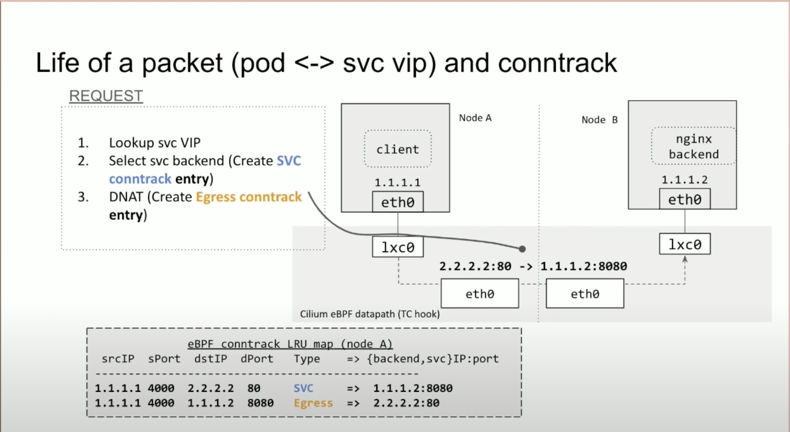
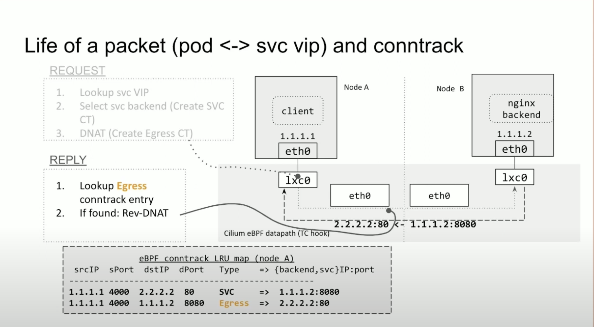

之前在线上遇到 bpf conntrack 的问题，这里我们解析下它的实现与 bpf lru map。

# 1. cilium conntrack 介绍

可以看一下 cilium maintainer 在 LPC 上的 talk [Rethinking BPF conntrack (Aditi Ghag)](https://www.youtube.com/watch?v=OrVn9VocdnA)，将实现细节，和存在的问题都展开说的比较明朗。这里摘取一些关于 conntrack 的介绍。

## 1.1 介绍

我们从一个从 pod <-> svc vip 的 reqeuest/response 场景来看 cilium conntrack 是如何运作的。

对 request path 来说



对于 reply path 来说



## 1.3 connection 的 lifecycle management

cilium 在 bpf lru map 中管理 connection entry。

1. 当 connection entry 被创建的时候，它会被赋予一个 default timeout，当有 flow packet 时会 refresh timeout
2. Default timeout 是比较长的，需要配合一些 long-lived connection
3. GC： userspace 会定期异步地清理过期的 connection entry


## 1.2 存在的问题

1. 复杂的带外(out-of-band) conntrack entry 回收机制
   1. 不能太频繁消耗过多 cpu
   2. 也不能让 lru map 里面存在很多 expired entries（可能会导致性能差，资源利用率不好），需要平衡两者。
2. 新连接建立时，有些应用使用同一个 source port。conntrack entry expire 了但没来得及被 GC，被重复利用，会导致总是选择 svc 的同一个 backend。
3. 流量大的时候有 Bpf lru map failure。

talk 中提到他们考虑会使用 socket storage，结合 socket state 来做 load balancing，但是 socket storage 也有一些挑战，可以具体看 talk。后面讨论环节，关于 sk_storage 的东西也是挺有意思的，总之  Aditi Ghag 的关键诉求在于，需要加速 gc 的 removal 过程，在 socket 被 free 的时候，把相关 conntrack free 掉，而不是依靠 timeout。


## bpf lru map

具体的实现过程在下图中描述的比较详细了，参考 https://docs.kernel.org/bpf/map_hash.html#bpf-map-type-lru-hash-and-variants


# 3. issue about BPF LRU map & cilium conntrack 

当 cilium conntrack table 满的时候，我们关于 bpf cpu 的监控指标会暴涨，达到 50 个核，这个节点接近卡死。我们也采取了一些方法来避免 conntrack table 变满，但是如上文所说，conntrack 的 gc 在用户态，如果用户态的 conntrack table 的 gc 因为某些原因（比如 cilium-agent 挂了）无法执行或延后了，那么 conntrack 表还是会变满。

how to reproduce: 用很多 client，起很多并发短连接，把 cilium conntrack 填满即可触发。

base kernel: ubuntu22, 5.15.0-26。

通过 perf 发现很多 cpu 花费在 bpf lru map 的 pop 操作

```
wrk:worker_33 47181 1831047.757047:     609938 cycles: 
	ffffffffa4f2e9b4 native_queued_spin_lock_slowpath+0x1d4 ([kernel.kallsyms])
	ffffffffa5af6eee _raw_spin_lock+0x1e ([kernel.kallsyms])
	ffffffffa5054417 bpf_lru_pop_free+0x1b7 ([kernel.kallsyms])
	ffffffffa504e7e7 prealloc_lru_pop+0x27 ([kernel.kallsyms])
	ffffffffa50508bc htab_lru_map_update_elem+0x18c ([kernel.kallsyms])
	ffffffffa5049262 bpf_map_update_elem+0x12 ([kernel.kallsyms])
	ffffffffc1745d56 bpf_prog_f4435f2b40df09b2_tail_handle_ipv4_cont+0xb6a (bpf_prog_f4435f2b40df09b2_tail_handle_ipv4_cont)
	ffffffffc13d07ff cls_bpf_classify+0x2df ([kernel.kallsyms])
	ffffffffa58beaca tcf_classify+0x7a ([kernel.kallsyms])
	ffffffffa584ca91 __netif_receive_skb_core+0x431 ([kernel.kallsyms])
	ffffffffa584d5ef __netif_receive_skb_one_core+0x3f ([kernel.kallsyms])
	ffffffffa584d695 __netif_receive_skb+0x15 ([kernel.kallsyms])
	ffffffffa584d8c9 process_backlog+0xa9 ([kernel.kallsyms])
	ffffffffa584ef80 __napi_poll+0x30 ([kernel.kallsyms])
	ffffffffa584f33c net_rx_action+0x11c ([kernel.kallsyms])
	ffffffffa5e000da __softirqentry_text_start+0xda ([kernel.kallsyms])
	ffffffffa4ebcc89 irq_exit_rcu+0x79 ([kernel.kallsyms])

```

上面栈告诉我们卡在了自旋锁，出现了锁争用的情况，结合代码分析，是保护 global lru list 的锁。

进一步分析 perf 栈，发现很多卡在了 `__bpf_lru_list_shrink` 的过程。

```
wrk:worker_33 47181 1831047.754442:     644543 cycles: 
	ffffffffa5af6f57 _raw_spin_lock_irqsave+0x27 ([kernel.kallsyms])
	ffffffffa504e6fc htab_lru_map_delete_node+0x6c ([kernel.kallsyms])
	ffffffffa50541e4 __bpf_lru_list_shrink+0xe4 ([kernel.kallsyms])
	ffffffffa50544e5 bpf_lru_pop_free+0x285 ([kernel.kallsyms])
	ffffffffa504e7e7 prealloc_lru_pop+0x27 ([kernel.kallsyms])
	ffffffffa50508bc htab_lru_map_update_elem+0x18c ([kernel.kallsyms])
	ffffffffa5049262 bpf_map_update_elem+0x12 ([kernel.kallsyms])
	ffffffffc1745d56 bpf_prog_f4435f2b40df09b2_tail_handle_ipv4_cont+0xb6a (bpf_prog_f4435f2b40df09b2_tail_handle_ipv4_cont)
	ffffffffc13d07ff cls_bpf_classify+0x2df ([kernel.kallsyms])
	ffffffffa58beaca tcf_classify+0x7a ([kernel.kallsyms])
	ffffffffa584ca91 __netif_receive_skb_core+0x431 ([kernel.kallsyms])
	ffffffffa584d5ef __netif_receive_skb_one_core+0x3f ([kernel.kallsyms])
	ffffffffa584d695 __netif_receive_skb+0x15 ([kernel.kallsyms])
	ffffffffa584d8c9 process_backlog+0xa9 ([kernel.kallsyms])
	ffffffffa584ef80 __napi_poll+0x30 ([kernel.kallsyms])
	ffffffffa584f33c net_rx_action+0x11c ([kernel.kallsyms])
	ffffffffa5e000da __softirqentry_text_start+0xda ([kernel.kallsyms])
	ffffffffa4ebcc89 irq_exit_rcu+0x79 ([kernel.kallsyms])

```

利用 addr2line 定位到具体是哪一行

```bash
ffffffffa50541e4 __bpf_lru_list_shrink+0xe4 ([kernel.kallsyms])
:~# addr2line -f -e vmlinux 0xFFFFFFFF812541E4
__bpf_lru_list_shrink
/mnt/src/jammy/kernel/bpf/bpf_lru_list.c:279
__bpf_lru_list_shrink -> lru->del_from_htab() force shrink by ignoring the reference bit.
```

从 perf 的结果来看 159680/159725 是在 htab_lru_map_update_elem 的 bpf_lru_pop_free 函数中，都在等待 lru 的 global spin lock，其他都是在 `__bpf_lru_list_shrink` 中从 lru global inactive list 里面尝试 shrink lru-node，具体在 force shrink 的步骤中，通过 ignore reference bit 来执行。

所以首先怀疑

1. lru global inactive list 是空的
2. 可能几乎没有 lru node 的 reference bit 是 0。

后面我们用 bpftrace hook 了 `__bpf_lru_node_move` 函数，发现 active 和 inactive 的成员数量差不多，说明猜想一错误。

```bash
__bpf_lru_node_move to type(BPF_LRU_LIST_T_INACTIVE) on cpu 25. node->ref(0). active_count(1249960). inactive_count(1249961)
__bpf_lru_node_move to type(BPF_LRU_LIST_T_ACTIVE) on cpu 56. node->ref(1). active_count(1249959). inactive_count(1249962)
```

我们再 trace 了 `__bpf_lru_list_shrink`，发现 lru node 的 reference count 都是 0，不是 1。这说明之前的猜想都是错误的。事实是 lru inactive list 里面有很多 lru node 无法被删除，而且他们的引用计数是 0.

我们对于发生问题的场景，再 hook 了 htab_lru_map_delete_node 函数，打印其返回值，发现它大部分时候 ret false，有可能是

* htab_lock_bucket fail，但也 bucket level 也不会一直 fail。
* inactive list 里面的尾部的一些 Lru-node 不在 hash table 里面（说明发生内存泄漏）

```c

/* It is called from the bpf_lru_list when the LRU needs to delete
 * older elements from the htab.
 */
static bool htab_lru_map_delete_node(void *arg, struct bpf_lru_node *node)
{
	struct bpf_htab *htab = (struct bpf_htab *)arg;
	struct htab_elem *l = NULL, *tgt_l;
	struct hlist_nulls_head *head;
	struct hlist_nulls_node *n;
	unsigned long flags;
	struct bucket *b;
	int ret;

	tgt_l = container_of(node, struct htab_elem, lru_node);
	b = __select_bucket(htab, tgt_l->hash);
	head = &b->head;
  
  // 1. lock failed
	ret = htab_lock_bucket(htab, b, tgt_l->hash, &flags);
	if (ret)
		return false;

	hlist_nulls_for_each_entry_rcu(l, n, head, hash_node)
		if (l == tgt_l) {
			hlist_nulls_del_rcu(&l->hash_node);
			check_and_free_timer(htab, l);
			break;
		}

	htab_unlock_bucket(htab, b, tgt_l->hash, flags);
  
  // 在 inactive list 里面无法找到 lru node
	return l == tgt_l;
}

```

所以大概是发生了 mem leak，inactive list 里面无法找到 lru node，有两种可能

* 忘记 insert 到 hashbucket。
* 删除的时候，只从 hash 里面删除，但没从 lru list 里面删除。

然后就找到相关 patch 了，发现是第一种情况，https://lore.kernel.org/all/20230522154558.2166815-1-aspsk@isovalent.com/
