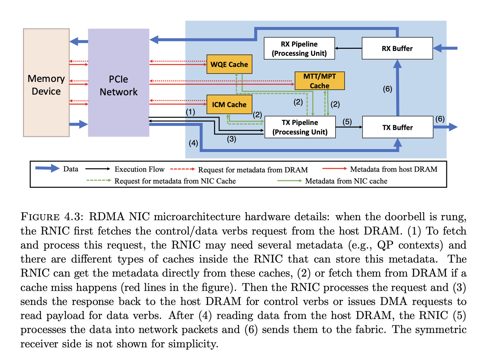
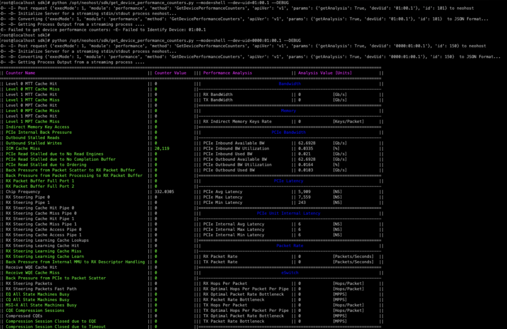

这篇介绍一些常用的 rdma 相关的诊断工具

## 1. tcpdump

**编译**

```bash
wget https://www.tcpdump.org/release/tcpdump-4.99.5.tar.xz
wget https://www.tcpdump.org/release/libpcap-1.10.5.tar.xz 
tar -xvf libpcap-1.10.5.tar.xz
tar -xvf tcpdump-4.99.5.tar.xz
apt-get install libibverbs-dev
# ensure this library is installed, otherwise rdma support is not enabled in compile phase
cd libpcap-1.10.5 && ./configure && make
cd ../tcpdump-4.99.5 && ./configure && make
```

另外，关于 rdma 的抓包实现，可以参考 [代码段](https://github.com/the-tcpdump-group/libpcap/blob/master/pcap-rdmasniff.c#L203) ，大概流程是：

1. 建一个 QP， 类型为 `IBV_QPT_RAW_PACKET`，表示可以抓到 raw packet（可以保留 ethernet header 信息， RoCE header 信息等）
2. 建一个 flow steering rule，类型为 `IBV_FLOW_ATTR_SNIFFER`，用来接收所有 port 的 traffic
3. 之后一直对这个 QP 执行 post_recv，poll cq 收到数据后，对收到的包执行 pcap filter 相关逻辑

**使用**

```bash
root@testpod1:~# rdma link
link mlx5_0/1 state ACTIVE physical_state LINK_UP
link mlx5_1/1 state DOWN physical_state DISABLED
link mlx5_2/1 state DOWN physical_state DISABLED
link mlx5_3/1 state DOWN physical_state DISABLED
link mlx5_4/1 state ACTIVE physical_state LINK_UP netdev net1
root@testpod1:~/tcpdump-4.99.5# ./tcpdump -i mlx5_4 -nnvv
tcpdump: listening on mlx5_4, link-type EN10MB (Ethernet), snapshot length 10000 bytes
```


## 2. PCM 

https://github.com/intel/pcm

可以帮助我们看到 PCIe 的带宽

### pcm-pcie

```
root@tess-node-hx4bg-tess19:/# pcm-pcie 

 Intel(r) Performance Counter Monitor: PCIe Bandwidth Monitoring Utility 
 This utility measures PCIe bandwidth in real-time

 PCIe event definitions (each event counts as a transfer): 
   PCIe read events (PCI devices reading from memory - application writes to disk/network/PCIe device):
     PCIePRd   - PCIe UC read transfer (partial cache line)
     PCIeRdCur* - PCIe read current transfer (full cache line)
         On Haswell Server PCIeRdCur counts both full/partial cache lines
     RFO*      - Demand Data RFO
     CRd*      - Demand Code Read
     DRd       - Demand Data Read
     PCIeNSWr  - PCIe Non-snoop write transfer (partial cache line)
   PCIe write events (PCI devices writing to memory - application reads from disk/network/PCIe device):
     PCIeWiLF  - PCIe Write transfer (non-allocating) (full cache line)
     PCIeItoM  - PCIe Write transfer (allocating) (full cache line)
     PCIeNSWr  - PCIe Non-snoop write transfer (partial cache line)
     PCIeNSWrF - PCIe Non-snoop write transfer (full cache line)
     ItoM      - PCIe write full cache line
     RFO       - PCIe partial Write
   CPU MMIO events (CPU reading/writing to PCIe devices):
     UCRdF     - read from uncacheable memory, including MMIO
     WCiL      - streaming store (partial cache line), includes MOVDIRI

     WCiLF     - streaming store (full cache line), includes MOVDIR64

     PRd       - MMIO Read [Haswell Server only] (Partial Cache Line)
     WiL       - MMIO Write (Full/Partial)

 * - NOTE: Depending on the configuration of your BIOS, this tool may report '0' if the message

Detected Intel(R) Xeon(R) Platinum 8352M CPU @ 2.30GHz "Intel(r) microarchitecture codename Icelake-SP" stepping 6
Skt |  PCIRdCur  |  ItoM  |  ItoMCacheNear  |  UCRdF  |  WiL  
 0      513 K     2578          4002             0     4848   
 1     2716          0           136             0     1024   
--------------------------------------------------------------
 *      515 K     2578          4138             0     5872   

Skt |  PCIRdCur  |  ItoM  |  ItoMCacheNear  |  UCRdF  |  WiL  
 0      510 K     1756          5702             0     5834   
 1     3110          0             4             0     1192   
--------------------------------------------------------------
 *      513 K     1756          5706             0     7026   
```

adding `-B`

``` 
Detected Intel(R) Xeon(R) Platinum 8352M CPU @ 2.30GHz "Intel(r) microarchitecture codename Icelake-SP" stepping 6
Skt |  PCIRdCur  |  ItoM  |  ItoMCacheNear  |  UCRdF  |  WiL  |  PCIe Rd (B)  |  PCIe Wr (B)  
 0      538 K       45 K        6940             0     6624          34 M          3332 K     
 1     3362          0             8             0     1006         215 K           512       
----------------------------------------------------------------------------------------------
 *      541 K       45 K        6948             0     7630          34 M          3332 K     

Skt |  PCIRdCur  |  ItoM  |  ItoMCacheNear  |  UCRdF  |  WiL  |  PCIe Rd (B)  |  PCIe Wr (B)  
 0      518 K       35 K          10 K           0       10 K        33 M          2960 K     
 1     3102          0             0             0     1090         198 K             0       
----------------------------------------------------------------------------------------------
 *      521 K       35 K          10 K           0       11 K        33 M          2960 K     
```

able to see the PCIe Wr/Rd total bandwidth

### pcm-iio

```
 _____________________________ ________ _______ _______ ________ ____________ __________ ______________ ______________ ____________ ____________ ____________ ________________ 
|IIO Stack 4 - PCIe3          |IB write|IB read|OB read|OB write|IOTLB Lookup|IOTLB Miss|Ctxt Cache Hit|512G Cache Hit|1G Cache Hit|2M Cache Hit|4K Cache Hit|IOMMU Mem Access|
|_____________________________|________|_______|_______|________|____________|__________|______________|______________|____________|____________|____________|________________|
| Part0 (1st x16/x8/x4)       | 192 K  |  34 M |   0   |  12 K  |   0        |   0      |   0          |   0          |   0        |   0        |   0        | 360            |
| Part1 (2nd x4)              |   0    |   0   |   0   |   0    |
| Part2 (2nd x8/3rd x4)       |   0    |   0   |   0   |   0    |
| Part3 (4th x4)              |   0    |   0   |   0   |   0    |
| Part4 (1st x16/x8/x4)       |   0    |   0   |   0   |   0    |
| Part5 (2nd x4)              |   0    |   0   |   0   |   0    |
| Part6 (2nd x8/3rd x4)       |   0    |   0   |   0   |   0    |
| Part7 (4th x4)              |   0    |   0   |   0   |   0    |
|_____________________________|________|_______|_______|________|____________|__________|______________|______________|____________|____________|____________|________________|
    |0000:65:00.0|Gen3 x8 |14E4:16D7 Broadcom Inc. and subsidiaries BCM57414 NetXtreme-E 10Gb/25Gb RDMA Ethernet Controller
    |0000:65:00.1|Gen3 x8 |14E4:16D7 Broadcom Inc. and subsidiaries BCM57414 NetXtreme-E 10Gb/25Gb RDMA Ethernet Controller
```


## 3. Neo host

需要讲下， 对于 ICM， MTT，MPT 这些结构，可以参考下图，ICM 存储 QP cache 在 RNIC 对信息， MTT/MPT 则存储 QP reg mr 时的地址转换表的 cache，WQE cache 则存储 WQE 的 cache。



运行，编译部署等可以参考

https://blog.csdn.net/essencelite/article/details/147166790



## 4.  doca flow tune

neo-host 本来是 MLNX_OFED 里面的，后面都移到 doca-host 里面的，doca-host 里面有类似的功能。

https://docs.nvidia.com/doca/sdk/doca+flow+tune+tool/index.html#src-3453016388_id-.DOCAFlowTuneToolv2.9.1-MonitorModeOverview


