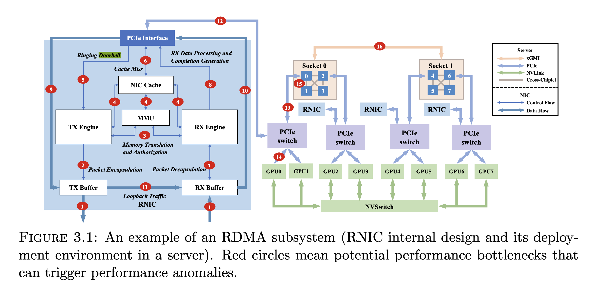
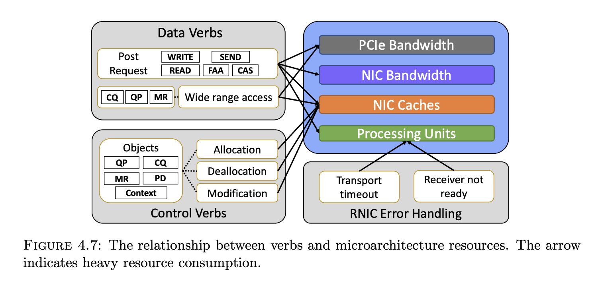
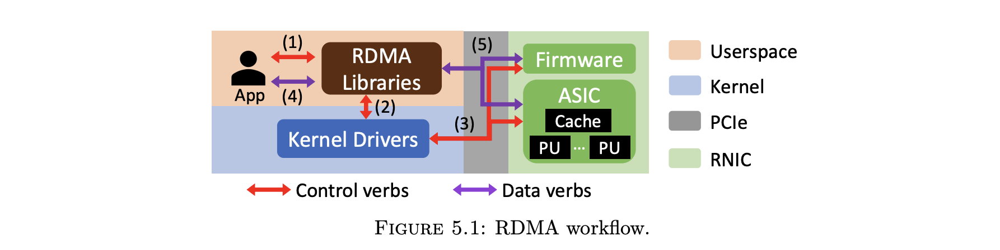
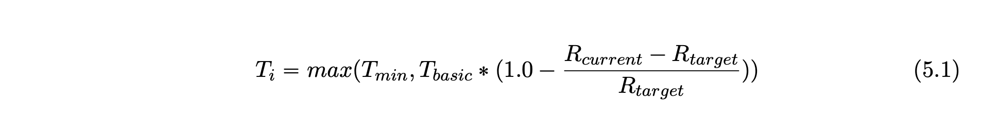

link: https://danyangzhuo.com/papers/Dissertation_Xinhao_Kong.pdf

This is a phd dissertation paper, respect.

## 1. collie:

- 是个测试系统，考虑各种 rdma 传输系统中的变量，控制变量进行组合测试，判断是否发生异常
- 异常的判断基于两点
  - 是否产生 PFC pause
  - throughput 是否过低
- 3.11 Appendix: Performance Anomalies 里面各个案例逐一分析讲得挺好的，下图中 16 处都可能有些相关的异常情况。
  - Root cause #1: Receive WQE cache misses bottleneck RNIC receiving rate.
  - Root cause #2: Interconnect Context Memory cache misses reduce RNIC sending rates. (存 QP 的）
  - Root cause #3: PCIe controller blocks RNIC from reading host memory
  - Root cause #4: RNIC packet processing bottleneck.
  - Root cause #5: Host topology causes PCIe latency to increase, and this bottlenecks RNIC receiving rate.
  - Root cause #6: RDMA NIC has potential in-NIC incast/congestion



## 2. husky:

- 混部在一起的 rdma 用户会相互影响，包括
  - data verbs：不同 data verbs 共存传输工作时，分配不均，比如 atomic operation 就会明显 throughput 较低。这是因为不同 data verbs 消耗的 resource 是不一样的
  - control verbs： register MR 不太影响性能，deregister MR 会导致性能很差，因为它优先级很高，其他操作都像停止了，导致较多的 cache miss
  - error handling：当handle 一些error，比如 RNR（receiver NOT ready），其他传输的连接性能很差
  - PCIe bandwidth will only become the bottleneck when the request size is in a specific range.

relationship between 3 factors and micro-resources:



- 4.10 里面关于 RDMA 过程中的 PCIe 开销分析也挺好的

网络包总大小（假设 payload 是 29 Bytes）：

```
Bytes(network)
= Bytes(payload) + Bytes(Ethernet) + Bytes(IP) + Bytes(UDP) + Bytes(IB)
= 29 + 38 + 20 + 8 + 32
= 127(bytes)
```

PCIe 传输量：

```
Bytes(PCIe) 
= Bytes(payload) + Bytes(payload TLP) + Bytes(WQE) + Bytes(WQE TLP) + Bytes(Doorbell) + Bytes(DB TLP)
= 29 + 20 + 36 + 20 + 64 + 20
= 189(bytes)
```


* introudction about RDMA NIC microarchitecture details:


* other findings
  * Other finding #1: Data verbs contend for different RNIC caches.
  * Other finding #2: Wide range access across many objects (QP, CQ, MR) causes ICM cache misses
  * Other finding #3: The impact of control verbs is restricted by its kernel involvement.


## 1.3 Harmonic

这篇文章提出了 hardware-assisted solution（ Harmonic） 来实现 RDMA 网络资源的 performance isolation，减少他们之间相互影响。

* 主要挑战有二：
  * 一则，需要准确测量各种 resource 的使用情况
    * RDMA bypass kernel，软件侧拿不到信息
    * RNIC 也只暴露了一些综合的指标，包括 PCIe，RNIC 的 cache miss 之类的，但其实不知道每个 用户 的资源使用情况。
  * 二则，需要找到合适 rate limit 的 entry point
    * software 不可限速，因为协议栈都在 RNIC 里面。
    * RNIC 有限速功能，但没有对某个 tenant 限速的功能。
    * 也不能在 RNIC 丢包来进行限速，会显著劣化 RDMA 的性能
* proposed solution
  * 对于挑战一，用一个 PCIe switch 在 runtime 对 RDMA 资源使用进行统计监控。这样做的原因是所有流量会经过 PCIe switch，而且由于 memory register，内存是 pin 住的，用户使用的物理内存是固定的，所以通过物理地址知道是哪个用户。作者他们通过 FPGA 来做了一个 programable intelligent PCIe Switch(PIPS) 来实现监控流量的功能。通过改 RNIC kernel driver 来拿到物理地址到 用户的 映射。两者结合即可
  * 对于挑战二，为了 performance isolation， 把 RNIC hardware 的 rate limiter 改了下，现在 RNIC 的 rate limiter 是为了 congestion control，他们根据 congestion 信号来调整速率，因此可以插入一些合适的 congestion 信号给用户，来限制他们的 RDMA 资源的使用。现在的 RNIC 都支持 DCQCN 算法，可以通过生成 CNP（congestion notification packet）来对用户进行限速。此外，为了限制用户对 RDMA 资源的使用，还限制了最大使用 QP 的数量以及 RDMA request 的数量。

* RDMA workflow 的介绍
  * user 与 rdma user library (libibverbs) 交互，可以调用一些 control verbs 和 data verbs。
  * 应用调用 control verbs， 则会由 kernel driver 处理，kernel driver 会做一些检查，把相关的控制命令发给 RNIC，RNIC 处理之后会将相关结果传递回 kernel driver，kernel driver 再将结果处理返回给用户。RNIC 上的软件是 firmware，当 firmware 处理 control verbs，也会牵涉到一些 ASIC 硬件里的状态。比如建 QP 的时候就会改动 NIC 里面的 cache
  * 应用可以调用 data verbs 来发送或接收数据，不需要 kernel driver 的参与，就是 bypass kernel。user library 直接通知 RNIC 有 WQE 需要处理，也就是发一个 doorbell 给 RNIC，RNIC 就会通过 DMA 来读取 WQE。



* 限速的具体实现
  * 当 monitor 发现， BPS/DRPS/PCIe bandwidth 超过 threshold 的时候，就发送 CNP 给用户的连接， Harmonic 会在 Ti interval 之后发 1-4 个 CNP 的包。Ti 通过如下公式计算，有两个需要人工配置的参数， Tmin 和 Tbasic，用来防止频繁发送 CNP。（看 paper 中的实际配置，100us poll 一次当前 throughput，Tmin 和 Tbasic 设为 200us 和 500us。
  * 另外讲下 CNP，DCQCN 的接收端在看到 ECN 的时候，会向发送方发送 CNP 来表示用户看到了 congestion，看到了 CNP 之后，发送端用户会减速。 




