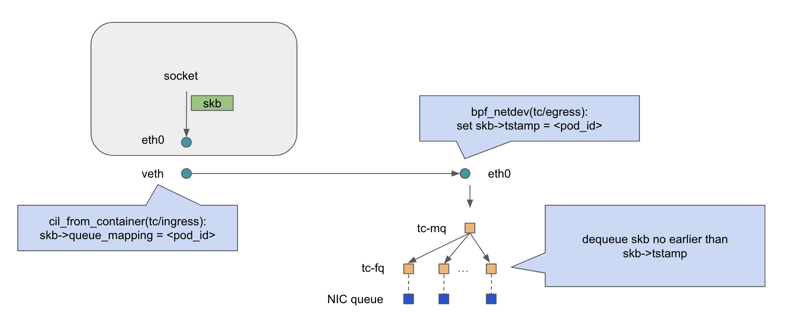
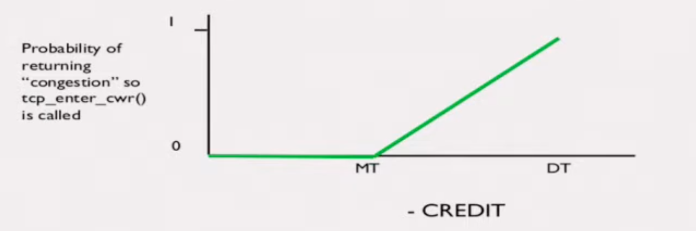

bandwidth management is hard, because it involves remote resources.

Typically, for bandwidth mangement, we talk about egress traffic shaping, ingress as traffic policing. We refer them in this way because, the sender is the one which has control. Sender can control or shape the traffic when it goes out of the host(or qdisc).

But for the receiver, it can have feedback to sender, but longer and slower. And when receiver is conducting any action to prevent any impact, it's already too late and impact has been caused(e.g. softirq has been triggered, some efforts has been spent, we are just stop bleeding in this case).


## 0. cilium bandwidth manager introduction

cilium banwdidth manager is only handling the egress rate limit part.



As introduced in https://isovalent.com/blog/post/addressing-bandwidth-exhaustion-with-cilium-bandwidth-manager/

It basically adopt clsact BPF to implement a EDT way to achieve pacing & rate limit.

for EDT, we can refer to 

* [Teach NIC about Timestamps](https://www.youtube.com/watch?v=MAni0_lN7zE)
* [Carousel](https://dl.acm.org/doi/10.1145/3098822.3098852)

## 1. Issues

### 1.1 in-host bufferbloat issue

Toke has a excellent post [The Big FIFO in the Cloud](https://blog.tohojo.dk/2023/12/the-big-fifo-in-the-cloud.html) about this issue, we just borrowed some pics here to describe the bufferbloat here.

In short, latencies increases a lot with #connections increase, typically bufferbloat issue.


```
These tests show the results of running the RRUL test inside a container with the Cilium bandwidth manager enabled, and either the fq or fq_codel qdiscs installed on the host-side physical interface. The 'BE', 'BK', 'CS5' and 'EF' labels refer to different DiffServ markings that the test applies to each flow. However, nothing in this test reacts to those markings, so it's safe to just ignore them.
```


```
In a regular FIFO, packets are queued one after the other and go out at line rate. With EDT, each packet has a timestamp that it will be dequeued at. One can think of this as the packets having 'space' between them, which can be used to achieve a particular shaping rate. In this example, packets are queued with 1 ms of delay from between them.
```


```
Even if packets are enqueued in multiple per-flow queues, because of the global timestamp assignment, we will end up with a virtual FIFO queue across all packets coming out of the same pod.
```


### 1.2 lack of UDP backpressure

We set rate limit for 100Mbps limit for one pod, and if we run udp iperf with rate < 100Mbps(may 90Mbps), we should see no anomalties.

e.g. we have rate limit for 100Mbps, then we run iperf of 200M, we will see is very low, about 2Mbps.

```
# iperf --udp --client 10.19.1.46 --bandwidth 200M --enhancedreports
[  3]  0.0-12.0 sec  3.81 MBytes  2.66 Mbits/sec   0.077 ms 175618/178334 (98%)
[  3] 0.0000-11.9995 sec  1 datagrams received out-of-order
```

e.g. we have rate limit of 10Mbps of one pod, if we run iperf with 10M specified, the throughput goes below 10Mbps, however, what we saw is its throughput is below 10Mbps.

```
# iperf3 -c <server-ip> -b 10M -u
[ ID] Interval           Transfer     Bitrate         Jitter    Lost/Total Datagrams
[  5]   0.00-10.00  sec  11.9 MBytes  10.0 Mbits/sec  0.000 ms  0/8633 (0%)  sender
[  5]   0.00-10.00  sec  9.10 MBytes  7.63 Mbits/sec  0.304 ms  1786/8376 (21%)  receiver
```

This is due to TCP has TSQ(TCP small queue), mechanism, throttling the in-host number of bytes of a connection.

If we check the tc -s qdisc show, we will find that packets are dropped by the tc-fq

```
$ sudo tc -s qdisc show dev ens4
qdisc mq 8002: root
 Sent 783370773 bytes 1006231 pkt (dropped 584, overlimits 0 requeues 0)
 backlog 0b 0p requeues 0
qdisc fq 0: parent 8002:8 limit 10000p flow_limit 100p buckets 1024 orphan_mask 1023 quantum 2948b initial_quantum 14740b low_rate_threshold 550Kbit refill_delay 40ms timer_slack 10us horizon 10s horizon_drop
 Sent 171368969 bytes 176640 pkt (dropped 104, overlimits 0 requeues 0)
 backlog 0b 0p requeues 0
```

because UDP packets are queued at tc-fq, not allowed to send until the `skb->tstamp`,  but each fq has a param called `flow_limit`, which identifies the queue length of one flow in tc-fq. So when more than 100 packets of the same flow are waiting in the tc-fq, excessive packets will be dropped.

About 10Mbps UDP case, it is due to the disturbance and variance introduced by kernel network stack or some noise of timers. Dequeue rate of tc-fq and enqueue rate of iperf, both are not accurate, this cause some queuing in tc-fq. When queue is longer than tc-fq flow limit, it causes packet drop still.

```
My guess would be that this is due to a difference in what iperf
considers to be 10Mbit/s and what the shapes does. Running a quick test
on my own machine, when sending at 10Mbit/s iperf sleeps somewhere
between 960 and 985 usecs between each frame. Whereas the interpacket
gap between 1500-byte frames is 1200 usecs (1500*8/10000000), or 1227
(1534*8/10000000) usecs if you account for the ethernet framing.
```


## 2. solutions

### 2.1 convert bufferbloat

bufferbloat has been investigated since start of the this centry, many methods has been proposed to tackle this issue, including ECN, RED, Codel.

#### 2.1.1 codel

codel is to overcome bufferbloat issues by differentiating burst and congestion, however, as we use tc clsact ingress BPF hook, BPF program can only impact the enqueue behavior, codel needs the queuing delay info for each packet, which we can obtain in egress dequeue point, not supported currently. [BPF qdisc](https://lpc.events/event/7/contributions/679/attachments/520/1188/sch_bpf.pdf) is currently being submitted to upstream, but looks like it has gone through a long discussion but not merged yet.

more about codel can be referred to  [Wiki page](https://en.wikipedia.org/wiki/CoDel) or [codel paper](https://queue.acm.org/detail.cfm?id=2209336)

#### 2.1.2 RED

Random early detection (RED), also known as random early discard or random early drop, compared to tail drop, RED will drop packets based on a probabilities, longer queue length means severe congestion, then we should drop it.

#### 2.1.3 ECN

The idea for this ECN & CWR methods mainly come from [LPC talk of Lawrance Brakmo](https://www.youtube.com/watch?v=wIWpqkdGrEM)

in BPF, we have bpf helper function to set ECN for packets. it helps to rate limit bulk elemphant flow. Mice flow packets are less likely to be ECN-marked. And it's not dropping packets, we got more goodput compared to RED. 

But enabling ECN in Datacenter networks is not an easy effort, some traditional protocol treated ECN marking as packet loss. they are unable to differentiate loss due to buffer occupancy high or traffic burst loss. DCTCP exploits the ECN marking better, but enabling DCTCP is also very challenging mixing ECN & non-ECN connections can cause unfairness.

> Meta has shared their experience in deploying DCTCP with ECN in datacenters, aimed to reduce the queue length in ToR switch. Meanwhile they enabled ECN for in-cluster traffic, However, they encountered many challenges like
>
> * differentiating in-cluster traffic & cross-cluster traffic(cross-cluster switch behavior are out of control), Meta uses sockops bpf prog to differentiate them, and they have runtime patching for the existing running connections(ECN connections are setup at TCP handshake phase)
> * coexistance about CUBIC and DCTCP traffic: select a low droptail threshold for CUBIC, and set a high ECN threshold for DCTCP, this make queue length longer, and CUBIC easier to drop packets, but it solves the main concern: CUBIC burst traffic break DCTCP.

> high buffer occupancy with bursty Cubic flows will result in very high ECN marks for a competing DCTCP flow, while high buffer occupancy with bursty DCTCP flows will result in very low available buffer for competing Cubic flows.

#### 2.1.4 CWR

for CWR, it means congestion window reduction phase in TCP state, which the tcp connection gets a congestion event and need to reduce the cwnd then. But compared ECN, CWR control is not as fine-grained as ECN, which means the fairness is not that good.

If a queue has longer length, we increase the probability we make tcp connection enter CWR.



From codepath, we have cgroup/egress for return a CWR to the source. 

```c
static int ip_finish_output(struct net *net, struct sock *sk, struct sk_buff *skb)
{
	int ret;

	ret = BPF_CGROUP_RUN_PROG_INET_EGRESS(sk, skb);
	switch (ret) {
	case NET_XMIT_SUCCESS:
		return __ip_finish_output(net, sk, skb);
	case NET_XMIT_CN:
		return __ip_finish_output(net, sk, skb) ? : ret;
	default:
		kfree_skb_reason(skb, SKB_DROP_REASON_BPF_CGROUP_EGRESS);
		return ret;
	}
}
```

From the codepath ip_finish_output -> ip_finish_output2 -> neigh_output -> neigh_hh_output -> dev_queue_xmit 

However, as cilium bandwidth manager uses clsact hook, it calls the sch_handle_egress to call the BPF program, then we can drop the packet, but in `sch_handle_egress`, we cannot set rc(return code) to NET_XMIT_CN. we can either modify the kernel logics here or modify sch_fq module to return NET_XMIT_CN, to tell socket there is congestion in the host.

```c
int __dev_queue_xmit(struct sk_buff *skb, struct net_device *sb_dev)
{
// ...
	tcx_set_ingress(skb, false);
// ...
		skb = sch_handle_egress(skb, &rc, dev);
		if (!skb)
			goto out;
// ...
}
```


### 2.2 token bucket filter(policing)

previously, BPF are hard to implement a token bucket filter, because lack the spin-lock semantics as mentioned in [LPC talk](https://lpc.events/event/2/contributions/121/attachments/84/95/LPC2018-TokenBucket_v4.pdf).

now we have `bpf_spin_lock` helper function, which make it easier to get it done. 

For rate limit, token bucket filter can effectively avoid burst & incast issues, it's just not pacing and not that accurate.

```c
	// Begin critical section
	bpf_spin_lock(&qdp->lock);
	delta = qdp->lasttime - curtime;
	// bound bursts to 100us
	if (delta < -BURST_SIZE_NS) {
		// negative delta is a credit that allows bursts
		qdp->lasttime = curtime - BURST_SIZE_NS;
		delta = -BURST_SIZE_NS;
	}
	sendtime = qdp->lasttime;
	delta_send = BYTES_TO_NS(len, qdp->rate);
	__sync_add_and_fetch(&(qdp->lasttime), delta_send);
	bpf_spin_unlock(&qdp->lock);
	// End critical section
```


