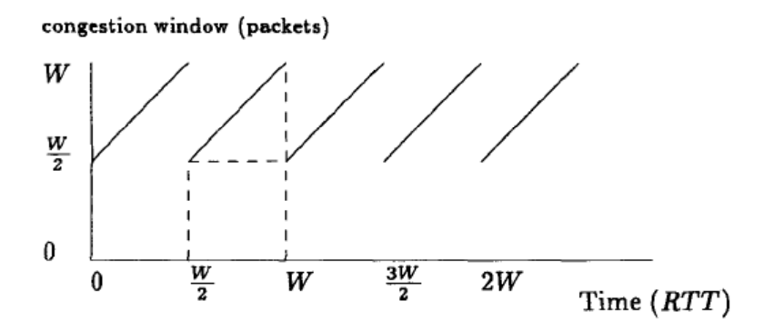
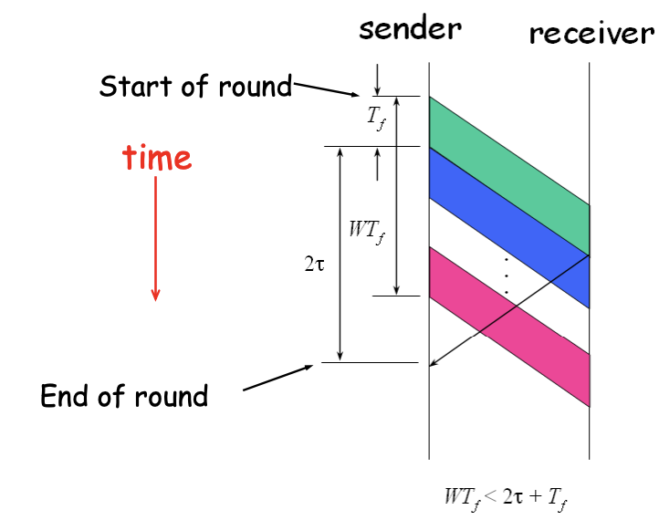
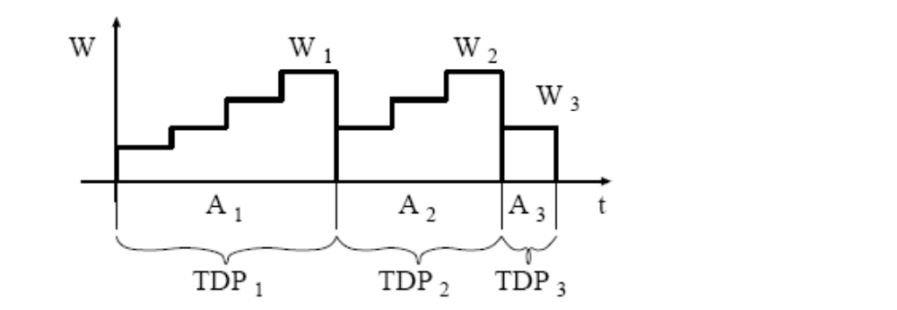
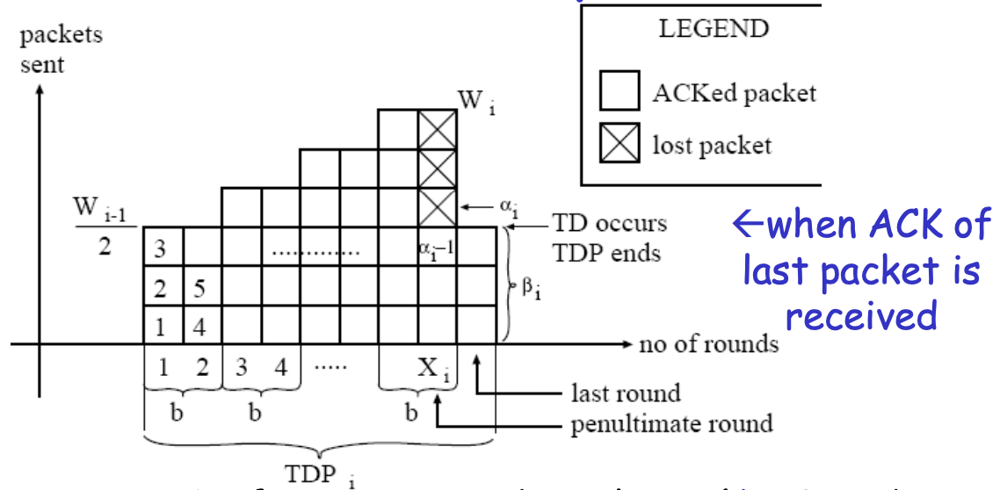
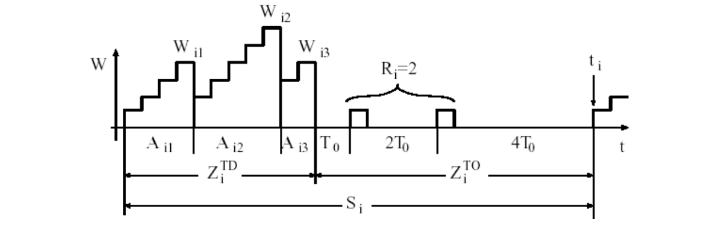

这篇文章推导 AIMD 的 goodput 和一些网络参数的关系，搬运 [Congestion Control 2 talks ](https://www.cs.utexas.edu/~lam/395t/slides/Congestion%20Control%202%20talks.pdf) ，源自论文 [Modeling TCP through-put: A simple model and its empirical validation](https://conferences.sigcomm.org/sigcomm/1998/tp/paper25.pdf)

关于 AIMD，简要解释为：

AI(additive increase)：当包被 ack， cwnd 增加 1 个 MSS

MD(multiplicative decrease)：丢包事件发生，cwnd 减半

近似来说，
$$
throughput = \frac{W}{RTT} \ \ packets/sec
$$

---

## 1. triple duplication loss 情形

情境1，我们有以下假设

* 没有 slow start，没有 timeout（TO），loss indication 全是由于 triple duplication（TD） 引起，它是一个 long-lived TCP connection 一直在传输
* 每个时间段是独立同分布的
* 每个包有概率 p 被丢失

在以上假设中，我们有如下结论

1. 遇到第一次 loss 的平均传输次数

$$
\begin{aligned}
\mathrm{n} & =\quad\sum_{i=1}^\infty ib_i=\sum_{i=1}^\infty i(1-p)^{i-1}p \\\\
 & =\quad p\sum_{i=1}^\infty i(1-p)^{i-1} \\\\
 & =\quad-p\frac{d}{dp}\sum_{i=1}^\infty(1-p)^i=-p\frac{d}{dp}\sum_{i=0}^\infty(1-p)^i \\\\
 & =\quad-p\frac{d}{dp}\frac{1}{1-1+p}=p\frac{1}{p^2} \\\\
 & =1/p
\end{aligned}
$$

2. 遇到第一次传输成功的传输次数 `1/(1-p)`

3. 一个 period 中的传输包的数量（即上图中一个梯形的面积）

$$
\left(\frac{W}{2}\right)^2+\frac{1}{2}{\left(\frac{W}{2}\right)^2}=\frac{3}{8}W^2
$$

1 和 3 应该是相等的，那么相应地，我们可以得到 p 和 W 的关系。

根据之前的公式 1 `throughput = W / RTT`，这一段时间的总时间 为 `RTT * W / 2`，这一段时间传输的包的数量为 `3W^2/8`，那么有
$$
\begin{aligned}
 & \text{send rate (in packets/sec)} \\\\
 & =\frac{\text{no. of packets/period}}{\text{time per period}}=\frac{\frac{3}{8}W^2}{RTT\left(\frac{W}{2}\right)} \\\\
 & =\frac{1/p}{RTT\left(\sqrt{\frac{2}{3p}}\right)}=\frac{1}{RTT}\sqrt{\frac{3}{2p}}
\end{aligned}
$$

---

## 2. delayed ack 的考虑

情境2，当我们考虑 delayed ack，比如说，对某些应用的流，receiver 每收到 b packets ，会发送一个 ACK 包。

那么这种情况下，改变的是上图中 cwnd 和 time 的斜率，结论是 
$$
\frac{1}{RTT}\sqrt{\frac{3}{2bp}}
$$

---

## 3. Timeout loss 的情形的考虑

### 3.1 对 TD 的进一步建模

情境3，我们前面的推导，在 loss 高的时候，是不准确的，因为我们忽略了 timeout（TO） 导致的重传，而只考虑了 dupack（TD） 导致的重传。

这里我们加入对重传的考虑，有以下假设

1. 应用册一直有数据发，TCP 连接当有 cwnd 增长时，可以立即发送数据。
2. 不考虑 slow start
3. 发包的时间比 RTT 小，如下图，我们考虑从 start of round 到 end of round 的时间，发包时间不会持续到  end of round 之后。

4. RTT 和 window size 是独立的（强假设）
5. 不考虑 fast recovery 带来的 inflation
6. Wi 是 yi 的 markov regenerative process

我们考虑以上传输周期，每个 TD（triple duplication） period 都由一个 loss event 结束，TDPi 有 Ai 轮次。Wi 是TDi 结束的时候的 window 大小，yi 是这一轮发送的包。

那么 good put B 即为 
$$
B=\lim_{t\to\infty}B_t=\lim_{t\to\infty}\frac{N_t}{t}=\frac{E[Y_i]}{E[A_i]}\triangleq\frac{E[Y]}{E[A]}
$$

7. 不同轮的 loss 是独立发生的
8. 如果一轮 TDi 中一个包 lost 了，那么这一 TDi 后续的包也 lost 了，他们以 p 的概率记为一次 loss indication。

基于以上假设，我们有如下结论 （一些变量关系如下图）

遇到第一次 loss 的平均传输次数`alpha`
$$
E[\alpha]=1/p
$$
E(r) 为 RTT 的期望
$$
E[r]=RTT
$$
E(Y) 为一轮 TDi 中发送的包
$$
E[Y]=E[\alpha]+E[W]-1=\frac{1}{p}-1+E[W]
$$
Wi 为 TDi 结束时 window 大小（Xi 为轮次数量，b 是之前说的 delayed ack 相关的参数）
$$
W_i=\frac{W_{i-1}}{2}+\frac{X_i}{b}
$$
Xi 为 TDi 中轮次数量（一轮就是回一个 ack）
$$
E[X]= \frac{b}{2}E[W]
$$
A 为 TDi 中总时间（考虑最后重传的一轮）
$$
E[A]= (E[X]+1)E[r]=(\frac{b}{2}E[W]+1)RTT
$$
那么发送速率为 
$$
B= \frac{E[Y]}{E[A]}=\frac{\frac{1}{p}-1+E[W]}{(\frac{b}{2}E[W]+1)RTT}
$$
对于 E(Y)，我们除了通过丢包率来算，也可以算面积（这里 beta_i 表示需要重传的包，假设为 E(W/2)）
$$
\begin{aligned}
 & Y_i=\sum_{k=0}^{X_i/b-1}(\frac{W_{i-1}}{2}+k)b+\beta_i \\\\
 & =\frac{X_iW_{i-1}}{2}+\frac{X_i}{2}(\frac{X_i}{b}-1)+\beta_i \\\\
 & =\frac{X_i}{2}(W_i+\frac{W_{i-1}}{2}-1)+\beta_i \\\\
 & E[Y]=\frac{E[X]}{2}(E[W]+\frac{E[W]}{2}-1)+E[\beta] \\\\
 & =\frac{bE[W]}{4}(E[W]+\frac{E[W]}{2}-1)+E[\frac{W}{2}]
\end{aligned}
$$
然后我们让 E(Y) 的两种公式 （14， 9），我们可以得到平均窗口大小 E(W)，丢包概率为 p 下的发送速率 B(p)，以及这一轮 TDi 持续时间 Ai，在前文有。
$$
\begin{aligned}
 & E\left[W\right]=\frac{2+b}{3b}+\sqrt{\frac{8(1-p)}{3bp}+(\frac{2+b}{3b}})^2 \\\\
 & \quad B\left(p\right)=\frac{\frac{1-p}{p}+E\left[W\right]}{E\left[A\right]}
\end{aligned}
$$

---

### 3.2 对 TO 的建模

这些都是对之前 TD（triple duplication） 情况的抽象和讨论，让我们进一步考虑 Timeout（TO） 的情形

其中 ni 表示发生一次 TO 时，已经经过的 TD 的数量。

这里要加上一个假设

9. ni 是独立同分布的，和 Yi， Ai 无关

这里我们再引入两个变量，

一个是 Mi，表示一轮 timeout（TOi） 周期中，发送的包的数量（Ri 表示是第 i 轮 Timeout 周期中的重传数量，之前有推导，期望为 `1/(1-p)` ）
$$
Mi = \sum_{j=1}^{ni} Yij + Ri
$$
一个是 Si，表示一轮 TOi 持续的时间，Zi 表示由于 timeout 重传导致的额外时间
$$
Si = \sum_{j=1}^{ni} Aij + Z_i^{TO}
$$
由此我们进一步计算其期望
$$
E[M]=E[n]E[Y]+E[R] \\\\
E[S]=E[n]E[A]+E[Z^{TO}]
$$
那么我们则可以知道发送速率 B 为
$$
\begin{aligned}
 & B=\frac{E[M]}{E[S]} \newline
 & =\frac{E[n]E[Y]+E[R]}{E[n]E[A]+E[Z^{TO}]} \newline
 & =\frac{E[Y]+Q*E[R]}{E[A]+Q*E[Z^{TO}]}
\end{aligned}
$$
其中未知的还有 E[Z^TO] 和 Q。

其中 Q 是 give loss 不是由 TD 引起，而是 TO 引起的概率
$$
Q\triangleq\frac1{E[n]}
$$
Q 就是两次 ack 的概率，这里不推了，结论是 
$$
Q\simeq\widehat{Q}(E[W])\simeq\min(1,\frac{3}{E[W]})\simeq\min(1,3\sqrt{\frac{3bp}{8}})
$$

---

### 3.3 多个 TO 周期

我们继续考虑多个TO周期的情形，

比如由于 TO 发生而丢了 R=k 个包
$$
P[R=k]=p^{k-1}(1-p)
$$
由于 timeout 会按指数增加
$$
L_k=(2^k-1)T_O\quad
$$
那么可以算出  E(Z^TO)
$$
\begin{aligned}
 & E[Z^{TO}]=T_O\frac{1+p+2p^2+4p^3+8p^4+16p^5+32p^6}{1-p} \\\\
 & \triangleq T_O\frac{f(p)}{1-p}\simeq T_0(1+32p^2)
\end{aligned}
$$
现在我们有了 Q 和 E(Z^TO)， 可以算出 19 中的 B 了
$$
\begin{gathered}
B(p)=\frac{\frac{1-p}{p}+E[W]+\widehat{Q}(E[W])\frac{1}{1-p}}{RTT(E[X]+1)+\widehat{Q}(E[W])T_O\frac{f(p)}{1-p}} \\\\
\simeq\frac{1/p}{RTT\left(\sqrt{\frac{2b}{3p}}\right)+\min\left(1,3\sqrt{\frac{3bp}{8}}\right)(1+32p^2)T_0} \\\\
=\frac{1}{RTT\left(\sqrt{\frac{2bp}{3}}\right)+\min\left(1,3\sqrt{\frac{3bp}{8}}\right)p(1+32p^2)T_0}
\end{gathered}
$$

最后，个人觉着，有些假设还是比较强的，没有考虑 buffer 的作用。由于 buffer，RTT 与 Wi 实际还是比较相关的。

