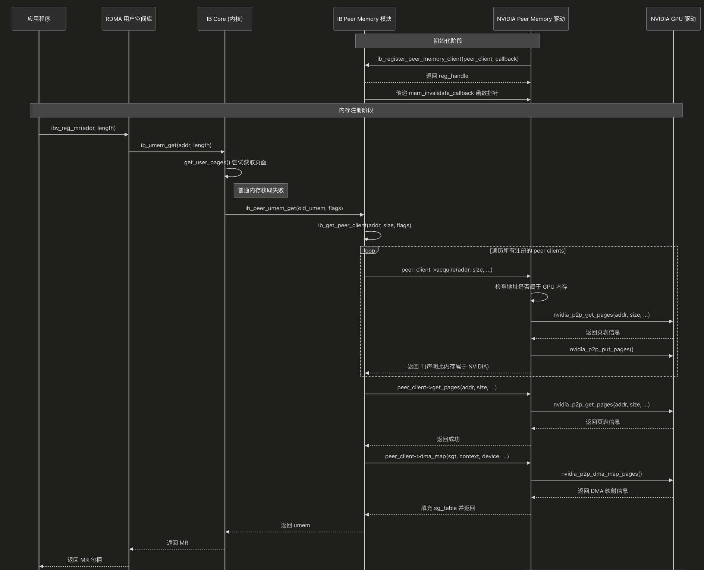
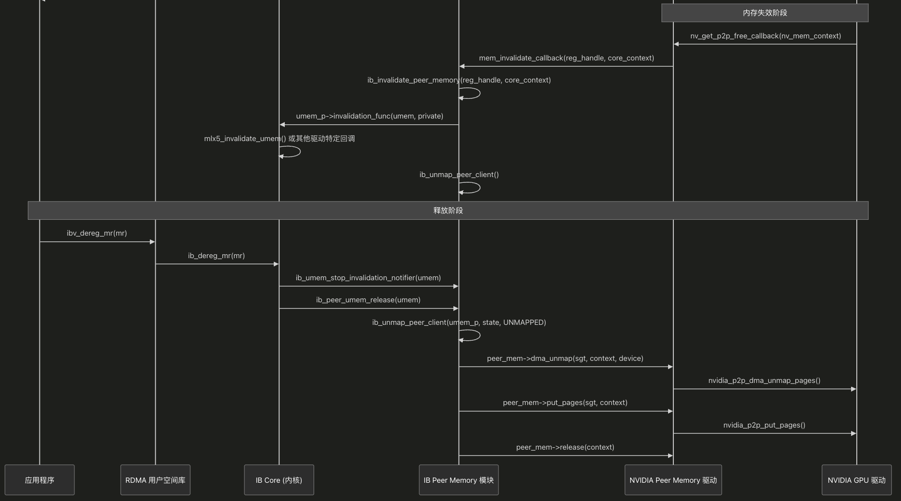
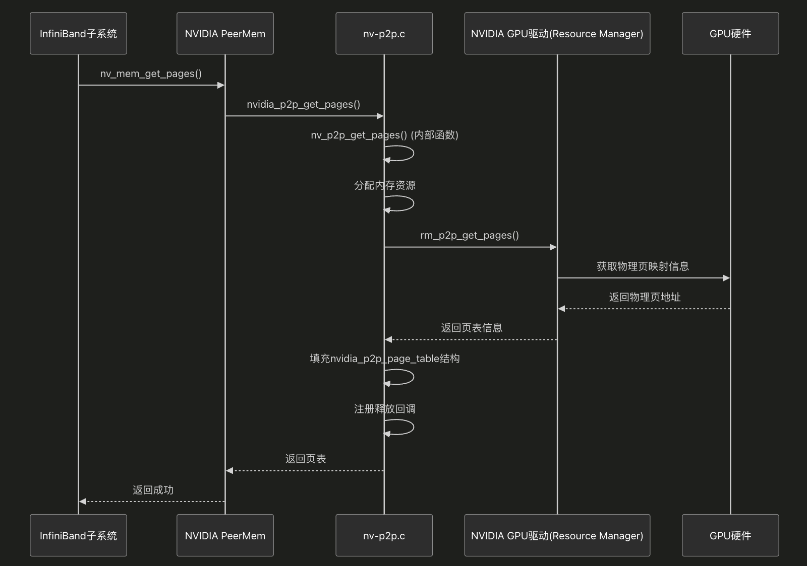
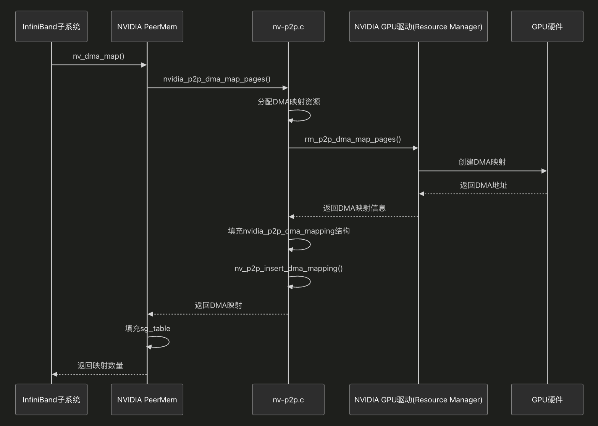
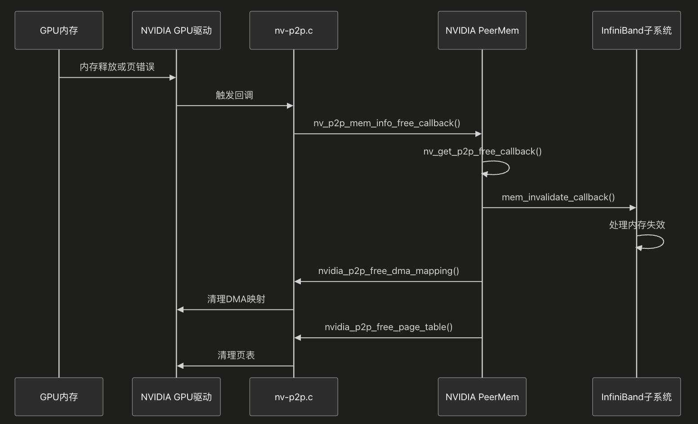

在RDMA（远程直接内存访问）中，传统上用户空间内存需要通过`get_user_pages()`获取才能用于RDMA操作。但某些特殊类型的内存（特别是GPU内存）无法通过此方式获取，这限制了RDMA的使用场景。

因此，nvidia 引入了"peer memory interface"（对等内存接口），允许驱动程序向RDMA子系统注册自己能够处理特殊类型的用户虚拟地址范围，这些地址范围与传统的`get_user_pages()`不兼容。例如：

- 通过`io_remap_pfn_range()`创建的虚拟内存区域(VMA)
- 其他驱动程序特殊的VMA（如GPU内存）

这篇博客，我们解析 peer memory interface 在 nvidia-peermem 的实现与交互流程。

Nvidia-peermem 相关实现之前是 mellanox 版本

* https://github.com/Mellanox/nv_peer_memory

再后来 nvidia 开源了 open gpu kernel module，nvidia-peermem 放在这个 repo 了。

* https://github.com/NVIDIA/open-gpu-kernel-modules/tree/main/kernel-open/nvidia-peermem


## 0. 流程

大致流程分为三个阶段：

- 初始化
  - 初始化一些 struct peer_memory_client_ex nv_mem_client_ex 的字段，这个数据结构实现了一些 peer_memory_client 的接口
  - NVIDIA peer memory 驱动通过 ib_register_peer_memory_client() 向 IB peer memory 模块注册自己
    - 传递 peer memory client 结构体，包含各种回调函数 (acquire, get_pages, dma_map 等)
    - IB peer memory 模块返回 reg_handle 并传递 mem_invalidate_callback 函数指针
- 内存注册过程
  - **触发流程**:
    - 用户程序调用 `ibv_reg_mr()` 注册内存区域
    - RDMA 用户空间库调用内核 `ib_umem_get()`
    - 内核尝试使用 `get_user_pages()` 获取普通内存页面
    - 如果是特殊内存（如 GPU 内存），普通获取方式失败
  - **Peer 内存识别**:
    - IB Core 调用 `ib_peer_umem_get()`
    - 遍历所有注册的 peer clients 寻找可以处理该内存区域的驱动
    - 调用每个客户端的 `acquire()` 函数，尝试认领内存区域
    - NVIDIA 驱动检查地址是否属于 GPU 内存，返回 1 表示认领
  - **内存映射流程**:
    - IB Peer Memory 调用 NVIDIA 驱动的 `get_pages()` -> `nvidia_p2p_get_pages()` 获取页表
    - 调用 `dma_map()` -> `nvidia_p2p_dma_map_pages()` 创建 DMA 映射
    - 返回填充好的 sg_table 给 RDMA 子系统
- 释放阶段
  - **用户触发释放**:
    - 用户程序调用 `ibv_dereg_mr()`
    - 最终调用到 `ib_peer_umem_release()`
  - **资源清理**:
    - 停止失效通知
    - 解除 DMA 映射 -> `nvidia_p2p_dma_unmap_pages()`
    - 释放页面 -> `nvidia_p2p_put_pages()`
    - 调用 `release()` 释放上下文







## 1. 初始化

`struct peer_memory_client` 是定义的外部驱动与 ib 模块交互的接口：

```c
static struct peer_memory_client_ex nv_mem_client_ex = { .client = {
    .acquire        = nv_mem_acquire,
    .get_pages  = nv_mem_get_pages,
    .dma_map    = nv_dma_map,
    .dma_unmap  = nv_dma_unmap,
    .put_pages  = nv_mem_put_pages,
    .get_page_size  = nv_mem_get_page_size,
    .release        = nv_mem_release,
}};

static struct peer_memory_client nv_mem_client_nc = {
    .acquire        = nv_mem_acquire,
    .get_pages      = nv_mem_get_pages_nc,
    .dma_map        = nv_dma_map,
    .dma_unmap      = nv_dma_unmap,
    .put_pages      = nv_mem_put_pages_nc,
    .get_page_size  = nv_mem_get_page_size,
    .release        = nv_mem_release,
};
```

persistent 和 legacy API 有如下差异：

- 传统API：依赖回调机制处理内存释放，当GPU内存被释放时自动触发回调
- 持久API：由用户负责显式释放资源，即使底层GPU内存被释放页表也保持有效

在初始化的过程中，主要是通过 ib_register_peer_memory_client 向 ib 模块注册当前模块（nvidia）实现的 peer  memory client。

```c
static int nv_mem_legacy_client_init(void)
{
    // ...
    reg_handle = ib_register_peer_memory_client(&nv_mem_client_ex.client,
                         &mem_invalidate_callback);
    if (!reg_handle) {
        peer_err("nv_mem_client_init -- error while registering traditional client\n");
        return -EINVAL;
    }
    return 0;
}
```

## 2. 内存注册

### 2.1 get pages

`nvidia_p2p_get_pages`是 NVIDIA PeerMem 模块中的关键函数，它从 NVIDIA GPU 驱动获取 GPU 内存的物理页表信息。下面详细分析其调用流程：



```c
static int nv_p2p_get_pages(
    nv_p2p_page_table_type_t pt_type,
    uint64_t p2p_token,
    uint32_t va_space,
    uint64_t virtual_address,
    uint64_t length,
    uint8_t  flags,
    struct nvidia_p2p_page_table **page_table,
    void (*free_callback)(void * data),
    void *data)
{
    // 分配资源和初始化
    // ...
    
    // 根据不同的页表类型调用不同的GPU驱动函数
    if (pt_type == NV_P2P_PAGE_TABLE_TYPE_PERSISTENT) {
        // 持久页表API调用
        status = rm_p2p_get_pages_persistent(sp, virtual_address, length,
                                           &mem_info->private,
                                           physical_addresses, &entries,
                                           force_pcie, *page_table, gpu_info,
                                           &mem_info->mig_info);
    } else {
        // 传统页表API调用
        status = rm_p2p_get_pages(sp, p2p_token, va_space,
                virtual_address, length, physical_addresses, wreqmb_h,
                rreqmb_h, &entries, &gpu_uuid, *page_table);
    }
    
    // 处理返回结果，填充页表结构
    // ...
    
    // 注册回调（如果提供了回调函数）
    if (free_callback != NULL) {
        mem_info->free_callback = free_callback;
        mem_info->data = data;
        
        status = rm_p2p_register_callback(sp, p2p_token, virtual_address, length,
                                       *page_table, nv_p2p_mem_info_free_callback, mem_info);
    }
    
    return nvidia_p2p_map_status(status);
}
```

* **rm_p2p_get_pages()/rm_p2p_get_pages_persistent() 函数**：

  * 这些函数是 NVIDIA GPU 驱动中的内部函数（Resource Manager部分）

  - 函数实现未在开源代码中直接可见

  - 它们的主要任务是从 GPU 内存管理系统获取虚拟地址对应的物理页面信息

  - 对于给定的虚拟地址范围，返回对应的物理页地址和必要的控制寄存器值

  - 可能涉及 GPU MMU（内存管理单元）查询和地址转换操作

* **填充页表结构**：
  * 当从 GPU 驱动获取物理页信息后，函数会填充 `nvidia_p2p_page_table` 结构
  * 为每个物理页创建一个 `nvidia_p2p_page` 结构
  * 设置物理地址和相关寄存器值
  * 设置页大小和页数量信息

* **回调注册**：

  * 如果提供了回调函数，会注册到 GPU 驱动

  - 当 GPU 内存被释放或失效时，这个回调会被触发

  - 回调机制确保了资源的正确清理和 InfiniBand 子系统的通知


### 2.2 dma map pages

`nvidia_p2p_dma_map_pages`函数用于为第三方设备（如 InfiniBand HCA）创建 GPU 内存的 DMA 映射。



```c
static int nv_dma_map(struct sg_table *sg_head, void *context,
                   struct device *dma_device, int dmasync,
                   int *nmap)
{
    int i, ret;
    struct scatterlist *sg;
    struct nv_mem_context *nv_mem_context = (struct nv_mem_context *) context;
    struct nvidia_p2p_page_table *page_table = nv_mem_context->page_table;
    struct nvidia_p2p_dma_mapping *dma_mapping;
    struct pci_dev *pdev = to_pci_dev(dma_device);
    
    // 检查页大小
    if (page_table->page_size != NVIDIA_P2P_PAGE_SIZE_64KB) {
        peer_err("assumption of 64KB pages failed size_id=%u\n",
                  nv_mem_context->page_table->page_size);
        return -EINVAL;
    }
    
    // 验证设备
    if (!pdev) {
        peer_err("invalid pci_dev\n");
        return -EINVAL;
    }
    
    // 调用NVIDIA P2P接口创建DMA映射
    ret = nvidia_p2p_dma_map_pages(pdev, page_table, &dma_mapping);
    if (ret) {
        peer_err("error %d while calling nvidia_p2p_dma_map_pages()\n", ret);
        return ret;
    }
    
    // 验证版本兼容性
    if (!NVIDIA_P2P_DMA_MAPPING_VERSION_COMPATIBLE(dma_mapping)) {
        peer_err("incompatible dma mapping version 0x%08x\n", dma_mapping->version);
        nvidia_p2p_dma_unmap_pages(pdev, page_table, dma_mapping);
        return -EINVAL;
    }
    
    // 设置页数
    nv_mem_context->npages = dma_mapping->entries;
    
    // 分配sg_table
    ret = sg_alloc_table(sg_head, dma_mapping->entries, GFP_KERNEL);
    if (ret) {
        nvidia_p2p_dma_unmap_pages(pdev, page_table, dma_mapping);
        return ret;
    }
    
    // 保存DMA映射并填充sg_table
    nv_mem_context->dma_mapping = dma_mapping;
    nv_mem_context->sg_allocated = 1;
    for_each_sg(sg_head->sgl, sg, nv_mem_context->npages, i) {
        sg_set_page(sg, NULL, nv_mem_context->page_size, 0);
        sg_dma_address(sg) = dma_mapping->dma_addresses[i];
        sg_dma_len(sg) = nv_mem_context->page_size;
    }
    nv_mem_context->sg_head = *sg_head;
    *nmap = nv_mem_context->npages;
    
    return 0;
}
```

1. **nvidia_p2p_dma_map_pages() 函数**： 
   - 这个函数在 `nv-p2p.c` 中实现，主要流程：验证参数有效性（页表、设备等）
   - 分配 DMA 映射结构和地址数组
   - 准备物理地址数组
   - 调用 GPU 驱动的 `rm_p2p_dma_map_pages()` 函数
   - 填充返回的 DMA 映射结构
   - 将 DMA 映射添加到内部列表中进行跟踪
2. **rm_p2p_dma_map_pages() 函数**：
   - 这是 NVIDIA GPU 驱动中的内部函数
   - 它的主要任务是为第三方 PCI 设备创建到 GPU 内存的 DMA 映射
   - 可能涉及 IOMMU 配置或特定 GPU 硬件功能的使用
   - 返回可供第三方设备使用的 DMA 地址
5. **DMA 映射管理**：
   - 通过 `nv_p2p_insert_dma_mapping()` 函数将 DMA 映射添加到内部列表
   - 这有助于跟踪所有活跃的 DMA 映射，便于后续清理
   - 当页表失效或被释放时，可以找到并清理所有相关的 DMA 映射
4. **sg_table 填充**：
   - 使用返回的 DMA 地址填充 sg_table（散列表）
   - 每个表项包含一个 DMA 地址和长度
   - InfiniBand 设备使用这个 sg_table 进行 DMA 操作

### 2.3 nv_get_p2p_free_callback 内存回收

当 GPU 内存被释放或发生页错误时，需要通知 InfiniBand 子系统并清理资源。



```c
static void nv_get_p2p_free_callback(void *data)
{
    int ret = 0;
    struct nv_mem_context *nv_mem_context = (struct nv_mem_context *)data;
    struct nvidia_p2p_page_table *page_table = NULL;
    struct nvidia_p2p_dma_mapping *dma_mapping = NULL;
    
    // 检查上下文有效性
    if (!NV_MEM_CONTEXT_CHECK_OK(nv_mem_context)) {
        peer_err("detected invalid context, skipping further processing\n");
        goto out;
    }
    
    // 保存页表和DMA映射的本地引用
    page_table = nv_mem_context->page_table;
    dma_mapping = nv_mem_context->dma_mapping;
    
    // 通知InfiniBand子系统
    nv_mem_context->callback_task = current;
    (*mem_invalidate_callback) (reg_handle, nv_mem_context->core_context);
    nv_mem_context->callback_task = NULL;
    
    // 释放DMA映射
    ret = nvidia_p2p_free_dma_mapping(dma_mapping);
    if (ret)
        peer_err("error %d while calling nvidia_p2p_free_dma_mapping()\n", ret);
    
    // 释放页表
    ret = nvidia_p2p_free_page_table(page_table);
    if (ret)
        peer_err("error %d while calling nvidia_p2p_free_page_table()\n", ret);
    
out:
    return;
}
```

**nvidia_p2p_free_dma_mapping() 和 nvidia_p2p_free_page_table()**：

- 在 `nv-p2p.c` 中，这些函数是空操作（no-op），实际的清理工作由 `nv_p2p_free_dma_mapping()` 和 `nv_p2p_free_page_table()` 内部函数完成
- 这些内部函数负责释放所有分配的资源并通知 GPU 驱动

```c
static void nv_p2p_free_dma_mapping(
    struct nvidia_p2p_dma_mapping *dma_mapping)
{
    nv_dma_device_t peer_dma_dev = {{ 0 }};
    NvU32 page_size;
    NV_STATUS status;
    
    // 设置DMA设备信息
    peer_dma_dev.dev = &dma_mapping->pci_dev->dev;
    peer_dma_dev.addressable_range.limit = dma_mapping->pci_dev->dma_mask;
    
    page_size = nvidia_p2p_page_size_mappings[dma_mapping->page_size_type];
    
    // 根据私有数据存在与否选择不同的清理方式
    if (dma_mapping->private != NULL) {
        // 处理页大小转换和调用nv_dma_unmap_alloc
        // ...
    } else {
        // 直接调用nv_dma_unmap_peer
        NvU32 i;
        for (i = 0; i < dma_mapping->entries; i++) {
            nv_dma_unmap_peer(&peer_dma_dev, page_size / PAGE_SIZE,
                            dma_mapping->dma_addresses[i]);
        }
    }
    
    // 释放地址数组
    os_free_mem(dma_mapping->dma_addresses);
    
    // 释放DMA映射结构
    os_free_mem(dma_mapping);
}

static void nv_p2p_free_page_table(
    struct nvidia_p2p_page_table *page_table)
{
    NvU32 i;
    struct nvidia_p2p_dma_mapping *dma_mapping;
    struct nv_p2p_mem_info *mem_info = NULL;
    
    mem_info = container_of(page_table, nv_p2p_mem_info_t, page_table);
    
    // 清理所有关联的DMA映射
    dma_mapping = nv_p2p_remove_dma_mapping(mem_info, NULL);
    while (dma_mapping != NULL) {
        nv_p2p_free_dma_mapping(dma_mapping);
        dma_mapping = nv_p2p_remove_dma_mapping(mem_info, NULL);
    }
    
    // 释放所有页结构
    for (i = 0; i < page_table->entries; i++) {
        NV_KMEM_CACHE_FREE(page_table->pages[i], nvidia_p2p_page_t_cache);
    }
    
    // 释放UUID
    if (page_table->gpu_uuid != NULL) {
        os_free_mem(page_table->gpu_uuid);
    }
    
    // 释放页数组
    if (page_table->pages != NULL) {
        os_free_mem(page_table->pages);
    }
    
    // 释放内存信息结构
    os_free_mem(mem_info);
}
```


## other

如 [4] 中所述

> 简而言之，这套方案的核心思想是：
>
> 1. 建立一个注册机制：管理 P2P 可访问内存的设备驱动（如 GPU 驱动）可以通过 ib_core 提供的 ib_register_peer_memory_client API，将自身注册成为一个 Peer Memory Client。
> 2. 提供地址翻译回调: 这些 Peer Memory Client 的实现需要提供一组回调函数。其中一个关键的回调函数 get_pages, 使得 RDMA 驱动在需要访问对等内存（如 GPU 显存）时，能将传入的设备虚拟地址翻译成为该地址对应的、可供 RDMA 网卡 DMA 使用的物理地址列表。
>
> 旨在 RDMA 框架内解决 P2P 内存注册的核心问题：地址翻译。这种设计直接解决了在 ibv_reg_mr 流程中处理非系统内存的痛点，对 RDMA 开发者来说是很友好的。
>
> 然而，这套在 RDMA 子系统 ib_core 内部提供 Peer Memory Client API 的方案却最终未能合并到 Linux 内核主线，最主要的原因在于其缺乏通用性。P2P DMA 的需求并不仅限于 RDMA，图形（DRM）、视频（V4L2）、存储等其他子系统同样存在设备间直接内存共享的需求。将 P2P DMA 解决方案深度绑定在 ib_core 中不仅使得该机制难以被其他子系统复用，也被认为是在系统架构中放置在了错误的层次——P2P 内存管理更像是一个底层的驱动模型或内存管理问题，而非特定 I/O 子系统的内部事务。


## reference 

1. [RDMA/core: Introduce peer memory interface](https://kernel.googlesource.com/pub/scm/linux/kernel/git/leon/linux-rdma/+/refs/heads/gpu-v6.4)
2. nvidia peermem patch： https://patentimages.storage.googleapis.com/25/a3/3f/28466fb18c472e/US10031857.pdf
3. [PROGRESS OF UPSTREAM GPU RDMA SUPPORT](https://www.openfabrics.org/wp-content/uploads/2021-workshop-presentations/303_Xiong_DMA-BUF.pdf)
4. [GPUDirect RDMA 的演进与实现](https://segmentfault.com/a/1190000046437653)
5. [HowTo Implement PeerDirect Client using MLNX_OFED](https://enterprise-support.nvidia.com/s/article/howto-implement-peerdirect-client-using-mlnx-ofed)
6. [open gpu kernel module repo](https://github.com/NVIDIA/open-gpu-kernel-modules)
7. [nv peer memory repo](https://github.com/Mellanox/nv_peer_memory)
