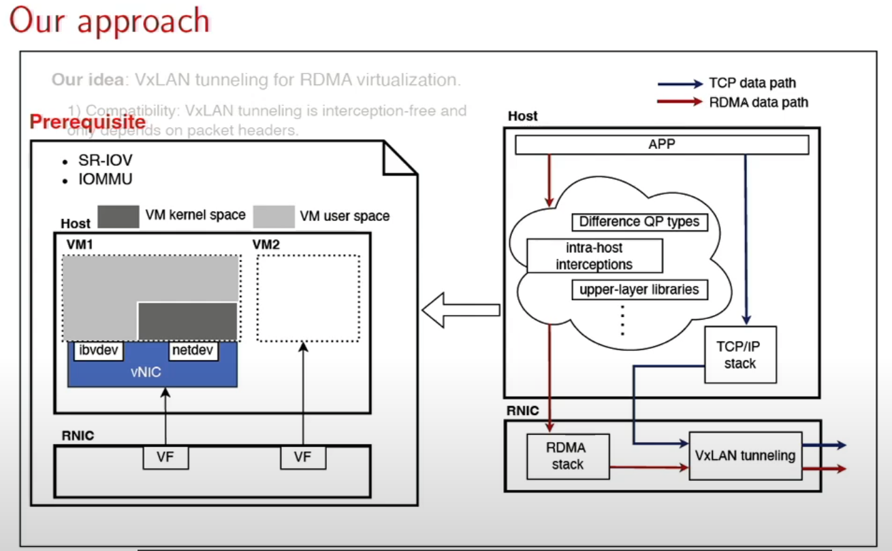

ByteDance Jakiro: Enabling RDMA and TCP over Virtual Private Cloud

paper: https://dl.acm.org/doi/abs/10.1145/3718958.3750496

video: https://www.youtube.com/watch?v=gh13ILZGY1s

如题所述，Jariko 是 dota 2 里面的，同时有冰火之力的双头龙，这里寓意是说一个头用于 RDMA，一个头用于 TCP。

大概看了一遍视频，没有细看 paper，这里博客简述下 paper 的 idea。

## background

我们知道 VPC 主要用于云上隔离不同租户的网络流量，什么应用场景下 RDMA 和 TCP 会有 VPC 隔离的需求呢？比如有些应用同时用 RDMA 和 TCP，比如分布式 ML 训练，存储，live streaming，LLM 推理里面的 PD 分离（我觉着还要加上 TCP 和 RDMA 想放在同一张网络里的前置条件，有些时候两者也不在一张网里面）

VPC 的 TCP 流量的隔离已经有很多成熟的方案了，RDMA 之前也有一些，但好像最后也都没大规模落地，之前看过一些，比如

* Freeflow，劫持了 libibverbs 的一些数据/控制路径，用个守护进程做转发。
* KRCore，设计了一套系统调用的 API，内核里面做转发（调内核的 ib 接口）。
* MasQ，劫持了控制/数据路径的一些 API，并实现数据路径透传零拷贝。

数据面用转发的方式会有些数据面性能损失，控制面劫持，有些语义可能不支持，比如 UD。

## Approach

用 VxLan tunnel 做 RDMA 虚拟化，在 RDMA IP 对外的流量出口上，加上 tunnel 的功能，将流量根据租户 id 来添加 tunnel header，这样可以做到上层应用/租户无感。

RDMA IP 流量出口加上 tunnel 的功能，实际上实现在 OVS 里面的，RNIC 的流量出去后要经过 OVS 再处理一次

## challenges & design

### 租户间的隔离

不同租户都有流量，混杂有 RDMA 和 TCP 流量，如何不让一个租户影响另一个租户。

这里的做法是每个租户（jakiro）设置一个 bandwidth limit，超过 limit 的是 RDMA 流量的话，就用 ECN 标记降速，TCP 的话就用 tbf 降速。

### 租户内的流量隔离

同一个租户的 RDMA 和 TCP 流量会相互影响，比如 RDMA 流量把带宽都吃掉了，对 TCP 流不公平，这里的做法是给总流量设置一个 threshold，超过这个 threshold 的是 RDMA 包就给 RDMA 降速（且 RDMA 流量超过某个阈值），超过的是 TCP 包就给 TCP 降速（且 TCP 流量超过某个阈值）。

### QP quota 的限制

这里的观察是说，不同租户的流量混在一起，如果一个租户不断增加它的 QP，那么会导致整体的流量下降。

我理解是，如果一个租户的 QP 很多，由于 RNIC 可扩展性的问题（片上 cache 有限），如果这个租户占了很多 RNIC 的 cache，那其实也会影响到其他租户，所以这里要做片上 QP 的数量限制？不太确定理解对不对。

这里的做法是把 QPN 和 VIP（virtual IP？)映射到一个具体的（硬件的） RC QP(RC flow)，这样就区分不同的租户的 RC QP 了，就好做限制了。

我看下面这个图也没太理解的是，它这个 DROP 是把这个 QP 的包丢掉？那这样其实 QPC 也已经被换出了吧？性能还是会降？后面拿到 paper 再看下。

