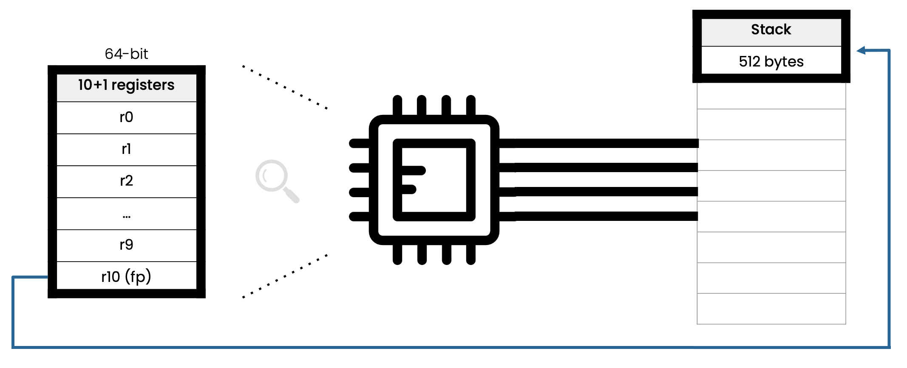
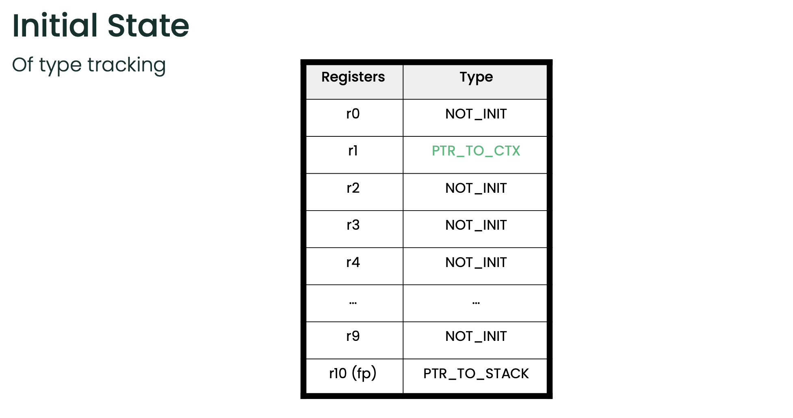
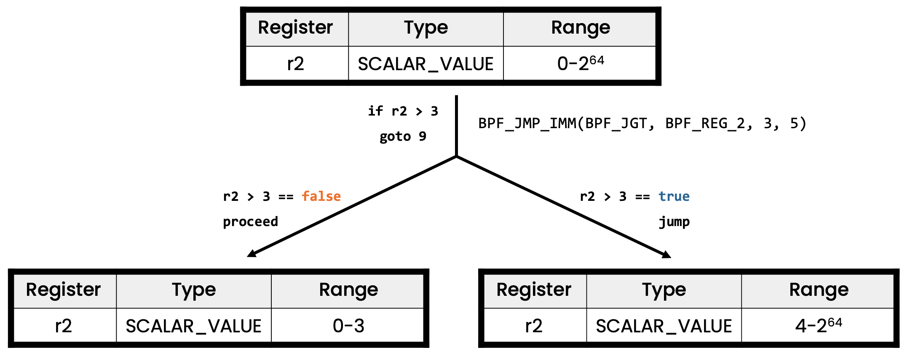
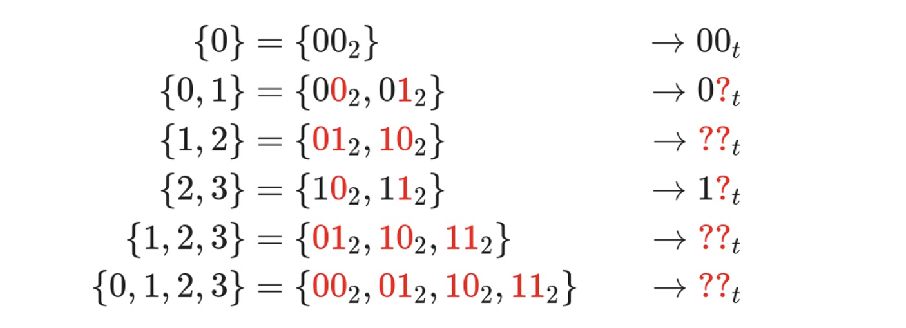

## bpf verifier (1)

[TOC]

由于经常 failed to load bpf progs, we need to know more about bpf verifier.

### basics

#### ebpf register



`r10` 是唯一的只读寄存器，其中存放的是访问 BPF 栈空间的栈帧指针（frame pointer） 地址。`r0` - `r9` 是可以被读/写的通用目的寄存器。

#### call convention

BPF 程序可以调用核心内核（而不是内核模块）预定义的一些辅助函数。**BPF call convention** 定义如下：

- `r0` 存放被调用的辅助函数的返回值，返回值的语义由程序类型决定。另外， 当将执行权交回内核时，返回值是以 32 位传递的。
- `r1` - `r5` 存放 BPF 调用内核辅助函数时传递的参数
- `r6` - `r9` 由被调用方（callee）保存，在函数返回之后调用方（caller）可以读取

`r1` - `r5` 寄存器是 **scratch registers**，意思是说，如果要在多次辅助函数调用之 间重用这些寄存器内的值，那 BPF 程序需要负责将这些值**临时转储（spill）到 BPF 栈**上 ，或者保存到被调用方（callee）保存的寄存器中。**Spilling**（倒出/转储） 的意思是这些寄存器内的变量被移到了 BPF 栈中。相反的操作，即将变量从 BPF 栈移回寄 存器，称为 **filling**（填充）。**spilling/filling 的原因是寄存器数量有限**。

more about spilling and filling：比如写下面这种程序就会有 spill/refill 了。https://godbolt.org/z/nPqffv3fe

```c
int example_bpf_program(struct __sk_buff *skb) {
    int a = 1;
    int b = 2;
    int c = 3;
    int d = 4;

    int result = a + b + c + d;

    return result;
}
/*
example_bpf_program:                    # @example_bpf_program
        *(u64 *)(r10 - 8) = r1
        r1 = 1
        *(u32 *)(r10 - 12) = r1
        r1 = 2
        *(u32 *)(r10 - 16) = r1
        r1 = 3
        *(u32 *)(r10 - 20) = r1
        r1 = 4
        *(u32 *)(r10 - 24) = r1
        r1 = *(u32 *)(r10 - 12)
        r2 = *(u32 *)(r10 - 16)
        r1 += r2
        r2 = *(u32 *)(r10 - 20)
        r1 += r2
        r2 = *(u32 *)(r10 - 24)
        r1 += r2
        *(u32 *)(r10 - 28) = r1
        exit
*/
```

BPF 程序开始执行时，**`r1` 寄存器中存放的是程序的上下文**（context）。上下文就是 **程序的输入参数**（和典型 C 程序的 `argc/argv` 类似）。**BPF 只能在单个上下文中 工作**（restricted to work on a single context）。这个**上下文是由程序类型定义的**， 例如，网络程序可以将网络包的内核表示（`skb`）作为输入参数。

#### bpf instruction

BPF 指令格式（instruction format）建模为两操作数指令（two operand instructions）， 这种格式可以在 **JIT 阶段**将 BPF 指令**映射（mapping）**为原生指令。指令集是固定长 度的，这意味着每条指令都是 64 比特编码的。目前已经实现了 87 条指令，并且在需要时 可以对指令集进行进一步扩展。一条 64 位指令在大端机器上的编码格式如下，从重要性最 高比特（most significant bit，MSB）到重要性最低比特（least significant bit，LSB）

```
op:8, dst_reg:4, src_reg:4, off:16, imm:32
```

```c
/* Defined in include/uapi/linux/bpf.h */
struct bpf_insn {
        __u8    code;           /* opcode */
        __u8    dst_reg:4;      /* dest register */
        __u8    src_reg:4;      /* source register */
        __s16   off;            /* signed offset */
        __s32   imm;            /* signed immediate constant */
};
```

`off` 和 `imm` 都是有符号类型。编码信息定义在内核头文件 `linux/bpf.h` 中，这个头 文件进一步 `include` 了 `linux/bpf_common.h`。

`op` 定了将要执行的操作。`op` 复用了大部分 cBPF 的编码定义。操作可以基于寄存器值 ，也可以基于立即操作数（immediate operands）。`op` 自身的编码信息中包含了应该使 用的模式类型：

- `BPF_X` 指基于寄存器的操作数（register-based operations）
- `BPF_K` 指基于立即操作数（immediate-based operations）

对于后者，目的操作数永远是一个寄存器（destination operand is always a register）。 `dst_reg` 和 `src_reg` 都提供了寄存器操作数（register operands，例如 `r0` - `r9`）的额外信息。在某些指令中，`off` 用于表示一个相对偏移量（offset）， 例如，对那些 BPF 可用的栈或缓冲区（例如 map values、packet data 等等）进行寻 址，或者跳转指令中用于跳转到目标。`imm` 存储一个常量/立即值。

所有的 `op` 指令可以分为若干类别。类别信息也编码到了 `op` 字段。`op` 字段分为（ 从 MSB 到 LSB）：`code:4`, `source:1` 和 `class:3`。

- `class` 是指令类型
- `code` 指特定类型的指令中的某种特定操作码（operational code）
- `source` 可以告诉我们源操作数（source operand）是一个寄存器还是一个立即数

可能的指令类别包括：

- `BPF_LD`, `BPF_LDX`：**加载操作**（load operations）
  - `BPF_LD` 用于加载**double word 长度的特殊指令**（占两个指令长度，源于 `imm:32` 的限制），或byte / half-word / word 长度的**包数据**（packet data ）。后者是从 cBPF 中延续过来的，主要为了保证 cBPF 到 BPF 翻译的高效，因为 这里的 JIT code 是优化过的。对于 native BPF 来说，这些包加载指令在今天已经 用的很少了。
  - `BPF_LDX` 用于从内存中加载 byte / half-word / word / double-word，这里的内 存包括栈内存、map value data、packet data 等等。
- `BPF_ST`, `BPF_STX`：**存储操作**（store operations）
  - `BPF_STX` 与 `BPF_LDX` 相对，将某个寄存器中的值存储到内存中，同样，这里的 内存可以是栈内存、map value、packet data 等等。`BPF_STX` 类包含一些 word 和 double-word 相关的原子加操作，例如，可以用于计数器。
  - `BPF_ST` 类与 `BPF_STX` 类似，提供了将数据存储到内存的操作，只不过其源操作 数（source operand）必须是一个立即值（immediate value）。
- `BPF_ALU`, `BPF_ALU64`：**逻辑运算操作**（ALU operations）
- `BPF_JMP`：**跳转操作**（jump operations）

用个 example 解析一下

```c
#define BPF_RAW_INSN(CODE, DST, SRC, OFF, IMM)			\
	((struct bpf_insn) {					\
		.code  = CODE,					\
		.dst_reg = DST,					\
		.src_reg = SRC,					\
		.off   = OFF,					\
		.imm   = IMM })

BPF_RAW_INSN(BPF_LD | BPF_IMM | BPF_DW, 0, BPF_REG_1, 0, 1),
```

在这个 example 中最后一条指令， BPF_LD 是 BPF class 的一种，BPF_IMM 属于是 BPF mode（0xe=0111，占3个bit），BPF_DW 是 BPF size 的一种（是指明操作的 field大小，占两个 bit），BPF size 和 BPF mode 都是 code field 和 source field。

```c

/* Instruction classes */
#define BPF_CLASS(code) ((code) & 0x07)
#define		BPF_LD		0x00
#define		BPF_LDX		0x01
#define		BPF_ST		0x02
#define		BPF_STX		0x03
#define		BPF_ALU		0x04
#define		BPF_JMP		0x05
#define		BPF_RET		0x06
#define		BPF_MISC        0x07

/* ld/ldx fields */
#define BPF_SIZE(code)  ((code) & 0x18)
#define		BPF_W		0x00 /* 32-bit */
#define		BPF_H		0x08 /* 16-bit */
#define		BPF_B		0x10 /*  8-bit */
/* eBPF		BPF_DW		0x18    64-bit */
#define BPF_MODE(code)  ((code) & 0xe0)
#define		BPF_IMM		0x00
#define		BPF_ABS		0x20
#define		BPF_IND		0x40
#define		BPF_MEM		0x60
#define		BPF_LEN		0x80
#define		BPF_MSH		0xa0

/* alu/jmp fields */
#define BPF_OP(code)    ((code) & 0xf0)
#define		BPF_ADD		0x00
#define		BPF_SUB		0x10
#define		BPF_MUL		0x20
#define		BPF_DIV		0x30
#define		BPF_OR		0x40
#define		BPF_AND		0x50
#define		BPF_LSH		0x60
#define		BPF_RSH		0x70
#define		BPF_NEG		0x80
#define		BPF_MOD		0x90
#define		BPF_XOR		0xa0

#define		BPF_JA		0x00
#define		BPF_JEQ		0x10
#define		BPF_JGT		0x20
#define		BPF_JGE		0x30
#define		BPF_JSET        0x40
#define BPF_SRC(code)   ((code) & 0x08)
#define		BPF_K		0x00
#define		BPF_X		0x08
```


### to gurantee safety

分为几种：

1. invalid memory use
   1. reading
   2. writing
2. address leakage
3. Improper termination
4. violation of spec

按照 maintainer 最初始的 bpf verifier patch [PATCH v5 net-next 14/29\] bpf: verifier (add verifier core) - Alexei Starovoitov (kernel.org)](https://lkml.kernel.org/netdev/1408911690-7598-15-git-send-email-ast@plumgrid.com/)  的说法，则是

```
This way it walks all possible paths through the program and checks all
possible values of registers. While doing so, it checks for:
- invalid instructions
- uninitialized register access
- uninitialized stack access
- misaligned stack access
- out of range stack access
- invalid calling convention
- instruction encoding is not using reserved fields
```


为了保证这些安全，bpf verifier 非常暴力，各种 helper function, params, instruction, register&value 都检查一遍


#### tracking type

对每个 register，verifier 会检查这个结构体，这个东西很长，就不全列出来了。就检查现在的寄存器里面存的是什么类型，值大小多少

```c
// include/linux/bpf_verifier.h
struct bpf_reg_state {
	/* Ordering of fields matters.  See states_equal() */
	enum bpf_reg_type type;
	/* Fixed part of pointer offset, pointer types only */
	s32 off;
```

Types 分为

* non-init：寄存器里面的东西没有意义
* scalar：是数字的东西都算 scalar，也可以说不是 pointer 的都是 scalar
* pointer：表示里面存的是指针

具体包括

```c
// include/linux/bpf.h
/* types of values stored in eBPF registers */
/* Pointer types represent:
 * pointer
 * pointer + imm
 * pointer + (u16) var
 * pointer + (u16) var + imm
 * if (range > 0) then [ptr, ptr + range - off) is safe to access
 * if (id > 0) means that some 'var' was added
 * if (off > 0) means that 'imm' was added
 */
enum bpf_reg_type {
	NOT_INIT = 0,		 /* nothing was written into register */
	SCALAR_VALUE,		 /* reg doesn't contain a valid pointer */
	PTR_TO_CTX,		 /* reg points to bpf_context */
	CONST_PTR_TO_MAP,	 /* reg points to struct bpf_map */
	PTR_TO_MAP_VALUE,	 /* reg points to map element value */
	PTR_TO_MAP_VALUE_OR_NULL,/* points to map elem value or NULL */
	PTR_TO_STACK,		 /* reg == frame_pointer + offset */
	PTR_TO_PACKET_META,	 /* skb->data - meta_len */
	PTR_TO_PACKET,		 /* reg points to skb->data */
	PTR_TO_PACKET_END,	 /* skb->data + headlen */
	PTR_TO_FLOW_KEYS,	 /* reg points to bpf_flow_keys */
    // ... 还有好多都是 PTR
	__BPF_REG_TYPE_MAX,
};
```

在 `do_check_common` 里初始化寄存器: https://elixir.bootlin.com/linux/v5.15.133/source/kernel/bpf/verifier.c#L13386



在 do_check_common 中开枝散叶，顺序遍历每一个语句，调用各种检查，内部是一个巨大的 switch，先找到 BPF 指令的 class，然后再进行具体的 check

```c
static int do_check(struct bpf_verifier_env *env) { /* 332 lines */
	for (;;) {
		struct bpf_insn *insn = &insns[env->insn_idx];
		u8 class = BPF_CLASS(insn->code);

		if (class == BPF_ALU || class == BPF_ALU64) {
			...
		} else if (class == BPF_LDX) {
			...
		} else if (class == BPF_STX) {
			...
		} else if (class == BPF_ST) {
			...
		} else if (class == BPF_JMP || class == BPF_JMP32) {
			...
		} else if (class == BPF_LD) {
			...
		}

		env->insn_idx++;
	}

```

示例程序: 

```c
#include "vmlinux.h"
#include <bpf/bpf_helpers.h>
#include <bpf/bpf_core_read.h>
#include <bpf/bpf_tracing.h>

SEC("socket")
void *test_prog(struct __sk_buff *skb) {
    return skb;
}
```

在命令行中运行以上示例程序，按照 talk [1] 的说法，应该会被 bpf_verifier 阻拦，并报错 "R0 leaks addr as return value"，发现并没有被 bpf_verifier 阻拦，和 talk 里面说的不一样....https://www.youtube.com/watch?v=_63fdh7Ye9M，（但代码里面他说的逻辑好像也没有错呀。。。）

```shell
~/proj/learning-ebpf/scratch (main ✗) sudo bpftool prog load -d bpf_test.bpf.o /sys/fs/bpf/hello
libbpf: loading bpf_test.bpf.o
libbpf: elf: section(3) socket, size 16, link 0, flags 6, type=1
libbpf: sec 'socket': found program 'test_prog' at insn offset 0 (0 bytes), code size 2 insns (16 bytes)
libbpf: elf: section(13) .BTF, size 1213, link 0, flags 0, type=1
libbpf: elf: section(14) .BTF.ext, size 96, link 0, flags 0, type=1
libbpf: elf: section(22) .symtab, size 288, link 1, flags 0, type=2
libbpf: looking for externs among 12 symbols...
libbpf: collected 0 externs total
libbpf: prog 'test_prog': -- BEGIN PROG LOAD LOG --
func#0 @0
0: R1=ctx(id=0,off=0,imm=0) R10=fp0
; void *test_prog(struct __sk_buff *skb) {
0: (bf) r0 = r1
1: R0_w=ctx(id=0,off=0,imm=0) R1=ctx(id=0,off=0,imm=0) R10=fp0
; return skb;
1: (95) exit
verification time 42 usec
stack depth 0
processed 2 insns (limit 1000000) max_states_per_insn 0 total_states 0 peak_states 0 mark_read 0
-- END PROG LOAD LOG --
```

找了半天，原来有个在检查 return code 里面有个判断，

```c
// verifer 在检查最后的退出 exit 语句时，会考虑 返回值是不是传递了指针
static int check_return_code(struct bpf_verifier_env *env)
{
    /* 检查 regs[BPF_REG_0.type != SCALAR ? true : false，如果返回指针，则泄露了地址 */
	if (is_pointer_value(env, BPF_REG_0)) {
		verbose(env, "R0 leaks addr as return value\n");
		return -EACCES;
	}
}
// is_pointr_value 只有在不允许 allow_ptr_leaks 的时候才会阻止返回指针的行为
static bool is_pointer_value(struct bpf_verifier_env *env, int regno)
{
	return __is_pointer_value(env->allow_ptr_leaks, reg_state(env, regno));
}
// 后面再看看这个 allow_ptr_leaks 是怎么初始化的
// ->
int bpf_check(struct bpf_prog **prog, union bpf_attr *attr, bpfptr_t uattr)
{
    // ...
    env->allow_ptr_leaks = bpf_allow_ptr_leaks();
    // ...
	ret = ret ?: do_check_main(env);
}
// ->
static inline bool bpf_allow_ptr_leaks(void)
{
	return perfmon_capable();
}
// -> 
static inline bool perfmon_capable(void)
{
	return capable(CAP_PERFMON) || capable(CAP_SYS_ADMIN);
}
// 因为我们用 root 跑，是 CAP_SYS_ADMIN 所以就可以返回地址了
// 如何不用 root 跑，我还没研究过....
```

### more about bpf types

composite types(5.16 引入): base type 和 modified types

bpf_type_flags 表示对 type 的修饰

```c
// include/linux/bpf.h
enum bpf_type_flag {
	/* PTR may be NULL. */
	PTR_MAYBE_NULL		= BIT(0 + BPF_BASE_TYPE_BITS),

	/* MEM is read-only. When applied on bpf_arg, it indicates the arg is
	 * compatible with both mutable and immutable memory.
	 */
	MEM_RDONLY		= BIT(1 + BPF_BASE_TYPE_BITS),

	/* MEM points to BPF ring buffer reservation. */
	MEM_RINGBUF		= BIT(2 + BPF_BASE_TYPE_BITS),

	/* MEM is in user address space. */
	MEM_USER		= BIT(3 + BPF_BASE_TYPE_BITS),
    
    // ... 省略中间一片代码

	/* DYNPTR points to sk_buff */
	DYNPTR_TYPE_SKB		= BIT(15 + BPF_BASE_TYPE_BITS),

	/* DYNPTR points to xdp_buff */
	DYNPTR_TYPE_XDP		= BIT(16 + BPF_BASE_TYPE_BITS),

	__BPF_TYPE_FLAG_MAX,
	__BPF_TYPE_LAST_FLAG	= __BPF_TYPE_FLAG_MAX - 1,
};
```

而 bpf_reg_type 其实是基于 

```c

enum bpf_reg_type {
	NOT_INIT = 0,		 /* nothing was written into register */
    // 下面是一些 base types
	SCALAR_VALUE,		 /* reg doesn't contain a valid pointer */
	PTR_TO_CTX,		 /* reg points to bpf_context */
	CONST_PTR_TO_DYNPTR,	 /* reg points to a const struct bpf_dynptr */
	__BPF_REG_TYPE_MAX,

	/* Extended reg_types. */
    // 这些是 modified types，需要这些 modified types 的原因是因为 一些 helper function
    // 导致的，比如 helper function 调用可能失败了，需要返回一个 null 值
    // 这里 base type 就是 PTR_TO_MAP_VALUE，然后加了一个 modifier flag PTR_MAYBE_NULL
	PTR_TO_MAP_VALUE_OR_NULL	= PTR_MAYBE_NULL | PTR_TO_MAP_VALUE,
	PTR_TO_SOCKET_OR_NULL		= PTR_MAYBE_NULL | PTR_TO_SOCKET,
    
};
```


#### tracking value

需要能够验证是否存在 out-of-bound value，譬如

```c
unsigned int i;
char arr[4] = { 1, 2, 3, 4 };

SEC("socket")
int bpf_prog(void)
{
	return arr[i]; /* Is i < 4 ? i 是否小于4？ */
}
```

这个例子在 load 的时候就会报错

```shell
~/proj/learning-ebpf/scratch (main ✗) sudo bpftool prog load -d bpf_test.bpf.o /sys/fs/bpf/hello
libbpf: loading bpf_test.bpf.o
# ...
libbpf: prog 'test_prog': BPF program load failed: Permission denied
libbpf: prog 'test_prog': -- BEGIN PROG LOAD LOG --
func#0 @0
0: R1=ctx(id=0,off=0,imm=0) R10=fp0
; return arr[i];
0: (18) r1 = 0xffffa55a46484000
2: R1_w=map_value(id=0,off=0,ks=4,vs=4,imm=0) R10=fp0
2: (61) r1 = *(u32 *)(r1 +0)
 R1_w=map_value(id=0,off=0,ks=4,vs=4,imm=0) R10=fp0
3: R1_w=inv(id=0,umax_value=4294967295,var_off=(0x0; 0xffffffff)) R10=fp0
; return arr[i];
3: (18) r2 = 0xffffa55a4645d000
5: R1_w=inv(id=0,umax_value=4294967295,var_off=(0x0; 0xffffffff)) R2_w=map_value(id=0,off=0,ks=4,vs=4,imm=0) R10=fp0
5: (0f) r2 += r1
last_idx 5 first_idx 0
regs=2 stack=0 before 3: (18) r2 = 0xffffa55a4645d000
regs=2 stack=0 before 2: (61) r1 = *(u32 *)(r1 +0)
6: R1_w=invP(id=0,umax_value=4294967295,var_off=(0x0; 0xffffffff)) R2_w=map_value(id=0,off=0,ks=4,vs=4,umax_value=4294967295,var_off=(0x0; 0xffffffff)) R10=fp0
6: (71) r0 = *(u8 *)(r2 +0)
 R1_w=invP(id=0,umax_value=4294967295,var_off=(0x0; 0xffffffff)) R2_w=map_value(id=0,off=0,ks=4,vs=4,umax_value=4294967295,var_off=(0x0; 0xffffffff)) R10=fp0
R2 unbounded memory access, make sure to bounds check any such access
verification time 110 usec
stack depth 0
processed 5 insns (limit 1000000) max_states_per_insn 0 total_states 0 peak_states 0 mark_read 0
-- END PROG LOAD LOG --
libbpf: prog 'test_prog': failed to load: -13
libbpf: failed to load object 'bpf_test.bpf.o'
Error: failed to load object file
```

加上边界检查就没事了

```c
unsigned int i;
char arr[4] = { 1, 2, 3, 4 };

SEC("sock_filter")
int bpf_prog(void)
{
    if (i < 4) {
        return arr[i]; /* Is i < 4 ? i 是否小于4？ */
    }
}
```

```shell
~/proj/learning-ebpf/scratch (main ✗) sudo bpftool prog dump xlated id 133
int test_prog():
; int test_prog(void) {
   0: (b7) r0 = 0
; if (i < 4) {
   1: (18) r1 = map[id:34][0]+0
   3: (61) r1 = *(u32 *)(r1 +0)
; if (i < 4) {
   4: (25) if r1 > 0x3 goto pc+6
; return arr[i];
   5: (18) r2 = map[id:33][0]+0 # 这里的 id:33 是指 MAP id 为 33 的 bpf map
   7: (0f) r2 += r1
   8: (71) r0 = *(u8 *)(r2 +0)
   9: (67) r0 <<= 56
  10: (c7) r0 s>>= 56
; }
  11: (95) exit

~/proj/learning-ebpf/scratch (main ✗) llvm-objdump-14 -D bpf_test.bpf.o
0000000000000000 <test_prog>:
       0:	b7 00 00 00 00 00 00 00	r0 = 0
       1:	18 01 00 00 00 00 00 00 00 00 00 00 00 00 00 00	r1 = 0 ll # 0 ll 是什么，这个时候可能 bpf map 还没有load进去，所以还无法确定位置？
       3:	61 11 00 00 00 00 00 00	r1 = *(u32 *)(r1 + 0)
       4:	25 01 06 00 03 00 00 00	if r1 > 3 goto +6 <LBB0_2> # 翻译成汇编就是  BPF_JMP_IMM(BPF_JGT(class=BPF_JMP=0x05, code=BPF_JGT=0x20), BPF_REG_1(0x01), 0, 6));
       5:	18 02 00 00 00 00 00 00 00 00 00 00 00 00 00 00	r2 = 0 ll
       7:	0f 12 00 00 00 00 00 00	r2 += r1
       8:	71 20 00 00 00 00 00 00	r0 = *(u8 *)(r2 + 0)
       9:	67 00 00 00 38 00 00 00	r0 <<= 56
      10:	c7 00 00 00 38 00 00 00	r0 s>>= 56
```

关于 JMP 指令的相关代码实现

```c
// kernel/bpf/verifier.c
static int check_cond_jmp_op(struct bpf_verifier_env *env,
			     struct bpf_insn *insn, int *insn_idx)
{
    // 其实对于 JMP，认为是一个新 stack
	other_branch = push_stack(env,
                             *insn_idx + insn->off + 1,
	                         *insn_idx, false);
	other_branch_regs =
     other_branch->frame[other_branch->curframe]->regs;

	if (BPF_SRC(insn->code) == BPF_X) {
		...
	} else if (dst_reg->type == SCALAR_VALUE) {
        // 对两个 stack 的寄存器分别设置取值范围
		reg_set_min_max(
               &other_branch_regs[insn->dst_reg],
				dst_reg, insn->imm, (u32)insn->imm,
				opcode, is_jmp32);
	}
}

```

对于指令 `BPF_JMP_IMM(BPF_JGT(class=BPF_JMP=0x05, code=BPF_JGT=0x20), BPF_REG_1(0x01), 0, 6));`，会走到 

```c
static void reg_set_min_max(
struct bpf_reg_state *true_reg,
			    struct bpf_reg_state *false_reg,
			    u64 val, u32 val32,
			    u8 opcode, bool is_jmp32)
{
	switch (opcode) {
	case BPF_JEQ:
	case BPF_JNE:
		...
	case BPF_JSET:
		...
	case BPF_JGT:
		false_reg->umax_value =
	    	min(false_reg->umax_value, val);

	    true_reg->umin_value =
	    	max(true_reg->umin_value, val + 1);
	
	    break;
	case BPF_JSGE:
	case BPF_JSGT:
		...
	case BPF_JLE:
	case BPF_JLT:
		...
	}
}
```

它相当于对两个分支的同一个register，设置了不同的 取值范围，结果如下图



Value check 不止 out-of-bound，还有 Sígness, Overflow/Underflow, Alignment and size (64-bit vs 32-bit), Different types, Pointer arithmetics，所以很麻烦的。

bpf verifier 里面有了一堆上限和下限去追踪可能的值

```c
struct bpf_reg_state {
	enum bpf_reg_type type;
	s64 smin_value; /* minimum possible (s64)value */
	s64 smax_value; /* maximum possible (s64)value */
	u64 umin_value; /* minimum possible (u64)value */
	u64 umax_value; /* maximum possible (u64)value */
	s32 s32_min_value; /* minimum possible (s32)value */
	s32 s32_max_value; /* maximum possible (s32)value */
	u32 u32_min_value; /* minimum possible (u32)value */
	u32 u32_max_value; /* maximum possible (u32)value */
	struct tnum var_off; // 这个是 tristate value，
	...
};

```

还有个 tristate(triple state 三种状态) 的 tricky thing，一个 bit 有三种状态，0，1 或者都有可能。它相当于自己形成了一个群环域（抽象代数的东西，记不清了），有自己的加减乘除法，bpf verifier 就是用 上下限和 tristate 来一起描述 寄存器的取值范围的，这个可以用 formal verification 证明其正确性。可以参考论文 

* [Sound, Precise, and Fast Abstract Interpretation with Tristate Numbers](https://doi.org/10.48550/arXiv.2105.05398)
* [Model Checking (a very small part) of BPF Verifier](https://gist.github.com/shunghsiyu/a63e08e6231553d1abdece4aef29f70e)



### tracking stack 

track all registers saved to stack when spilling. spill 就是把寄存器变量存到 stack 了

```c
struct bpf_stack_state {
	struct bpf_reg_state spilled_ptr;
	u8 slot_type[BPF_REG_SIZE];
};
```


### code sanitization

bpf verifier 也会改用户代码的指令，或者说 instruction patching，叫做 sanitization

### tracing program

tracing 类型的 ebpf 程序不太一样，verifier 会将他们区别对待，比如一些 memory access 可能是合理的。


### Tips

#### 调整 bpf verifier log level

Set log_level to 3 == (BPF_LOG_LEVEL1 | BPF_LOG_LEVEL2)

Set bpf_attr.log_level and call printf("%s", bpf_attr.log_buf)

Set bpf_object_open_opts.kernel_log_level and, set callback with libbpf_set_print([libbpf_print_fn](https://github.com/libbpf/libbpf-bootstrap/blob/bc18679/examples/c/minimal.c))

### questions

bpftool load -d 里面的那些 log 是什么，比如 inv，还有 R0_w 之类的

### reference 

1. Peeking into BPF veifier, COSCUP 2023 https://www.youtube.com/watch?v=_63fdh7Ye9M
2. Cilium：BPF 和 XDP 参考指南（2021） https://arthurchiao.art/blog/cilium-bpf-xdp-reference-guide-zh/
3. More Than u want to know about bpf verifier https://www.youtube.com/watch?v=T4QAWIHb9ZU
4. [Sound, Precise, and Fast Abstract Interpretation with Tristate Numbers](https://doi.org/10.48550/arXiv.2105.05398)
5. [Model Checking (a very small part) of BPF Verifier](https://gist.github.com/shunghsiyu/a63e08e6231553d1abdece4aef29f70e)
