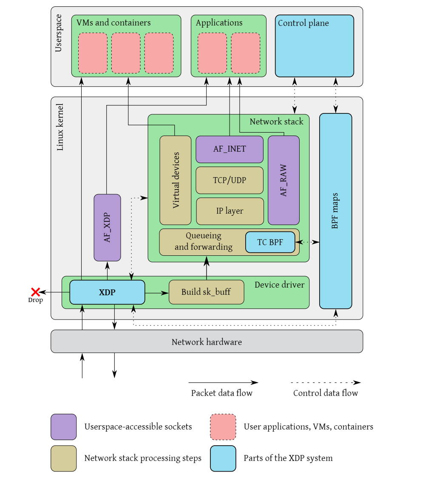
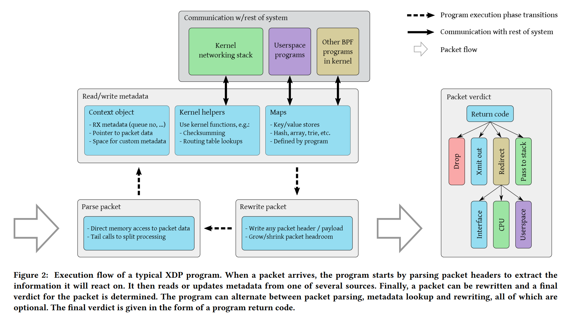
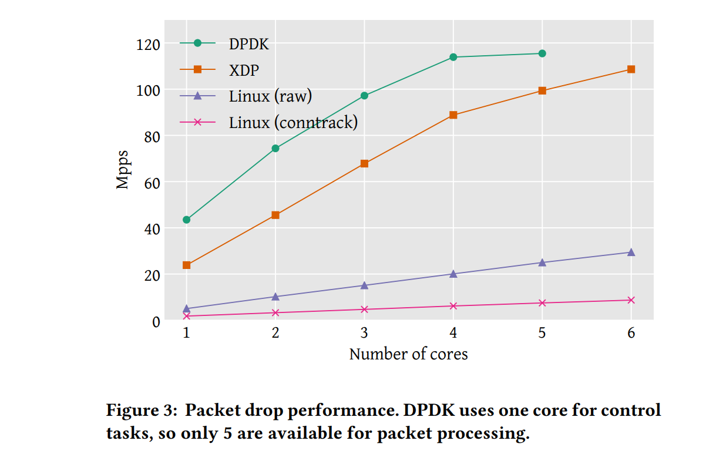
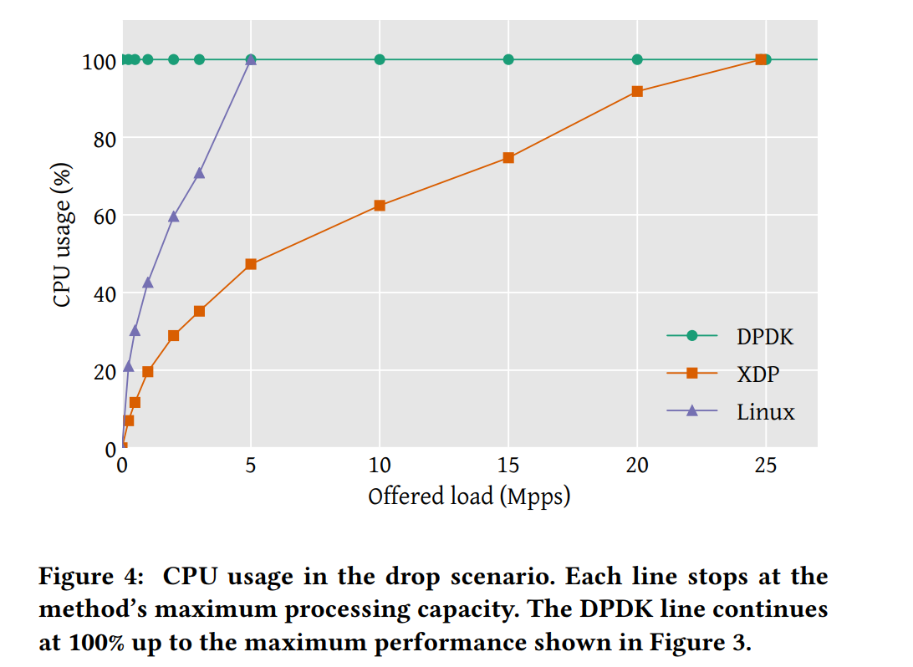
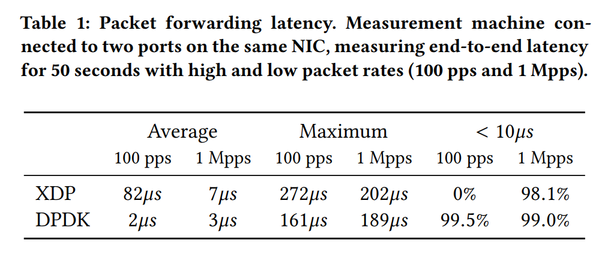
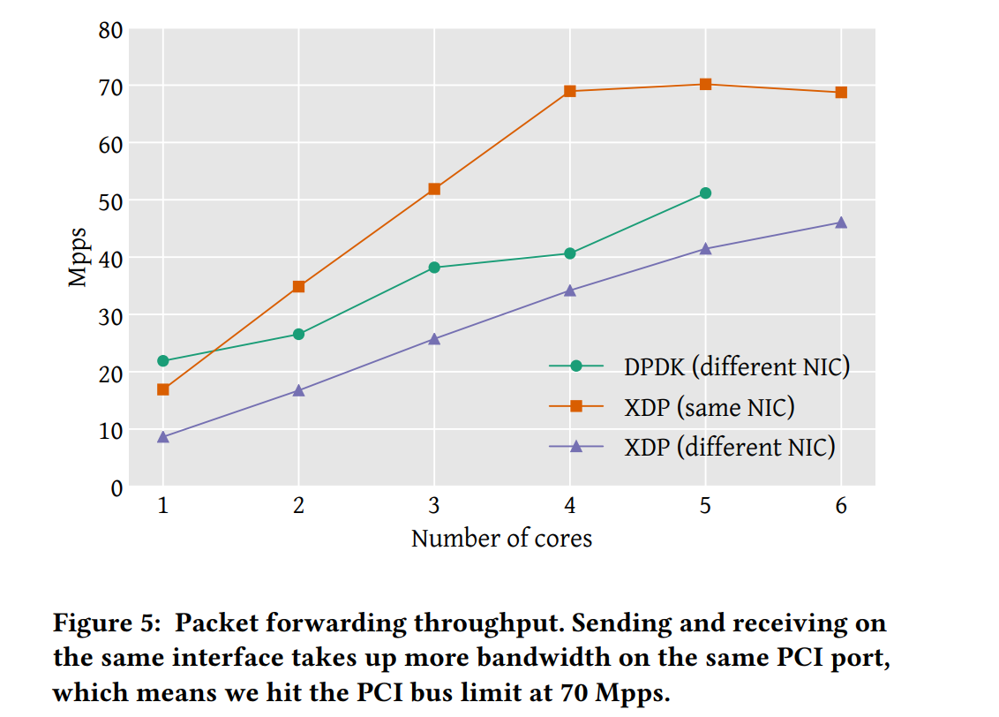

## paper notes for XDP

>  主要是翻译......

Paper: The eXpress data path: fast programmable packet processing in the operating system kernel

Link: https://dl.acm.org/doi/10.1145/3281411.3281443

* paper 简介

作者列表里有 David Miller，内核 net 模块的 maintainer，还有 cilium 的大佬，膜。（其他人也不太认识了.......

我们知道，内核协议栈在高性能业务场景可能有些捉襟见肘，按照一些 paper 的说法，CPU是瓶颈，单核 CPU 打满，收包 40Gbps(Iperf 和 netperf 测的)，1Mpps(forwarding)，在小包场景下，瓶颈在于协议栈解析的开销，而大包场景下，瓶颈在于 data copy 的开销。（按 leader 和 mentor 的说法，“这不是常识吗”）

所以就需要一些对应的优化，于是有了一些 zero-copy 和 绑核 polling 的优化。有了一些 bypass kernel  的 DPDK，RDMA 高性能网络协议栈。AF_XDP 也是其中之一，它在 skb 创建之前，拿到了完整的驱动里未经修改的包，直接交给用户态，实现了用户态自定的协议栈，某些情况下可以 zero-copy，然后协议栈解析可以自己定制。所以性能好。另外 kernel bypassing 也节省 user/kernel 的 context switch 的开销。

它比起 RDMA DPDK的优势在于，内核的用户隔离，安全策略也被绕过去了。XDP 部分还是在内核里的。

这篇papper也介绍了 XDP 的性能，大概在 24 Mpps，也可以用来实现 一些 layer-3 routing，layer-4 load balancing，DDoS protection 的应用。

* paper background

高性能网络对网络处理包时延有严苛要求，传统协议栈主要考虑针对灵活性优化，意味着每个包都执行了过多的操作。因此一些特殊设计的协议栈，如 DPDK，很流行。他们绕开内核，将硬件的控制权交给 networking application。（比如 DPDK 要占一个网卡）然后也要独占一个或者多个 CPU 用于包处理。

内核旁路方法可以显著提高性能，但其缺点是更难与现有系统集成（integrate），应用程序必须重新实现本来由操作系统网络协议栈提供的功能，比如 routing tables 和 更高层次的协议。在最坏的情况下，这将导致 处理网络包的应用程序 在一个完全独立的环境中运行，而之现有的工具和由 OS 提供的部署机制不能使用，因为需要直接的硬件访问（而这时候硬件交给应用控制了）。这导致了系统复杂性的增加，模糊了安全边界。后者尤其带来了一些问题，因为基础设施正在变得 容器/微服务化，其中内核在资源抽象和隔离方面起着主导作用。

作为内核旁路设计的替代方案，作者提出了 XDP，以嵌入的方式在操作系统网络协议栈中直接增加可编程性。这使得执行高速数据包处理成为可能，它与现有系统无缝集成，同时有选择地利用操作系统的功能。这个框架被称为 eXpress Data Path（XDP），它通过定义一个有限的执行环境，以虚拟机的形式运行eBPF代码，这是原始BSD Packet Filter（BPF）字节代码格式的扩展版本。这个环境直接在内核上下文中执行自定义程序，在内核本身接触到数据包之前，这使得自定义处理（包括重定向）可以在数据包从硬件接收后的最早时间点进行。内核通过在加载时静态验证这些程序，确保定制程序的安全性；并且程序被动态编译成本地机器指令，以确保高性能。在几个版本中，XDP 已经被逐渐整合到 Linux 内核中，但以前没有关于整个系统的完整架构描述。在这项工作中，作者提出了对XDP及其功能的高层次设计描述，以及它如何与Linux内核的其他部分集成。根据的性能评估显示，每个 CPU 核的原始数据包处理性能高达每秒钟 24Mpps 数据包。虽然这与相同硬件上基于 DPDK 的应用所能达到的最高性能不尽相同，但作者认为 XDP 系统通过提供比 DPDK 和其他内核旁路解决方案更有说服力的优势而弥补了这一点。具体来说，XDP 有如下优势：

1. 与常规网络协议栈合作集成，保留了对内核中硬件的完全控制。这保留了内核的安全边界，并且不需要改变网络配置和管理工具。此外，任何带有 Linux 驱动程序的网络适配器都可以被 XDP 支持；

2. 不需要特殊的硬件功能，现有的驱动程序只需要修改以添加 XDP 执行钩。使得有选择地利用内核网络协议栈功能成为可能，如路由表和 TCP 协议栈，保持相同的配置界面，同时加速关键性能路径。

3. 保证了 eBPF 指令集和编程接口（API）的稳定性，同时也暴露了它。

4. **在与基于正常套接字层的工作负载交互时，不需要从用户空间向内核空间重新注入昂贵的数据包。**（没懂）

5. 对在主机上运行的应用程序是透明的，实现了新的部署方案，如针对服务器上的拒绝服务攻击的内联保护。

6. 可以在不中断服务的情况下动态地重新编程，这意味着可以在不需要这些功能的情况下即时添加或完全删除，而不会中断网络流量，并且处理过程可以对系统其他部分的情况作出动态反应。

7. 不需要将全部 CPU 核心用于数据包处理，这意味着较低的流量水平会直接转化为较低的 CPU 使用率。提升效率，节省用电。

* related works

XDP 不是第一个支持可编程网络包处理，相反，这一领域在过去几年中获得了发展势头，并将继续持续发展。现有几个框架来实现这种可编程性，而且它们已经实现了许多新的应用。这种应用的例子包括那些执行单一功能的应用，如 switching、routing、name-based forwarding、classification、caching 或 traffic generation。它们还包括更普遍的解决方案，这些解决方案是高度可定制的，可以对来自不同来源的数据包进行操作。为了在普通现货（COTS）硬件上实现高的数据包处理性能，有必要消除网络接口卡（NIC）和执行数据包处理的程序之间的任何瓶颈。由于性能瓶颈的主要来源之一是操作系统内核和运行在其上的用户空间应用程序之间的接口（因为**系统调用的高开销**和**底层功能丰富的通用协议栈的复杂性**），low-level 包处理框架必须以某种方式管理这种开销。现有的框架，实现了上述的应用，采取了几种方法来确保高性能；而XDP是建立在其中几种技术之上的。下面我们简要介绍一下 XDP 和最常用的现有框架之间的异同。

DPDK 可能是最广泛使用的高速数据包处理框架。它起初是一个针对英特尔的硬件支持包，但后来在Linux基金会的管理下被广泛采用。DPDK 是一个内核旁路框架，它把对网络硬件的控制从内核中移到网络应用中，完全消除了内核-用户空间边界的开销。这种方法的其他例子包括PF_RING ZC模块和特定硬件的 Solarflare OpenOnload。**内核旁路提供了现有框架中最高的性能**。但坏处是之前网络灵活性都不复存在，有**维护和安全**的问题。

在引入XDP之前，将数据包处理功能作为内核模块来实现是一种高成本的方法。因为错误会使整个系统崩溃，而且内部的内核 APIs 频繁变化。由于这个原因，很少有系统采取这种方法。在那些采取这种方法的系统中，最突出的例子是 最突出的例子是 OVS 以及 Click 和Contrail 虚拟路由器框架。这些都是高度可配置的系统，具有广泛的范围，使它们能够在广泛的用途中摊薄成本。XDP 大大降低了将处理过程移入内核的应用成本。通过提供一个安全的执行环境和 内核社区的支持，从而提供了与其他接口一样的 提供同样的API稳定性保证。此外，XDP 程序可以完全绕过网络协议栈，这比传统的内核模块提供更高的性能。

虽然XDP允许数据包处理转移到操作系统中，以获得最大的性能，但它也允许程序 带来最大的性能，但它也允许载入内核的程序 装入内核的程序有选择地将数据包重定向到一个特殊的 用户空间的套接字类型，它绕过了正常的网络 绕过正常的网络协议栈，甚至可以在零拷贝模式下运行，以进一步降低 的开销。这种操作模式非常类似于 这种操作模式与Netmap[46]和PF_RING[11]等框架所使用的方法非常相似，通过降低数据包处理的开销，提供高的数据包处理性能，而且不完全绕过内核。这种方法，它与特殊用途的操作系统有一些相似性，如Arrakis[43]和ClickOS[36]。

最后，可编程的硬件设备是另一种实现高性能数据包处理的方式。实现高性能数据包处理。一个例子是 NetFPGA [32]，它暴露了一个API，使其有可能在基于FPGA的专用硬件上运行任意的数据包处理任务。P4语言[7]试图将这种可编程性扩展到更多种类的数据包处理硬件（包括。顺便说一下，包括XDP后端[51]）。在某种意义上，XDP可以被认为是一种 "软件卸载"，其中对性能敏感的处理 以提高性能，而应用程序则与常规网络协议栈进行交互。此外，不需要访问内核辅助功能的XDP程序可以完全卸载到支持的网络硬件上（目前 支持Netronome智能网卡[27]）。总而言之，XDP代表了一种高性能的包处理的方法，虽然它建立在以前的方法之上。它在性能、与系统的整合和一般的灵活性之间提供了一种新的权衡。系统和一般灵活性之间进行了新的权衡。下一节将更详细地解释 详细解释了 XDP 是如何实现这一目标的。

总之，XDP代表了一种高性能数据包处理的方法，虽然它建立在以前的方法之上，但在**性能、与系统的集成和一般的灵活性之间提供了一种新的权衡**。下一节将更详细地解释XDP是如何实现这一目标的。

* XDP的设计

XDP 设计的 motivation 是想要高性能网络协议栈 和 现有内核 能够整合起来。

这一部分会极少 XDP 的主要组成部分，以及他们是如何组合在一起工作的。

XDP 在 figure1 中 描述了它是如何整合到 linux kernel的，figure 2 说明了 XDP 程序的执行流。

figure1 中，网络包到达，在内核处理网络包之前（skb创建之前），会运行 main XDP hook 中的 ebpf 程序。这时候，可以选择丢弃 packet，或者发挥到原来的 NIC，重定向到其他核，或者重定向到 AF_XDP socket，发给用户态。也可以再常规网络协议栈中执行这些 XDP hook，有一个 TC BPF hook，在 packets queued for transmission 之前执行。不同的 eBPF 程序可以使用 BPF maps 互相通讯，也可以和 userspace 通讯，这里，我们只显示了 ingress 路径（收包路径）

Figure2，描述了 XDP 程序的执行流程，当数据包到达，程序会解析包头，了解需要执行哪些操作，读取和更新一些 metadata，packet 会被 rewritten，最后包会被判定，之后会如何执行 (PASS, REDIRECT, ABORT)

XDP 系统主要由四个部分：

1. XDP driver hook：这是 XDP 程序的入口点，当包从硬件收到的时候，会执行这些程序。

2. eBPF 虚拟机： 执行 XDP 的 bytecode，会实时编译 XDP 程序。

3. BPF map 是 KV 存储，作为 主要的和系统其他部分通信的通道。

4. eBPF verifier：在加载到内核前，静态验证 eBPF 程序，确认不会损害内核。

* 实验评估（ 又到了我们**喜闻乐见的实验部分**

CPU：Intel Xeon E5-1650 v4 3.60GHz，支持 DDIO

网卡： 两张 CX-5 Ex + mlx5 driver

Trex 用于生成测试流量

OS： linux 4.18

主要测试了3项：packet drop（最大包处理速度），CPU usage，packet forwarding performance。

1500 bytes可以直接打满 100Gbps，所以他们直接测试了 64 bytes，然后记录 pps。

然后也评估了核数增长和吞吐量的关系。

1. packet drop

可以看到 figure3 中，单核 XDP 可以做到 24 Mpps，DPDK 可以做到 43 Mpps，在达到 PCI bus 的 115 Mpps 极限之前，都一直是线性增加的。而 linux 内核在 iptables 防火墙可以丢弃数据包，是网络协议栈中最早可以丢包的实际，但如果使用 conntracking 的话，开销会很大。 conntrack 单核只能做到 1.8 Mpps，不用的话单核可以做到 4.8 Mpps。

如果单纯用 XDP 统计包数量，那么单核性能变为 4.5 Mpps，比 raw 低了 0.3 Mpps，那么意味着 (1/4.3 - 1/4.8) * 1e-6 = 13.3 ns，说明 XDP 统计包，对每个包而言，多花了 13.3 ns。

2. CPU 占用

   

使用 mpstat 系统工具统计 CPU busy time。 DPDK 需要一直 busy polling。而 XDP 和 Linux kernel 会随着 offered load 相应增加，按需使用 CPU。

左下角非线性是因为中断的处理造成的。一次中断处理的包比较少，每个包的处理的开销就比较大。

3. packet forwarding

这里把两台机器练到同一个 NIC 的两个端口，使用不同的 packet rates 来测试。

packet forwarding 的应用会简单地把以太网地址重写，目的地址和源地址交换。这是 packet forwarding 最简单的形式。测量的处理时延如上图所示。

主要是 DPDK 一直 polling，所以性能好，平均时延快，低 packet rates 的时候也是很快。XDP 只有在 packet rates 大的时候，才比较快一点，接近 DPDK。

最后看一下转发的 throughput。

如图5所示，我们再次看到，吞吐量随着 core 数量增加而线性增加，直至出现全局性能瓶颈。

我们还看到当数据包**在同一个接口**发送和接收时，XDP的性能明显改善。

而在 core >= 2 时， different NIC （不同接口）性能不好，这是因为内存处理：数据包缓冲区是由设备驱动程序分配的，并与接收接口相关。因此，当数据包被转发到不同的接口时，内存缓冲区需要被回收一次。（这里 DPDK 只能做 different NIC，因为 same NIC 在 DPDK exmaple 中没支持。
